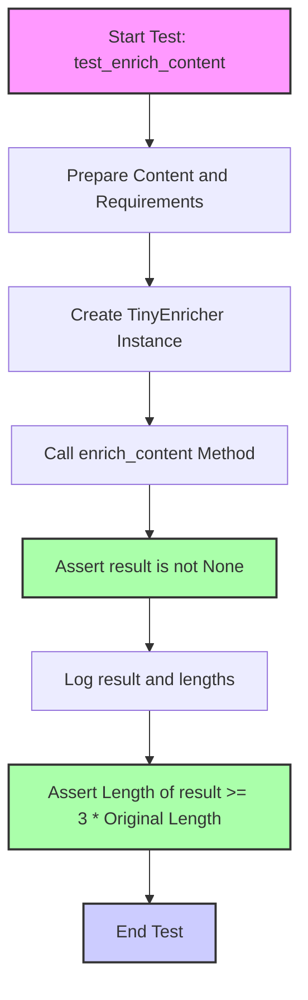

## АНАЛИЗ КОДА

### <алгоритм>

1. **Импорт библиотек и настройка путей**:
   - Импортируются необходимые библиотеки: `pytest` для тестирования, `textwrap` для работы с многострочным текстом, `logging` для логирования.
   - Настраивается логгер `tinytroupe`.
   - Добавляются пути к каталогам проекта для импорта модулей:
     - `../../tinytroupe/`
     - `../../`
     - `../`
   - Импортируется `testing_utils` и `TinyEnricher`.

2.  **Определение тестовой функции `test_enrich_content`**:
    - Задается многострочная строка `content_to_enrich` - текст для обогащения, описывающий партнерство WonderCode и Microsoft.
    - Задается многострочная строка `requirements` - требования к обогащению: расширить текст, сделать его длиннее как минимум в три раза, добавляя детали, таблицы, списки и т.д.
    - Создается экземпляр `TinyEnricher`.
    - Вызывается метод `enrich_content` с указанием требований, контента, типа контента, дополнительной контекстной информации, кеша и флага `verbose`.
    
     **Пример**:
        -   **Вход**: `content_to_enrich` (документ о партнерстве), `requirements` (расширить в три раза)
        -   **Выход**: `result` (обогащенный документ)
        - **Логика внутри `enrich_content`**:
            -  Контент обрабатывается в соответствии с предоставленными требованиями, предположительно с использованием языковой модели для расширения и детализации текста.
    
3. **Проверка результатов**:
    - Проверяется, что результат не `None`.
    - Выводится отладочная информация: обогащенный текст, его длина и длина оригинального текста.
    - Проверяется, что длина обогащенного текста как минимум в 3 раза больше длины исходного текста.

### <mermaid>

**Объяснение диаграммы:**

- **Start:** Начало выполнения тестовой функции `test_enrich_content`.
- **PrepareContent:** Подготовка исходного контента (`content_to_enrich`) и требований (`requirements`) к обогащению.
- **CreateEnricher:** Создание экземпляра класса `TinyEnricher`, который будет использоваться для обогащения контента.
- **CallEnrichContent:** Вызов метода `enrich_content` с переданными параметрами (контент, требования, тип контента, контекстная информация и т.д.).
- **CheckResult:** Проверка, что результат выполнения метода `enrich_content` не равен `None`. Если это условие не выполняется, тест считается проваленным.
- **LogResult:** Вывод отладочной информации в лог: обогащенный контент, его длина и длина исходного контента.
- **CheckLength:** Проверка, что длина обогащенного контента как минимум в три раза превышает длину исходного контента. Если это условие не выполняется, тест считается проваленным.
- **End:** Завершение тестовой функции.
- `classDef`: определение классов для стилизации элементов.

### <объяснение>

**Импорты:**

*   `pytest`: Фреймворк для тестирования. Используется для определения и запуска тестовых функций.
*   `textwrap`: Модуль для работы с многострочным текстом, используется для форматирования и удаления отступов.
*  `logging`: Модуль для логирования, используется для отслеживания событий и отладки.
    -   `logger = logging.getLogger("tinytroupe")`: создает объект логгера для модуля tinytroupe, позволяет записывать сообщения для отладки.
*  `sys`: Модуль для доступа к параметрам командной строки и системным функциям.
    -   `sys.path.append(...)`: добавляет пути к директориям, где лежат модули проекта, чтобы можно было импортировать `testing_utils` и `TinyEnricher`.

*   `testing_utils`: Модуль из проекта, содержащий вспомогательные функции для тестирования.
*   `tinytroupe.enrichment.TinyEnricher`: Класс для обогащения контента, основная цель теста.

**Функции:**

*   `test_enrich_content()`:
    -   **Назначение**: Функция, выполняющая тест для проверки работы `TinyEnricher`.
    -   **Аргументы**: Отсутствуют.
    -   **Возвращаемое значение**: Ничего не возвращает, использует `assert` для проверки условий и вызывает исключение в случае ошибки.
    -   **Пример**: Внутри функции заданы контент и требования.
        -   Создается объект `TinyEnricher` и вызывается метод `enrich_content` для обогащения текста.
        -   Результат проверяется на `None`, его длина проверяется на соответствие условию (в 3 раза больше оригинала).

**Переменные:**

*   `content_to_enrich` (str):  Многострочный текст, представляющий документ о партнерстве WonderCode и Microsoft, который нужно обогатить.
*   `requirements` (str): Многострочный текст, описывающий требования к обогащению контента.
*   `result` (str): Переменная, в которой сохраняется результат работы метода `enrich_content`.
*   `logger` (logging.Logger): Логгер для записи отладочных сообщений.

**Классы:**

*   `TinyEnricher`: Класс, предназначенный для обогащения контента. Метод `enrich_content` выполняет основную работу по увеличению и детализации текста.

**Потенциальные ошибки и улучшения:**

*   **Зависимость от языковой модели**: Код полагается на функциональность класса `TinyEnricher`, который, вероятно, использует языковые модели. Проверка этого аспекта не входит в тестовый код.
*   **Проверка качества обогащения**: Тест проверяет только длину результата, но не проверяет его качество, связность, соответствие требованиям.
*   **Использование `sys.path.append`**: Использование `sys.path.append` может сделать код менее переносимым и менее явным. Лучше использовать относительные импорты или настроить переменные окружения.
*   **Отсутствие моков/заглушек**: При тестировании `TinyEnricher` не используется мокирование зависимостей, что делает тест более хрупким.
*   **Логирование**: Логирование используется для отладочной информации, но не для полноценного отслеживания процесса.

**Взаимосвязи с другими частями проекта:**

*   Тест напрямую зависит от модуля `tinytroupe.enrichment`, в частности, класса `TinyEnricher`.
*   Предполагается, что `TinyEnricher` взаимодействует с другими компонентами для выполнения обогащения контента, например, с языковыми моделями или базами данных. Однако это не видно непосредственно в тестовом коде.
*   `testing_utils` используется для вспомогательных функций при тестировании, и этот модуль скорее всего, используется и в других тестах проекта.

**Цепочка взаимосвязей:**

1.  `test_enrich_content`
    -   использует `TinyEnricher` для обогащения контента.
    -   `TinyEnricher`
        -   вероятно использует языковую модель для генерации текста
        -   возможно взаимодействует с другими компонентами проекта, что не видно из кода
    -  `testing_utils`
        -   предполагается использование общих вспомогательных функций для тестирования