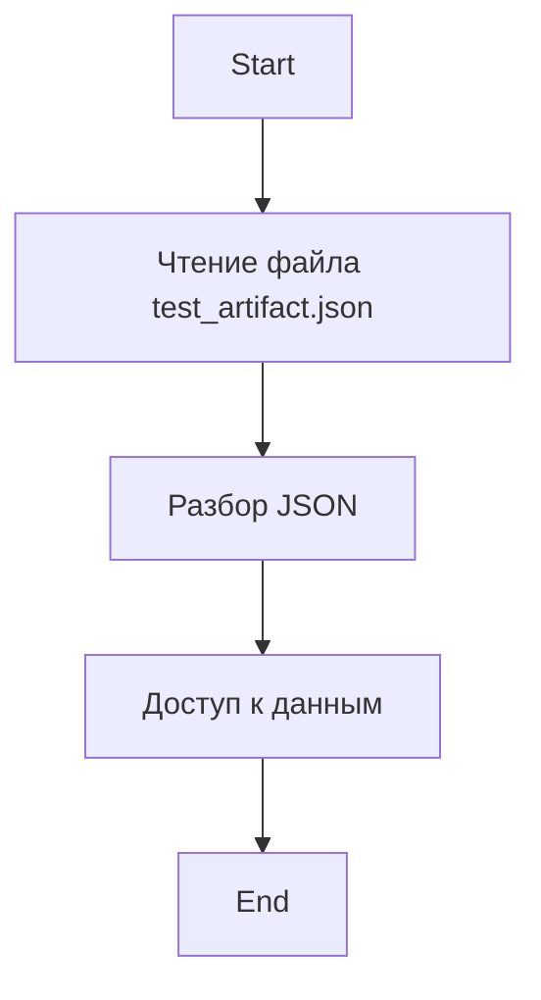

## Анализ JSON-файла `test_artifact.json`

### 1. <алгоритм>

JSON-файл `test_artifact.json` представляет собой структурированный набор данных в формате JSON (JavaScript Object Notation). Алгоритм его обработки заключается в следующем:

1. **Чтение файла:** Файл читается как обычный текстовый файл, и его содержимое загружается в память.
2. **Разбор JSON:** Загруженная строка преобразуется в структуру данных, например, в Python, это был бы словарь (`dict`). 
3. **Доступ к данным:** После разбора можно получить доступ к отдельным элементам данных (например, `name`, `age`, `occupation`, `content`) по их ключам.

**Пример для каждого логического блока:**

*   **Чтение файла:** (в Python)
    ```python
    with open('test_artifact.json', 'r') as f:
        json_string = f.read()
    ```
    Результат: `json_string` содержит текстовое представление JSON.

*   **Разбор JSON:** (в Python)
    ```python
    import json
    data = json.loads(json_string)
    ```
    Результат: `data` – это словарь Python, который содержит информацию из JSON.

*   **Доступ к данным:** (в Python)
    ```python
    name = data['name'] # "John Doe"
    age = data['age']   # 30
    ```
    Результат: Получение конкретных значений из словаря `data`.

**Поток данных:**



### 2. <mermaid>

```mermaid
flowchart TD
    Start --> ReadFile[Чтение файла test_artifact.json<br> (текстовый формат)];
    ReadFile --> ParseJson[Разбор JSON<br> (преобразование в словарь)];
    ParseJson --> Name[Получение имени: <br> data['name']];
    ParseJson --> Age[Получение возраста: <br> data['age']];
    ParseJson --> Occupation[Получение профессии: <br> data['occupation']];
    ParseJson --> Content[Получение контента: <br> data['content']];
    Name --> End;
    Age --> End;
    Occupation --> End;
    Content --> End;
```

**Объяснение зависимостей:**

Диаграмма `mermaid` показывает поток данных при обработке JSON. Основные элементы:

*   `ReadFile`: Операция чтения файла, возвращает текст, который далее обрабатывается.
*   `ParseJson`: Преобразование текстового представления JSON в структуру данных (словарь).
*   `Name`, `Age`, `Occupation`, `Content`: Доступ к отдельным значениям JSON по ключу.

### 3. <объяснение>

**Импорты:**

В данном коде нет импортов, так как это просто JSON-файл, а не Python-скрипт. Обычно для работы с JSON в Python используется модуль `json` (например, `import json`), который позволяет сериализовать и десериализовать JSON-данные. 

**Классы:**

В JSON-файле нет классов. Это структура данных, представляющая собой словарь (объект) с набором ключ-значение.

**Функции:**

В JSON-файле нет функций. Функции могут использоваться при обработке данных из JSON в Python. Например, можно было бы написать функцию для загрузки данных из файла:
```python
import json
def load_json_data(file_path):
  with open(file_path, 'r') as f:
    json_string = f.read()
  return json.loads(json_string)

# Пример использования:
data = load_json_data('test_artifact.json')
print(data['name'])
```

**Переменные:**

*   `name`: Строка, представляющая имя человека (John Doe).
*   `age`: Целое число, представляющее возраст человека (30).
*   `occupation`: Строка, представляющая профессию человека (Engineer).
*   `content`: Строка, содержащая произвольное текстовое содержание.

**Взаимосвязь с другими частями проекта:**

Этот JSON-файл может быть использован как тестовый артефакт для тестирования механизмов обработки данных. Например, в модульных тестах (как видно из пути к файлу `hypotez/src/ai/tiny_troupe/TinyTroupe/tests/unit/test_exports/record/test_artifact.json`)  он мог бы быть использован для проверки корректности загрузки, разбора и доступа к данным.

**Потенциальные ошибки и улучшения:**

*   **Типы данных:**  Необходимо учитывать типы данных, получаемых из JSON, при их дальнейшей обработке.
*   **Валидация данных:** Можно добавить проверки валидности данных, например, убедиться, что `age` является положительным числом.
*   **Обработка ошибок:** При чтении и разборе JSON необходимо обрабатывать возможные исключения (например, если файл не существует или JSON не корректен).
*  **Обновление данных:** Структура `json` может быть изменена (добавление/удаление ключей). Код, который использует эти данные должен уметь это обрабатывать.

**Цепочка взаимосвязей:**

`test_artifact.json` -> `тестовый_скрипт_в_Python` (может использовать `json.load` для чтения) -> `функции_обработки_данных` -> `вывод_результата` или `сохранение_результата`.

Этот анализ предоставляет полную картину того, как работает данный JSON файл и как он используется в контексте проекта.