## АНАЛИЗ КОДА:

### 1. <алгоритм>

**test_export_json:**
1. **Определение данных артефакта:** Создается словарь `artifact_data` с примером данных (имя, возраст, профессия, контент).
   ```python
   artifact_data = {
       "name": "John Doe",
       "age": 30,
       "occupation": "Engineer",
       "content": "This is a sample JSON data."
   }
   ```
2. **Экспорт данных в JSON:** Вызывается метод `exporter.export()` с указанием имени файла "test_artifact", данных, типа контента "record" и формата "json".
   ```python
   exporter.export("test_artifact", artifact_data, content_type="record", target_format="json")
   ```
3. **Проверка существования файла:** Проверяется, создан ли файл `./test_exports/record/test_artifact.json`.
    ```python
    assert os.path.exists("./test_exports/record/test_artifact.json")
    ```
4. **Чтение и сравнение данных:**  Файл JSON открывается, данные читаются и сравниваются с исходными `artifact_data`.
   ```python
    with open("./test_exports/record/test_artifact.json", "r") as f:
        exported_data = json.load(f)
        assert exported_data == artifact_data
   ```

**test_export_text:**
1. **Определение текстовых данных:** Задается строка `artifact_data` с текстом.
   ```python
   artifact_data = "This is a sample text."
   ```
2. **Экспорт данных в TXT:** Вызывается метод `exporter.export()` с именем файла "test_artifact", данными, типом контента "text" и форматом "txt".
   ```python
   exporter.export("test_artifact", artifact_data, content_type="text", target_format="txt")
   ```
3. **Проверка существования файла:**  Проверяется, создан ли файл `./test_exports/text/test_artifact.txt`.
    ```python
    assert os.path.exists("./test_exports/text/test_artifact.txt")
    ```
4. **Чтение и сравнение данных:** Файл TXT открывается, данные читаются и сравниваются с исходными `artifact_data`.
   ```python
    with open("./test_exports/text/test_artifact.txt", "r") as f:
        exported_data = f.read()
        assert exported_data == artifact_data
   ```

**test_export_docx:**
1. **Определение данных в Markdown:** Задается многострочная строка `artifact_data` с текстом в формате Markdown.
   ```python
   artifact_data = """
       # This is a sample markdown text
       This is a **bold** text.
       This is an *italic* text.
       This is a [link](https://www.example.com).
   """
   ```
2. **Экспорт данных в DOCX:** Вызывается метод `exporter.export()` с именем файла "test_artifact", данными, типом контента "Document", форматом контента "markdown" и форматом файла "docx".
   ```python
   exporter.export("test_artifact", artifact_data, content_type="Document", content_format="markdown", target_format="docx")
   ```
3. **Проверка существования файла:** Проверяется, создан ли файл `./test_exports/Document/test_artifact.docx`.
    ```python
    assert os.path.exists("./test_exports/Document/test_artifact.docx")
    ```
4. **Чтение и проверка данных DOCX:** Файл DOCX открывается, текст из параграфов читается, проверяется наличие исходной строки и отсутствие markdown синтаксиса.
   ```python
    from docx import Document
    doc = Document("./test_exports/Document/test_artifact.docx")
    exported_data = ""
    for para in doc.paragraphs:
        exported_data += para.text
    assert "This is a sample markdown text" in exported_data
    assert "#" not in exported_data
   ```

**test_normalizer:**
1. **Определение списка концепций:**  Создается список `concepts` содержащий строки.
   ```python
   concepts = [...]
   ```
2. **Удаление дубликатов:**  Из `concepts` создается список `unique_concepts` без дубликатов.
   ```python
   unique_concepts = list(set(concepts))
   ```
3. **Создание объекта Normalizer:** Создается объект `normalizer` класса `Normalizer` с `concepts`, `n=10` и `verbose=True`.
   ```python
   normalizer = Normalizer(concepts, n=10, verbose=True)
   ```
4. **Проверка количества нормализованных элементов:**  Проверяется, что количество элементов в `normalizer.normalized_elements` равно 10.
    ```python
    assert len(normalizer.normalized_elements) == 10
    ```
5. **Генерация случайных бакетов:**  Создается 5 списков (бакетов) случайных концептов из `concepts`.
    ```python
     random_concepts_buckets = [random.sample(concepts, 15), ...]
    ```
6. **Цикл нормализации:** Для каждого бакета в `random_concepts_buckets`:
    1. Сохраняется текущий размер кеша `normalizer.normalizing_map`.
    2. Вызывается метод `normalizer.normalize()` для бакета и сохраняется результат в `normalized_concept`.
        ```python
        normalized_concept = normalizer.normalize(bucket)
        ```
    3. Проверяется, что результат не `None`.
    4. Вывод в лог.
    5. Сохраняется новый размер кеша `normalizer.normalizing_map`.
    6. Проверяется, что длина `normalized_concept` равна длине входного бакета.
    7. Проверяется, что все элементы бакета присутствуют в ключах `normalizer.normalizing_map`.
    8. Проверяется, что размер кеша увеличился.

```mermaid
flowchart TD
    subgraph Test_Export_JSON
        A[Define Artifact Data] --> B(Export JSON)
        B --> C{Check File Exists}
        C -- Yes --> D(Read and Compare JSON Data)
        C -- No --> E[Assertion Error]
    end
    
    subgraph Test_Export_Text
        F[Define Text Data] --> G(Export TXT)
        G --> H{Check File Exists}
        H -- Yes --> I(Read and Compare TXT Data)
         H -- No --> J[Assertion Error]
    end

    subgraph Test_Export_DOCX
        K[Define Markdown Data] --> L(Export DOCX)
        L --> M{Check File Exists}
        M -- Yes --> N(Read and Compare DOCX Data)
        M -- No --> O[Assertion Error]
    end

    subgraph Test_Normalizer
      P[Define Concepts List] --> Q(Create Normalizer Object)
      Q --> R{Check Initial Normalization Elements Length}
      R -- Yes --> S[Create Random Concept Buckets]
       R -- No --> T[Assertion Error]
      S --> U{Iterate through Buckets}
      U -- For Each Bucket --> V(Normalize Bucket)
      V --> W{Check Normalize Result and Cache}
       W -- No --> X[Assertion Error]
       W -- Yes --> U
       U -- After Last Bucket --> Y[End Test]
    end

    style Test_Export_JSON fill:#f9f,stroke:#333,stroke-width:2px
    style Test_Export_Text fill:#ccf,stroke:#333,stroke-width:2px
    style Test_Export_DOCX fill:#afa,stroke:#333,stroke-width:2px
    style Test_Normalizer fill:#ffa,stroke:#333,stroke-width:2px
```

### 2. <mermaid>



**Объяснение `mermaid`:**

Диаграмма показывает блок-схемы для каждого теста. 
-  `Test_Export_JSON`, `Test_Export_Text` и `Test_Export_DOCX` демонстрируют процессы экспорта данных в разные форматы и последующую проверку целостности экспортированных данных.
- `Test_Normalizer` показывает процесс нормализации списка концепций и проверки правильности работы кеша.

**Зависимости:**

- **pytest**: Используется для написания и запуска тестов.
- **os**: Используется для работы с файловой системой (проверка существования файлов).
- **json**: Используется для работы с JSON (экспорт и загрузка).
- **random**: Используется для генерации случайных данных (при тестировании нормализатора).
- **logging**: Используется для логирования информации.
- **docx**: Используется для работы с документами Word (чтение содержимого).

### 3. <объяснение>

**Импорты:**

-   `pytest`: Фреймворк для тестирования. `pytest` используется для определения тестовых функций (`test_export_json`, `test_export_text`, `test_export_docx`, `test_normalizer`), а также для создания фикстуры (`exporter`).
-   `os`: Модуль для работы с операционной системой. Используется для проверки существования файлов, созданных в процессе тестирования.
-   `json`: Модуль для работы с данными в формате JSON. Используется для экспорта и проверки JSON файлов.
-   `random`: Модуль для генерации случайных чисел. Используется для генерации случайных подмножеств (бакетов) при тестировании нормализатора.
-   `logging`: Модуль для логирования событий. В данном случае используется для отладки процесса нормализации.
-   `sys`: Модуль для работы с интерпретатором Python. Используется для добавления путей к модулям `tinytroupe` и других.
-   `testing_utils`:  Импортирует  утилиты для тестирования (из файла `testing_utils.py`),  которые,  как видно из кода, не используются, но могут пригодиться в других тестах.
-   `tinytroupe.extraction`: Импортирует классы `ArtifactExporter` и `Normalizer` из модуля `extraction` проекта `tinytroupe`.
-   `tinytroupe.utils`: Импортирует утилиты из модуля `utils` проекта `tinytroupe`. В данном коде не используется.
-  `docx`: Импортирует класс `Document` из библиотеки `python-docx`. Используется для чтения и анализа содержимого `.docx` файлов.

**Классы:**

-   `ArtifactExporter`: Класс, ответственный за экспорт артефактов в различные форматы (JSON, TXT, DOCX). Он принимает базовую папку для вывода при инициализации.
    -   `__init__(base_output_folder)`: Конструктор, инициализирует путь для сохранения файлов.
    -   `export(artifact_name, data, content_type, content_format, target_format)`: Метод для экспорта данных. Принимает имя артефакта, сами данные, тип контента (text, record, Document), формат контента (например markdown) и целевой формат (json, txt, docx).
-   `Normalizer`: Класс, отвечающий за нормализацию списка концептов.
    -   `__init__(concepts, n, verbose)`: Конструктор, принимает список концептов, количество нормализованных элементов и флаг вывода информации.
    -   `normalize(bucket)`: Метод, нормализует бакет концептов.

**Функции:**

-   `exporter()`: Фикстура pytest, которая создает и возвращает экземпляр класса `ArtifactExporter`.
-   `test_export_json(exporter)`: Тестовая функция для проверки экспорта данных в JSON.
    -   `exporter`: Экземпляр `ArtifactExporter`, полученный из фикстуры.
-   `test_export_text(exporter)`: Тестовая функция для проверки экспорта данных в TXT.
    -   `exporter`: Экземпляр `ArtifactExporter`, полученный из фикстуры.
-   `test_export_docx(exporter)`: Тестовая функция для проверки экспорта данных в DOCX.
    -   `exporter`: Экземпляр `ArtifactExporter`, полученный из фикстуры.
-   `test_normalizer()`: Тестовая функция для проверки нормализатора.

**Переменные:**

-   `artifact_data`: Содержит данные для экспорта, типы данных разные в зависимости от теста (словарь для JSON, строка для TXT и Markdown для DOCX).
-   `exporter`: Экземпляр `ArtifactExporter`.
-   `concepts`: Список концептов для нормализации.
-   `unique_concepts`: Список уникальных концептов.
-   `normalizer`: Экземпляр `Normalizer`.
-   `random_concepts_buckets`: Список списков случайных концептов.
-   `normalized_concept`: Нормализованный концепт (возвращается методом `normalize`).
-   `exported_data`: Данные, прочитанные из экспортированного файла.
-   `init_cache_size`: Размер кеша нормализатора до нормализации бакета.
-   `next_cache_size`: Размер кеша нормализатора после нормализации бакета.
    
**Потенциальные ошибки или области для улучшения:**

1.  **Обработка ошибок**: В коде нет явной обработки исключений при экспорте файлов и чтении. Стоит добавить блоки try-except, чтобы обрабатывать, например, ошибки доступа к файлу или ошибки записи.
2.  **Модульность тестирования**: Можно разбить тесты на более мелкие модульные функции для повышения читаемости и удобства поддержки.
3.  **Тесты для крайних случаев**: Не хватает тестов для крайних случаев, например, пустых данных, некорректных форматов или очень больших объемов данных.
4.  **Расширение тестов экспорта**: Тесты экспорта проверяют только существование файла и совпадение контента. Следует добавить проверки форматирования (например, для markdown в docx).
5.  **Оптимизация тестов**: В `test_normalizer` можно вынести общие проверки в отдельную функцию для уменьшения дублирования кода.

**Взаимосвязь с другими частями проекта:**

-   `tinytroupe.extraction`:  Этот тест напрямую проверяет работу модулей `ArtifactExporter` и `Normalizer` проекта.
-   `tinytroupe.utils`:  Хотя модуль `utils` не используется напрямую, вероятно, он содержит общие функции, которые могут использоваться другими частями проекта.
-  `testing_utils`: Используются вспомогательные функции для тестирования.

В целом, код выполняет корректную проверку экспорта в различные форматы и работы нормализатора.  Возможные улучшения касаются расширения набора тестов, обработки ошибок и оптимизации кода.