## АНАЛИЗ КОДА `config.ini`

### 1. <алгоритм>

Этот файл конфигурации, `config.ini`, содержит параметры, необходимые для работы с OpenAI или Azure OpenAI API, а также настройки для симуляции и ведения журнала. Он не содержит исполняемого кода, а представляет собой набор переменных, предназначенных для чтения и использования другими частями приложения.

*   **[OpenAI]**: Секция содержит настройки, специфичные для работы с OpenAI API.
    *   `API_TYPE`: Определяет, какой тип API использовать (по умолчанию `openai`).
    *   `AZURE_API_VERSION`: Задает версию API для Azure OpenAI Service (если используется).
    *   `MODEL`: Название используемой модели (по умолчанию `gpt-4o`).
    *   `MAX_TOKENS`: Максимальное количество токенов в ответе от API (по умолчанию `4000`).
    *   `TEMPERATURE`: Температура модели, влияет на ее креативность (по умолчанию `0.3`).
    *   `FREQ_PENALTY`: Штраф за частоту слов (по умолчанию `0.0`).
    *   `PRESENCE_PENALTY`: Штраф за присутствие слов (по умолчанию `0.0`).
    *   `TIMEOUT`: Время ожидания ответа от API в секундах (по умолчанию `60`).
    *   `MAX_ATTEMPTS`: Максимальное количество попыток при ошибке вызова API (по умолчанию `5`).
    *   `WAITING_TIME`: Время ожидания перед повторной попыткой вызова API (по умолчанию `1`).
    *   `EXPONENTIAL_BACKOFF_FACTOR`: Коэффициент экспоненциальной задержки при повторных попытках (по умолчанию `5`).
    *   `EMBEDDING_MODEL`: Модель для эмбеддингов (по умолчанию `text-embedding-3-small`).
    *   `CACHE_API_CALLS`: Включает или отключает кеширование ответов API (по умолчанию `False`).
    *   `CACHE_FILE_NAME`: Имя файла для хранения кеша (по умолчанию `openai_api_cache.pickle`).
    *   `MAX_CONTENT_DISPLAY_LENGTH`: Максимальная длина отображаемого текста (по умолчанию `1024`).
*   **[Simulation]**: Секция для настроек симуляции.
    *   `RAI_HARMFUL_CONTENT_PREVENTION`: Включение или отключение предотвращения генерации вредного контента (по умолчанию `True`).
    *   `RAI_COPYRIGHT_INFRINGEMENT_PREVENTION`: Включение или отключение предотвращения нарушения авторских прав (по умолчанию `True`).
*  **[Logging]**: Секция для настроек логирования.
   *  `LOGLEVEL`: Уровень логирования (по умолчанию `ERROR`).

**Примеры использования:**

*   Приложение считывает `API_TYPE`, чтобы определить, какой API использовать (OpenAI или Azure).
*   `MODEL` используется для запроса к API.
*   `MAX_TOKENS`, `TEMPERATURE`, `FREQ_PENALTY`, `PRESENCE_PENALTY` влияют на поведение языковой модели.
*   `TIMEOUT`, `MAX_ATTEMPTS`, `WAITING_TIME`, `EXPONENTIAL_BACKOFF_FACTOR` управляют процессом обработки ошибок при вызове API.
*   `CACHE_API_CALLS` и `CACHE_FILE_NAME` управляют кешированием результатов вызова API для уменьшения нагрузки и ускорения работы.
*   `RAI_HARMFUL_CONTENT_PREVENTION` и `RAI_COPYRIGHT_INFRINGEMENT_PREVENTION` управляют мерами предосторожности при симуляции.
*   `LOGLEVEL` определяет, какие сообщения будут записываться в лог.

```mermaid
flowchart TD
    subgraph Configuration File
        Start[Start] --> LoadConfig[Load Configuration]
        LoadConfig --> OpenAISection[OpenAI Settings]
        LoadConfig --> SimulationSection[Simulation Settings]
        LoadConfig --> LoggingSection[Logging Settings]

        OpenAISection --> ApiType(API_TYPE: openai/azure)
        OpenAISection --> AzureApiVersion(AZURE_API_VERSION: Version)
        OpenAISection --> Model(MODEL: gpt-4o)
        OpenAISection --> MaxTokens(MAX_TOKENS: 4000)
        OpenAISection --> Temperature(TEMPERATURE: 0.3)
        OpenAISection --> FreqPenalty(FREQ_PENALTY: 0.0)
        OpenAISection --> PresencePenalty(PRESENCE_PENALTY: 0.0)
        OpenAISection --> Timeout(TIMEOUT: 60)
        OpenAISection --> MaxAttempts(MAX_ATTEMPTS: 5)
        OpenAISection --> WaitingTime(WAITING_TIME: 1)
        OpenAISection --> ExponentialBackoffFactor(EXPONENTIAL_BACKOFF_FACTOR: 5)
        OpenAISection --> EmbeddingModel(EMBEDDING_MODEL: text-embedding-3-small)
        OpenAISection --> CacheApiCalls(CACHE_API_CALLS: True/False)
        OpenAISection --> CacheFileName(CACHE_FILE_NAME: openai_api_cache.pickle)
        OpenAISection --> MaxContentDisplayLength(MAX_CONTENT_DISPLAY_LENGTH: 1024)

        SimulationSection --> RaiHarmfulContentPrevention(RAI_HARMFUL_CONTENT_PREVENTION: True/False)
        SimulationSection --> RaiCopyrightInfringementPrevention(RAI_COPYRIGHT_INFRINGEMENT_PREVENTION: True/False)

        LoggingSection --> LogLevel(LOGLEVEL: ERROR/WARNING/INFO/DEBUG)
    end
    
    LoadConfig --> UseConfig[Use Configuration in Application]
```

### 2. <mermaid>

**Зависимости:**

*   Нет явных зависимостей от других библиотек Python или модулей. Это файл конфигурации, который читается другими частями проекта.
*   В диаграмме показан процесс загрузки и использования конфигурации, где каждое поле из файла конфигурации становится отдельным параметром для дальнейшего использования.
*   Все имена переменных соответствуют параметрам в файле `config.ini` и имеют описательные имена.

### 3. <объяснение>

#### Импорты:

*   В данном файле нет импортов, так как это файл конфигурации (`.ini`). Он используется для хранения параметров, а не для выполнения кода.

#### Классы:

*   Файл `config.ini` не содержит классов. Это файл конфигурации, который используется для хранения параметров.

#### Функции:

*   Файл `config.ini` не содержит функций. Это файл конфигурации, который используется для хранения параметров.

#### Переменные:

*   Файл `config.ini` содержит переменные, которые представляют собой параметры конфигурации. Вот их объяснения:

    *   `API_TYPE` (string): Определяет тип API для использования (`openai` или `azure`).
    *   `AZURE_API_VERSION` (string): Версия Azure API. Используется только если `API_TYPE` равен `azure`.
    *   `MODEL` (string): Название модели OpenAI.
    *   `MAX_TOKENS` (int): Максимальное количество токенов для генерации ответа.
    *   `TEMPERATURE` (float): Температура модели (между `0` и `1`).
    *   `FREQ_PENALTY` (float): Штраф за частоту токенов (между `-2.0` и `2.0`).
    *   `PRESENCE_PENALTY` (float): Штраф за присутствие токенов (между `-2.0` и `2.0`).
    *   `TIMEOUT` (int): Время ожидания ответа от API (в секундах).
    *   `MAX_ATTEMPTS` (int): Максимальное количество попыток при неудачном запросе API.
    *   `WAITING_TIME` (int): Время ожидания между повторными попытками (в секундах).
    *   `EXPONENTIAL_BACKOFF_FACTOR` (int): Коэффициент экспоненциальной задержки для повторных попыток.
    *  `EMBEDDING_MODEL` (string): Модель для эмбеддингов.
    *   `CACHE_API_CALLS` (boolean): Флаг для включения/выключения кеширования ответов API.
    *   `CACHE_FILE_NAME` (string): Имя файла для хранения кеша.
    *  `MAX_CONTENT_DISPLAY_LENGTH` (int): Максимальная длина отображаемого текста в консоле.
    *   `RAI_HARMFUL_CONTENT_PREVENTION` (boolean): Флаг для включения/выключения предотвращения вредного контента.
    *   `RAI_COPYRIGHT_INFRINGEMENT_PREVENTION` (boolean): Флаг для включения/выключения предотвращения нарушения авторских прав.
    *   `LOGLEVEL` (string): Уровень логирования (`ERROR`, `WARNING`, `INFO`, `DEBUG`).

#### Потенциальные ошибки или области для улучшения:

*   **Отсутствие проверки типов данных**: Хотя все переменные имеют предполагаемые типы, явной проверки типов при чтении конфигурации нет. Это может привести к ошибкам, если файл `.ini` содержит данные неверного типа. Можно добавить валидацию в коде, который читает этот файл.
*   **Недостаточная документация**: Комментарии в файле `config.ini` минимальны. Можно добавить более подробные описания для каждой переменной, чтобы обеспечить ясность для пользователей.
*   **Отсутствие валидации значений**: Значения переменных не проверяются на допустимый диапазон. Например, `TEMPERATURE` должен быть между `0` и `1`, а `TIMEOUT` должно быть положительным числом. Можно добавить валидацию, чтобы предотвратить некорректные значения.
*   **Жестко закодированные значения по умолчанию**: Значения по умолчанию, такие как `gpt-4o`, `4000`, `0.3`, и т.д., жестко закодированы в файле. Можно сделать их более настраиваемыми, вынеся в отдельный файл или используя переменные окружения.
*   **Отсутствие поддержки переменных окружения**: Файл `config.ini` не поддерживает чтение переменных окружения, что может быть полезно для чувствительных данных (например, ключи API) или для настройки в различных средах.
*   **Магические числа**: Некоторые числа, такие как `60` для таймаута, могут быть вынесены в константы с описательными именами для лучшей читаемости.

#### Взаимосвязь с другими частями проекта:

*   Другие части проекта, такие как `src/ai/tiny_troupe/TinyTroupe/tinytroupe/openai_api.py` будут считывать этот файл `config.ini` для настройки API.
*   Файл конфигурации является центральным для настройки многих аспектов приложения, и его изменения повлияют на поведение всей системы.
*   Параметры логирования, такие как `LOGLEVEL`, будут использоваться модулем логирования для определения, какие сообщения выводить.

В заключение, `config.ini` – это ключевой файл для настройки приложения, который нуждается в тщательной обработке и валидации данных для обеспечения стабильной и предсказуемой работы.