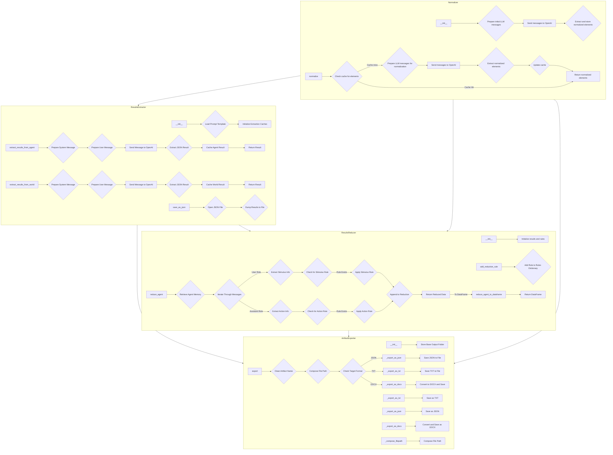

## ИНСТРУКЦИЯ:

Анализируй предоставленный код подробно и объясни его функциональность. Ответ должен включать три раздела:  

1. **<алгоритм>**: Опиши рабочий процесс в виде пошаговой блок-схемы, включая примеры для каждого логического блока, и проиллюстрируй поток данных между функциями, классами или методами.  
2. **<mermaid>**: Напиши код для диаграммы в формате `mermaid`, проанализируй и объясни все зависимости, 
    которые импортируются при создании диаграммы. 
    **ВАЖНО!** Убедитесь, что все имена переменных, используемые в диаграмме `mermaid`, 
    имеют осмысленные и описательные имена. Имена переменных вроде `A`, `B`, `C`, и т.д., не допускаются!  
    
    **Дополнительно**: Если в коде есть импорт `import header`, добавьте блок `mermaid` flowchart, объясняющий `header.py`:
    ```mermaid
    flowchart TD
        Start --> Header[<code>header.py</code><br> Determine Project Root]
    
        Header --> import[Import Global Settings: <br><code>from src import gs</code>] 
    ```

3. **<объяснение>**: Предоставьте подробные объяснения:  
   - **Импорты**: Их назначение и взаимосвязь с другими пакетами `src.`.  
   - **Классы**: Их роль, атрибуты, методы и взаимодействие с другими компонентами проекта.  
   - **Функции**: Их аргументы, возвращаемые значения, назначение и примеры.  
   - **Переменные**: Их типы и использование.  
   - Выделите потенциальные ошибки или области для улучшения.  

Дополнительно, постройте цепочку взаимосвязей с другими частями проекта (если применимо).  

Это обеспечивает всесторонний и структурированный анализ кода.
## Формат ответа: `.md` (markdown)
**КОНЕЦ ИНСТРУКЦИИ**

## <алгоритм>

### Класс `ResultsExtractor`

1. **Инициализация `__init__`**:
   - Загружает путь к шаблону промпта для извлечения (`_extraction_prompt_template_path`) из файла `interaction_results_extractor.mustache`.
   - Инициализирует кэши для результатов извлечения из агентов (`agent_extraction`) и миров (`world_extraction`) в виде пустых словарей.

2. **Извлечение результатов из агента `extract_results_from_agent`**:
   - Принимает экземпляр `TinyPerson`, цель извлечения, контекстную ситуацию, список полей и их подсказки, а также флаг подробного вывода.
   - Создает системное сообщение, используя шаблон из `_extraction_prompt_template_path`, заполняя его предоставленными полями и их подсказками.
   - Формирует запрос пользователя, включая цель извлечения, ситуацию и историю взаимодействий агента (полученную через `tinyperson.pretty_current_interactions()`).
   - Отправляет запрос в OpenAI через `openai_utils.client().send_message()`.
   - Извлекает JSON из ответа OpenAI (`utils.extract_json()`).
   - Кэширует результат извлечения для данного агента в `agent_extraction`.
   - Возвращает извлеченные данные.
   - Пример:
     ```python
     extractor = ResultsExtractor()
     agent = TinyPerson(name="Alice")
     agent.memory.add({"role": "user", "content": {"stimuli": [{"type": "talk", "content": "Hello!"}]}})
     agent.memory.add({"role": "assistant", "content": {"action": {"type": "talk", "content": "Hi there!"}}})
     result = extractor.extract_results_from_agent(agent, extraction_objective="Summary of interactions", fields=["type", "content"])
     print(result)
     # Output: {'interactions': [{'type': 'talk', 'content': 'Hello!'}, {'type': 'talk', 'content': 'Hi there!'}]}
     ```

3. **Извлечение результатов из мира `extract_results_from_world`**:
   - Принимает экземпляр `TinyWorld`, цель извлечения, контекстную ситуацию, список полей и их подсказки, а также флаг подробного вывода.
   - Создает системное сообщение аналогично `extract_results_from_agent`, используя шаблон и предоставленные поля.
   - Формирует запрос пользователя, включая цель извлечения, ситуацию и историю взаимодействий всех агентов в мире (полученную через `tinyworld.pretty_current_interactions()`).
   - Отправляет запрос в OpenAI через `openai_utils.client().send_message()`.
   - Извлекает JSON из ответа OpenAI (`utils.extract_json()`).
   - Кэширует результат извлечения для данного мира в `world_extraction`.
   - Возвращает извлеченные данные.
   - Пример:
      ```python
      world = TinyWorld(name="MyWorld")
      agent1 = TinyPerson(name="Alice")
      agent2 = TinyPerson(name="Bob")
      world.add_agent(agent1)
      world.add_agent(agent2)
      agent1.memory.add({"role": "user", "content": {"stimuli": [{"type": "talk", "content": "Hello, Bob!"}]}})
      agent2.memory.add({"role": "assistant", "content": {"action": {"type": "talk", "content": "Hi, Alice!"}}})
      
      extractor = ResultsExtractor()
      result = extractor.extract_results_from_world(world, extraction_objective="Summary of interactions", fields=["type", "content"])
      print(result)
     # Output: {'interactions': [{'type': 'talk', 'content': 'Hello, Bob!'}, {'type': 'talk', 'content': 'Hi, Alice!'}]}

      ```

4.  **Сохранение результатов в JSON `save_as_json`**:
    - Принимает имя файла и флаг подробного вывода.
    - Сохраняет кэшированные результаты извлечения из агентов и миров (`agent_extraction`, `world_extraction`) в JSON-файл.

### Класс `ResultsReducer`
1.  **Инициализация `__init__`**:
    - Инициализирует пустой словарь `results` и `rules`.

2.  **Добавление правила редукции `add_reduction_rule`**:
    - Принимает триггер (например, тип стимула или действия) и функцию редукции.
    - Регистрирует функцию редукции в словаре `rules` по ключу триггера.

3.  **Редукция агента `reduce_agent`**:
    - Принимает экземпляр `TinyPerson`.
    - Проходит по всей истории взаимодействий агента (`agent.episodic_memory.retrieve_all()`).
    - Для сообщений с ролью "user" (стимулы):
        - Извлекает тип, контент, источник и время стимула.
        - Если тип стимула есть в `rules`, применяет соответствующую функцию редукции, передавая ей контекст.
    - Для сообщений с ролью "assistant" (действия):
        - Извлекает тип, контент и цель действия.
        - Если тип действия есть в `rules`, применяет соответствующую функцию редукции, передавая ей контекст.
    - Возвращает список редуцированных данных.
        ```python
    reducer = ResultsReducer()
    def talk_reducer(focus_agent, source_agent, target_agent, kind, event, content, timestamp):
        return {
            "focus": focus_agent.name,
            "source": source_agent.name,
            "target": target_agent.name,
            "kind": kind,
            "event": event,
            "content": content,
            "timestamp": timestamp,
        }
    reducer.add_reduction_rule("talk", talk_reducer)
    agent = TinyPerson(name="Alice")
    agent.memory.add({"role": "user", "content": {"stimuli": [{"type": "talk", "content": "Hello!", "source": "Bob"}]},"simulation_timestamp":1})
    agent.memory.add({"role": "assistant", "content": {"action": {"type": "talk", "content": "Hi there!", "target":"Bob"}},"simulation_timestamp":2})
    
    reduction = reducer.reduce_agent(agent)
    print(reduction)
    # Output:
    # [{'focus': 'Alice', 'source': 'Bob', 'target': 'Alice', 'kind': 'stimulus', 'event': 'talk', 'content': 'Hello!', 'timestamp': 1},
    #  {'focus': 'Alice', 'source': 'Alice', 'target': 'Bob', 'kind': 'action', 'event': 'talk', 'content': 'Hi there!', 'timestamp': 2}]
    ```
    
4.  **Редукция агента в DataFrame `reduce_agent_to_dataframe`**:
    - Принимает экземпляр `TinyPerson` и список имен столбцов.
    - Вызывает `reduce_agent` для получения редуцированных данных.
    - Преобразует редуцированные данные в `pandas.DataFrame`.
    - Возвращает DataFrame.
     ```python
    reducer = ResultsReducer()
    def talk_reducer(focus_agent, source_agent, target_agent, kind, event, content, timestamp):
        return {
            "focus": focus_agent.name,
            "source": source_agent.name,
            "target": target_agent.name,
            "kind": kind,
            "event": event,
            "content": content,
            "timestamp": timestamp,
        }
    reducer.add_reduction_rule("talk", talk_reducer)
    agent = TinyPerson(name="Alice")
    agent.memory.add({"role": "user", "content": {"stimuli": [{"type": "talk", "content": "Hello!", "source": "Bob"}]},"simulation_timestamp":1})
    agent.memory.add({"role": "assistant", "content": {"action": {"type": "talk", "content": "Hi there!", "target":"Bob"}},"simulation_timestamp":2})

    df = reducer.reduce_agent_to_dataframe(agent, column_names=["focus", "source", "target", "kind", "event", "content", "timestamp"])
    print(df)

    # Output:
    #    focus source target      kind  event    content  timestamp
    # 0  Alice    Bob  Alice  stimulus   talk    Hello!          1
    # 1  Alice  Alice    Bob    action   talk  Hi there!         2
    ```

### Класс `ArtifactExporter`
1.  **Инициализация `__init__`**:
    - Принимает базовую папку вывода и сохраняет её.

2.  **Экспорт артефакта `export`**:
    - Принимает имя артефакта, данные, тип содержимого, формат содержимого (необязательно), целевой формат и флаг подробного вывода.
    - Очищает имя артефакта от недопустимых символов.
    - Определяет путь к файлу на основе базовой папки, имени артефакта, типа содержимого и целевого формата.
    - Вызывает соответствующие методы (`_export_as_json`, `_export_as_txt`, `_export_as_docx`) для сохранения файла, в зависимости от целевого формата.
    - Пример:
      ```python
      exporter = ArtifactExporter("output")
      exporter.export(
          artifact_name="my_artifact",
          artifact_data="This is my text data.",
          content_type="text",
          target_format="txt",
          verbose=True
      )
      #Output file: output/text/my_artifact.txt
      
       exporter.export(
          artifact_name="my_json_artifact",
          artifact_data={"key":"value"},
          content_type="json",
          target_format="json",
          verbose=True
      )
      #Output file: output/json/my_json_artifact.json

      ```

3.  **Экспорт в текстовый файл `_export_as_txt`**:
    - Принимает путь к файлу, данные и тип содержимого.
    - Сохраняет данные в текстовый файл.

4.  **Экспорт в JSON файл `_export_as_json`**:
    - Принимает путь к файлу, данные и тип содержимого.
    - Сохраняет данные в JSON-файл (если данные - словарь).

5. **Экспорт в DOCX файл `_export_as_docx`**:
   - Принимает путь к файлу, данные, исходный формат контента и флаг подробного вывода.
   -  Преобразует контент из Markdown в HTML, если исходный формат указан как `markdown`.
   -  Конвертирует HTML в DOCX файл используя `pypandoc`.

6.  **Компоновка пути к файлу `_compose_filepath`**:
    - Принимает данные, имя артефакта, тип содержимого, формат содержимого и флаг подробного вывода.
    - Формирует путь к файлу, включая подпапку на основе типа содержимого, расширение файла на основе целевого формата, а также создает промежуточные папки.

### Класс `Normalizer`
1. **Инициализация `__init__`**:
   -  Принимает список элементов для нормализации, количество нормализованных элементов `n` и флаг подробного вывода.
   -  Удаляет дубликаты из входного списка элементов.
   -  Инициализирует кэш нормализованных элементов `normalized_elements` и словарь отображения `normalizing_map`.
   -  Создает системное и пользовательское сообщения, используя шаблоны `normalizer.system.mustache` и `normalizer.user.mustache`.
   -  Отправляет запрос в OpenAI через `openai_utils.client().send_message()`.
   -  Извлекает JSON из ответа OpenAI (`utils.extract_json()`) и сохраняет в `self.normalized_elements`.
   
2. **Нормализация `normalize`**:
   - Принимает элемент или список элементов для нормализации.
   - Проверяет кэш `normalizing_map` для уже нормализованных элементов.
   - Для некэшированных элементов:
     - Создает системное и пользовательское сообщения, используя шаблоны `normalizer.applier.system.mustache` и `normalizer.applier.user.mustache`, с информацией о категориях нормализации, полученных из `self.normalized_elements`, а также элементах, которые необходимо нормализовать.
     - Отправляет запрос в OpenAI через `openai_utils.client().send_message()`.
     - Извлекает JSON из ответа OpenAI (`utils.extract_json()`) и сохраняет в кэш `self.normalizing_map`.
   - Возвращает нормализованный элемент или список элементов, сохраняя порядок входных данных.

### Глобальная переменная `default_extractor`
- Создается экземпляр класса `ResultsExtractor` для удобства использования по умолчанию.

## <mermaid>

### Анализ зависимостей `mermaid`:

*   **`ResultsExtractor`:**
    *   `__init__`: Инициализирует кэши и загружает шаблон промпта.
    *   `extract_results_from_agent`: Извлекает результаты из экземпляра `TinyPerson` с помощью OpenAI и кэширует их.
    *   `extract_results_from_world`: Извлекает результаты из экземпляра `TinyWorld` с помощью OpenAI и кэширует их.
    *   `save_as_json`: Сохраняет извлеченные результаты в JSON файл.
*  **`ResultsReducer`:**
    *  `__init__`: Инициализирует пустые словари для хранения результатов и правил редукции.
    *  `add_reduction_rule`: Регистрирует функции редукции.
    *   `reduce_agent`: Применяет правила редукции к истории взаимодействия агента.
    *   `reduce_agent_to_dataframe`: Применяет правила редукции и преобразует результат в DataFrame.
*   **`ArtifactExporter`:**
    *   `__init__`: Сохраняет базовую папку для вывода.
    *   `export`: Экспортирует артефакт в файл с указанным форматом (JSON, TXT, DOCX).
    *   `_export_as_txt`: Экспортирует данные в текстовый файл.
    *   `_export_as_json`: Экспортирует данные в JSON файл.
    *  `_export_as_docx`: Экспортирует данные в DOCX файл.
    *   `_compose_filepath`: Составляет путь к файлу.
*  **`Normalizer`:**
    *  `__init__`: Инициализирует нормализатор, отправляет запрос на нормализацию в OpenAI.
    *   `normalize`: Нормализует отдельные элементы или списки, используя кэш и OpenAI.

*   **Связи между классами:**
    *   `ResultsExtractor` и `ResultsReducer` могут использоваться вместе: `ResultsExtractor` извлекает данные, а `ResultsReducer` преобразует их в более структурированный формат.
     *   `ResultsExtractor`, `ResultsReducer` и `Normalizer` могут использоваться для экспорта артефактов через `ArtifactExporter`.
    *  `Normalizer` может использоваться `ResultsExtractor`, `ResultsReducer` и `ArtifactExporter` для нормализации текста перед отправкой в OpenAI или перед экспортом.

## <объяснение>
### Импорты:
- `os`: Используется для работы с файловой системой, например, для соединения путей и создания директорий.
- `json`: Используется для работы с JSON-данными (сериализация и десериализация).
- `chevron`: Используется для рендеринга шаблонов (шаблонизатор Mustache).
- `logging`: Используется для логирования отладочной информации.
- `pandas as pd`: Используется для работы с табличными данными (DataFrame).
- `pypandoc`: Используется для конвертации файлов из одного формата в другой (например, из Markdown в DOCX).
- `markdown`: Используется для конвертации текста в формате Markdown в HTML.
- `typing.Union, typing.List`: Используется для аннотации типов.
- `tinytroupe.agent.TinyPerson`: Класс, представляющий агента в симуляции.
- `tinytroupe.environment.TinyWorld`: Класс, представляющий среду в симуляции.
- `tinytroupe.factory.TinyPersonFactory`: Класс, создающий экземпляры агентов.
- `tinytroupe.utils.JsonSerializableRegistry`: Базовый класс для реестров, поддерживающих сериализацию в JSON.
- `tinytroupe.openai_utils`: Содержит утилиты для работы с OpenAI API.
- `tinytroupe.utils`: Общие утилиты проекта.

### Классы:

1.  **`ResultsExtractor`**:
    -   **Роль**: Извлекает данные из агентов и мира, используя OpenAI API.
    -   **Атрибуты**:
        -   `_extraction_prompt_template_path` (str): Путь к файлу шаблона для промпта.
        -   `agent_extraction` (dict): Кэш для извлеченных данных агентов.
        -   `world_extraction` (dict): Кэш для извлеченных данных миров.
    -   **Методы**:
        -   `__init__`: Инициализирует класс, загружая шаблон и создавая кэши.
        -   `extract_results_from_agent`: Извлекает данные из агента.
        -   `extract_results_from_world`: Извлекает данные из мира.
        -   `save_as_json`: Сохраняет извлеченные данные в JSON-файл.
    -   **Взаимодействие**:
        -   Использует `chevron` для рендеринга шаблонов промптов.
        -   Использует `openai_utils` для отправки запросов в OpenAI.
        -   Использует `tinytroupe.agent.TinyPerson` и `tinytroupe.environment.TinyWorld` для доступа к данным.
        -   Использует `tinytroupe.utils.extract_json` для обработки результатов из OpenAI.
    
2.  **`ResultsReducer`**:
    -   **Роль**: Уменьшает объем данных, полученных от агентов, путем применения предопределенных правил.
    -   **Атрибуты**:
        -   `results` (dict):  Словарь для хранения результатов редукции (в текущей реализации не используется, только в будущих).
        -  `rules` (dict): Словарь, где ключами являются триггеры (например, тип стимула или действия), а значениями - функции редукции.
    -   **Методы**:
        -   `__init__`: Инициализирует атрибуты.
        -   `add_reduction_rule`: Добавляет правило редукции.
        -   `reduce_agent`: Применяет правила редукции к истории взаимодействий агента.
        -  `reduce_agent_to_dataframe`: Применяет правила редукции и возвращает результат в виде DataFrame.
    -   **Взаимодействие**:
        -   Использует `tinytroupe.agent.TinyPerson` для доступа к данным агентов.
        -    Возвращает редуцированные данные или `pandas.DataFrame`.

3.  **`ArtifactExporter`**:
    -   **Роль**: Экспортирует артефакты (данные) из симуляции в различные форматы файлов.
    -   **Атрибуты**:
        -   `base_output_folder` (str): Базовая папка для сохранения файлов.
    -   **Методы**:
        -   `__init__`: Инициализирует базовую папку вывода.
        -   `export`: Экспортирует данные в файл.
        -   `_export_as_txt`: Экспортирует данные в текстовый файл.
        -   `_export_as_json`: Экспортирует данные в JSON-файл.
        -   `_export_as_docx`: Экспортирует данные в DOCX файл.
        -   `_compose_filepath`: Компонует путь к файлу.
    -   **Взаимодействие**:
        -   Использует `os` для создания директорий и путей к файлам.
        -   Использует `json` для сохранения данных в JSON.
        -   Использует `pypandoc` для конвертации в DOCX.
        -   Использует `markdown` для преобразования Markdown в HTML перед конвертацией в DOCX.
        -   Использует `tinytroupe.utils` для отступа и очистки текста.

4.  **`Normalizer`**:
    -  **Роль**: Нормализует текстовые элементы, используя OpenAI API.
    -   **Атрибуты**:
        -   `elements` (List[str]): Список элементов для нормализации.
        -    `n` (int): Количество нормализованных элементов.
        -    `verbose` (bool): Флаг подробного вывода.
        -   `normalized_elements` (dict): Кэш для нормализованных элементов.
        -    `normalizing_map` (dict): Словарь для сопоставления исходных элементов с их нормализованными аналогами.
    -   **Методы**:
        -   `__init__`: Инициализирует класс, отправляя запрос для нормализации в OpenAI.
         -   `normalize`:  Нормализует элементы, используя кэш и OpenAI.
    -   **Взаимодействие**:
        -    Использует `openai_utils` для отправки запросов в OpenAI.
         -   Использует `tinytroupe.utils.extract_json` для обработки результатов из OpenAI.
         -   Использует `tinytroupe.utils.compose_initial_LLM_messages_with_templates` для подготовки сообщений для OpenAI.
         
### Функции:

-   `default_extractor`: Глобальная переменная, которая является экземпляром `ResultsExtractor` и предоставляется как удобный объект по умолчанию для извлечения данных.

### Переменные:

-   `logger`: Логгер для записи отладочных сообщений.
-   `messages`, `next_message`: Используются в качестве буфера для обмена сообщениями с OpenAI.
-   `result`, `reduction`: Используются для хранения результатов извлечения, нормализации или редукции.
-   `rendering_configs`: Словарь, содержащий конфигурацию для рендеринга шаблонов промптов.

### Потенциальные ошибки и области для улучшения:

1.  **Обработка ошибок**:
    -   В некоторых местах (например, в `utils.extract_json()`) не выполняется полноценная обработка ошибок.
    -   Следует добавить обработку исключений в `pypandoc.convert_text`, чтобы избежать сбоев.
2.  **Производительность**:
    -   В методе `reduce_agent` выполняется итерация по всей истории взаимодействий агента, что может быть неэффективно для больших историй. Можно рассмотреть возможность использования генераторов или итераторов для уменьшения потребления памяти и времени обработки.
    -  Запросы к OpenAI могут быть потенциальным узким местом в производительности. Для повышения производительности можно кэшировать результаты, использовать асинхронные запросы.
3.  **Параметризация**:
    -   Некоторые параметры, такие как температура в `openai_utils.client().send_message()`, заданы жестко (temperature=0.0). Их можно сделать настраиваемыми.
    -    Необходимо сделать  шаблоны для `normalizer.system.mustache`, `normalizer.user.mustache`, `normalizer.applier.system.mustache`, `normalizer.applier.user.mustache`  настраиваемыми.
4.  **Гибкость**:
    -  `_compose_filepath` и экспорт артефактов можно сделать более гибкими, разрешая пользовательскую настройку пути и имени файла.
    -   В `_export_as_docx` нет поддержки конвертации из других форматов, кроме `text` и `markdown`.
5.  **Рефакторинг**:
    -   Можно выделить общие части кода в отдельные функции или классы (например, подготовку сообщений для OpenAI), чтобы уменьшить дублирование.
    -    Код в функциях `extract_results_from_agent` и `extract_results_from_world`  имеет много дублирований, можно вынести общий код в отдельную функцию.
6.  **Улучшение нормализации:**
    -   Для  `Normalizer`  не предусмотрена возможность использования  конкретных шаблонов для нормализации различных типов текстовых элементов. Можно добавить данную функциональность.
7. **Управление зависимостями:**
    -  В проекте используется библиотека `pypandoc` для экспорта в DOCX формат. Необходимо проверить наличие `pandoc` в системе, в случае отсутствия необходимо уведомить пользователя о необходимости установить `pandoc`.
    - Необходимо предусмотреть возможность экспорта в другие форматы кроме `json`, `txt` и `docx`, например в `csv`, `html` и др.

### Взаимосвязи с другими частями проекта:

-   Данный модуль (`extraction.py`) взаимодействует с модулями `agent.py`, `environment.py`, `factory.py`, `utils.py`, и `openai_utils.py`, и таким образом формирует ядро системы извлечения, редукции и экспорта данных из TinyTroupe.
-   Этот модуль используется в других частях проекта, которые нуждаются в анализе и экспорте данных симуляций.
-   Реализация этого модуля  зависит от структуры `TinyPerson`, `TinyWorld`, `episodic_memory`, и других связанных классов.