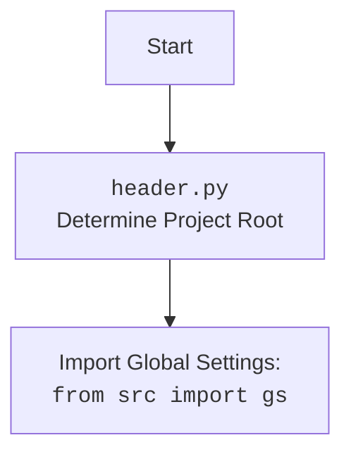

## <алгоритм>

**Общий рабочий процесс:**

1.  **Инициализация `TinyFactory`**:
    *   При создании экземпляра `TinyFactory` (или его подкласса, например, `TinyPersonFactory`) вызывается конструктор `__init__`.
    *   Генерируется уникальное имя для фабрики и сохраняется `simulation_id` (если предоставлен).
    *   Фабрика добавляется в глобальный словарь `TinyFactory.all_factories`.

2.  **Установка симуляции для "свободных" фабрик**:
    *   Метод `TinyFactory.set_simulation_for_free_factories` проходит по всем фабрикам.
    *   Если у фабрики `simulation_id` равен `None`, то эта фабрика добавляется в указанную симуляцию.

3.  **Управление фабриками**:
    *   Метод `TinyFactory.add_factory` добавляет фабрику в `TinyFactory.all_factories` с проверкой на уникальность имени.
    *   Метод `TinyFactory.clear_factories` очищает глобальный список фабрик.

4.  **Кэширование состояния**:
    *   Метод `encode_complete_state` создает глубокую копию словаря `__dict__` экземпляра фабрики, представляя ее состояние.
    *   Метод `decode_complete_state` обновляет `__dict__` экземпляра фабрики на основе переданного словаря.

5.  **Инициализация `TinyPersonFactory`**:
    *   `TinyPersonFactory` наследует от `TinyFactory` и имеет свои специфические атрибуты и методы.
    *   При инициализации, кроме базовой инициализации, задается путь к шаблону `mustache` для генерации персонажей (`person_prompt_template_path`), контекстный текст (`context_text`), а также списки для отслеживания сгенерированных мини-биографий (`generated_minibios`) и имен (`generated_names`).

6.  **Генерация нескольких фабрик персонажей**:
    *   `TinyPersonFactory.generate_person_factories` принимает количество фабрик и общий контекст.
    *   Читает системный промпт из файла (`prompts/generate_person_factory.md`).
    *   Формирует пользовательский промпт, используя шаблон `mustache`, и отправляет его в OpenAI LLM.
    *   Извлекает JSON из ответа LLM.
    *   Создает список экземпляров `TinyPersonFactory` на основе полученных описаний и возвращает его.

7.  **Генерация персонажа**:
    *   `TinyPersonFactory.generate_person` формирует промпт для LLM, используя шаблон `mustache` из файла `person_prompt_template_path`, контекст, конкретные характеристики агента и список уже сгенерированных мини-биографий.
    *   Вызывает вспомогательную функцию `aux_generate` для взаимодействия с LLM.
        *   `aux_generate` отправляет запрос в LLM через `_aux_model_call`.
        *   Если получен ответ, он извлекает JSON с параметрами персонажа.
        *   Возвращает параметры персонажа, если имя не использовалось ранее.
    *   В основном методе, делаются несколько попыток вызова `aux_generate`, пока не будет получен корректный результат, или количество попыток не истечет.
    *   Если персонаж создан, то создается экземпляр `TinyPerson`, настраивается его конфигурация, и его минибиография и имя добавляются в соответствующие списки.
    *   Возвращает созданного персонажа или `None`, если генерация не удалась.

8.  **Вспомогательные методы для LLM**:
    *   `_aux_model_call` вызывает LLM, используя `openai_utils.client().send_message`, с поддержкой кэширования благодаря декоратору `@transactional`.
    *   `_setup_agent` устанавливает параметры агента из переданной конфигурации, используя методы `define` и `define_several`.

**Пример потока данных:**

1.  `TinyPersonFactory.generate_person_factories`:
    *   Вход: `number_of_factories`, `generic_context_text`
    *   Выход: `list[TinyPersonFactory]`
    *   Использует: `openai_utils.client().send_message`, `utils.extract_json`

2.  `TinyPersonFactory.generate_person`:
    *   Вход: `agent_particularities`, `temperature`, `attepmpts`
    *   Выход: `TinyPerson`
    *   Использует: `chevron.render`, `_aux_model_call`, `_setup_agent`

3.  `_aux_model_call`:
    *   Вход: `messages`, `temperature`
    *   Выход: `dict` (ответ от LLM)
    *   Использует: `openai_utils.client().send_message`

4.  `_setup_agent`:
    *   Вход: `agent`, `configuration`
    *   Выход: `None` (изменяет объект `agent` напрямую)
    *   Использует: `agent.define`, `agent.define_several`

## <mermaid>

```mermaid
flowchart TD
    Start([Начало]) --> InitFactory(Создание экземпляра TinyFactory или TinyPersonFactory);
    InitFactory --> AddFactory(Добавление фабрики в all_factories);
    AddFactory -- "Имя уникально" --> SetSimulationForFreeFactories{Установка симуляции для свободных фабрик};
    SetSimulationForFreeFactories -- "Есть свободные фабрики?" --> AddToSimulation{Добавление фабрики в симуляцию}
    AddToSimulation -->  |Да|CacheMechanism{Механизмы кэширования};
     SetSimulationForFreeFactories  -- "Нет" --> CacheMechanism
    CacheMechanism --> EncodeState(encode_complete_state);
    CacheMechanism --> DecodeState(decode_complete_state);
    CacheMechanism --> GenerateFactories{Генерация фабрик персонажей (TinyPersonFactory.generate_person_factories)};
    
    GenerateFactories --> GeneratePerson{Генерация персонажа (TinyPersonFactory.generate_person)};
    GeneratePerson --> GeneratePersonAux{Вспомогательная функция генерации персонажа (aux_generate)};
    GeneratePersonAux --> ModelCall[_aux_model_call - Вызов LLM]
     ModelCall --> TransactionalCache{Транзакционное кеширование};
    TransactionalCache -- "Есть результат в кэше" --> CreatePerson{Создание персонажа (TinyPerson)};
    TransactionalCache -- "Нет результата в кэше" -->  SendToLLM[openai_utils.client().send_message];
      SendToLLM --> CreatePerson
    CreatePerson --> SetupAgent{Настройка агента (_setup_agent)};
    SetupAgent --> ReturnPerson(Возврат созданного персонажа);

     ReturnPerson --> End([Конец]);
    AddFactory -- "Имя не уникально" --> Error([Ошибка: Имя фабрики не уникально]);
     Error --> End
    
    
    classDef method fill:#f9f,stroke:#333,stroke-width:2px
    class InitFactory,AddFactory,SetSimulationForFreeFactories,AddToSimulation,EncodeState,DecodeState,GenerateFactories,GeneratePerson,GeneratePersonAux,TransactionalCache,CreatePerson,SetupAgent,ReturnPerson method
    
    
    classDef llm fill:#ccf,stroke:#333,stroke-width:2px
    class ModelCall,SendToLLM llm
    
        classDef error fill:#fcc,stroke:#333,stroke-width:2px
    class Error error
    
    
    
```



## <объяснение>

### Импорты:

1.  **`os`**: Модуль для работы с операционной системой, используется для манипуляций с путями к файлам (`os.path.join`, `os.path.dirname`).
2.  **`json`**: Модуль для работы с JSON, используется для сериализации и десериализации данных (`json.dumps`).
3.  **`chevron`**: Модуль для шаблонизации, используется для генерации промптов на основе шаблонов (`chevron.render`).
4.  **`logging`**: Модуль для логирования, используется для записи отладочной информации (`logging.getLogger`).
5.  **`copy`**: Модуль для создания копий объектов, используется для создания глубоких копий словарей (`copy.deepcopy`).
6.  **`tinytroupe.openai_utils`**: Содержит утилиты для взаимодействия с OpenAI API (`openai_utils.client()`). Позволяет отправлять сообщения и получать ответы от языковой модели.
7.  **`tinytroupe.agent.TinyPerson`**: Класс, представляющий агента, который будет генерироваться фабрикой.
8.  **`tinytroupe.utils`**:  Содержит общие утилиты, такие как `utils.fresh_id` для генерации уникальных ID и `utils.extract_json` для извлечения JSON из строк.
9.  **`tinytroupe.control.transactional`**:  Декоратор для кэширования результатов функций в рамках транзакций, позволяющий избежать повторных вычислений (`@transactional`).

### Классы:

1.  **`TinyFactory`**:
    *   **Роль**: Базовый класс для фабрик, обеспечивающий общую функциональность для создания объектов и управления их состоянием.
    *   **Атрибуты**:
        *   `all_factories`:  Словарь, хранящий все созданные фабрики.
        *   `name`:  Имя фабрики.
        *   `simulation_id`: ID симуляции, к которой принадлежит фабрика.
    *   **Методы**:
        *   `__init__`:  Конструктор, инициализирует фабрику.
        *   `__repr__`: Возвращает строковое представление объекта фабрики.
        *   `set_simulation_for_free_factories`: Устанавливает симуляцию для "свободных" фабрик (у которых `simulation_id` не определен).
        *   `add_factory`: Добавляет фабрику в `all_factories`.
        *   `clear_factories`: Очищает список фабрик.
        *   `encode_complete_state`: Кодирует состояние фабрики.
        *   `decode_complete_state`: Декодирует состояние фабрики.
    *   **Взаимодействие**:
        *   Используется как базовый класс для других фабрик (например, `TinyPersonFactory`).
        *   Управляет списком всех созданных фабрик, позволяя работать с ними глобально.
        *   Обеспечивает механизм для сохранения и восстановления состояния фабрики, что важно для кэширования.

2.  **`TinyPersonFactory`**:
    *   **Роль**: Фабрика для создания экземпляров `TinyPerson`.
    *   **Атрибуты**:
        *   `person_prompt_template_path`: Путь к файлу с шаблоном для генерации промптов.
        *   `context_text`:  Контекст, используемый для генерации персонажей.
        *   `generated_minibios`: Список сгенерированных минибиографий.
        *   `generated_names`: Список сгенерированных имен.
    *   **Методы**:
        *   `__init__`:  Конструктор, инициализирует фабрику и наследует от `TinyFactory`.
        *   `generate_person_factories`:  Генерирует список фабрик персонажей на основе контекста.
        *   `generate_person`:  Генерирует экземпляр `TinyPerson` с использованием LLM.
        *   `_aux_model_call`: Вспомогательный метод для вызова LLM, поддерживающий кэширование.
        *   `_setup_agent`:  Настраивает агента, определяя его параметры.
    *   **Взаимодействие**:
        *   Использует `openai_utils` для взаимодействия с LLM.
        *   Использует `TinyPerson` для создания экземпляров агентов.
        *   Применяет `chevron` для рендеринга промптов.
        *   Использует `@transactional` для кэширования результатов вызовов LLM.

### Функции:

*   **`TinyFactory.__init__(self, simulation_id: str = None) -> None`**:
    *   **Аргументы**:
        *   `simulation_id` (str, optional): ID симуляции.
    *   **Возвращает**: `None`
    *   **Назначение**: Инициализирует экземпляр `TinyFactory`, задает имя и `simulation_id`.
    *   **Пример**:
        ```python
        factory = TinyFactory(simulation_id="sim123")
        print(factory.name) # Выведет: Factory <уникальный ID>
        print(factory.simulation_id) # Выведет: sim123
        ```
*   **`TinyFactory.set_simulation_for_free_factories(simulation)`**:
    *   **Аргументы**: `simulation` (объект симуляции).
    *   **Возвращает**: `None`
    *   **Назначение**: Добавляет "свободные" фабрики в указанную симуляцию.
    *   **Пример**:
        ```python
        from tinytroupe.simulation import Simulation # предположим, есть такой класс
        simulation = Simulation()
        factory1 = TinyFactory()  # factory1.simulation_id is None
        factory2 = TinyFactory(simulation_id = 'sim1')
        TinyFactory.set_simulation_for_free_factories(simulation) #factory1 будет добавлена в simulation
        ```

*   **`TinyFactory.add_factory(factory)`**:
    *   **Аргументы**: `factory` (экземпляр `TinyFactory`).
    *   **Возвращает**: `None`
    *   **Назначение**: Добавляет фабрику в словарь `all_factories` и проверяет на уникальность имени.
    *   **Пример**:
        ```python
        factory = TinyFactory()
        TinyFactory.add_factory(factory) #добавит factory в all_factories
        ```

*   **`TinyFactory.clear_factories()`**:
    *   **Аргументы**: Нет.
    *   **Возвращает**: `None`
    *   **Назначение**: Очищает словарь `all_factories`, удаляя все фабрики.
    *   **Пример**:
        ```python
        TinyFactory.clear_factories()  # удалит все фабрики из all_factories
        ```

*   **`TinyFactory.encode_complete_state(self) -> dict`**:
    *   **Аргументы**: Нет.
    *   **Возвращает**: `dict` (состояние фабрики).
    *   **Назначение**: Копирует состояние фабрики для кэширования.
    *   **Пример**:
        ```python
        factory = TinyFactory()
        state = factory.encode_complete_state() # state - словарь
        ```
*  **`TinyFactory.decode_complete_state(self, state: dict)`**:
    *    **Аргументы**: `state` (dict, состояние фабрики)
    *    **Возвращает**: `TinyFactory` (обновленный экземпляр фабрики).
    *    **Назначение**: Обновляет состояние фабрики из переданного словаря.
    *    **Пример**:
        ```python
        factory = TinyFactory()
        state = factory.encode_complete_state()
        new_factory = TinyFactory()
        new_factory.decode_complete_state(state) #new_factory имеет тоже состояние что и factory
        ```

*   **`TinyPersonFactory.__init__(self, context_text, simulation_id: str = None)`**:
    *   **Аргументы**:
        *   `context_text` (str): Контекст для генерации персонажей.
        *   `simulation_id` (str, optional): ID симуляции.
    *   **Возвращает**: `None`
    *   **Назначение**: Инициализирует `TinyPersonFactory`, задает контекст и списки для отслеживания персонажей.

*   **`TinyPersonFactory.generate_person_factories(number_of_factories, generic_context_text)`**:
    *   **Аргументы**:
        *   `number_of_factories` (int): Количество фабрик.
        *   `generic_context_text` (str): Общий контекст для генерации фабрик.
    *   **Возвращает**: `list[TinyPersonFactory]` (список созданных фабрик).
    *   **Назначение**: Создает список фабрик персонажей.

*   **`TinyPersonFactory.generate_person(self, agent_particularities: str = None, temperature: float = 1.5, attepmpts: int = 5)`**:
    *   **Аргументы**:
        *   `agent_particularities` (str, optional): Спецификации агента.
        *   `temperature` (float, optional): Температура LLM.
        *   `attepmpts` (int, optional): Количество попыток.
    *   **Возвращает**: `TinyPerson` (созданный персонаж) или `None`.
    *   **Назначение**: Генерирует персонажа, вызывает LLM через `_aux_model_call` и настраивает его.

*   **`TinyPersonFactory._aux_model_call(self, messages, temperature)`**:
    *   **Аргументы**:
        *   `messages` (list): Сообщения для LLM.
        *   `temperature` (float): Температура LLM.
    *   **Возвращает**: `dict` (ответ от LLM).
    *   **Назначение**: Вызывает LLM для генерации параметров персонажа.

*   **`TinyPersonFactory._setup_agent(self, agent, configuration)`**:
    *   **Аргументы**:
        *   `agent` (объект `TinyPerson`): Персонаж.
        *   `configuration` (dict): Параметры персонажа.
    *   **Возвращает**: `None`
    *   **Назначение**: Настраивает параметры агента на основе конфигурации.

### Переменные:

*   **`TinyFactory.all_factories`**:  Словарь, где ключом является имя фабрики, а значением — объект фабрики.
*   **`TinyFactory.name`**:  Уникальное имя фабрики.
*   **`TinyFactory.simulation_id`**: ID симуляции, к которой относится фабрика.
*   **`TinyPersonFactory.person_prompt_template_path`**: Путь к шаблону для промптов генерации персонажей.
*   **`TinyPersonFactory.context_text`**:  Контекст для генерации персонажей.
*   **`TinyPersonFactory.generated_minibios`**: Список сгенерированных мини-биографий.
*   **`TinyPersonFactory.generated_names`**: Список сгенерированных имен.

### Потенциальные ошибки и улучшения:

*   **Обработка ошибок LLM**: В случае ошибки при вызове LLM, программа может завершиться ошибкой или вернуть `None`. Было бы полезно добавить более гибкую обработку ошибок, например, повторные попытки с экспоненциальным откладыванием, сохранение результатов в лог и т.д.
*   **Кэширование**: Кэширование, реализованное с помощью декоратора `@transactional`, может быть улучшено. Например, можно добавить возможность настраивать время жизни кэша, использовать разные backend'ы для кэширования (Redis, Memcached), и т.д.
*   **Расширяемость**: Можно добавить абстрактный метод для создания агента, чтобы можно было создать фабрику для других типов агентов.
*   **Унификация**:  Возможно, можно унифицировать методы `encode_complete_state` и `decode_complete_state`, чтобы упростить их реализацию в подклассах.

### Взаимосвязи с другими частями проекта:

*   **`src.openai_utils`**: Используется для взаимодействия с LLM.
*   **`src.agent.TinyPerson`**: Объект, который создают фабрики.
*   **`src.utils`**: Предоставляет общие утилиты.
*   **`src.control.transactional`**: Используется для кэширования результатов.
*   **`src.simulation`**: (неявно, как предполагается из метода `set_simulation_for_free_factories`) используется для управления фабриками в рамках симуляции.

Этот код обеспечивает гибкую и расширяемую систему для создания различных типов объектов (`TinyPerson` в текущей реализации), используя LLM и механизмы кэширования.