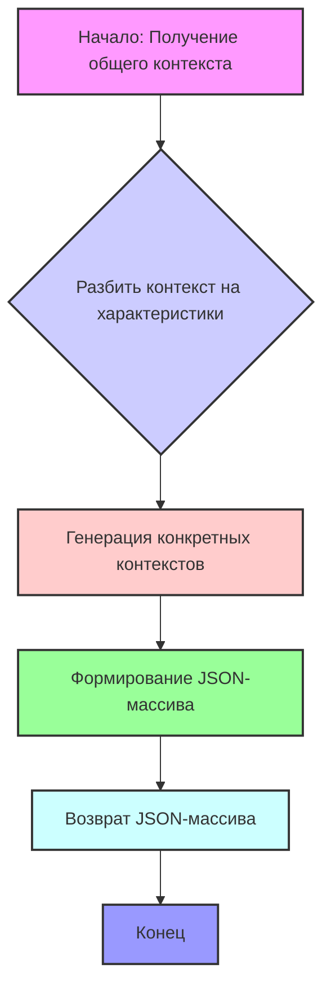

## Анализ кода

### <алгоритм>

1.  **Входные данные:** Получаем общий контекст (строка), описывающий общие характеристики группы людей, которых нужно сгенерировать. Например: "Латиноамериканец, возраст от 20 до 40 лет, может быть бедным или богатым, религиозным или нет, женатым или нет, с детьми или без, профессионалом или нет, рабочим или нет".
2.  **Обработка контекста:** 
    *   Разбиваем общий контекст на ключевые характеристики (например, "Латиноамериканец", "возраст от 20 до 40 лет", "экономический статус", "религиозность", "семейное положение", "наличие детей", "профессия", "род занятий").
    *   Используем эти характеристики для создания более конкретных контекстов.  Например:
        *   Из "Латиноамериканец" можем получить "Мексиканец", "Бразилец", "Колумбиец".
        *   Из "профессионал" можем получить "юрист", "врач".
        *   Из "род занятий" можем получить "рабочий", "фермер".
        *   Можно комбинировать разные характеристики для создания уникальных контекстов. Например, "мексиканский юрист", "бразильский врач".
    *   Добавляем детали к контексту (например, "любит спорт и фильмы", "любит домашних животных и природу", "любит читать и пить кофе").

3. **Генерация выходных данных:**
    *   Составляем массив (список) строк в формате JSON. 
    *   Каждая строка является сгенерированным контекстом для описания конкретного человека. Например:
        `["Мексиканец, который выучился на юриста, но теперь работает в другой сфере, холост, любит спорт и фильмы", "Создай бразильца, который является врачом, любит домашних животных и природу и любит тяжелый металл.", "Создай колумбийца, который является юристом, любит читать и пить кофе и женат, имеет двоих детей."]`
4.  **Вывод:** Возвращаем JSON-массив строк, где каждая строка - это контекст для создания описания человека.

**Пример потока данных:**

```
Общий контекст (строка) --> Обработка контекста --> Массив (JSON) конкретных контекстов (строки)
```

### <mermaid>



**Объяснение `mermaid` диаграммы:**

*   Диаграмма показывает последовательность шагов в алгоритме.
*   **A (Начало: Получение общего контекста):** Начальная точка, где алгоритм получает вводный общий контекст.
*   **B (Разбить контекст на характеристики):** Этап, где общий контекст анализируется и разбивается на ключевые характеристики.
*   **C (Генерация конкретных контекстов):** Используя характеристики из предыдущего этапа, генерируются более конкретные контексты для описания отдельных людей.
*   **D (Формирование JSON-массива):** Конкретные контексты собираются в JSON массив.
*   **E (Возврат JSON-массива):** Массив с контекстами возвращается как результат работы алгоритма.
*   **F (Конец):** Конечная точка алгоритма.

### <объяснение>

**Импорты:**

В предоставленном коде нет импортов. Это означает, что код не зависит от каких-либо внешних модулей или библиотек.  Он полагается на базовые структуры данных и операции Python.

**Классы:**
В предоставленном коде нет классов.

**Функции:**

В предоставленном коде нет функций. Это описание алгоритма, а не конкретная реализация.

**Переменные:**

*   `INPUT` (предполагаемая переменная): Строка, представляющая общий контекст для генерации описаний людей.  
*   `OUTPUT` (предполагаемая переменная):  JSON-массив строк, каждая из которых является контекстом для описания отдельного человека.
*   Переменные, используемые во время обработки контекста (не указаны в коде):
    *   Характеристики из `INPUT` (например, национальность, возраст, экономический статус).
    *   Конкретные контексты (например, "мексиканский юрист", "бразильский врач").

**Объяснения:**

*   **Основная цель:**  Генерация множества конкретных контекстов на основе одного более общего контекста.
*   **Алгоритм:** Описывает процесс создания вариаций контекстов для генерации описаний личностей. Он разбивает общий контекст на составляющие и создает из них более специфические. 
*   **Формат выходных данных:**  Массив JSON строк,  каждая строка - контекст для описания конкретного человека.
*   **Потенциальные улучшения**:
    *   Реализация логики генерации контекста в виде кода (функций и классов).
    *   Использование библиотек для обработки текста, если нужно создавать более сложные контексты.
    *   Использование генерации случайных значений, чтобы сделать выбор более разнообразным.
    *   Использование более продвинутых методов обработки естественного языка (NLP) для генерации более качественных контекстов.

**Взаимосвязь с другими частями проекта:**

Данный код представляет собой часть системы, отвечающей за генерацию описаний людей. Это может быть использовано в качестве основы для создания персонажей в играх, симуляциях или других приложениях. Сгенерированные контексты могут быть переданы другим частям проекта, которые будут использовать их для создания полных описаний персонажей.  Например, передача контекста в нейросеть для генерации текста.

**Пример использования:**

Предположим, что мы имеем следующую структуру:

1.  **Генератор контекстов:** (описанный алгоритм) получает общий контекст.
2.  **Генератор текста:** принимает сгенерированные контексты и генерирует более полные описания людей.

Цепочка будет выглядеть так:

Общий контекст -> Генератор контекстов -> Массив конкретных контекстов -> Генератор текста -> Описания людей.