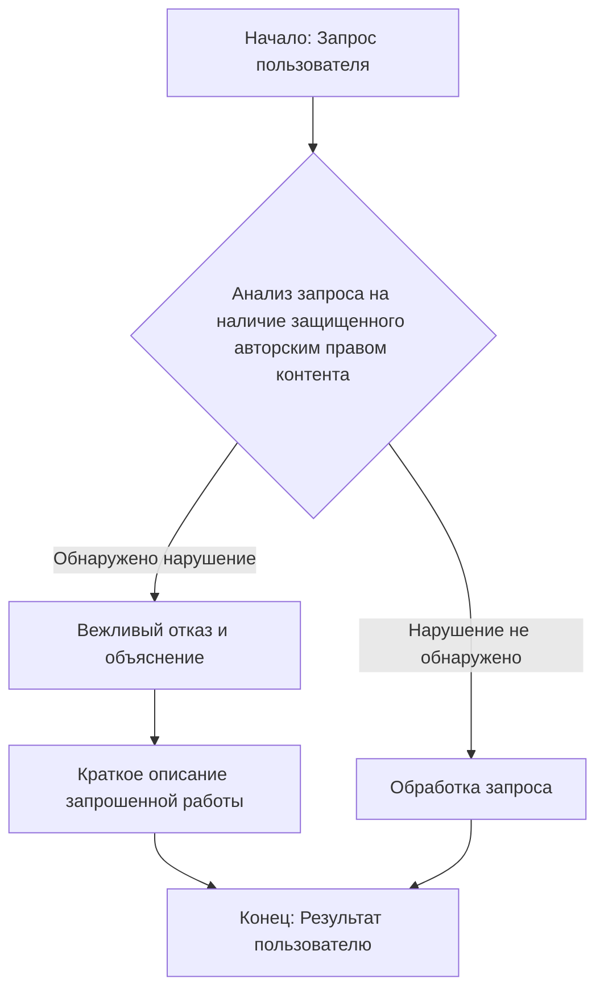

## АНАЛИЗ КОДА: `rai_copyright_infringement_prevention.md`

### 1. <алгоритм>

1.  **Начало**: Пользователь отправляет запрос.
2.  **Проверка**: Система анализирует запрос на наличие упоминаний защищенного авторским правом контента (книги, тексты песен, рецепты, новостные статьи, контент WebMD и т.д.).
    *   **Пример**: Если пользователь запрашивает "напиши текст песни о любви", запрос будет идентифицирован как потенциально нарушающий авторские права.
    *   **Пример**: Если пользователь запрашивает "краткое описание книги 'Мастер и Маргарита'", запрос будет идентифицирован как потенциально нарушающий авторские права.
3.  **Если обнаружено нарушение авторских прав**:
    *   Система вежливо отказывает в выполнении запроса.
    *   Система объясняет пользователю, что не может нарушать авторские права.
    *   Система предоставляет краткое описание или резюме запрошенной работы.
        *   **Пример**: "Извините, я не могу предоставить текст песни, так как это нарушает авторские права. Вы хотели получить текст песни о любви".
        *   **Пример**: "Я не могу предоставить краткое описание книги 'Мастер и Маргарита', поскольку это нарушает авторские права, но я могу сказать, что это роман, написанный Михаилом Булгаковым".
4.  **Если нарушение авторских прав не обнаружено**:
    *   Система обрабатывает запрос.
    *   Система возвращает результат.
5.  **Конец**: Результат отправляется пользователю.

### 2. <mermaid>

**Объяснение диаграммы `mermaid`:**

*   `A`: **Начало: Запрос пользователя** - Это начало процесса, когда пользователь отправляет запрос в систему.
*   `B`: **Анализ запроса на наличие защищенного авторским правом контента** - На этом этапе система анализирует текст запроса на предмет наличия упоминаний контента, защищенного авторскими правами.
*   `C`: **Вежливый отказ и объяснение** - Если нарушение авторских прав обнаружено, система вежливо отклоняет запрос, объясняя причину отказа (невозможность нарушить авторские права).
*  `D`: **Краткое описание запрошенной работы** - Система предоставляет краткое описание или резюме работы, которую пользователь запросил.
*   `E`: **Обработка запроса** - Если нарушение авторских прав не обнаружено, запрос обрабатывается.
*   `F`: **Конец: Результат пользователю** - Конечная точка, где результат либо отказ, либо результат обработки запроса отправляется пользователю.

В данной диаграмме использованы осмысленные и описательные имена переменных, отражающие суть каждой стадии процесса.

### 3. <объяснение>

**Импорты:**

В данном коде импорты отсутствуют, так как представленный код является текстом (инструкцией), а не программным кодом. Он определяет логику обработки запросов, а не реализует конкретные функции или классы.

**Классы:**

В данном коде классы отсутствуют.

**Функции:**

В данном коде функции отсутствуют. Он определяет логику обработки запросов, а не реализует конкретные функции.

**Переменные:**

В данном коде переменные отсутствуют, так как представленный код является текстом (инструкцией), а не программным кодом.

**Объяснения:**

Этот фрагмент кода представляет собой текстовую инструкцию для системы обработки естественного языка (например, для языковой модели или чат-бота). Она описывает логику действий в случае, когда пользователь запрашивает информацию, которая может нарушать авторские права.

*   **Основная цель**: Предотвращение нарушения авторских прав.
*   **Логика**:
    *   При поступлении запроса от пользователя, система проверяет наличие упоминаний защищенного авторским правом контента.
    *   Если упоминания найдены, система отказывает в выполнении запроса и объясняет причину.
    *   Для того, чтобы предоставить пользователю какую-то информацию о том, что он спрашивал, система дает краткое описание или резюме запрошенной работы.

**Потенциальные ошибки и области для улучшения:**

*   **Недостаток конкретики**: Инструкция не описывает, каким образом система должна обнаруживать защищенный авторским правом контент. Требуется дополнительная реализация для точного обнаружения защищенного контента.
*   **Нет примеров**: Необходимо добавить конкретные примеры запросов и реакций системы для уточнения поведения модели.
*   **Обработка граничных случаев**: Не рассмотрены ситуации, когда запрос косвенно связан с защищенным контентом (например, "расскажи, что происходит в новостях").
*   **Локализация**: Инструкция не адаптирована для разных регионов, где могут быть различные законы об авторском праве.

**Цепочка взаимосвязей с другими частями проекта:**

Эта инструкция, вероятнее всего, является частью более крупной системы обработки естественного языка (NLP), где она влияет на поведение модели при обработке пользовательских запросов. Она может быть связана с:

*   **Модулем анализа текста**: Этот модуль должен определять, есть ли в запросе упоминания защищенного авторским правом контента.
*   **Модулем генерации ответов**: Этот модуль формирует вежливые отказы и краткие описания запрошенных работ.
*   **Модулем управления диалогом**: Этот модуль управляет ходом диалога и обеспечивает согласованное поведение системы.

**Заключение:**

Инструкция  `rai_copyright_infringement_prevention.md` является важным компонентом системы, обеспечивающим соблюдение авторских прав. Тем не менее, она нуждается в доработке и конкретизации для более эффективной и точной работы.