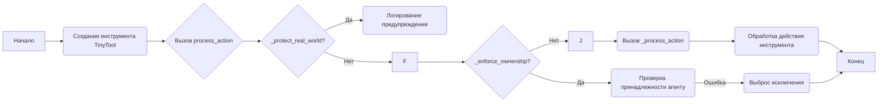

## АНАЛИЗ КОДА: `tinytroupe/tools.py`

### 1. **<алгоритм>**

**Общая блок-схема:**


**Примеры для каждого блока:**
*   **A (Начало):** Начало работы с любым инструментом.
*   **B (Создание инструмента `TinyTool`):**  Создание экземпляра `TinyTool`, например, `calendar = TinyCalendar(owner=agent1)`.
*   **C (Вызов `process_action`):**  Вызов метода для обработки действий, например, `calendar.process_action(agent1, action)`.
*   **D (`_protect_real_world?`):** Проверка, имеет ли инструмент побочные эффекты, например, `TinyCalendar` нет, а `TinyRealWorldTool` да.
*   **E (Логирование предупреждения):** Вывод предупреждения в лог, если `real_world_side_effects` is `True`.
*  **F (Продолжение):** Продолжение выполнения, если нет побочных эффектов.
*   **G (`_enforce_ownership?`):** Проверка, принадлежит ли инструмент агенту.
*  **H (Проверка принадлежности агенту):** Сравнение имени агента и владельца инструмента.
*   **I (Выброс исключения):** Выброс ошибки `ValueError`, если агент не владелец инструмента.
*   **J (Продолжение):** Продолжение выполнения, если владелец совпадает.
*   **K (Вызов `_process_action`):** Вызов метода `_process_action` для обработки конкретного действия инструмента.
*   **L (Обработка действия инструмента):**  Выполнение действия, например, создание события в календаре.
*   **M (Конец):** Завершение обработки действия инструмента.

**Поток данных:**

1.  Инициализация: Создание инструмента (`TinyTool`, `TinyCalendar`, `TinyWordProcessor`) с параметрами, включая владельца, описания, экспортера, обогатителя.
2.  Вызов действия: Агент вызывает метод `process_action` инструмента с описанием действия (`action` в виде словаря).
3.  Проверка безопасности: `_protect_real_world` проверяет наличие реальных побочных эффектов.
4.  Проверка владения: `_enforce_ownership` проверяет, имеет ли агент право использовать инструмент.
5.  Обработка действия: `_process_action` обрабатывает конкретное действие, определяемое типом (`action['type']`) и содержимым (`action['content']`).
6.  Экспорт и обогащение: `TinyWordProcessor` может использовать `ArtifactExporter` для экспорта и `TinyEnricher` для обогащения контента.
7.  Результат:  Метод `process_action` возвращает `True`, если действие успешно выполнено, и `False` в противном случае.

### 2. **<mermaid>**

```mermaid
flowchart TD
    Start[Начало] --> CreateTool[Создание инструмента TinyTool: <br><code>TinyTool(name, description, owner, real_world_side_effects, exporter, enricher)</code>]
    CreateTool --> ProcessAction[Вызов <code>process_action(agent, action)</code>];
    ProcessAction --> ProtectRealWorld[Вызов <code>_protect_real_world()</code>];
    ProtectRealWorld --  "real_world_side_effects=True" --> LogWarning[Логирование предупреждения]
    ProtectRealWorld -- "real_world_side_effects=False" --> EnforceOwnership[Вызов <code>_enforce_ownership(agent)</code>];
    LogWarning --> EnforceOwnership
    EnforceOwnership -- "owner is not None and agent.name != owner.name" --> ThrowError[Выброс <code>ValueError</code>]
    EnforceOwnership -- "owner is None or agent.name == owner.name" --> ProcessActionSubclass[Вызов <code>_process_action(agent, action)</code>]

    ThrowError --> End[Конец]
    ProcessActionSubclass --> HandleAction[Обработка действия инструмента в <code>_process_action()</code>];
    HandleAction --> End
    
     subgraph TinyCalendar
    T1[Создание календаря: <code>TinyCalendar(owner)</code>] --> T2[<code>add_event(date, title, description, owner, mandatory_attendees, optional_attendees, start_time, end_time)</code>]
    T2 --> T3[<code>find_events(year, month, day, hour, minute)</code>]
    T3 --> T4[Обработка CREATE_EVENT в <code>_process_action()</code>];
        end
    
    
    
    subgraph TinyWordProcessor
        W1[Создание вордпроцессора: <code>TinyWordProcessor(owner, exporter, enricher)</code>] --> W2[<code>write_document(title, content, author)</code>]
        W2 --> W3{Использование <code>TinyEnricher</code>?}
        W3 -- "Да" --> W4[<code>enrich_content()</code>]
         W3 -- "Нет" --> W5
         W4 --> W5
        W5 --> W6{Использование <code>ArtifactExporter</code>?}
        W6 -- "Да" --> W7[Экспорт документа в разных форматах]
        W6 -- "Нет" --> W8
        W7 --> W8
        W8 --> W9[Обработка WRITE_DOCUMENT в <code>_process_action()</code>];
    end    
    

  subgraph ArtifactExporter
        EX1[Создание экспортера <code>ArtifactExporter</code>] --> EX2[<code>export(artifact_name, artifact_data, content_type, content_format, target_format)</code>]
    end
    
  subgraph TinyEnricher
       EN1[Создание обогатителя <code>TinyEnricher</code>] --> EN2[<code>enrich_content(requirements, content, content_type, context_info, context_cache, verbose)</code>]
    end
    
  
    
    linkStyle 0,1,2,3,4,5,6,7,8,9,10,11,12,13,14,15,16,17,18,19 stroke:#333,stroke-width:2px
```

**Зависимости импорта:**
*   **`textwrap`**: Используется для форматирования текста.
*   **`json`**: Используется для работы с JSON-данными.
*   **`copy`**:  Не используется в данном коде.
*    **`logging`**: Используется для логирования событий.
*    **`tinytroupe.utils`**: Содержит вспомогательные функции, такие как `check_valid_fields` и `dedent`.
*    **`tinytroupe.extraction`**: Содержит класс `ArtifactExporter` для экспорта артефактов.
*    **`tinytroupe.enrichment`**: Содержит класс `TinyEnricher` для обогащения контента.

### 3. **<объяснение>**

**Импорты:**
*   `textwrap`: Модуль `textwrap` используется для работы с текстом, в частности, для удаления отступов из многострочных строк, что упрощает форматирование строк для запросов.
*   `json`: Модуль `json` используется для кодирования и декодирования данных в формате JSON. Это необходимо для передачи и обработки структурированных данных в функциях `_process_action` классов `TinyCalendar` и `TinyWordProcessor`.
*   `copy`: Хотя модуль `copy` импортируется, он не используется в этом файле, что может указывать на то, что он может быть необходим для других частей проекта или будет использован в будущем.
*    `logging`: Модуль `logging` используется для записи сообщений журнала. Он позволяет отслеживать работу программы, выявлять ошибки и отлаживать код.
*   `tinytroupe.utils`: Это собственный модуль проекта, содержащий вспомогательные функции. `utils.check_valid_fields` используется для проверки допустимости полей в словаре, а `utils.dedent` - для форматирования многострочных строк.
*   `tinytroupe.extraction`: Из этого модуля импортируется `ArtifactExporter`, который предназначен для экспорта данных в разные форматы (например, markdown, json, docx). Он используется в `TinyWordProcessor` для сохранения сгенерированных документов.
*   `tinytroupe.enrichment`: Из этого модуля импортируется `TinyEnricher`, который используется для обогащения контента документов. В `TinyWordProcessor` он используется для добавления деталей и расширения текста.

**Классы:**

*   **`TinyTool`**:
    *   **Роль**: Базовый класс для всех инструментов. Определяет общую структуру и методы для всех инструментов.
    *   **Атрибуты**:
        *   `name` (str): Имя инструмента.
        *   `description` (str): Описание инструмента.
        *   `owner` (obj): Агент, владеющий инструментом. Может быть `None`.
        *   `real_world_side_effects` (bool): Флаг, указывающий, имеет ли инструмент побочные эффекты.
        *   `exporter` (`ArtifactExporter`): Экспортер для сохранения результатов.
        *   `enricher` (`TinyEnricher`): Обогатитель для добавления деталей.
    *   **Методы**:
        *   `__init__`: Конструктор класса, инициализирует атрибуты инструмента.
        *   `_process_action(agent, action)`:  Метод, который должен быть реализован в подклассах для обработки действий. Вызывает ошибку `NotImplementedError` если не переопределен.
        *   `_protect_real_world()`: Метод для логирования предупреждения, если инструмент имеет реальные побочные эффекты.
        *   `_enforce_ownership(agent)`: Метод для проверки, имеет ли агент право использовать инструмент.
        *    `set_owner(owner)`: Метод для установки владельца инструмента.
        *   `actions_definitions_prompt() -> str`: Метод, который должен быть реализован в подклассах для возвращения определения возможных действий. Вызывает ошибку `NotImplementedError` если не переопределен.
        *  `actions_constraints_prompt() -> str`: Метод, который должен быть реализован в подклассах для возвращения ограничений на использование действий. Вызывает ошибку `NotImplementedError` если не переопределен.
        *  `process_action(agent, action) -> bool`: Метод, для обработки действий, вызывает `_protect_real_world`, `_enforce_ownership` и `_process_action`.
*   **`TinyCalendar`** (наследуется от `TinyTool`):
    *   **Роль**: Инструмент для управления календарем. Позволяет агентам создавать события, но функционал еще в разработке.
    *   **Атрибуты**:
        * `calendar` (dict): Словарь, где ключи это даты, а значения - списки событий.
    *   **Методы**:
        *   `__init__`: Конструктор класса.
        *   `add_event(date, title, description, owner, mandatory_attendees, optional_attendees, start_time, end_time)`: Метод для добавления события в календарь.
        *   `find_events(year, month, day, hour, minute)`: Метод для поиска событий в календаре (не реализован).
        *   `_process_action(agent, action)`: Метод для обработки действия `CREATE_EVENT`. Парсит JSON из `action['content']` и добавляет событие.
        *    `actions_definitions_prompt() -> str`: Метод возвращает описание действия `CREATE_EVENT` для календаря.
        *    `actions_constraints_prompt() -> str`: Метод возвращает ограничения для действий календаря.
*   **`TinyWordProcessor`** (наследуется от `TinyTool`):
    *   **Роль**: Инструмент для работы с текстовыми документами. Позволяет агентам создавать, обогащать и экспортировать документы.
    *   **Атрибуты**: отсутствуют, только те что унаследованы от родительского класса
    *   **Методы**:
        *   `__init__`: Конструктор класса, инициализирует `exporter` и `enricher`.
        *   `write_document(title, content, author)`: Метод для создания документа. Использует `TinyEnricher` для обогащения и `ArtifactExporter` для экспорта в разные форматы.
        *   `_process_action(agent, action)`: Метод для обработки действия `WRITE_DOCUMENT`. Парсит JSON из `action['content']` и создает документ.
         *    `actions_definitions_prompt() -> str`: Метод возвращает описание действия `WRITE_DOCUMENT` для вордпроцессора.
         *    `actions_constraints_prompt() -> str`: Метод возвращает ограничения для действий вордпроцессора.

**Функции:**

*   **`_process_action(agent, action)`** (в каждом подклассе):
    *   **Аргументы**:
        *   `agent`: Агент, вызывающий действие.
        *   `action`: Словарь с описанием действия.
    *   **Возвращаемое значение**: `bool`. `True`, если действие выполнено успешно, `False` в противном случае.
    *   **Назначение**: Реализует логику выполнения конкретного действия для каждого инструмента.
*   **`write_document(title, content, author)`** в `TinyWordProcessor`
    *   **Аргументы**:
        *   `title` (str): Заголовок документа.
        *   `content` (str): Содержание документа.
        *   `author` (str): Автор документа.
    *   **Возвращаемое значение**: `None`.
    *   **Назначение**: Создает документ, обогащает его с помощью `TinyEnricher` и экспортирует в различные форматы с помощью `ArtifactExporter`.
*   **`add_event(date, title, description, owner, mandatory_attendees, optional_attendees, start_time, end_time)`** в `TinyCalendar`
     *  **Аргументы**:
        *  `date` (str): Дата события.
        *  `title` (str): Название события.
        *  `description` (str): Описание события.
        *  `owner` (str): Владелец события.
        *  `mandatory_attendees` (list): Список обязательных участников.
        *  `optional_attendees` (list): Список приглашенных участников.
        *  `start_time` (str): Время начала события.
        *  `end_time` (str): Время окончания события.
    *   **Возвращаемое значение**: `None`.
    *   **Назначение**: Добавляет событие в календарь.

**Переменные:**

*   `logger`: Объект `logging.Logger` для записи логов.
*   `prompt`: Многострочная строка для описания действий и их ограничений, используется в `actions_definitions_prompt()` и `actions_constraints_prompt()` методах.
*   `valid_keys`: Список допустимых ключей для JSON-содержимого в методах `_process_action`.
*   `self.calendar`: Атрибут словаря, содержащий все события календаря.
*    `action`: Словарь, содержащий информацию о действии, которое нужно выполнить, используется в методе `_process_action`.
*    `doc_spec`: Словарь, содержащий параметры документа (заголовок, содержание, автор).

**Потенциальные ошибки и области для улучшения:**

*   **Обработка ошибок JSON:** В `_process_action` `TinyWordProcessor` используется `try-except` для обработки `json.JSONDecodeError`, но следует также обработать другие возможные ошибки, связанные с отсутствием ключей или неверным форматом данных.
*   **`TinyCalendar`:** Функциональность календаря не завершена, в частности, методы `find_events` не реализован, необходимо добавить логику поиска событий. Также надо реализовать оповещение приглашенных о событии.
*   **`actions_constraints_prompt`:** В классе `TinyCalendar` метод `actions_constraints_prompt()` пуст, нужно добавить ограничения для действий календаря.
*   **`copy` import**: Модуль `copy` импортируется, но нигде не используется в файле, этот импорт стоит удалить.
*   **Обработка JSON в TinyCalendar**: В методе `_process_action` класса `TinyCalendar` не обрабатывается случай когда при попытке распарсить JSON с помощью `json.loads` возникает ошибка.

**Взаимосвязь с другими частями проекта:**

*   **`tinytroupe.utils`:** Классы `TinyTool`, `TinyCalendar` и `TinyWordProcessor` используют `utils.check_valid_fields` и `utils.dedent` для валидации и форматирования данных.
*   **`tinytroupe.extraction`:** `TinyWordProcessor` использует `ArtifactExporter` для экспорта сгенерированных документов.
*   **`tinytroupe.enrichment`:** `TinyWordProcessor` использует `TinyEnricher` для обогащения контента документов.

**Общая цепочка:**

1.  Агенты используют инструменты (`TinyCalendar`, `TinyWordProcessor`) для выполнения задач.
2.  Инструменты обрабатывают действия агентов, проверяют права доступа и логируют предупреждения о побочных эффектах.
3.  `TinyWordProcessor` использует `TinyEnricher` для обогащения документов и `ArtifactExporter` для сохранения результатов.
4.  Все взаимодействие с инструментами происходит через метод `process_action`.
5. `actions_definitions_prompt()` и `actions_constraints_prompt()` предоставляют информацию об использовании инструментов.

В целом, код предоставляет базовую структуру для инструментов, используемых агентами, с возможностью расширения и добавления новых функциональностей.