## <алгоритм>

1.  **`compose_initial_LLM_messages_with_templates(system_template_name, user_template_name, rendering_configs)`**
    *   **Вход**: `system_template_name` (строка, имя файла шаблона для системного сообщения), `user_template_name` (строка, имя файла шаблона для пользовательского сообщения, может быть `None`), `rendering_configs` (словарь, параметры для рендеринга шаблона).
    *   **Шаг 1**: Формирование полных путей к файлам шаблонов: `system_prompt_template_path` и `user_prompt_template_path`.  Пути формируются относительно текущего местоположения файла `utils.py`,  используя `os.path.join`.
    *   **Шаг 2**: Создание списка `messages` для хранения сообщений.
    *   **Шаг 3**: Добавление системного сообщения:
        *   Читается содержимое файла шаблона по пути `system_prompt_template_path`.
        *   Рендеринг шаблона с использованием `chevron.render` и словаря `rendering_configs`.
        *   Создание словаря с ключами `role` (значение "system") и `content` (результат рендеринга).
        *   Добавление словаря в список `messages`.
    *   **Шаг 4**: Проверка, есть ли пользовательское сообщение (`user_template_name` не `None`).
        *   Если есть, повторяются шаги, аналогичные добавлению системного сообщения, но с ролью "user" и путем `user_prompt_template_path`.
    *   **Выход**: Список словарей `messages`, представляющих сообщения для LLM.

    **Пример**:
    ```python
    messages = compose_initial_LLM_messages_with_templates(
        system_template_name='system_prompt.txt',
        user_template_name='user_prompt.txt',
        rendering_configs={'name': 'John', 'task': 'write a story'}
    )
    # messages может быть:
    # [
    #   { "role": "system", "content": "You are an assistant." },
    #   { "role": "user", "content": "John, please write a story." }
    # ]
    ```

2.  **`extract_json(text)`**
    *   **Вход**: `text` (строка, текст для извлечения JSON).
    *   **Шаг 1**: Используя регулярные выражения, удалить весь текст до первой открывающей фигурной или квадратной скобки.
    *   **Шаг 2**: Используя регулярные выражения, удалить весь текст после последней закрывающей фигурной или квадратной скобки.
    *   **Шаг 3**: Заменить недопустимые escape-последовательности, например  `\\\'` на `'`.
    *   **Шаг 4**: Попытка преобразовать строку в JSON с использованием `json.loads()`.
    *   **Шаг 5**: Если возникает исключение, возвращается пустой словарь `{}`.
    *   **Выход**: Извлеченный словарь JSON или пустой словарь.

    **Пример**:
    ```python
    text = 'some text { "name": "John", "age": 30 } some other text'
    result = extract_json(text)  # result будет {'name': 'John', 'age': 30}

    text = 'invalid json'
    result = extract_json(text)  # result будет {}
    ```

3.  **`extract_code_block(text)`**
    *   **Вход**: `text` (строка, текст для извлечения кодового блока).
    *   **Шаг 1**: Используя регулярные выражения, удалить весь текст до первой открывающей последовательности тройных обратных кавычек (```).
    *   **Шаг 2**: Используя регулярные выражения, удалить весь текст после последней закрывающей последовательности тройных обратных кавычек (```).
    *  **Шаг 3**: Возвращается извлеченный блок кода
    *   **Шаг 4**: Если возникает исключение, возвращается пустая строка `""`.
    *   **Выход**: Извлеченный кодовый блок или пустая строка.

    **Пример**:
    ```python
    text = 'some text ```python\nprint("Hello")\n``` some other text'
    result = extract_code_block(text)  # result будет ```python\nprint("Hello")\n```
    
    text = 'no code block'
    result = extract_code_block(text) # result будет ""
    ```

4.  **`repeat_on_error(retries, exceptions)`**
    *   **Вход**: `retries` (целое число, количество попыток), `exceptions` (список классов исключений).
    *   **Шаг 1**: Декоратор: создается функция `decorator`, которая принимает функцию `func` в качестве аргумента.
    *   **Шаг 2**: Функция `wrapper`, которая является внутренней функцией декоратора, принимает произвольные аргументы `*args`, `**kwargs` и вызывает декорируемую функцию.
    *   **Шаг 3**: Запускается цикл `for` от `0` до `retries - 1` для повторных вызовов `func`.
        *   **Шаг 4**: Вызывается `func(*args, **kwargs)` в блоке `try`.
        *   **Шаг 5**: Если возникает исключение, проверяется, является ли оно одним из указанных в списке `exceptions`.
        *   **Шаг 6**: Если исключение есть и это последняя попытка, исключение выбрасывается. В ином случае - попытка повторяется.
    *   **Выход**: Декорированная функция.

    **Пример**:
    ```python
    @repeat_on_error(retries=3, exceptions=[ValueError])
    def flaky_function(x):
        if random.random() < 0.5:
            raise ValueError("Oops!")
        return x * 2

    result = flaky_function(5)
    # Функция будет вызываться до 3 раз, пока не вернёт результат или не исчерпает количество попыток
    ```

5.  **`check_valid_fields(obj, valid_fields)`**
    *   **Вход**: `obj` (словарь), `valid_fields` (список допустимых ключей).
    *   **Шаг 1**: Для каждого ключа в `obj` выполняется проверка его наличия в списке `valid_fields`.
    *   **Шаг 2**: Если ключ не найден в `valid_fields`, выбрасывается исключение `ValueError` с сообщением об ошибке.
    *   **Выход**: Ничего не возвращает, но может вызвать исключение `ValueError`.

    **Пример**:
    ```python
    data = {'name': 'John', 'age': 30, 'city': 'New York'}
    valid = ['name', 'age']
    check_valid_fields(data, valid)  # Вызовет ValueError
    
    valid = ['name', 'age', 'city']
    check_valid_fields(data, valid)  # Не вызовет исключение
    ```

6. **`sanitize_raw_string(value)`**
    *   **Вход**: `value` (строка).
    *   **Шаг 1**: Кодирует строку в UTF-8 с игнорированием ошибок, а затем декодирует обратно в UTF-8.
    *   **Шаг 2**: Возвращает строку, усеченную до максимальной длины строки в Python (`sys.maxsize`).
    *   **Выход**: Санированная строка.

7. **`sanitize_dict(value)`**
    *   **Вход**: `value` (словарь).
    *   **Шаг 1**: Преобразует словарь в JSON строку, с отключением экранирования ASCII символов.
    *   **Шаг 2**: Санирует JSON строку с помощью `sanitize_raw_string`.
    *   **Шаг 3**:  Преобразует обратно JSON строку в словарь.
    *   **Выход**: Санированный словарь.

8.  **`add_rai_template_variables_if_enabled(template_variables)`**
    *   **Вход**: `template_variables` (словарь переменных шаблона).
    *   **Шаг 1**: Импортируется конфигурация из `tinytroupe.config`, чтобы избежать циклического импорта.
    *   **Шаг 2**: Определяется, включена ли обработка `RAI_HARMFUL_CONTENT_PREVENTION` и `RAI_COPYRIGHT_INFRINGEMENT_PREVENTION` из `config.ini`.
    *   **Шаг 3**: Открываются файлы с предупреждениями RAI из каталога `prompts`.
    *   **Шаг 4**: Если `rai_harmful_content_prevention` включена, в `template_variables` добавляется переменная `rai_harmful_content_prevention`, иначе она устанавливается в `None`.
    *   **Шаг 5**: Если `rai_copyright_infringement_prevention` включена, в `template_variables` добавляется переменная `rai_copyright_infringement_prevention`, иначе она устанавливается в `None`.
    *   **Выход**: Обновленный словарь `template_variables` с переменными RAI.

9. **`inject_html_css_style_prefix(html, style_prefix_attributes)`**
    *   **Вход**: `html` (строка HTML), `style_prefix_attributes` (строка с CSS).
    *  **Шаг 1**: Замена всех вхождений `style="` на `style="{style_prefix_attributes};`.
    *   **Выход**: HTML строка со стилями.

10. **`break_text_at_length(text, max_length)`**
    *   **Вход**: `text` (строка или словарь), `max_length` (максимальная длина, может быть `None`).
    *   **Шаг 1**: Если `text` - словарь, он преобразуется в JSON строку с отступами.
    *   **Шаг 2**: Если `max_length` равен `None` или длина `text` не превышает `max_length`, возвращается `text` без изменений.
    *   **Шаг 3**: Иначе, текст обрезается до `max_length` и к концу добавляется `(...)`.
    *   **Выход**: Обрезанная или исходная строка.

11. **`pretty_datetime(dt)`**
    *   **Вход**: `dt` (объект `datetime`).
    *   **Шаг 1**: Форматирование объекта `datetime` в строку в виде `YYYY-MM-DD HH:MM`.
    *   **Выход**: Отформатированная строка.

12. **`dedent(text)`**
     *   **Вход**: `text` (строка).
     *   **Шаг 1**: Удаляет общие начальные отступы из текста с помощью `textwrap.dedent()`.
     *  **Шаг 2**: Удаляет начальные и конечные пробельные символы.
     *   **Выход**: Деидентированный текст.

13. **`read_config_file(use_cache, verbose)`**
    *   **Вход**: `use_cache` (булево значение, использовать ли кэш), `verbose` (булево значение, выводить ли сообщения).
    *   **Шаг 1**: Если `use_cache` истинно и кэшированная конфигурация `_config` существует, возвращается кэшированная конфигурация.
    *   **Шаг 2**: Создается новый объект `configparser.ConfigParser`.
    *   **Шаг 3**: Поиск файла `config.ini` в директории модуля, попытка прочитать значения.
    *   **Шаг 4**: Переопределение значений, если есть пользовательский `config.ini` в текущей директории.
    *   **Выход**: Объект `configparser.ConfigParser`.

14. **`pretty_print_config(config)`**
    *   **Вход**: `config` (объект `configparser.ConfigParser`).
    *   **Шаг 1**: Печать конфигурации в удобочитаемом виде, разделяя секции и их содержимое.
    *   **Выход**: Ничего не возвращает, выводит на печать.

15. **`start_logger(config)`**
    *  **Вход**: `config` (объект `configparser.ConfigParser`).
    *  **Шаг 1**: Создание объекта logger `tinytroupe` и установка уровня логирования из конфигурации, по умолчанию INFO.
    *  **Шаг 2**: Создание обработчика для вывода в консоль, установка уровня логирования.
    *  **Шаг 3**: Создание форматера для вывода сообщений в определенном формате.
    *  **Шаг 4**: Установка форматера для обработчика.
    *  **Шаг 5**: Добавление обработчика к логгеру.
    *  **Выход**: Ничего не возвращает, настраивает logger.

16. **`JsonSerializableRegistry`**
    *  **Класс**, предоставляющий методы для сериализации и десериализации объектов в JSON.
        * **`to_json(include, suppress, file_path)`**: Сериализует объект в JSON словарь. Может включать/исключать определенные атрибуты, также имеет возможность сохранить результат в файл. Рекурсивно обрабатывает вложенные объекты `JsonSerializableRegistry`.
        * **`from_json(json_dict_or_path, suppress, post_init_params)`**: Десериализует объект из JSON словаря или файла. При этом также рекурсивно обрабатывает вложенные объекты `JsonSerializableRegistry`.
        * **`__init_subclass__(cls, **kwargs)`**: Метод, вызываемый при создании подкласса. Регистрирует подкласс и обновляет `serializable_attributes`, `suppress_attributes_from_serialization` и `custom_serialization_initializers` из родительских классов.
        * **`_post_deserialization_init(self, **kwargs)`**: Метод, вызываемый после десериализации, для дополнительной инициализации объекта, если метод `_post_init` существует.

17.  **`post_init(cls)`**
    *   **Вход**: `cls` (класс).
    *   **Шаг 1**: Декоратор, добавляющий вызов метода `_post_init` после вызова конструктора `__init__`, если этот метод существует.
    *   **Выход**: Модифицированный класс с добавленным пост-инициализатором.

18. **`name_or_empty(named_entity)`**
    *   **Вход**: `named_entity` (объект типа `AgentOrWorld`).
    *   **Шаг 1**: Если `named_entity` равен `None`, возвращается пустая строка.
    *   **Шаг 2**: Иначе возвращается атрибут `name` объекта.
    *   **Выход**: Строка с именем объекта или пустая строка.

19. **`custom_hash(obj)`**
    *   **Вход**: `obj` (объект).
    *   **Шаг 1**: Преобразует объект в строку.
    *   **Шаг 2**: Вычисляет SHA-256 хэш от строки.
    *   **Выход**: Хэш объекта в виде шестнадцатеричной строки.

20. **`fresh_id()`**
    *   **Вход**: Нет.
    *   **Шаг 1**: Увеличивает глобальный счетчик `_fresh_id_counter` на 1.
    *   **Шаг 2**: Возвращает новое значение счетчика.
    *   **Выход**: Уникальный идентификатор.

```mermaid
flowchart TD
    subgraph Model Input Utilities
        A[compose_initial_LLM_messages_with_templates]
        A --> B[os.path.join]
        B --> C[chevron.render]
    end

    subgraph Model Output Utilities
        D[extract_json]
        D --> E[re.sub]
        E --> F[json.loads]

        G[extract_code_block]
        G --> H[re.sub]
    end

    subgraph Model Control Utilities
        I[repeat_on_error]
        I --> J[decorator]
        J --> K[wrapper]
        K --> L[func]
        L --> M[logging.debug]
    end

    subgraph Validation
        N[check_valid_fields]
        N --> O[ValueError]
        P[sanitize_raw_string]
        P --> Q[encode]
        Q --> R[decode]
        S[sanitize_dict]
        S --> T[json.dumps]
        T --> U[sanitize_raw_string]
        U --> V[json.loads]
    end
    
    subgraph Prompt engineering
        W[add_rai_template_variables_if_enabled]
        W --> X[tinytroupe.config]
        X --> Y[os.path.join]
    end
    
    subgraph Rendering and markup 
        Z[inject_html_css_style_prefix]
        AA[break_text_at_length]
        AA --> AB[json.dumps]
        AC[pretty_datetime]
        AD[dedent]
        AD --> AE[textwrap.dedent]
    end

    subgraph IO and startup utilities
        AF[read_config_file]
        AG[pretty_print_config]
        AH[start_logger]
        AH --> AI[logging.getLogger]
        AI --> AJ[logging.StreamHandler]
        AJ --> AK[logging.Formatter]
    end

    subgraph JsonSerializableRegistry
        AL[JsonSerializableRegistry]
        AL --> AM[to_json]
        AM --> AN[copy.deepcopy]
        AL --> AO[from_json]
        AO --> AP[JsonSerializableRegistry.from_json]
        AL --> AQ[__init_subclass__]
        AL --> AR[_post_deserialization_init]
        AL --> AS[JsonSerializableRegistry.class_mapping]
    end

    subgraph Other
        AT[post_init]
        AU[name_or_empty]
        AV[custom_hash]
        AV --> AW[hashlib.sha256]
        AX[fresh_id]
    end

```

## <mermaid>



**Импорты и зависимости:**

*   `re`: Модуль для работы с регулярными выражениями, используется для извлечения JSON и кодовых блоков.
*   `json`: Модуль для работы с JSON, используется для сериализации и десериализации данных.
*   `os`: Модуль для работы с операционной системой, используется для работы с путями к файлам.
*   `sys`: Модуль для доступа к системным переменным, используется для получения максимальной длины строки.
*   `hashlib`: Модуль для работы с хэш-функциями, используется для создания хэша объекта.
*    `textwrap`: Модуль для работы с текстом, используется для удаления отступов.
*   `logging`: Модуль для логирования, используется для отладки и записи сообщений о событиях.
*   `chevron`: Модуль для рендеринга шаблонов, используется для создания сообщений для LLM.
*   `copy`: Модуль для создания глубоких копий объектов, используется для работы с `JsonSerializableRegistry`.
*   `typing`: Модуль для аннотаций типов, используется для определения типов аргументов и возвращаемых значений.
*   `datetime`: Модуль для работы с датами и временем, используется для форматирования дат.
*   `pathlib`: Модуль для работы с путями к файлам, используется для формирования путей к файлам конфигурации.
*   `configparser`: Модуль для работы с файлами конфигурации, используется для чтения конфигурации из файла.
*  `tinytroupe.config`: Импортируется для доступа к настройкам приложения, используется в функции `add_rai_template_variables_if_enabled`, но импортируется внутри функции, чтобы избежать циклического импорта.

## <объяснение>

### Импорты:
-   `re`: Модуль `re` используется для работы с регулярными выражениями, которые применяются в функциях `extract_json` и `extract_code_block` для извлечения JSON объектов и кодовых блоков из текста.
-   `json`: Модуль `json` используется для кодирования и декодирования JSON объектов в функциях `extract_json`, `sanitize_dict`, `break_text_at_length`, и класса `JsonSerializableRegistry`.
-   `os`: Модуль `os` предоставляет функции для взаимодействия с операционной системой, включая создание путей к файлам в функциях `compose_initial_LLM_messages_with_templates`, `add_rai_template_variables_if_enabled`, `read_config_file` и классе `JsonSerializableRegistry`.
-   `sys`: Модуль `sys` используется для доступа к параметрам и функциям, специфичным для среды выполнения, например, для получения максимальной длины строки в `sanitize_raw_string`.
-   `hashlib`: Модуль `hashlib` используется для вычисления хэшей данных в функции `custom_hash`.
-   `textwrap`: Модуль `textwrap` используется для удаления отступов в начале строк в функции `dedent`.
-    `logging`: Модуль `logging` используется для ведения журнала работы приложения, в частности в функциях `start_logger` и декораторе `repeat_on_error`.
-   `chevron`: Модуль `chevron` используется для рендеринга шаблонов в функции `compose_initial_LLM_messages_with_templates`.
-   `copy`: Модуль `copy` используется для создания глубоких копий объектов в классе `JsonSerializableRegistry`, избегая проблем с ссылками.
-    `typing`: Модуль `typing` используется для определения типов переменных, аргументов и возвращаемых значений, что улучшает читаемость и сопровождение кода.
-    `datetime`: Модуль `datetime` используется для работы с датами и временем в функции `pretty_datetime`.
-   `pathlib`: Модуль `pathlib` используется для создания путей к файлам и каталогам в более удобной форме.
-  `configparser`: Модуль `configparser` используется для работы с файлами конфигурации в функциях `read_config_file` и `start_logger`.
- `tinytroupe.config`: Импортируется динамически для доступа к настройкам RAI, чтобы избежать циклических импортов.

### Классы:

*   **`JsonSerializableRegistry`**:
    *   **Роль**: Предоставляет функционал для сериализации и десериализации объектов в JSON, а также для автоматической регистрации подклассов.
    *   **Атрибуты**:
        *   `class_mapping`: Словарь, который содержит отображение имен классов на сами классы, используется для регистрации и поиска подклассов.
    *   **Методы**:
        *   `to_json(self, include=None, suppress=None, file_path=None)`: Сериализует объект в JSON. Параметры `include` и `suppress` позволяют управлять тем, какие атрибуты будут включены или исключены из JSON-представления. Если `file_path` указан, результат записывается в файл. Рекурсивно обрабатывает другие объекты `JsonSerializableRegistry`.
        *  `from_json(cls, json_dict_or_path, suppress=None, post_init_params=None)`: Десериализует объект из JSON. Параметр `suppress` позволяет исключить некоторые атрибуты из загрузки. После десериализации вызывает метод `_post_deserialization_init`, если он есть у класса.
        * `__init_subclass__(cls, **kwargs)`: Регистрирует подкласс в `class_mapping` и обновляет атрибуты `serializable_attributes`, `suppress_attributes_from_serialization` и `custom_serialization_initializers` из родительских классов.
        * `_post_deserialization_init(self, **kwargs)`: Выполняет пост-инициализацию объекта после десериализации.
    *   **Взаимодействие**: Используется в качестве базового класса для объектов, которые требуется сериализовать/десериализовать.

### Функции:

*   **`compose_initial_LLM_messages_with_templates(system_template_name, user_template_name, rendering_configs)`**:
    *   **Аргументы**:
        *   `system_template_name` (str): Имя файла шаблона для системного сообщения.
        *   `user_template_name` (str, optional): Имя файла шаблона для пользовательского сообщения.
        *   `rendering_configs` (dict): Словарь параметров для рендеринга шаблона.
    *   **Возвращаемое значение**: `list`: Список словарей с сообщениями для LLM.
    *   **Назначение**: Создает начальные сообщения для LLM, используя шаблоны и конфигурации.
    *   **Пример**:
        ```python
        messages = compose_initial_LLM_messages_with_templates(
            system_template_name='system_prompt.txt',
            user_template_name='user_prompt.txt',
            rendering_configs={'name': 'John', 'task': 'write a story'}
        )
        ```

*   **`extract_json(text)`**:
    *   **Аргументы**:
        *   `text` (str): Текст, из которого нужно извлечь JSON.
    *   **Возвращаемое значение**: `dict`: Извлеченный JSON объект или пустой словарь.
    *   **Назначение**: Извлекает JSON объект из строки, игнорируя лишний текст.
    *   **Пример**:
        ```python
        text = 'some text { "name": "John", "age": 30 } some other text'
        result = extract_json(text)
        ```

*   **`extract_code_block(text)`**:
    *  **Аргументы**:
         * `text` (str): Текст, из которого нужно извлечь кодовый блок
    *   **Возвращаемое значение**: `str`: Извлеченный кодовый блок или пустая строка.
    *   **Назначение**: Извлекает кодовый блок из строки, игнорируя лишний текст.
    *   **Пример**:
         ```python
         text = 'some text ```python\nprint("Hello")\n``` some other text'
         result = extract_code_block(text)
         ```
*   **`repeat_on_error(retries, exceptions)`**:
    *   **Аргументы**:
        *   `retries` (int): Количество попыток повторения вызова функции.
        *   `exceptions` (list): Список классов исключений, которые нужно перехватывать.
    *   **Возвращаемое значение**: `function`: Декорированная функция.
    *   **Назначение**: Декоратор для повторения вызова функции при возникновении определенных исключений.
    *   **Пример**:
        ```python
        @repeat_on_error(retries=3, exceptions=[ValueError])
        def flaky_function(x):
            if random.random() < 0.5:
                raise ValueError("Oops!")
            return x * 2
        ```

*   **`check_valid_fields(obj, valid_fields)`**:
    *   **Аргументы**:
        *   `obj` (dict): Словарь, поля которого нужно проверить.
        *   `valid_fields` (list): Список допустимых ключей.
    *   **Возвращаемое значение**: `None`: Возвращает `None` в случае успешной проверки.
    *  **Назначение**: Проверяет, все ли ключи в словаре входят в список допустимых.
    *   **Пример**:
        ```python
        data = {'name': 'John', 'age': 30, 'city': 'New York'}
        valid = ['name', 'age']
        check_valid_fields(data, valid)
        ```

*   **`sanitize_raw_string(value)`**:
    *   **Аргументы**:
        *   `value` (str): Строка для санирования.
    *   **Возвращаемое значение**: `str`: Санированная строка.
    *   **Назначение**: Санирует строку, удаляя недопустимые символы и ограничивая длину.
    *   **Пример**:
        ```python
        text = "some invalid chars \x00"
        sanitized = sanitize_raw_string(text)
        ```

*   **`sanitize_dict(value)`**:
    *  **Аргументы**:
         * `value` (dict): Словарь для санирования.
    *   **Возвращаемое значение**: `dict`: Санированный словарь.
    *   **Назначение**: Санирует словарь, удаляя недопустимые символы и ограничивая глубину вложенности.
    *   **Пример**:
       ```python
        data = { "a" :  "some invalid chars \x00" }
        sanitized = sanitize_dict(data)
        ```
*   **`add_rai_template_variables_if_enabled(template_variables)`**:
    *   **Аргументы**:
        *   `template_variables` (dict): Словарь переменных шаблона.
    *   **Возвращаемое значение**: `dict`: Обновленный словарь с переменными RAI.
    *   **Назначение**: Добавляет переменные RAI (Responsible AI) в словарь шаблона, если это разрешено в конфигурации.
    *   **Пример**:
        ```python
        template_vars = {}
        updated_vars = add_rai_template_variables_if_enabled(template_vars)
        ```

*   **`inject_html_css_style_prefix(html, style_prefix_attributes)`**:
    *   **Аргументы**:
        *   `html` (str): HTML строка.
        *   `style_prefix_attributes` (str): CSS стили для префикса.
    *   **Возвращаемое значение**: `str`: HTML строка со стилями.
    *   **Назначение**: Вставляет префикс CSS стилей в атрибуты `style` HTML-строки.
    *   **Пример**:
        ```python
        html = '<div style="color: red;">Hello</div>'
        result = inject_html_css_style_prefix(html, "font-size: 20px")
        ```
*   **`break_text_at_length(text, max_length=None)`**:
    *   **Аргументы**:
        *   `text` (str или dict): Текст или JSON объект для обработки.
        *   `max_length` (int, optional): Максимальная длина текста.
    *   **Возвращаемое значение**: `str`: Обработанный текст.
    *   **Назначение**: Обрезает текст до заданной длины, добавляя " (...)".
    *  **Пример**:
        ```python
        text = "This is a long text"
        result = break_text_at_length(text, max_length = 10)
        ```
*   **`pretty_datetime(dt)`**:
    *   **Аргументы**:
        *   `dt` (`datetime`): Объект даты и времени.
    *   **Возвращаемое значение**: `str`: Строка с отформатированной датой и временем.
    *   **Назначение**: Возвращает отформатированную строку даты и времени.
    *   **Пример**:
        ```python
        now = datetime.now()
        formatted_time = pretty_datetime(now)
        ```

*   **`dedent(text)`**:
    *   **Аргументы**:
        *   `text` (str): Текст, который нужно деидентифицировать.
    *   **Возвращаемое значение**: `str`: Деидентифицированный текст.
    *   **Назначение**: Удаляет отступы в начале строк.
    *   **Пример**:
        ```python
        text = "  \n    Hello, world!\n  "
        result = dedent(text)
        ```
*   **`read_config_file(use_cache=True, verbose=True)`**:
    *   **Аргументы**:
        *   `use_cache` (bool, optional): Использовать ли кэшированную конфигурацию.
        *   `verbose` (bool, optional): Выводить ли сообщения о процессе.
    *   **Возвращаемое значение**: `configparser.ConfigParser`: Объект с загруженной конфигурацией.
    *   **Назначение**: Считывает конфигурацию из файла `config.ini` и использует кэширование.
    *   **Пример**:
        ```python
        config = read_config_file()
        ```
*   **`pretty_print_config(config)`**:
    *   **Аргументы**:
        *   `config` (`configparser.ConfigParser`): Объект с конфигурацией.
    *   **Возвращаемое значение**: `None`: Не возвращает ничего, выводит конфигурацию в консоль.
    *  **Назначение**: Выводит конфигурацию на печать в читаемом формате.
    *   **Пример**:
        ```python
        config = read_config_file()
        pretty_print_config(config)
        ```

*  **`start_logger(config)`**:
    * **Аргументы**:
       *  `config` (`configparser.ConfigParser`): Объект конфигурации.
    *  **Возвращаемое значение**: `None`.
    *  **Назначение**: Настраивает логгер для записи сообщений в консоль на заданном уровне.
    *  **Пример**:
        ```python
        config = read_config_file()
        start_logger(config)
        ```

*   **`post_init(cls)`**:
    *   **Аргументы**:
        *   `cls` (class): Класс, к которому применяется декоратор.
    *   **Возвращаемое значение**: `class`: Модифицированный класс.
    *   **Назначение**: Декоратор для вызова `_post_init` метода после вызова конструктора класса.
    *   **Пример**:
        ```python
        @post_init
        class MyClass:
           def __init__(self, x):
               self.x = x
           def _post_init(self):
               self.y =