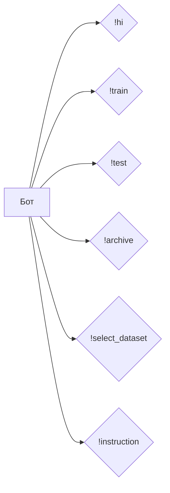

```MD
# Анализ кода бота

## <input code>

```
!hi: Greets the user.
!train <data> <data_dir> <positive> <attachment>: Trains the model with the provided data. Use data for a file, data_dir for a directory, or attachment for a file attachment.
!test <test_data>: Tests the model with provided JSON test data.
!test <test_data>: Tests the model with provided JSON test data.
!archive <directory>: Archives files in the specified directory.
!select_dataset <path_to_dir_positive> <positive>: Selects a dataset for training from the specified directory.
!instruction: Displays this instruction message.
```

## <algorithm>

В данном случае алгоритм не описывает вычислений, а определяет набор команд (инструкций) для бота.  Блок-схема не требуется, так как это не программный код, а набор команд.  Каждая строка представляет отдельную команду/инструкцию для бота.

## <mermaid>



## <explanation>

Код представляет собой набор команд для чат-бота, вероятно, написанного на платформе, поддерживающей обработку пользовательских команд (например, Discord бот, Slack бот или Telegram бот).

**Импорты:**

Нет импортов, так как это не фрагмент программного кода на языке программирования. Это просто список доступных команд для бота.

**Классы:**

Нет классов.  Это набор команд, определяющих поведение бота в ответ на определенные входные данные.

**Функции:**

Нет функций в традиционном понимании.  Каждая строка `!команда <аргументы>` представляет собой вызов "функции" (возможно, обработчика события) с конкретной командой и параметрами.

**Переменные:**

Нет переменных.

**Возможные ошибки или улучшения:**

* **Неопределенность:** Нужно понимать, как бот будет обрабатывать некорректные запросы или команды, которые не соответствуют синтаксису.  Например, `!train` требует определенных аргументов.
* **Обработка ошибок:** Необходимо обеспечить обработку ошибок ввода-вывода (например, при работе с файлами/каталогами) или других ситуаций, которые могут возникнуть при выполнении команд.
* **Документация:** Желательно добавить более подробное описание каждой команды, таких как формат входных данных и ожидаемые результаты.
* **Обработка больших данных:** Если команды будут работать с большими объемами данных, необходимы оптимизации для обработки таких объемов.

**Взаимосвязь с другими частями проекта:**

Этот фрагмент кода определяет интерфейс взаимодействия бота с пользователем.  В более полном проекте должны быть функции/классы, которые выполняют действия, соответствующие каждой команде.  Например, за `!train` может стоять функция, обучивающая модель машинного обучения, а за `!archive` — функция архивирования файлов.  Поэтому код напрямую не зависит от внешних библиотек, но предполагает существование соответствующей логики обработки команд (в других частях проекта).