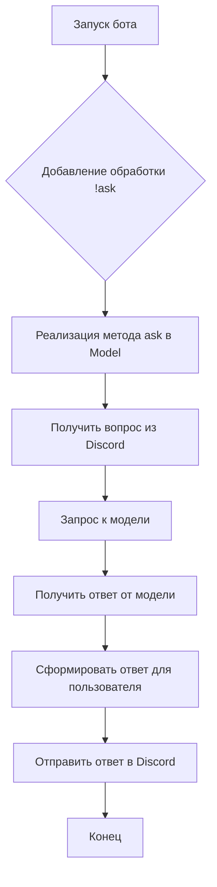

# Анализ кода Discord бота для обучения и тестирования модели

## <input code>

```
### Step-by-Step Guide
... (Описание шагов по запуску, приглашению бота, подготовке данных, обучению, мониторингу, тестированию, дополнительным командам)
...
### Guide to Adding a Q&A Command
... (Описание шагов по добавлению команды для ответов на вопросы)
```

## <algorithm>

Поскольку предоставленный код представляет собой руководство, а не фрагмент кода, алгоритм его работы описывается в виде пошагового описания инструкций, которые нужно выполнить для добавления функциональности Q&A в бота:

1. **Запуск бота:** Убедитесь, что бот запущен и подключен к Discord серверу.
2. **Добавление команды `!ask`:** В коде бота необходимо добавить обработку команды `!ask`.
3. **Реализация метода `ask` в классе `Model`:**  В классе, представляющем модель, нужно реализовать метод `ask`, который будет принимать вопрос в качестве входных данных и возвращать ответ, полученный от модели. 
4. **Обработка входных данных:** Получить текст вопроса от пользователя (например, из сообщения Discord).
5. **Запрос к модели:** Отправить вопрос обученной модели и получить результат.
6. **Формирование ответа:** Сформировать ответ, который будет отправлен пользователю.
7. **Отправка ответа:** Отправить ответ пользователю в Discord.


## <mermaid>



## <explanation>

Этот код не содержит фрагмента исходного кода на языке программирования, а представляет собой руководство пользователя, описывающее шаги по созданию и использованию бота Discord для обучения, тестирования и получения ответов от обученной модели.

**Импорты:**  Нет импортированных пакетов, поскольку это документация по процедуре.

**Классы:**  В руководстве упоминается класс `Model`, но нет информации о его структуре и реализации, только о методе `ask`.

**Функции:**  Нет определённых функций, только описания действий.

**Переменные:**  Нет объявленных переменных.


**Возможные ошибки или области для улучшения:**

* Не указаны подробности реализации методов `ask`, `train`, `test` и других команд.
* Не указаны конкретные библиотеки, используемые для работы с Discord и обучением моделей.
* Отсутствует конкретный код на языке программирования для реализации описанных шагов.
* Нет описания структуры данных, которые используются для хранения и обработки данных обучения и тестирования модели.

**Взаимосвязи с другими частями проекта:**

Руководство подразумевает, что существуют определённые классы и методы, которые отвечают за взаимодействие с Discord, загрузку данных, обучение модели и получение результатов.  Создание бота подразумевает взаимодействие с API Discord.

**Выводы:**

Документация описывает последовательность действий, необходимых для добавления функциональности Q&A в бота Discord.  Для полноценного анализа нужен код на языке программирования.