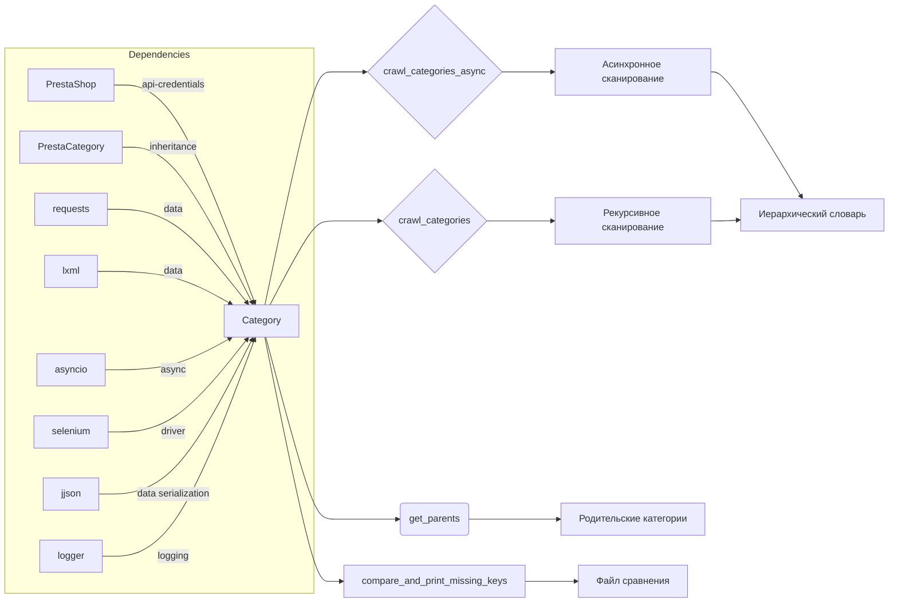

```MD
# Анализ кода модуля `src.category`

## <input code>

```rst
.. :module: src.category
```
# Модуль: Category

## Обзор

Модуль `Category` предоставляет функциональность для работы с категориями продуктов, в основном для PrestaShop. Он предлагает инструменты для взаимодействия с данными категорий, включая сканирование страниц категорий и управление иерархической структурой категорий.

## Класс: `Category`

Класс `Category` наследуется от `PrestaCategory` и отвечает за обработку категорий продуктов, извлечение родительских категорий и рекурсивное сканирование страниц категорий.

### Конструктор: `__init__(self, api_credentials, *args, **kwargs)`

Инициализирует объект `Category`.

#### Аргументы:
- `api_credentials`: API-ключи для доступа к данным о категориях.
- `args`: Список аргументов переменной длины (не используется).
- `kwargs`: Словарь ключевых аргументов (не используется).

### Метод: `get_parents(self, id_category, dept)`

Извлекает список родительских категорий.

#### Аргументы:
- `id_category`: ID категории для получения родительских категорий.
- `dept`: Уровень глубины категории.

#### Возвращает:
- Список родительских категорий.

### Метод: `crawl_categories_async(self, url, depth, driver, locator, dump_file, default_category_id, category=None)`

Асинхронно сканирует категории, строя иерархический словарь.

#### Аргументы:
- `url`: URL страницы категории.
- `depth`: Глубина рекурсивного сканирования.
- `driver`: Экземпляр Selenium WebDriver.
- `locator`: XPath локатор для ссылок на категории.
- `dump_file`: Путь к JSON-файлу для сохранения результатов.
- `default_category_id`: ID по умолчанию для категории.
- `category`: (Необязательно) Существующий словарь категории (по умолчанию None).

#### Возвращает:
- Обновленный или новый словарь категории.

### Метод: `crawl_categories(self, url, depth, driver, locator, dump_file, id_category_default, category={})`

Рекурсивно сканирует категории и строит иерархический словарь.

#### Аргументы:
- `url`: URL страницы для сканирования.
- `depth`: Глубина рекурсии.
- `driver`: Экземпляр Selenium WebDriver.
- `locator`: XPath локатор для нахождения ссылок на категории.
- `dump_file`: Файл для сохранения иерархического словаря.
- `id_category_default`: ID категории по умолчанию.
- `category`: Словарь категории (по умолчанию пустой).

#### Возвращает:
- Иерархический словарь категорий и их URL-адресов.

### Метод: `_is_duplicate_url(self, category, url)`

Проверяет, существует ли URL уже в словаре категории.

#### Аргументы:
- `category`: Словарь категории.
- `url`: URL для проверки.

#### Возвращает:
- `True`, если URL дублируется, `False` в противном случае.

## Функция: `compare_and_print_missing_keys(current_dict, file_path)`

Сравнивает текущий словарь с данными из файла и выводит любые отсутствующие ключи.

### Аргументы:
- `current_dict`: Словарь для сравнения.
- `file_path`: Путь к файлу с данными для сравнения.


## Пример использования

```python
from src.category import Category

# Инициализация Category с API-ключами
category = Category(api_credentials={'api_key': 'your_api_key'})

# Получение родителей категории
parents = category.get_parents(id_category=123, dept=2)

# Асинхронное сканирование категорий
category_data = await category.crawl_categories_async(
    url='https://example.com/categories',
    depth=3,
    driver=driver_instance,
    locator='//a[@class="category-link"]',
    dump_file='categories.json',
    default_category_id=123
)

# Сравнение текущих данных категории с файлом и вывод пропущенных ключей
compare_and_print_missing_keys(current_dict=category_data, file_path='saved_categories.json')
```

## Зависимости

- `requests`
- `lxml`
- `asyncio`
- `selenium`
- `src.endpoints.prestashop.PrestaShop`
- `src.endpoints.prestashop.PrestaCategory`
- `src.utils.jjson.j_loads`
- `src.utils.jjson.j_dumps`
- `src.logger.logger`

## <mermaid>




## <explanation>

**Импорты:**  Модуль использует `requests`, `lxml`, `asyncio`, `selenium` для работы с веб-страницами, асинхронности, работы с DOM.  `src.endpoints.prestashop.PrestaShop` и `src.endpoints.prestashop.PrestaCategory` – это предположительно классы, предоставляющие доступ к API PrestaShop и категории товаров. `src.utils.jjson.j_loads` и `src.utils.jjson.j_dumps` - функции для работы с JSON. `src.logger.logger`  для логирования.  Они предполагают организацию кода в иерархической структуре пакета `src`.

**Классы:**

* **`Category`:** Центральный класс, отвечающий за взаимодействие с категориями. Он наследует от `PrestaCategory`, что подразумевает подключение к API PrestaShop.  Методы `crawl_categories_async` и `crawl_categories` обеспечивают сканирование категорий.  `get_parents` извлекает родительские категории.

**Функции:**

* **`compare_and_print_missing_keys`:**  Сравнивает два словаря и выводит отсутствующие ключи. Используется для проверки полноты данных.

**Переменные:**  Типы переменных в основном очевидны из документации к методам (URL, depth, driver, locator, словарь `category`).  Важно понимать, что `api_credentials` предполагает словарь с API-ключами,  `driver` - объект Selenium WebDriver. `locator` - это XPath-выражение для выбора элементов на странице.

**Возможные ошибки/улучшения:**

* **Обработка исключений:**  Необходима обработка исключений (например, `requests.exceptions`, `selenium.common.exceptions`) для предотвращения падения скрипта.
* **Детализация логирования:** Логирование должно содержать больше контекстной информации (например, URL, ID категории) для эффективной отладки.
* **Эффективность сканирования:**  Асинхронность `crawl_categories_async` важна, но нужно учитывать возможности перегрузки системы (например, время ожидания между запросами, контроль количества одновременно выполняемых задач).
* **Обработка ошибок API:**  Нужно предусмотреть обработку ошибок, возвращаемых API PrestaShop, например, проверку кода ответа и корректную реакцию на ошибки.

**Взаимосвязь с другими частями проекта:**  `Category` явно зависит от API PrestaShop (через `PrestaCategory`).  Также присутствует зависимость от функций `jjson` для работы с данными в формате JSON.  Логирование ( `src.logger.logger`) указывает на более широкую структуру проекта, в которой используется система логирования.  Существует предполагаемый файл `saved_categories.json` в качестве источника данных для сравнения.