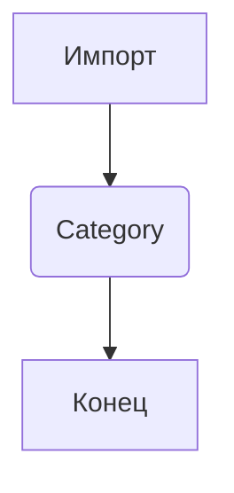
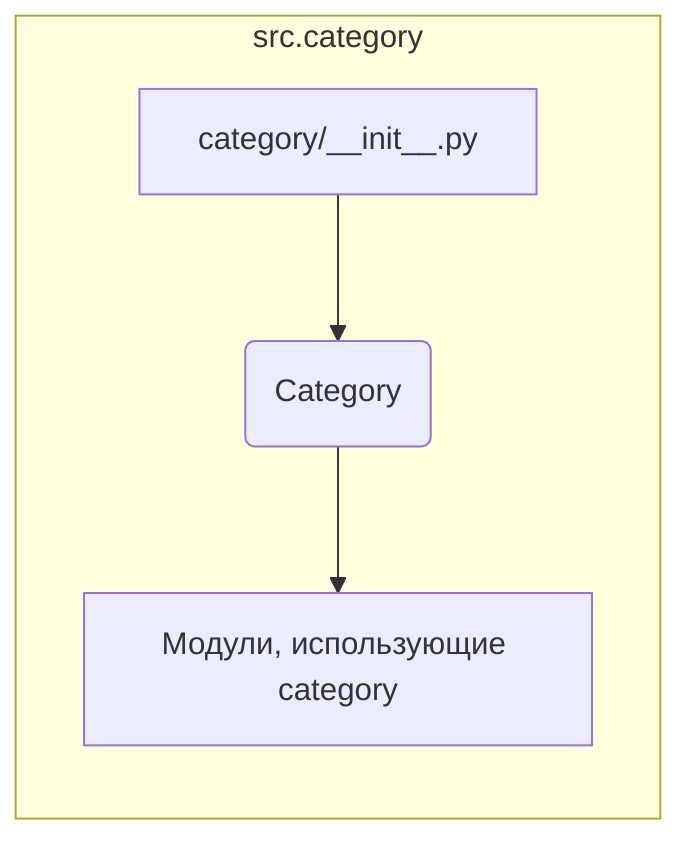

```MD
# Анализ кода hypotez/src/category/__init__.py

## <input code>

```python
## \file hypotez/src/category/__init__.py
# -*- coding: utf-8 -*-\

#! venv/bin/python/python3.12

"""
.. module: src.category 
	:platform: Windows, Unix
	:synopsis:

"""


from .category import Category
```

## <algorithm>

Этот код импортирует класс `Category` из модуля `category.py` в текущем каталоге (`src/category`).  Блок-схема проста и состоит из одного шага: импорта.



Пример:

В файле `hypotez/src/category/__init__.py` определяется переменная `MODE` со значением `'dev'`.  Это глобальная переменная, доступная во всех модулях, импортирующих `src/category/__init__.py`. Далее, происходит импорт класса `Category` из модуля `src/category/category.py`. Это означает, что в `__init__.py` теперь доступен класс `Category` для использования в других модулях пакета `src.category`.  Эта операция не выполняет каких-либо вычислений или преобразований данных.


## <mermaid>



Диаграмма показывает, что `__init__.py` модуль импортирует класс `Category` из `category.py`.  Взаимосвязь происходит через импорт, а не через вызовы функций или передачи данных.  Зависимости `category/__init__.py` ограничены импортом.  Никаких других подключений или внешних зависимостей, за исключением стандартных Python библиотек, нет.


## <explanation>

**Импорты:**

* `from .category import Category`: Этот импорт необходим для использования класса `Category` в других частях пакета `src.category`.  `.` указывает, что импортируемый модуль находится в том же каталоге.  Это типичный способ организации Python кода по модулям. Этот импорт предоставляет доступ к классу `Category` для использования в других файлах пакета `src.category`.  Импортируя класс, этот файл позволяет другим модулям работать с объектами класса `Category`.

**Классы:**

* `Category`:  Этот класс не определен в `__init__.py`.  Его определение находится в `src/category/category.py`.  `__init__.py` просто предоставляет к нему доступ.  Информация о классе `Category` (атрибуты, методы) должна быть изучена из `src/category/category.py`.


**Функции:**

Нет функций.


**Переменные:**

* ``:  Эта глобальная переменная хранит строку, вероятно, обозначающую режим работы (например, 'dev' для разработки, 'prod' для производства). Она используется в других частях проекта для настройки поведения.


**Возможные ошибки и улучшения:**

* Необходимо проанализировать файл `src/category/category.py` для понимания полного функционала пакета.  
* Если `category.py` содержит сложную логику, стоит создать блок-схему и проанализировать его.
* Добавьте документацию (`docstrings`) к классу `Category` и его методам для лучшей читаемости и понимания.
* Рассмотрите возможность использования `typing` для улучшения типов данных.
* Если `MODE` используется в нескольких местах, стоит вынести его в отдельный конфигурационный файл или переменную окружения для большей гибкости.


**Взаимосвязи с другими частями проекта:**

`src.category/__init__.py` играет роль импортера для других частей `src.category`.  Для анализа необходимы файлы из пакета `src/category` (например, `src/category/category.py`), чтобы понять взаимодействие класса `Category` с другими компонентами.