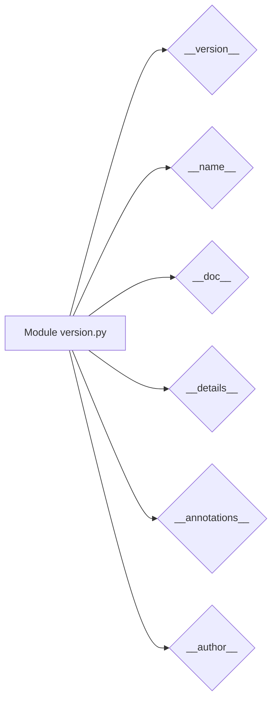

# <input code>

```python
## \file hypotez/src/category/_examples/version.py
# -*- coding: utf-8 -*-\

#! venv/bin/python/python3.12

"""
.. module: src.category._examples 
	:platform: Windows, Unix
	:synopsis:

"""


"""
	:platform: Windows, Unix
	:synopsis:

"""


"""
	:platform: Windows, Unix
	:synopsis:

"""


"""
  :platform: Windows, Unix

"""
"""
  :platform: Windows, Unix
  :platform: Windows, Unix
  :synopsis:
"""
  
""" module: src.category._examples """


""" @namespace src.category._examples """


"""
- `__version__`: This variable holds the version of the module or package.
- `__name__`: Contains the name of the module. If the script is being run directly, the value will be `"__main__"`.
- `__doc__`: The module's documentation string.
- `__details__`: This variable likely contains additional details about the module, but the exact purpose depends on the specific module or package.
- `__annotations__`: Contains type annotations for variables and functions in the module.
- `__author__`: The name(s) of the author(s) of the module.
"""
__name__:str
__version__="3.12.0.0.0.4"
__doc__:str
__details__:str="Details about version for module or class"
__annotations__

__author__='hypotez '
```

# <algorithm>

Этот код не содержит алгоритма в классическом понимании. Он представляет собой определение модуля, содержащего метаданные о нём, такую как версия, название и автор.  Данные не передаются между функциями или классами.

# <mermaid>



# <explanation>

Этот Python-файл (`version.py`) определяет метаданные модуля.  Он не содержит каких-либо выполняемых инструкций (функций или классов), а представляет собой набор констант, которые описывают сам модуль:

* **`__version__`**: Строковая переменная, хранящая версию модуля (`3.12.0.0.0.4`).
* **`__name__`**:  Строковая переменная, хранящая имя модуля (`hypotez/src/category/_examples/version`). В коде указано `__name__:str`, предполагая, что это переменная, содержащая имя. Однако, её значение приводится в виде документации, а не объявляется прямо. В интерпретаторе Python имя модуля обычно доступно как `__name__`
* **`__doc__`**: Строковая переменная, содержащая строку документации модуля.
* **`__details__`**: Строковая переменная, описывающая дополнительные подробности о версии модуля или класса.
* **`__annotations__`**: Предполагаемая переменная для аннотаций типов, которые могут быть добавлены в будущем (но в текущем коде не используется).
* **`__author__`**: Строковая переменная, содержащая имя автора модуля.

**Импорты:** В данном файле отсутствуют импорты. Модуль работает автономно, используя только собственные переменные.


**Классы, функции, переменные:** В файле определены только константы, описывающие сам модуль.


**Возможные ошибки или улучшения:**

* **Неясная структура**: Присутствуют многочисленные строки документации, которые могли бы быть организованы более четко.
* **Неиспользуемые переменные**:  `MODE` используется только в документации, но в коде не используется. Лучше удалить его, если он не нужен.

**Взаимосвязь с другими частями проекта:**

Этот файл скорее всего служит для хранения информации о версии модуля.  Он не вызывает другие модули и не содержит интерфейса для взаимодействия с ними.  Его использование логично в составе проекта, который требует определения и использования информации о версии.  Например, в `setup.py` этого проекта может быть использована переменная `__version__` для определения версии при установке пакета.


```