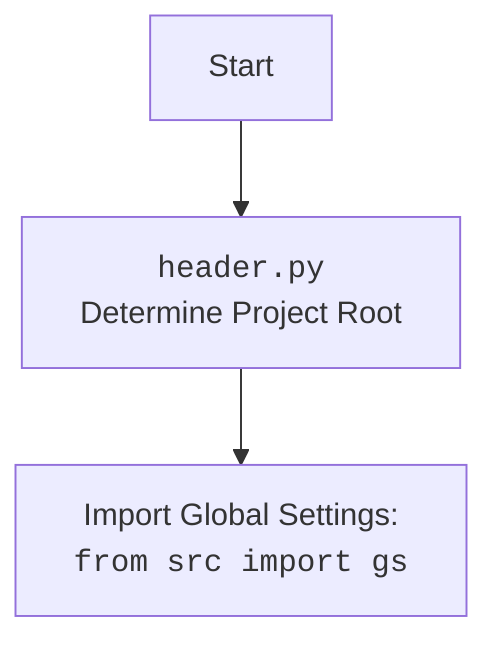

## <алгоритм>

### 1. Инициализация `Category`
   - Создается экземпляр класса `Category` с API-кредами.
   - Вызывается конструктор родительского класса `PrestaCategory`.
   - **Пример:** `category_instance = Category(api_credentials={"key": "value"})`

### 2. Получение родительских категорий `get_parents`
   - Метод `get_parents` принимает ID категории (`id_category`) и уровень (`dept`).
   - Вызывает метод `get_list_parent_categories` из родительского класса `PrestaCategory`.
   - Возвращает список родительских категорий.
   - **Пример:** `parent_categories = category_instance.get_parents(123, 2)`

### 3. Асинхронный обход категорий `crawl_categories_async`
   - Принимает URL, глубину, Selenium-драйвер, локатор, путь к файлу для сохранения, ID категории по умолчанию, и опционально словарь категории.
   - Если словарь категории не предоставлен, создается базовый словарь с URL, пустым именем, настройками PrestaShop и пустым словарем для дочерних категорий.
   - Если глубина равна 0, возвращает текущий словарь категории.
   - Загружает страницу по URL с помощью Selenium WebDriver.
   - Извлекает ссылки на категории по локатору XPath. Если ссылки не найдены, выводит ошибку и возвращает текущую категорию.
   - Запускает асинхронные задачи для каждой ссылки, рекурсивно вызывая `crawl_categories_async` с уменьшенной глубиной.
   - Проверяет дубликаты URL перед рекурсивным вызовом, используя метод `_is_duplicate_url`.
   - После завершения всех асинхронных задач возвращает обновленный словарь категории.
   - Если возникает исключение, выводит сообщение об ошибке и возвращает текущую категорию.
    - **Пример:**
        -   `url` = "https://example.com/categories"
        -   `depth` = 2
        -   `driver` = (Selenium WebDriver instance)
        -   `locator` = "//div/a"
        -   `dump_file` = "categories.json"
        -   `default_category_id` = 1
    ```mermaid
    flowchart TD
        A[Start crawl_categories_async] --> B{category is None?};
        B -- Yes --> C[Initialize category];
        B -- No --> D{depth <= 0?};
        C --> D;
        D -- Yes --> E[Return category];
        D -- No --> F[driver.get(url)];
        F --> G[Wait for page load];
        G --> H[Find category links];
        H --> I{category_links is empty?};
        I -- Yes --> J[Log error];
        J --> K[Return category];
        I -- No --> L[Create tasks list];
        L --> M[asyncio.gather(*tasks)];
        M --> N[Return category];
        N --> End[End];
        K --> End
        
    ```

### 4. Синхронный обход категорий `crawl_categories`
   - Принимает URL, глубину, Selenium-драйвер, локатор, путь к файлу для сохранения, ID категории по умолчанию и опционально словарь категории.
   - Если глубина равна 0, возвращает текущий словарь категории.
   - Загружает страницу по URL с помощью Selenium WebDriver.
   - Извлекает ссылки на категории по локатору XPath. Если ссылки не найдены, выводит ошибку и возвращает текущую категорию.
   - Итерируется по ссылкам на категории.
   - Проверяет дубликаты URL перед рекурсивным вызовом, используя метод `_is_duplicate_url`.
   - Создает новый словарь категории и рекурсивно вызывает `crawl_categories` с уменьшенной глубиной.
   - Загружает существующие данные из файла `dump_file`, объединяет их с новым словарем категорий и сохраняет обратно в файл.
   - Возвращает обновленный словарь категории.
   - Если возникает исключение, выводит сообщение об ошибке и возвращает текущую категорию.
    - **Пример:**
        -   `url` = "https://example.com/categories"
        -   `depth` = 2
        -   `driver` = (Selenium WebDriver instance)
        -   `locator` = "//div/a"
        -   `dump_file` = "categories.json"
        -   `default_category_id` = 1
        -   `category` = {}
    ```mermaid
    flowchart TD
        A[Start crawl_categories] --> B{depth <= 0?};
        B -- Yes --> C[Return category];
        B -- No --> D[driver.get(url)];
        D --> E[Wait for page load];
        E --> F[Find category links];
        F --> G{category_links is empty?};
        G -- Yes --> H[Log error];
        H --> I[Return category];
        G -- No --> J[Iterate through category_links];
         J --> K{is_duplicate_url?};
        K -- Yes --> J;
        K -- No --> L[Create new category];
        L --> M[Add new category to current];
        M --> N[Recursively call crawl_categories];
        N --> O[Load data from dump_file];
        O --> P[Merge data and save to dump_file];
        P --> Q[Return category];
        Q --> End[End];
        I --> End

    ```

### 5. Проверка дубликатов URL `_is_duplicate_url`
   - Принимает словарь категории и URL.
   - Проверяет, существует ли URL в значениях словаря.
   - Возвращает `True`, если URL дублируется, иначе `False`.
   - **Пример:** `is_duplicate = category_instance._is_duplicate_url(category_dict, "https://example.com/page")`

### 6. Сравнение и вывод недостающих ключей `compare_and_print_missing_keys`
   - Принимает словарь и путь к файлу.
   - Загружает данные из файла. Если загрузка не удалась, выводит ошибку и завершается.
   - Итерируется по ключам загруженных данных.
   - Если ключ не найден в переданном словаре, выводит его в консоль.
   - **Пример:** `compare_and_print_missing_keys(current_category_dict, "categories.json")`
    ```mermaid
    flowchart TD
        A[Start compare_and_print_missing_keys] --> B[Load data from file];
         B --> C{Error loading data?};
        C -- Yes --> D[Log error];
        D --> End[End];
        C -- No --> E[Iterate through keys from file];
        E --> F{key not in current_dict?};
        F -- Yes --> G[Print key];
        G --> E;
        F -- No --> E;
        E --> End

    ```

## <mermaid>

```mermaid
flowchart TD
    A[Category Object] --> B(get_parents);
    B --> C[PrestaCategory.get_list_parent_categories];
    A --> D(crawl_categories_async);
    D --> E{category is None?};
    E -- Yes --> F[Initialize category];
    E -- No --> G{depth <= 0?};
    F --> G;
    G -- Yes --> H[Return category];
    G -- No --> I[driver.get(url)];
    I --> J[Wait for page load];
    J --> K[Find category links];
    K --> L{category_links is empty?};
    L -- Yes --> M[Log error];
    M --> N[Return category];
    L -- No --> O[Create tasks list];
    O --> P[asyncio.gather(*tasks)];
    P --> Q[Return category];
    
    A --> R(crawl_categories);
    R --> S{depth <= 0?};
    S -- Yes --> T[Return category];
    S -- No --> U[driver.get(url)];
    U --> V[Wait for page load];
    V --> W[Find category links];
    W --> X{category_links is empty?};
     X -- Yes --> Y[Log error];
    Y --> Z[Return category];
     X -- No --> AA[Iterate through category_links];
    AA --> AB{is_duplicate_url?};
    AB -- Yes --> AA;
    AB -- No --> AC[Create new category];
    AC --> AD[Add new category to current];
    AD --> AE[Recursively call crawl_categories];
    AE --> AF[Load data from dump_file];
    AF --> AG[Merge data and save to dump_file];
     AG --> AH[Return category];


    A --> AI(_is_duplicate_url);
    AI --> AJ{url in category.values()?};
    AJ -- Yes --> AK[return True];
    AJ -- No --> AL[return False];
    
    MN[compare_and_print_missing_keys] --> AO[Load data from file];
    AO --> AP{Error loading data?};
    AP -- Yes --> AQ[Log error];
     AP -- No --> AR[Iterate through keys from file];
    AR --> AS{key not in current_dict?};
    AS -- Yes --> AT[Print key];
    AT --> AR;
     AS -- No --> AR;
    
    classDef green fill:#90EE90
    class A, MN green
```
**Объяснение зависимостей:**
*   **`Category`**: Основной класс для управления категориями.
*   **`PrestaCategory`**: Родительский класс, предоставляющий методы для работы с категориями PrestaShop.
*   **`get_parents`**: Метод для получения родительских категорий.
*   **`crawl_categories_async`**: Асинхронный метод для обхода иерархии категорий.
*   **`crawl_categories`**: Синхронный метод для обхода иерархии категорий.
*   **`_is_duplicate_url`**: Метод для проверки наличия дубликатов URL.
*   **`compare_and_print_missing_keys`**: Функция для сравнения словаря с данными из файла и вывода отсутствующих ключей.



## <объяснение>

### Импорты:

-   `from __future__ import annotations`: Позволяет использовать аннотации типов, которые могут ссылаться на еще не определенные классы (например, внутри класса).
-   `import asyncio`: Модуль для асинхронного программирования, используется для параллельного выполнения задач.
-   `from pathlib import Path`: Модуль для работы с путями к файлам, обеспечивает кроссплатформенность.
-   `import os`: Модуль для работы с операционной системой, в данном случае не используется напрямую.
-    `from typing import Dict`: Модуль для определения типов данных, используется для аннотации словарей.
-   `from lxml import html`: Библиотека для работы с HTML и XML, используется для парсинга веб-страниц.
-   `import requests`: Библиотека для отправки HTTP-запросов.
-   `import header`: Локальный модуль для определения корневой директории проекта.
-   `from src import gs`: Локальный модуль для доступа к глобальным настройкам проекта.
-   `from src.logger.logger import logger`: Локальный модуль для логирования событий.
-   `from src.utils.jjson import j_loads, j_dumps`: Локальный модуль для безопасной работы с JSON.
-   `from src.endpoints.prestashop import PrestaCategory`: Локальный модуль, представляющий класс для взаимодействия с API PrestaShop категорий.

**Взаимосвязь с другими пакетами:**
    - `src.logger`: Используется для логирования ошибок и других событий.
    - `src.utils`: Содержит утилиты для работы с JSON.
    - `src.endpoints`: Содержит классы для взаимодействия с различными API, в том числе PrestaShop.

### Классы:

#### `Category(PrestaCategory)`:

*   **Роль**: Класс для обработки категорий продуктов, наследовается от `PrestaCategory`.
*   **Атрибуты**:
    *   `credentials`: Словарь с учетными данными API.
*   **Методы**:
    *   `__init__`: Конструктор класса, инициализирует объект `Category`. Принимает API-креды.
    *   `get_parents`: Возвращает список родительских категорий. Вызывает `get_list_parent_categories` из родительского класса.
    *   `crawl_categories_async`: Асинхронно обходит категории, строя иерархический словарь. Использует `asyncio.gather` для запуска нескольких задач одновременно.
    *   `crawl_categories`: Синхронно обходит категории, строя иерархический словарь.
    *   `_is_duplicate_url`: Проверяет наличие URL в словаре категорий.

**Взаимодействие с другими компонентами:**
    - Наследуется от `PrestaCategory` для использования API-методов.
    - Использует `logger` для логирования.
    - Использует `j_loads` и `j_dumps` для безопасной работы с JSON файлами.
    - Использует методы Selenium WebDriver.

### Функции:

#### `crawl_categories_async(self, url, depth, driver, locator, dump_file, default_category_id, category=None)`:

*   **Аргументы**:
    *   `url`: URL страницы для обхода.
    *   `depth`: Глубина рекурсии.
    *   `driver`: Экземпляр Selenium WebDriver.
    *   `locator`: XPath-локатор для поиска ссылок на категории.
    *   `dump_file`: Путь к файлу для сохранения результата.
    *   `default_category_id`: ID категории по умолчанию.
    *   `category`: Существующий словарь категорий (необязательный).
*   **Возвращаемое значение**: Обновленный словарь категорий.
*   **Назначение**: Асинхронный обход категорий и построение иерархического словаря.
*   **Пример:**
    ```python
    async def main():
        api_creds = {"key": "value"}
        category_obj = Category(api_creds)
        from selenium import webdriver
        driver = webdriver.Chrome()
        url = "https://example.com/categories"
        locator = "//a[@class='category-link']"
        dump_file = "categories.json"
        default_category_id = 1
        result = await category_obj.crawl_categories_async(url, 2, driver, locator, dump_file, default_category_id)
        print(result)
        driver.quit()

    if __name__ == "__main__":
         asyncio.run(main())
    ```

#### `crawl_categories(self, url, depth, driver, locator, dump_file, id_category_default, category={})`:

*   **Аргументы**:
    *   `url`: URL страницы для обхода.
    *   `depth`: Глубина рекурсии.
    *   `driver`: Экземпляр Selenium WebDriver.
    *   `locator`: XPath-локатор для поиска ссылок на категории.
    *   `dump_file`: Путь к файлу для сохранения результата.
    *   `id_category_default`: ID категории по умолчанию.
    *   `category`: Существующий словарь категорий (необязательный).
*   **Возвращаемое значение**: Обновленный словарь категорий.
*   **Назначение**: Синхронный обход категорий и построение иерархического словаря.
*   **Пример:**
    ```python
    api_creds = {"key": "value"}
    category_obj = Category(api_creds)
    from selenium import webdriver
    driver = webdriver.Chrome()
    url = "https://example.com/categories"
    locator = "//a[@class='category-link']"
    dump_file = "categories.json"
    id_category_default = 1
    result = category_obj.crawl_categories(url, 2, driver, locator, dump_file, id_category_default)
    print(result)
    driver.quit()
    ```

#### `_is_duplicate_url(self, category, url)`:

*   **Аргументы**:
    *   `category`: Словарь категорий.
    *   `url`: URL для проверки.
*   **Возвращаемое значение**: `True`, если URL уже существует в словаре, `False` в противном случае.
*   **Назначение**: Проверка дублирования URL.

#### `compare_and_print_missing_keys(current_dict, file_path)`:

*   **Аргументы**:
    *   `current_dict`: Словарь для сравнения.
    *   `file_path`: Путь к файлу JSON.
*   **Возвращаемое значение**: None.
*   **Назначение**: Сравнение ключей текущего словаря с ключами из файла и вывод отсутствующих ключей.
*   **Пример:**
   ```python
   current_dict = {"key1": "value1", "key2": "value2"}
   file_path = "categories.json"
   compare_and_print_missing_keys(current_dict, file_path)
   ```

### Переменные:

*   `credentials`: Словарь для хранения учетных данных API.
*   `category`: Словарь для хранения информации о категориях и их подкатегориях (в методах обхода).
*   `url`: Строка, представляющая URL страницы.
*   `depth`: Целое число, представляющее глубину обхода.
*   `driver`: Экземпляр Selenium WebDriver.
*   `locator`: Строка, представляющая XPath-локатор.
*   `dump_file`: Строка, представляющая путь к файлу JSON.
*    `id_category_default` - id категории по умолчанию
*    `default_category_id` - id категории по умолчанию

### Потенциальные ошибки и области для улучшения:

1.  **Обработка исключений**: В блоках `try-except` логируется общая ошибка. Можно было бы сделать более специфическую обработку исключений.
2.  **Зависимости**: Код сильно зависит от Selenium WebDriver. При изменении верстки веб-страницы,  XPath локаторы нужно будет обновлять.
3.  **Производительность**: Синхронный обход `crawl_categories` может быть медленным для больших объемов данных.
4.  **Дублирование кода**: Код обхода категорий (`crawl_categories` и `crawl_categories_async`) имеет много общего, можно вынести общие части в отдельную функцию.
5.  **Расширение функциональности**: Можно добавить методы для обновления категорий, создания новых категорий и т.д.
6.  **Использование глобальных переменных:** `id_category_default` используется и как глобальная переменная.
7. **Проверка типа данных:** В методе `crawl_categories` не проверяется правильность типа `dump_file`. Это может привести к ошибкам.

### Цепочка взаимосвязей:

1.  **`Category` -> `PrestaCategory`**: Наследование для работы с API PrestaShop.
2.  **`Category` -> `src.logger.logger`**: Логирование событий.
3.  **`Category` -> `src.utils.jjson`**: Безопасная работа с JSON.
4.  **`Category` -> `Selenium WebDriver`**: Для обхода веб-страниц.
5.  **`crawl_categories_async` -> `asyncio`**: Асинхронное выполнение задач.
6.  **`compare_and_print_missing_keys` -> `j_loads`**: Загрузка данных из файла.
7.  **`header.py` -> `src.gs`**: определение корневой директории и чтение глобальных параметров.