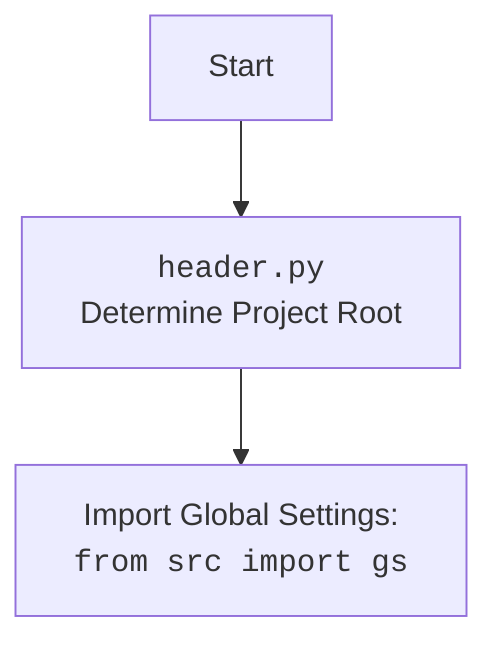

## <алгоритм>

1.  **Начало**:
    *   Начинается выполнение скрипта `header.py`.
2.  **`set_project_root()`**:
    *   Вызывается функция `set_project_root()` для определения корневой директории проекта.
    *   **Инициализация**: `current_path` устанавливается в путь директории, где находится файл `header.py`.
        *   Пример: Если `header.py` находится в `/home/user/hypotez/src/category/`, то `current_path` будет `/home/user/hypotez/src/category/`.
    *   `__root__` устанавливается в `current_path` изначально.
        *   Пример: `__root__` = `/home/user/hypotez/src/category/`.
    *   **Поиск родительских каталогов**: Проходится по текущей директории и всем ее родительским директориям.
        *   Перебираем `/home/user/hypotez/src/category/`, `/home/user/hypotez/src/`, `/home/user/hypotez/`, `/home/user/`, `/home/`, `/`.
    *   **Проверка маркеров**: Для каждой директории проверяется, существует ли в ней хотя бы один из файлов/директорий-маркеров (`__root__` или `.git`).
        *   Пример: Если в `/home/user/hypotez/` есть файл `.git`, то цикл остановится.
    *   **Обновление `__root__`**: Если маркер найден, то `__root__` устанавливается в директорию, где он был найден.
        *   Пример: Если `.git` был найден в `/home/user/hypotez/`, то `__root__` станет `/home/user/hypotez/`.
    *   **Добавление в `sys.path`**: Если `__root__` нет в списке путей `sys.path`, то он добавляется в начало списка.
    *   Возвращает `__root__`.
        *  Пример: `/home/user/hypotez/`.
3.  **Инициализация `__root__`**:
    *   Результат выполнения `set_project_root()` присваивается переменной `__root__`.
        *   Пример: `__root__` = `/home/user/hypotez/`.
4.  **Импорт `gs`**:
    *   Из `src` импортируется модуль `gs`.
5.  **Загрузка настроек из `settings.json`**:
    *   Пытается открыть файл `settings.json` в директории `src` относительно `__root__`.
        *   Пример: `/home/user/hypotez/src/settings.json`
    *   Если файл найден и валидный JSON, то его содержимое загружается в словарь `settings`.
    *   Если файл не найден или JSON не валидный, то исключение игнорируется, и `settings` остается `None`.
6.   **Загрузка документации из `README.MD`**:
    * Пытается открыть файл `README.MD` в директории `src` относительно `__root__`.
    * Если файл найден, то его содержимое считывается в строку `doc_str`.
    * Если файл не найден, то исключение игнорируется, и `doc_str` остается `None`.
7.  **Инициализация глобальных переменных**:
    *   Инициализируются глобальные переменные, такие как `__project_name__`, `__version__`, `__doc__`, `__details__`, `__author__`, `__copyright__`, `__cofee__`, используя значения из словаря `settings`, если он был загружен.
    *   Если `settings` не был загружен, используются значения по умолчанию.
8.  **Конец**:
    *   Выполнение скрипта завершается.

## <mermaid>

```mermaid
flowchart TD
    Start[Start] --> FindRoot[set_project_root(): Find Project Root];
    FindRoot --> SetRootVar[Set __root__ Variable];
    SetRootVar --> ImportGS[import from src import gs];
    ImportGS --> LoadSettings[Load settings.json];
    LoadSettings --> LoadDoc[Load README.MD];
    LoadDoc --> InitGlobalVars[Initialize Global Variables];
    InitGlobalVars --> End[End];

    style FindRoot fill:#f9f,stroke:#333,stroke-width:2px
    style SetRootVar fill:#ccf,stroke:#333,stroke-width:2px
    style LoadSettings fill:#ccf,stroke:#333,stroke-width:2px
    style LoadDoc fill:#ccf,stroke:#333,stroke-width:2px
    style ImportGS fill:#ccf,stroke:#333,stroke-width:2px
    
    
     subgraph set_project_root
        SetCurrentPath[current_path = Path(__file__).resolve().parent]
        SetRootToCurrent[__root__ = current_path]
        LoopThroughParents[for parent in [current_path] + list(current_path.parents)]
        CheckMarkerExistence[if any((parent / marker).exists() for marker in marker_files)]
        UpdateRoot[__root__ = parent]
        InsertPath[sys.path.insert(0, str(__root__))]
        ReturnRoot[return __root__]

        SetCurrentPath --> SetRootToCurrent
        SetRootToCurrent --> LoopThroughParents
        LoopThroughParents --> CheckMarkerExistence
        CheckMarkerExistence -- Yes --> UpdateRoot
        CheckMarkerExistence -- No --> LoopThroughParents
        UpdateRoot --> InsertPath
        InsertPath --> ReturnRoot
        LoopThroughParents -->ReturnRoot
        
     end

     FindRoot --> SetCurrentPath
```

## <объяснение>

### Импорты

*   **`import sys`**: Модуль `sys` используется для работы с системными переменными и функциями, такими как добавление пути к проекту в `sys.path`.
*   **`import json`**: Модуль `json` используется для работы с JSON файлами, в частности, для загрузки настроек из `settings.json`.
*    **`from packaging.version import Version`**: Модуль `packaging.version` используется для работы с версиями пакетов. В данном коде не используется, возможно, остался от старой версии кода.
*   **`from pathlib import Path`**: Модуль `pathlib` используется для работы с путями в файловой системе, объект `Path` делает работу с путями более удобной и кроссплатформенной.
*   **`from src import gs`**: Импортирует модуль `gs` из пакета `src`. Предположительно, `gs` содержит глобальные настройки или константы проекта. Это демонстрирует взаимосвязь данного модуля с другими частями проекта, а именно с модулем `gs`.

### Функции

*   **`set_project_root(marker_files: tuple = ('__root__', '.git')) -> Path`**:
    *   **Аргументы**:
        *   `marker_files` (tuple): Кортеж с именами файлов или папок, которые используются как маркеры для определения корневой директории проекта. По умолчанию `('__root__', '.git')`.
    *   **Возвращает**:
        *   `Path`: Объект `Path`, представляющий корневую директорию проекта.
    *   **Назначение**:
        *   Находит корневую директорию проекта, начиная с директории, в которой находится скрипт, и поднимаясь вверх по дереву директорий, пока не найдет один из маркеров.
        *   Добавляет корневую директорию в список путей поиска модулей `sys.path`, чтобы импорты работали корректно относительно корня проекта.
    *   **Пример**:
        *   Если `header.py` находится в `/home/user/hypotez/src/category/` и файл `.git` находится в `/home/user/hypotez/`, то функция вернет `Path('/home/user/hypotez/')`.

### Переменные

*   **`__root__`**:
    *   **Тип**: `Path`
    *   **Назначение**: Хранит путь к корневой директории проекта.
*   **`settings`**:
    *   **Тип**: `dict` или `None`
    *   **Назначение**: Словарь, содержащий настройки проекта, загруженные из `settings.json`. Может быть `None`, если файл не был найден или не удалось распарсить JSON.
*   **`doc_str`**:
    *    **Тип**: `str` или `None`
    *   **Назначение**: Строка, содержащая документацию проекта, загруженную из `README.MD`. Может быть `None`, если файл не был найден или не удалось распарсить содержимое.
*  **`__project_name__`**:
    *    **Тип**: `str`
    *    **Назначение**: Имя проекта, берется из settings или 'hypotez' по умолчанию.
*   **`__version__`**:
    *   **Тип**: `str`
    *   **Назначение**: Версия проекта, берется из settings или '' по умолчанию.
*  **`__doc__`**:
    *   **Тип**: `str`
    *   **Назначение**: Документация проекта, берется из doc_str.
*  **`__details__`**:
    *   **Тип**: `str`
    *   **Назначение**: Детали проекта, пустая строка по умолчанию.
*  **`__author__`**:
    *   **Тип**: `str`
    *   **Назначение**: Автор проекта, берется из settings или '' по умолчанию.
*  **`__copyright__`**:
    *   **Тип**: `str`
    *   **Назначение**: Информация об авторских правах, берется из settings или '' по умолчанию.
*   **`__cofee__`**:
    *    **Тип**: `str`
    *    **Назначение**: Ссылка на донат разработчику, берется из settings или ссылка по умолчанию.

### Потенциальные ошибки и области для улучшения

*   **Обработка ошибок**: Исключения `FileNotFoundError` и `json.JSONDecodeError` при загрузке настроек и документации обрабатываются, но не логируются. Было бы полезно добавить логирование для отслеживания таких ситуаций.
*   **Жестко заданные пути**:  Пути `src/settings.json` и `src/README.MD` заданы жестко. Можно сделать их более гибкими, например, передавая их как аргументы или определяя через переменные окружения.
*   **Отсутствие явной обработки случая отсутствия маркера**: Если маркер не найден, то `__root__` будет равен директории, где находится скрипт. Возможно стоит вызывать ошибку в таком случае.
* **Использование `...`**: Использование `...` в блоках `except` подавляет исключения без какой-либо обработки или логирования. Это может затруднить отладку. Лучше использовать `pass` или залогировать ошибку.
* **`packaging.version`**: импортирован, но не используется. Следует либо удалить импорт, либо использовать его по назначению.

### Взаимосвязи с другими частями проекта

*   **`src.gs`**: Модуль `header.py` зависит от модуля `gs` из пакета `src`, который, предположительно, хранит глобальные настройки или пути.
*   **`settings.json`**: Файл используется для хранения настроек проекта, включая имя, версию, автора и т.д.
*   **`README.MD`**: Файл используется для хранения документации проекта.
*    Другие части проекта используют переменные, инициализированные в этом модуле: `__root__`, `__project_name__`, `__version__`, `__doc__`, `__details__`, `__author__`, `__copyright__`, `__cofee__`.