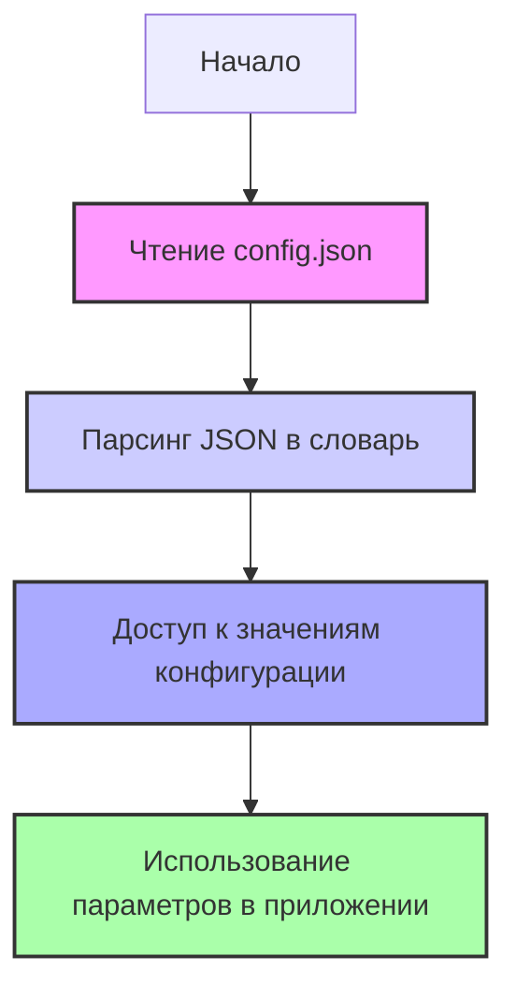

## АНАЛИЗ КОДА: `hypotez/src/config.json`

### 1. <алгоритм>

1.  **Чтение файла конфигурации**:
    *   Файл `config.json` представляет собой JSON-объект.
    *   Приложение считывает этот файл при запуске.
    *   JSON-объект разбирается в Python-словарь с использованием библиотеки `json` (`json.load()`).

    *   **Пример**:
        ```json
        {
          "author": "Hypo69",
          "project_name": "hypotez",
          ...
        }
        ```
2.  **Доступ к данным**:
    *   После разбора JSON, данные доступны через ключи словаря, например `config['author']`.
    *   Значения используются для настройки различных аспектов приложения.
    *   Данные из `config.json` влияют на логику работы приложения, например, определяют режим работы (`dev`, `debug` и т.д.), пути хранения данных, форматы и т.п.

    *   **Пример**:
        ```python
        config = json.load(open('config.json'))
        print(config['author']) # Вывод: Hypo69
        print(config['path']['external_storage']) # Вывод: E:\\hypo69\\data
        ```
3.  **Использование в приложении**:
    *   Пути к файлам (например, `external_storage`, `log`, `tmp`) используются для чтения и записи данных.
    *   `mode` определяет режим работы приложения.
    *   `timestamp_format` используется для форматирования временных меток.
    *   `version` и `release` предоставляют информацию о версии приложения.

### 2. <mermaid>



**Объяснение `mermaid` диаграммы:**

*   **`Start`**: Начальная точка процесса, когда приложение начинает работу.
*   **`ReadConfig`**: Процесс чтения файла `config.json`.
*   **`ParseJSON`**: Разбор содержимого JSON-файла в Python-словарь.
*   **`AccessData`**: Получение доступа к отдельным значениям конфигурации (например, `config['author']`, `config['path']['external_storage']`).
*   **`UseConfig`**: Использование полученных параметров для настройки и работы приложения.
    *  **Стиль**: Стилевые свойства `fill`, `stroke` и `stroke-width` применяются для выделения основных этапов процесса чтения и использования конфигурационных данных.

### 3. <объяснение>

**Импорты**:
  * В представленном коде `config.json` нет импортов, так как это файл конфигурации в формате JSON, а не Python-код.
  * В проекте `hypotez` этот файл будет использоваться в Python-коде, для чего будет применен `import json`.

**Классы**:
  * В файле `config.json` нет классов, так как это файл конфигурации.
  * В рамках проекта `hypotez` файл используется для настроек приложения.

**Функции**:
  * В файле `config.json` нет функций, так как это файл конфигурации.
  * JSON файл считывается функцией `json.load()`.

**Переменные**:

*   **`author`**: Строка, представляющая автора проекта.
*   **`project_name`**: Строка, название проекта.
*   **`mode`**: Строка, определяющая текущий режим работы приложения (`dev`, `debug`, `test`, `prod`).
*   **`avaible_modes`**: Список строк, содержащий допустимые режимы работы приложения.
*   **`git`**: Строка, краткое имя для идентификации репозитория.
*   **`git_user`**: Строка, имя пользователя GitHub/GitLab.
*   **`path`**: Словарь, содержащий пути к различным директориям:
    *   `external_storage`: Путь к директории для хранения внешних данных.
    *   `google_drive`: Путь к директории Google Drive.
    *   `log`: Путь к директории для хранения логов.
    *   `tmp`: Путь к директории для хранения временных файлов.
*   **`timestamp_format`**: Строка, формат для временных меток.
*   **`release`**: Строка, номер релиза приложения.
*   **`version`**: Строка, номер версии приложения.
*   **`copyright`**: Строка, информация об авторских правах.
*  **`cofee`**: Строка, сообщение и ссылка на поддержку разработчика.

**Цепочка взаимосвязей с другими частями проекта**:

1.  **Загрузка конфигурации**: При запуске приложения, файл `config.json` будет загружен в память (например, с помощью библиотеки `json`).
2.  **Использование параметров**: Значения из конфигурации будут использованы для:
    *   Определения путей для чтения и записи данных (например, журналов, временных файлов).
    *   Установки режима работы приложения (например, для отладки или продакшена).
    *   Форматирования временных меток при записи логов.
    *   Отображения информации о версии и релизе приложения.
3.  **Взаимодействие с другими модулями**: Другие модули проекта будут использовать данные из `config.json` для настройки своего поведения, например:
    *   Модуль для работы с файловой системой будет использовать пути из `path`.
    *   Модуль логирования будет использовать `timestamp_format` и путь к логам.
    *   Основной модуль приложения будет использовать `mode` для определения режима работы.

**Потенциальные ошибки и области для улучшения**:

*   **Отсутствие валидации**: Отсутствует валидация данных в `config.json`, что может привести к ошибкам при неправильном форматировании или отсутствующих полях.
*   **Жестко заданные пути**: Пути жестко заданы и зависят от операционной системы. Необходимо предусмотреть возможность задания путей из командной строки или из переменных окружения.
*   **Отсутствие документации**: Желательно добавить документацию по всем параметрам конфигурации.
*   **Отсутствие проверок на наличие файлов**:  Перед использованием путей из `config.json`, следует проверять наличие директорий, а также иметь возможность их автоматического создания.

**Пример взаимодействия**:

1.  **Запуск приложения:**
    *   Приложение читает `config.json`.
    *   Приложение определяет, что `mode` установлен в `dev`.
    *   Приложение использует пути к логам и временным файлам, определенные в секции `path`.
2.  **Работа с данными:**
    *   Приложение использует путь `external_storage` для загрузки внешних данных.
    *   Приложение использует путь `log` для записи логов, используя формат `timestamp_format`.
3.  **Отображение информации:**
    *   Приложение отображает `release` и `version` в интерфейсе.

Этот анализ обеспечивает детальное понимание структуры и назначения конфигурационного файла `config.json` в контексте проекта `hypotez`.