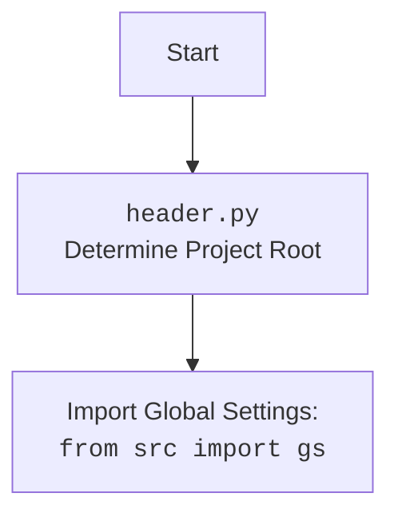

## <алгоритм>

1.  **`set_project_root(marker_files)`**:
    *   **Начало**: Функция принимает кортеж `marker_files` (например, `('pyproject.toml', 'requirements.txt', '.git')`).
    *   **Получение текущего пути**: Определяется путь к текущему файлу и его родительский каталог (`current_path`).
    *   **Инициализация корневого пути**: Изначально корневым путем (`__root__`) считается текущий каталог.
    *   **Перебор родительских каталогов**: Перебираются текущий и все родительские каталоги.
        *   **Проверка маркеров**: Для каждого каталога проверяется наличие хотя бы одного файла или директории из `marker_files`.
            *   **Маркер найден**: Если маркер найден, текущий каталог становится корневым каталогом (`__root__`), и цикл завершается.
    *   **Добавление в `sys.path`**: Если найденный корневой путь не в списке путей Python, он добавляется в начало списка `sys.path`.
    *   **Возврат**: Функция возвращает путь к корневому каталогу.
    *   **Пример**:
        *   Путь к текущему файлу: `/home/user/project/src/credentials.py`.
        *   `marker_files`: `('pyproject.toml', 'requirements.txt', '.git')`.
        *   Поиск маркеров в каталогах: `/home/user/project/src`, `/home/user/project`, `/home/user`, `/home` и т.д.
        *   Если `/home/user/project` содержит `pyproject.toml`, то `/home/user/project` будет возвращен как корневой путь.
2.  **`singleton(cls)`**:
    *   **Начало**: Декоратор `singleton` принимает класс `cls`, который должен быть преобразован в синглтон.
    *   **Создание переменной для экземпляра**: Создается внутренняя переменная `instance` = `None`
    *   **Определение обёрточной функции `get_instance`**:
        *   **Проверка наличия экземпляра**: Проверяется, создан ли уже экземпляр класса.
        *   **Создание экземпляра**: Если экземпляр еще не создан, он создается и присваивается переменной `instance`.
        *   **Возврат экземпляра**: Возвращается сохраненный или только что созданный экземпляр.
    *   **Возврат**: Декоратор возвращает функцию `get_instance`.
    *   **Пример**:
        *   Класс `ProgramSettings` декорируется `@singleton`.
        *   Первый вызов `ProgramSettings()` создает экземпляр.
        *   Последующие вызовы `ProgramSettings()` возвращают тот же экземпляр.
3.  **`ProgramSettings.__init__(self, **kwargs)`**:
    *   **Начало**: Конструктор класса `ProgramSettings`
    *   **Определение корневого каталога**: Вызывается `set_project_root()`, для определения корневой директории проекта.
    *   **Загрузка настроек из `config.json`**: Загружается файл `config.json` из директории `/src`, и его содержимое присваивается `self.config` в виде `SimpleNamespace`.
    *   **Установка имени проекта**: Имя проекта берется из названия корневой директории и присваивается `self.config.project_name`.
    *   **Инициализация `self.path`**:  Инициализируется `self.path` как `SimpleNamespace` с путями к различным директориям проекта.
    *   **Проверка последней версии**: Вызывается метод `check_latest_release` (не описан в коде).
    *   **Загрузка данных из KeePass**: Вызывается `_load_credentials` для загрузки учетных данных.
    *   **Пример**:
        *   Вызов `ProgramSettings()`
        *   Вычисляется `self.base_dir` как `/home/user/project`.
        *   Загружается `config.json` из `/home/user/project/src/config.json`.
        *   Инициализируются пути к директориям, например, `self.path.secrets` = `/home/user/project/secrets`.
        *   Загружаются учетные данные из `credentials.kdbx`.
4.  **`ProgramSettings._load_credentials(self)`**:
    *   **Начало**: Метод `_load_credentials`
    *   **Открытие KeePass**: Вызывается метод `_open_kp` для открытия базы данных `credentials.kdbx`.
        *  **Обработка ошибок**: Если не удается открыть базу данных, выводятся сообщения об ошибке. Если попыток больше нет, то завершается работа программы.
    *   **Загрузка учетных данных**: Вызываются методы `_load_*_credentials` для загрузки различных учетных данных из базы KeePass (например, `_load_aliexpress_credentials`, `_load_openai_credentials`).
        *   Методы загрузки (например, `_load_aliexpress_credentials`) извлекают учетные данные из базы KeePass и сохраняют их в `self.credentials`.
    *   **Закрытие KeePass**: KeePass закрывается после загрузки всех данных.
    *   **Пример**:
        *   Вызывается `_load_credentials()`.
        *   Открывается `/home/user/project/secrets/credentials.kdbx` с паролем, считанным из `/home/user/project/secrets/password.txt`.
        *   Извлекаются данные из KeePass и сохраняются в `self.credentials`.
        *   Закрывается база данных KeePass.
5.  **`ProgramSettings._open_kp(self, retry)`**:
    *   **Начало**: Метод `_open_kp`
    *   **Цикл попыток**: Цикл повторяется `retry` раз.
        *   **Чтение пароля**: Читает пароль из `/secrets/password.txt`, если файл не существует, предлагает ввести пароль через консоль.
        *   **Открытие KeePass**: Пытается открыть KeePass базу данных с полученным паролем.
        *   **Возврат**: Если KeePass открыт, возвращается его экземпляр.
        *   **Обработка ошибок**: Если происходит ошибка при открытии KeePass, выводится сообщение и количество попыток уменьшается на один. Если попытки закончились, программа завершает работу.
    *   **Пример**:
        *   Вызывается `_open_kp(retry=3)`.
        *   Считывается пароль из файла или вводится с консоли.
        *   Пытается открыть KeePass базу данных. Если неудачно, цикл повторяется, пока есть попытки.
6.  **`ProgramSettings.now(self)`**:
    *   **Начало**: Метод `now`
    *   **Форматирование времени**: Возвращает текущее время в формате, указанном в `self.config.time_format`.
    *   **Пример**:
        *   Вызывается `now()`.
        *   Возвращается строка текущего времени, например, `2024-01-20 12:34:56`.
7.  **`_load_*_credentials` Methods (e.g., `_load_aliexpress_credentials(self, kp)`):**
    *   **Начало**: Методы `_load_*_credentials` принимают экземпляр `PyKeePass` `kp`
    *   **Поиск группы**: Находит группу в базе данных KeePass.
    *   **Поиск входа**: Находит запись в группе.
    *   **Извлечение данных**: Извлекает учетные данные из записи.
    *   **Сохранение данных**: Сохраняет извлеченные данные в соответствующие атрибуты `self.credentials`.
    *   **Возврат**: Возвращает `True` в случае успеха и `False` если не удалось загрузить данные
    *   **Пример**:
        *   Вызывается `_load_aliexpress_credentials(kp)`.
        *   Находит группу `suppliers/aliexpress/api`.
        *   Находит запись в группе.
        *   Извлекает `api_key`, `secret`, `tracking_id`, `email` и `password`.
        *   Сохраняет в `self.credentials.aliexpress`.

## <mermaid>

```mermaid
flowchart TD
    Start[Начало] --> setProjectRootCall[Вызов set_project_root()]
    setProjectRootCall --> setProjectRoot[<code>set_project_root()</code><br>Определение корня проекта]
    setProjectRoot --> ProgramSettingsCreation[Создание экземпляра ProgramSettings]
    ProgramSettingsCreation --> ProgramSettingsInit[<code>ProgramSettings.__init__()</code><br>Инициализация]
    ProgramSettingsInit --> LoadConfig[Загрузка конфигурации из config.json]
    LoadConfig --> SetProjectName[Установка имени проекта]
    SetProjectName --> InitPaths[Инициализация путей проекта]
    InitPaths --> CheckLatestRelease[Проверка последней версии]
    CheckLatestRelease --> LoadCredentialsCall[Вызов _load_credentials()]
    LoadCredentialsCall --> LoadCredentials[<code>_load_credentials()</code><br>Загрузка учетных данных]
    LoadCredentials --> OpenKeePassCall[Вызов _open_kp()]
    OpenKeePassCall --> OpenKeePass[<code>_open_kp()</code><br>Открытие KeePass]
    OpenKeePass --> ReadPassword[Считывание пароля]
    ReadPassword --> OpenKeePassDB[Открытие KeePass DB]
    OpenKeePassDB --> LoadSpecificCredentials[Вызовы _load_*_credentials<br> (например, _load_aliexpress_credentials)]
     LoadSpecificCredentials --> LoadCredentialsFromKeePass[Загрузка данных из KeePass]
    LoadCredentialsFromKeePass --> SaveCredentials[Сохранение в self.credentials]
    SaveCredentials-->  CloseKeePassDB[Закрытие KeePass DB]
    CloseKeePassDB --> End[Конец]
     ProgramSettingsCreation --> gs[Глобальный экземпляр `gs`]
     
    
    subgraph "set_project_root()"
        setProjectRoot --> GetCurrentPath[Получение текущего пути файла]
        GetCurrentPath --> InitRootPath[Инициализация корневого пути]
         InitRootPath --> LoopParentDirs[Перебор родительских каталогов]
         LoopParentDirs --> CheckMarkerFiles[Проверка маркеров]
         CheckMarkerFiles -- Маркер найден --> SetRootPath[Установка корневого пути]
        CheckMarkerFiles -- Маркер не найден --> LoopParentDirs
        SetRootPath --> AddToSysPath[Добавление пути в sys.path]
        AddToSysPath --> ReturnRootPath[Возврат корневого пути]
       
        ReturnRootPath --> setProjectRootCall
    end
    
     subgraph "ProgramSettings()"
        ProgramSettingsCreation --> ProgramSettingsInit
    end
    
    subgraph "_load_credentials()"
        LoadCredentials --> OpenKeePassCall
        LoadSpecificCredentials --> LoadCredentialsCall
    end

    subgraph "_open_kp()"
      OpenKeePass --> ReadPassword
     ReadPassword --> OpenKeePassDB
    OpenKeePassDB --> OpenKeePassCall
    
    
    end
    
    subgraph "_load_*_credentials()"
        LoadCredentialsFromKeePass --> FindGroup[Поиск группы в KeePass]
         FindGroup --> FindEntry[Поиск записи в группе]
         FindEntry --> GetCredentials[Извлечение учетных данных]
         GetCredentials --> SaveCredentials
         SaveCredentials --> LoadSpecificCredentials

    end

     style Start fill:#f9f,stroke:#333,stroke-width:2px
     style End fill:#f9f,stroke:#333,stroke-width:2px
    style setProjectRoot fill:#ccf,stroke:#333,stroke-width:2px
    style ProgramSettingsCreation fill:#ccf,stroke:#333,stroke-width:2px
   style LoadConfig fill:#ccf,stroke:#333,stroke-width:2px
    style  SetProjectName fill:#ccf,stroke:#333,stroke-width:2px
    style InitPaths fill:#ccf,stroke:#333,stroke-width:2px
    style CheckLatestRelease fill:#ccf,stroke:#333,stroke-width:2px
    style LoadCredentials fill:#ccf,stroke:#333,stroke-width:2px
    style OpenKeePass fill:#ccf,stroke:#333,stroke-width:2px
    style ReadPassword fill:#ccf,stroke:#333,stroke-width:2px
    style OpenKeePassDB fill:#ccf,stroke:#333,stroke-width:2px
    style LoadSpecificCredentials fill:#ccf,stroke:#333,stroke-width:2px
     style LoadCredentialsFromKeePass fill:#ccf,stroke:#333,stroke-width:2px
     style SaveCredentials fill:#ccf,stroke:#333,stroke-width:2px
    style  CloseKeePassDB fill:#ccf,stroke:#333,stroke-width:2px
    style FindGroup fill:#ccf,stroke:#333,stroke-width:2px
    style FindEntry fill:#ccf,stroke:#333,stroke-width:2px
    style GetCredentials fill:#ccf,stroke:#333,stroke-width:2px
```

**Описание зависимостей:**

1.  **`set_project_root()`**: Эта функция не имеет внешних зависимостей, но она использует встроенные модули `pathlib` и `sys`. Она определяет корневой каталог проекта путем поиска файлов-маркеров в родительских каталогах и добавляет корневую директорию в пути поиска модулей (`sys.path`), обеспечивая доступ к модулям проекта из любого места.
2.  **`ProgramSettings`**:
    *   Импортирует `pathlib.Path` для работы с путями к файлам.
    *   Импортирует `SimpleNamespace` из `types` для хранения конфигурационных данных.
    *   Импортирует `json.loads` для загрузки данных из `config.json`.
    *    Импортирует `getpass` для считывания пароля из консоли.
    *   Импортирует `sys`,  для работы с путями.
    *   Импортирует `PyKeePass` для работы с базой данных KeePass.
    *   Импортирует `j_loads_ns` из `src.utils.js_utils` для загрузки json в `SimpleNamespace`.
     *   Импортирует `logger` из `src.utils.log_config` для логирования.
     *    Импортирует `CredentialsError` из `src.exceptions` для обработки ошибок при работе с учетными данными.
    *   Использует `set_project_root()` для определения корневого каталога.
    *   Использует методы `_open_kp()`, `_load_credentials()`, и другие `_load_*_credentials()` для загрузки настроек и учетных данных.
3.  **`singleton`**:  Не имеет прямых зависимостей, но используется для декорации класса `ProgramSettings`, обеспечивая его уникальный экземпляр.
4.  **`_load_*_credentials()`**:  Все методы принимают экземпляр `PyKeePass` и используют его методы для работы с базой данных KeePass. Зависит от корректной структуры базы данных KeePass.
5. **`_open_kp()`**: Зависит от `pathlib.Path` для работы с файловой системой, `getpass` для считывания пароля, и `PyKeePass` для открытия базы данных.
6. **Глобальный экземпляр `gs`**: Зависит от корректного создания экземпляра `ProgramSettings`, и этот экземпляр используется в других модулях для доступа к настройкам.

**header.py:**



`header.py` импортирует глобальный экземпляр `ProgramSettings` gs, что обеспечивает доступ ко всем его настройкам и учетным данным.

## <объяснение>

**Импорты:**

*   `pathlib`: Используется для работы с путями к файлам и директориям, облегчая операции, связанные с файловой системой.
*   `types.SimpleNamespace`: Используется для создания простых объектов, которые могут хранить произвольные атрибуты, что полезно для представления конфигурации и учетных данных.
*   `json.loads`: Используется для загрузки данных из JSON-файлов, преобразуя их в Python объекты.
*   `getpass`: Используется для безопасного ввода пароля через консоль, при этом пароль не отображается на экране.
*   `sys`: Используется для взаимодействия с интерпретатором Python, в том числе для работы с путями поиска модулей (`sys.path`).
*   `PyKeePass`: Используется для работы с базами данных KeePass, позволяя читать и получать доступ к данным, хранящимся в файле `credentials.kdbx`.
*   `src.utils.js_utils.j_loads_ns`: Функция для загрузки JSON и преобразования его в `SimpleNamespace`.
*   `src.utils.log_config.logger`: Используется для логирования ошибок и других важных событий.
*   `src.exceptions.CredentialsError`: Кастомное исключение, используемое для обработки ошибок, связанных с учетными данными.

**Классы:**

*   **`ProgramSettings`**:
    *   **Роль**: Является центральным классом для управления настройками и учетными данными проекта. Обеспечивает доступ к конфигурации, путям и учетным данным, используя паттерн singleton.
    *   **Атрибуты**:
        *   `host_name` (`str`): Имя хоста.
        *   `base_dir` (`Path`): Путь к корневому каталогу проекта.
        *   `config` (`SimpleNamespace`): Объект, содержащий настройки проекта из `config.json`.
        *   `credentials` (`SimpleNamespace`): Объект, содержащий учетные данные, загруженные из KeePass.
        *    `MODE` (`str`): Режим работы проекта (например, 'dev', 'prod').
        *   `path` (`SimpleNamespace`): Объект, содержащий пути к различным директориям проекта.
    *   **Методы**:
        *   `__init__`: Конструктор класса, инициализирует все атрибуты.
        *   `_load_credentials`: Загружает учетные данные из базы данных KeePass.
        *   `_open_kp`: Открывает базу данных KeePass, считывая пароль из файла или запрашивая через консоль.
        *   `_load_*_credentials`: Методы для загрузки конкретных учетных данных из KeePass.
        *   `now`: Возвращает текущее время в формате, определенном в конфигурации.

**Функции:**

*   **`set_project_root(marker_files)`**:
    *   **Аргументы**:
        *   `marker_files` (`tuple`): Кортеж файлов или директорий, которые используются для поиска корневого каталога проекта.
    *   **Возвращаемое значение**:
        *   `Path`: Путь к корневому каталогу проекта.
    *   **Назначение**: Поиск корневого каталога проекта, что позволяет правильно определять местоположение конфигурационных файлов.
*   **`singleton(cls)`**:
    *   **Аргументы**:
        *   `cls`: Класс, который должен быть преобразован в синглтон.
    *   **Возвращаемое значение**:
        *   `function`: Функция, возвращающая экземпляр синглтона.
    *   **Назначение**: Декоратор, гарантирующий, что у класса будет только один экземпляр. Это важно для управления настройками, где нужен единый источник данных.

**Переменные:**

*   `gs` (`ProgramSettings`): Глобальный экземпляр класса `ProgramSettings`. Этот экземпляр используется для доступа к настройкам и учетным данным в других частях проекта.

**Потенциальные ошибки и области для улучшения:**

1.  **Хранение пароля в файле (`password.txt`)**: Хранение пароля в plain text является серьезной уязвимостью безопасности. Необходимо заменить это на более безопасный способ хранения пароля, например, с помощью переменных окружения или более безопасных механизмов хранения секретов.
2.  **Обработка ошибок**: Хотя присутствуют блоки `try-except`, их можно улучшить, сделав более специфичными и предоставив более детальные сообщения об ошибках.
3.  **Управление исключениями**: Необходимо более тщательно обрабатывать исключения, особенно связанные с доступом к KeePass и файловой системе.
4.  **Отсутствие описания `check_latest_release`**: Метод не описан в предоставленном коде, что затрудняет понимание его назначения и функциональности.
5.  **Жестко заданные пути**: Некоторые пути, например, к файлу `config.json`, жестко заданы в коде. Их можно сделать более гибкими, используя переменные окружения или аргументы командной строки.

**Взаимосвязи с другими частями проекта:**

*   **Глобальный доступ через `gs`**: Модуль `credentials.py` создает глобальный экземпляр `ProgramSettings`, который импортируется и используется в других частях проекта. Это обеспечивает единую точку доступа ко всем настройкам и учетным данным.
*   **Конфигурация**: Модуль взаимодействует с файлом `config.json`, который содержит различные настройки проекта, и который влияет на работу других модулей.
*   **Логирование**: Модуль использует `src.utils.log_config.logger` для логирования важных событий.
*   **Исключения**: Модуль использует кастомное исключение `CredentialsError`, определенное в `src.exceptions`.
*  **Утилиты**: Модуль использует `j_loads_ns` из `src.utils.js_utils` для загрузки json в `SimpleNamespace`.

Этот анализ предоставляет полное представление о функциональности модуля `src.credentials`, его взаимодействии с другими частями проекта и потенциальных улучшениях.