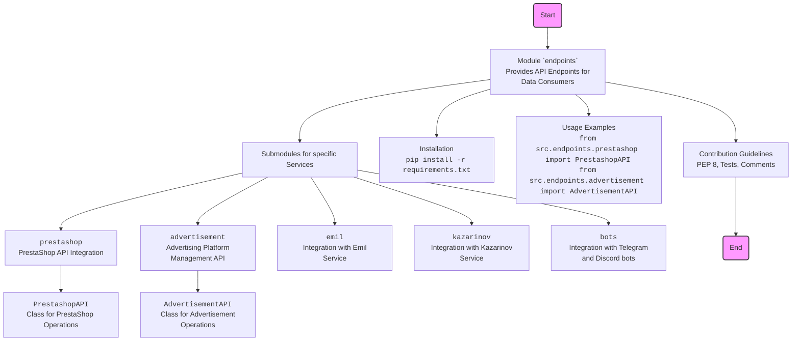

## <алгоритм>

1.  **Начало**: Чтение файла `README.MD` из директории `hypotez/src/endpoints/`.
2.  **Общая структура**:
    *   Документ описывает модуль `endpoints`, который предоставляет API для различных потребителей данных.
    *   Модуль разделен на подмодули, каждый из которых представляет интеграцию с конкретным сервисом (например, PrestaShop, Telegram боты, Emil, Kazarinov).
    *   Каждый подмодуль содержит свою реализацию API.
3.  **Описание подмодулей**:
    *   **`prestashop`**:  Интеграция с PrestaShop для управления продуктами, заказами и пользователями.
        *   Пример: `from src.endpoints.prestashop import PrestashopAPI`
    *   **`advertisement`**: Управление рекламными кампаниями и сбор аналитических данных.
        *   Пример: `from src.endpoints.advertisement import AdvertisementAPI`
    *   **`emil`**:  Интерфейс для обмена данными с сервисом `https://emil-design.com` (PrestaShop + Facebook).
    *   **`kazarinov`**:  Интеграция с сервисом Kazarinov для создания прайс-листов и продвижения в Facebook.
    *   **`bots`**: Управление интеграцией с Telegram и Discord ботами.
4.  **Установка**: Описан процесс установки зависимостей через `pip install -r requirements.txt`.
5.  **Использование**:
    *   Показан пример импорта модулей и их последующего использования.
6.  **Вклад в разработку**: Описаны правила для контрибьюторов (стиль кода PEP 8, тесты, комментарии).
7.  **Завершение**: Завершение анализа `README.MD`.

## <mermaid>

## <объяснение>

### Импорты
В данном файле `README.MD` импорты не рассматриваются, так как это описательный файл. Импорты будут присутствовать в коде самих подмодулей, которые описаны в данном файле. Приведенные в разделе **Usage** примеры импортов показывают, как подключаются конкретные API из подмодулей `prestashop` и `advertisement`.
    
### Классы
В этом файле `README.MD` напрямую не описываются классы, но упоминаются примеры классов `PrestashopAPI` и `AdvertisementAPI`, которые, предположительно, реализованы в соответствующих подмодулях. Эти классы вероятно предоставляют методы для работы с API сервисов PrestaShop и Advertisement соответственно.
    
### Функции
В файле `README.MD` нет прямого описания функций. Однако, из описания подмодулей можно предположить, что каждый API будет иметь набор функций для выполнения конкретных действий (например, создание продукта в PrestaShop, запуск рекламной кампании и т.д.).

### Переменные
В данном файле `README.MD` нет явного описания переменных, так как это файл с описанием модулей и инструкциями.

### Подробное объяснение

*   **Назначение модуля `endpoints`**: Основная цель модуля `endpoints` - предоставить структурированный способ взаимодействия с различными внешними сервисами, такими как PrestaShop, рекламные платформы, и другие. Модуль действует как посредник, облегчая интеграцию с разнообразными потребителями данных. Каждый подмодуль отвечает за взаимодействие с конкретным сервисом, обеспечивая модульность и расширяемость проекта.

*   **Структура модуля**: Модульная структура позволяет разделить API на логические блоки, что упрощает разработку и поддержку. Каждый подмодуль содержит API для конкретного сервиса, обеспечивая инкапсуляцию и структуризацию кода.
    
*   **Подмодули**:
    *   `prestashop`: Этот модуль предназначен для интеграции с платформой PrestaShop и предоставляет функциональность для управления каталогом товаров, заказами и пользователями.
    *   `advertisement`: Данный модуль используется для управления рекламными кампаниями и сбора аналитической информации, предоставляя API для взаимодействия с рекламными платформами.
    *   `emil`, `kazarinov`, `bots`: Эти модули отвечают за интеграцию с отдельными сервисами и платформами, расширяя функциональность системы.

*   **Установка и использование**: Описаны шаги по установке необходимых зависимостей через `pip install -r requirements.txt` и примеры импорта и использования API в Python. Это делает модуль готовым к быстрому использованию.

*   **Участие в разработке**: Даны четкие инструкции для разработчиков, желающих внести свой вклад в проект, включая следование стандарту PEP 8, необходимость написания тестов и комментирование кода.

### Потенциальные ошибки и улучшения
*   **Отсутствие конкретных примеров**: Хотя есть указания на использование, не хватает конкретных примеров кода для каждого подмодуля, что могло бы облегчить начало работы с модулем.
*   **Недостаточное описание API**: `README.MD`  описывает общие принципы работы и структуру, но не углубляется в детали API каждого подмодуля (список эндпоинтов, форматы запросов и ответов).

### Взаимосвязи с другими частями проекта
Модуль `endpoints` является связующим звеном между основным функционалом приложения и внешними сервисами. Он предоставляет API, которые другие модули проекта могут использовать для взаимодействия с внешними системами. Например, модули управления данными или отчетности могут использовать API из `endpoints` для получения данных от PrestaShop, рекламных платформ и других источников.

Модуль `endpoints` является важной частью проекта, обеспечивая интеграцию с внешними сервисами и делая приложение гибким и масштабируемым.