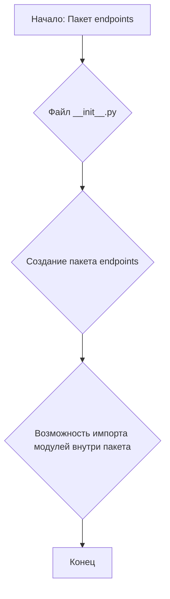
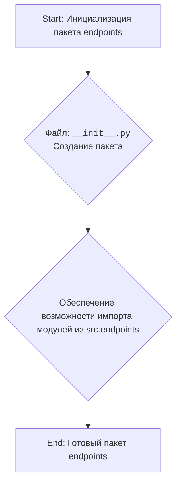

## Анализ кода `hypotez/src/endpoints/__init__.py`

### 1. <алгоритм>

Файл `__init__.py` в Python используется для обозначения директории как пакета. В данном случае, файл `hypotez/src/endpoints/__init__.py` делает директорию `endpoints` пакетом, что позволяет импортировать модули и пакеты, расположенные внутри неё.

**Пример**:

1.  Пусть в директории `endpoints` есть файл `prestashop.py`.
2.  Благодаря файлу `__init__.py`, можно будет импортировать `prestashop.py` следующим образом:
    ```python
    from src.endpoints import prestashop
    ```
    или
    ```python
    from src.endpoints.prestashop import PrestaShop
    ```
3.  Если бы файла `__init__.py` не было, Python не знал бы, как трактовать директорию `endpoints`, и импорт был бы невозможен.

**Блок-схема:**



В данном примере, показано, как создание файла  `__init__.py`  превращает директорию в пакет, что позволяет импортировать модули, расположенные в этой директории.

### 2. <mermaid>



**Объяснение диаграммы:**
-  **Start:** Начало процесса - когда Python интерпретатор встречает файл `__init__.py`
-  `__init__.py`:  Этот файл позволяет директории `endpoints` интерпретироваться как пакет, а не как обычная папка.
-  **Обеспечение возможности импорта**: Благодаря файлу `__init__.py`  другие части программы могут импортировать модули из пакета `endpoints`
-   **End**: Пакет `endpoints` готов к использованию.

В данном коде нет импортов `import header`, поэтому дополнительный блок `mermaid`  для `header.py`  не требуется.

### 3. <объяснение>

**Импорты:**

В предоставленном коде импорты закомментированы. Если бы они были активны, они бы импортировали следующие модули:

*   `from .prestashop import PrestaShop, PrestaCategory, PrestaCustomer, PrestaLanguage, PrestaProduct, PrestaShopShop, PrestaSupplier, PrestaWarehouse, PriceListRequester`: Импортирует классы для работы с PrestaShop API. Классы представляют сущности PrestaShop, такие как магазины, категории, клиенты, языки, продукты, поставщики, склады и инструменты для запроса прайс-листов.
*   `from .kazarinov import KazarinovTelegramBot`: Импортирует класс `KazarinovTelegramBot` для работы с Telegram-ботом.

**Файл `__init__.py`:**

-   **Назначение:** Файл `__init__.py` используется для инициализации пакета Python. Когда Python встречает директорию с таким файлом, он интерпретирует ее как пакет, то есть коллекцию модулей, которую можно импортировать.
-   **В данном случае:** Файл `hypotez/src/endpoints/__init__.py` делает директорию `endpoints` пакетом. Это позволяет другим частям проекта импортировать модули и пакеты, находящиеся в директории `endpoints`, используя путь `src.endpoints`.

**Переменные:**
В данном файле не объявлены переменные.

**Цепочка взаимосвязей с другими частями проекта:**
-   Благодаря этому файлу, другие части проекта, например, основной скрипт или другие модули из пакета `src`, могут использовать модули, импортированные из пакета `endpoints`. Например, если из файла `src.main` нужно будет работать с API Prestashop, то это можно будет сделать через импорт классов из `src.endpoints`.

**Потенциальные ошибки и области для улучшения:**
-   Код в текущем состоянии не выполняет никаких действий, кроме создания пакета. Это обычное явление для `__init__.py`, но импортированные строки, должны быть раскомментированы для функционала.
-   Отсутствие документации (docstrings) у пакета может усложнить понимание его назначения и использования для других разработчиков.
-   Импорты всех классов `Presta` в одной строке может усложнить поиск класса в коде, и разнос по строкам будет лучшим решением.

**Пример использования:**
```python
# src/main.py

from src.endpoints.prestashop import PrestaShop, PrestaProduct
# from src.endpoints.kazarinov import KazarinovTelegramBot
from src import gs # example of using settings

def main():
    # example of how to use the classes
    prestashop = PrestaShop(gs.PRESTASHOP_URL, gs.PRESTASHOP_KEY)
    products = prestashop.get_products()
    print (products)
    # bot = KazarinovTelegramBot(token="TOKEN_STRING") #example of use

if __name__ == "__main__":
    main()
```
В данном примере показано, как можно использовать классы, импортированные из пакета `endpoints`. `gs` тут пример импорта глобальных настроек проекта.

**Итог:**
Файл `__init__.py` в директории `endpoints` играет важную роль, определяя ее как пакет, который может содержать модули с разной функциональностью, например, для работы с Prestashop или Telegram-ботом. В текущем состоянии файл не выполняет никаких конкретных действий, кроме как объявляет директорию пакетом.