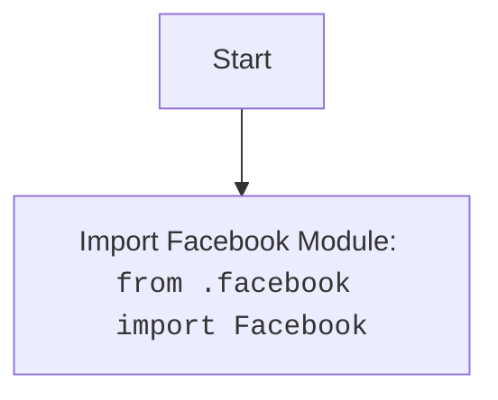

## <алгоритм>

1. **Импорт модуля:** Начинается с импорта модуля `Facebook` из текущей директории (`.facebook`).
   * Пример: `from .facebook import Facebook` - импортирует класс или модуль `Facebook`.

## <mermaid>

## <объяснение>

### Импорты
- `from .facebook import Facebook`: Этот импорт означает, что из файла `facebook.py`, находящегося в той же директории, что и `__init__.py`, импортируется модуль или класс `Facebook`.  Этот импорт создает связь между текущим модулем `__init__.py` и модулем `facebook.py`.

### Классы
- В предоставленном коде нет определений классов в `__init__.py`, но подразумевается, что импортируемый `Facebook` является классом или модулем из `facebook.py`.

### Функции
- В коде нет явных определений функций.

### Переменные
- В коде нет явных объявлений переменных.

### Цепочка взаимосвязей
- `__init__.py` служит для инициализации пакета `advertisement` и позволяет импортировать `Facebook` напрямую через `from src.endpoints.advertisement import Facebook`.  Без `__init__.py` этот пакет был бы не импортируемым.
- Файл `facebook.py` должен содержать определение класса `Facebook` или модуля `Facebook`, используемого в других частях проекта для работы с Facebook API.

### Потенциальные ошибки и области для улучшения
- Код выглядит как минимальная структура для модуля. Отсутствует документация, поясняющая, какие функции или классы должны быть определены в файле `facebook.py`.
- Для повышения понятности кода в файл `__init__.py` можно добавить комментарии, поясняющие, какие модули экспортируются.
- Важно убедиться, что файл `facebook.py` существует и содержит необходимый функционал, иначе будет ошибка импорта.
- Важно отметить, что если `Facebook` в `facebook.py` является модулем, то при импорте будет импортирован модуль, а не класс, это нужно иметь ввиду. Если же `Facebook` - это класс, то при импорте будет импортирован класс.