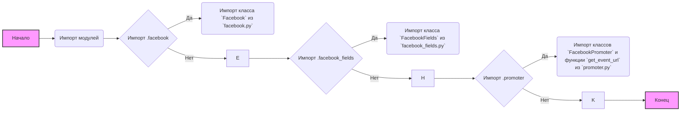
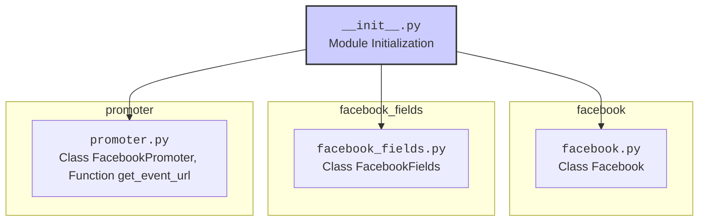

## АНАЛИЗ КОДА: `hypotez/src/endpoints/advertisement/facebook/__init__.py`

### 1. <алгоритм>

**Блок-схема:**

**Примеры:**
1.  **Импорт `.facebook`**: Когда в коде используется строка `from .facebook import Facebook`, модуль `facebook.py` из текущего каталога импортируется, и класс `Facebook` становится доступным.
2.  **Импорт `.facebook_fields`**: При `from .facebook_fields import FacebookFields`,  класс `FacebookFields` из `facebook_fields.py` импортируется и используется в проекте.
3. **Импорт `.promoter`**: Когда есть `from .promoter import FacebookPromoter, get_event_url`,  импортируются класс `FacebookPromoter` и функция `get_event_url` из `promoter.py`,  и они могут использоваться далее в коде.

### 2. <mermaid>

**Объяснение:**

*   Диаграмма показывает структуру пакета `facebook` и его подмодули.
*   `__init__.py` -  это инициализирующий модуль, который импортирует классы `Facebook`, `FacebookFields`, `FacebookPromoter` и функцию `get_event_url` из соответствующих файлов.
*   `facebook_module`: представляет модуль `facebook.py`, где определен класс `Facebook`.
*   `facebook_fields_module`: представляет модуль `facebook_fields.py`, где определен класс `FacebookFields`.
*   `promoter_module`: представляет модуль `promoter.py`, где определены класс `FacebookPromoter` и функция `get_event_url`.

### 3. <объяснение>

**Импорты:**
*   `from .facebook import Facebook`: Импортирует класс `Facebook` из модуля `facebook.py`, находящегося в той же директории, что и `__init__.py`. Этот класс, вероятно, содержит логику для взаимодействия с API Facebook.
*   `from .facebook_fields import FacebookFields`: Импортирует класс `FacebookFields` из модуля `facebook_fields.py` в той же директории. Этот класс, вероятно, отвечает за управление полями данных, используемыми при взаимодействии с Facebook.
*   `from .promoter import FacebookPromoter, get_event_url`: Импортирует класс `FacebookPromoter` и функцию `get_event_url` из модуля `promoter.py`. `FacebookPromoter`, вероятно, отвечает за создание и продвижение рекламных кампаний в Facebook. Функция `get_event_url`, скорее всего, генерирует URL для событий Facebook.

**Назначение:**

Этот файл `__init__.py` выполняет роль точки входа для пакета `facebook`. Он импортирует и делает доступными основные компоненты пакета: классы `Facebook`, `FacebookFields`, `FacebookPromoter` и функцию `get_event_url`. Это упрощает использование пакета в других частях проекта, позволяя импортировать все необходимые компоненты из одного места.

**Взаимосвязь:**
*  **Связи внутри `src.endpoints.advertisement.facebook`:**  
   - `facebook.py`, `facebook_fields.py`, и `promoter.py` работают совместно, реализуя логику взаимодействия с Facebook API. `facebook` предоставляет основные функции, `facebook_fields` управляет данными, а `promoter` отвечает за рекламные кампании.
* **Связи с другими частями проекта `src`:**
    - Классы и функции, импортированные из этого модуля (`__init__.py`) будут использоваться для создания, управления и анализа рекламных кампаний в Facebook. Они, вероятно, интегрируются с основными моделями данных и логикой проекта, расположенными в других частях `src`.

**Потенциальные улучшения:**
*   **Документация:** Добавить docstring для каждого импорта, класса и функции, чтобы улучшить читаемость кода и упростить его понимание.
*   **Обработка ошибок:** Добавить обработку ошибок (например, try-except блоки) при взаимодействии с Facebook API, чтобы сделать код более устойчивым.
*   **Логирование:** Использовать систему логирования для отслеживания ошибок и событий в работе приложения.
*   **Конфигурация:** Возможно, следует добавить настройки для API Facebook (например, access token) через конфигурационный файл или переменные среды.
*   **Тестирование:** Добавить юнит-тесты для классов и функций, чтобы гарантировать их корректную работу после изменений кода.
*   **Асинхронность:** Если приложение выполняет много сетевых запросов, то стоит рассмотреть использование асинхронности для повышения производительности.