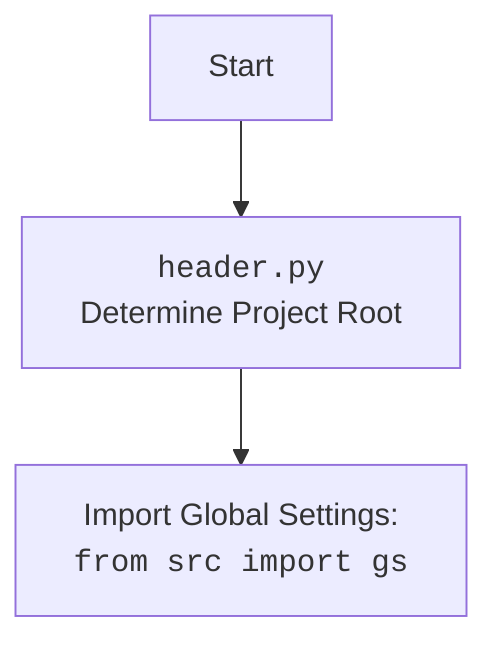

## Анализ кода `facebook_groups_widgets.py`

### 1. <алгоритм>

**Блок-схема:**

```mermaid
graph LR
    Start[Начало] --> LoadData[Загрузка JSON: `j_loads_ns(json_file_path)`]
    LoadData -- Данные групп Facebook --> CreateDropdown[Создание Dropdown виджета: `create_dropdown()`]
    CreateDropdown -- Dropdown виджет --> DisplayWidget[Отображение виджета: `display_widget()`]
    DisplayWidget --> End[Конец]
    
    subgraph "Класс FacebookGroupsWidget"
        LoadData
        CreateDropdown
        DisplayWidget
    end
```

**Пример:**

1. **`Start`**: Инициализация происходит с указанием пути к JSON-файлу (например, `'data/facebook_groups.json'`).
2. **`LoadData`**: Функция `j_loads_ns` загружает JSON из файла в виде `SimpleNamespace`. Например, если JSON имеет вид `{"group1": "url1", "group2": "url2"}`, то `self.groups_data` будет содержать `SimpleNamespace(group1="url1", group2="url2")`.
3. **`CreateDropdown`**: Метод `create_dropdown` извлекает ключи из `self.groups_data`, создавая список `['group1', 'group2']`. Затем, создает объект `Dropdown` с этими ключами в качестве `options`, который будет отображаться как выпадающий список.
4. **`DisplayWidget`**: Метод `display_widget` использует `IPython.display.display` для отображения созданного виджета в интерфейсе, например, в Jupyter Notebook.
5. **`End`**: Виджет отображается и готов к взаимодействию.

### 2. <mermaid>

```mermaid
flowchart TD
    Start[Начало] --> LoadJson[Load JSON Data: <br><code>j_loads_ns(json_file_path)</code><br>from src.utils.jjson import j_loads_ns]
    LoadJson --> CreateDropdown[Create Dropdown Widget: <br><code>create_dropdown()</code><br>from ipywidgets import Dropdown]
    CreateDropdown --> DisplayWidget[Display Widget:<br><code>display_widget()</code><br>from IPython.display import display]
    DisplayWidget --> End[Конец]

    style Start fill:#f9f,stroke:#333,stroke-width:2px
    style End fill:#ccf,stroke:#333,stroke-width:2px
    
    classDef classFill fill:#E2E2E2,stroke:#333,stroke-width:2px
    class LoadJson,CreateDropdown,DisplayWidget classFill

  
```



**Объяснение `mermaid`:**

- **`flowchart TD`**: Определяет тип диаграммы как блок-схему с направлением сверху вниз.
- **`Start`**: Начальная точка процесса, обозначающая начало работы скрипта.
- **`LoadJson`**:  Загрузка JSON-данных из файла с помощью функции `j_loads_ns` из `src.utils.jjson`. Указывает на зависимость от `j_loads_ns`.
- **`CreateDropdown`**: Создание виджета выпадающего списка с помощью класса `Dropdown` из библиотеки `ipywidgets`. Указывает на зависимость от `ipywidgets`.
- **`DisplayWidget`**: Отображение виджета на экране с помощью функции `display` из библиотеки `IPython.display`. Указывает на зависимость от `IPython.display`.
- **`End`**: Конечная точка процесса, обозначает завершение работы скрипта.
- **`style`**: Определяет стили для элементов `Start` и `End`, делая их визуально более заметными.
- **`classDef classFill`**: Определяет стиль для блоков `LoadJson`, `CreateDropdown`, и `DisplayWidget`.

### 3. <объяснение>

**Импорты:**

-   `import header`: Импортирует модуль `header`, который, вероятно, отвечает за определение корневого каталога проекта и настройку глобальных параметров. (См. дополнительный блок `mermaid` для `header.py`)
-   `from IPython.display import display`: Импортирует функцию `display` из модуля `IPython.display`, которая используется для отображения объектов (в данном случае виджета) в Jupyter Notebook или подобных окружениях.
-   `from ipywidgets import Dropdown`: Импортирует класс `Dropdown` из библиотеки `ipywidgets`, который используется для создания интерактивного выпадающего списка.
-   `from src.utils.jjson import j_loads_ns`: Импортирует функцию `j_loads_ns` из модуля `src.utils.jjson`, которая, вероятно, используется для загрузки JSON-данных из файла и преобразования их в объект `SimpleNamespace`.
-   `from types import SimpleNamespace`: Импортирует класс `SimpleNamespace`, который используется для создания объектов, свойства которых могут быть доступны по имени.
-   `from pathlib import Path`: Импортирует класс `Path` из модуля `pathlib`, который предоставляет удобный способ работы с путями файловой системы.

**Класс `FacebookGroupsWidget`:**

-   **Роль:**  Создает интерактивный выпадающий список для выбора групп Facebook на основе данных из JSON-файла.
-   **Атрибуты:**
    -   `groups_data: SimpleNamespace`: Хранит данные о группах Facebook, загруженные из JSON-файла, в виде `SimpleNamespace`.
    -   `dropdown: Dropdown`: Содержит виджет выпадающего списка.
-   **Методы:**
    -   `__init__(self, json_file_path: Path)`: Конструктор класса. Инициализирует атрибуты `groups_data` путем загрузки данных из JSON-файла, а также создает выпадающий список с помощью метода `create_dropdown`.
    -   `create_dropdown(self) -> Dropdown`: Создает и возвращает объект `Dropdown`, на основе ключей (названий групп) из `groups_data`.
        -   Извлекает ключи из `self.groups_data.__dict__`, которые представляют собой названия групп.
        -   Создает виджет `Dropdown` с опциями, равными названиям групп, и описанием "Facebook Groups:".
    -   `display_widget(self)`: Отображает виджет выпадающего списка с помощью функции `display` из `IPython.display`.

**Функции:**

-   `__init__(self, json_file_path: Path)`:
    -   **Аргументы:** `json_file_path` (объект `Path`): путь к JSON-файлу с информацией о группах.
    -   **Назначение:** Загружает данные JSON в `self.groups_data`, создает виджет `dropdown`.
    -   **Пример:** `widget = FacebookGroupsWidget(Path('data/groups.json'))`
-   `create_dropdown(self) -> Dropdown`:
    -   **Аргументы:** нет.
    -   **Возвращает:** `Dropdown`: объект выпадающего списка.
    -   **Назначение:** Создает виджет `Dropdown` на основе ключей `self.groups_data`.
    -   **Пример:** `dropdown = widget.create_dropdown()`
-   `display_widget(self)`:
    -   **Аргументы:** нет.
    -   **Возвращает:** нет.
    -   **Назначение:** Отображает виджет на экране.
    -   **Пример:** `widget.display_widget()`

**Переменные:**

-   `json_file_path: Path`:  Путь к JSON-файлу, содержащему данные о группах Facebook.
-   `self.groups_data: SimpleNamespace`:  Объект `SimpleNamespace`, хранящий загруженные данные о группах.
-   `self.dropdown: Dropdown`: Объект выпадающего списка, созданный с помощью `ipywidgets.Dropdown`.
-   `group_urls: list`: Список URL групп, извлеченных из ключей словаря `self.groups_data.__dict__`.
-   `dropdown: Dropdown`: Временная переменная для хранения созданного виджета выпадающего списка.

**Потенциальные ошибки и области для улучшения:**

-   **Обработка ошибок:** Отсутствует обработка ошибок при загрузке JSON-файла. Если файл не существует или имеет неверный формат, программа может завершиться с ошибкой. Необходимо добавить try-except блоки.
-   **Валидация данных:** Не производится валидация данных, загружаемых из JSON. Необходимо проверить наличие ключей и корректность данных в JSON.
-   **Гибкость:** Жестко задан формат JSON данных (ключи - названия групп, значения - URL). Можно сделать более гибким, позволяя выбирать поля.
-   **Управление виджетом:** Нет методов для взаимодействия с выбранным значением в выпадающем списке. Следует добавить методы для получения выбранного значения.

**Взаимосвязь с другими частями проекта:**

-   Использует `j_loads_ns` из `src.utils.jjson`, предполагая наличие общего модуля для загрузки JSON.
-   Использует `header`, который предполагает настройку общих параметров проекта.
-   Предполагается, что этот виджет используется в интерфейсе, который может отображать объекты `IPython.display`.

В целом, код выполняет свою задачу по созданию виджета выпадающего списка для групп Facebook, но требует улучшения в плане обработки ошибок, валидации данных и гибкости.