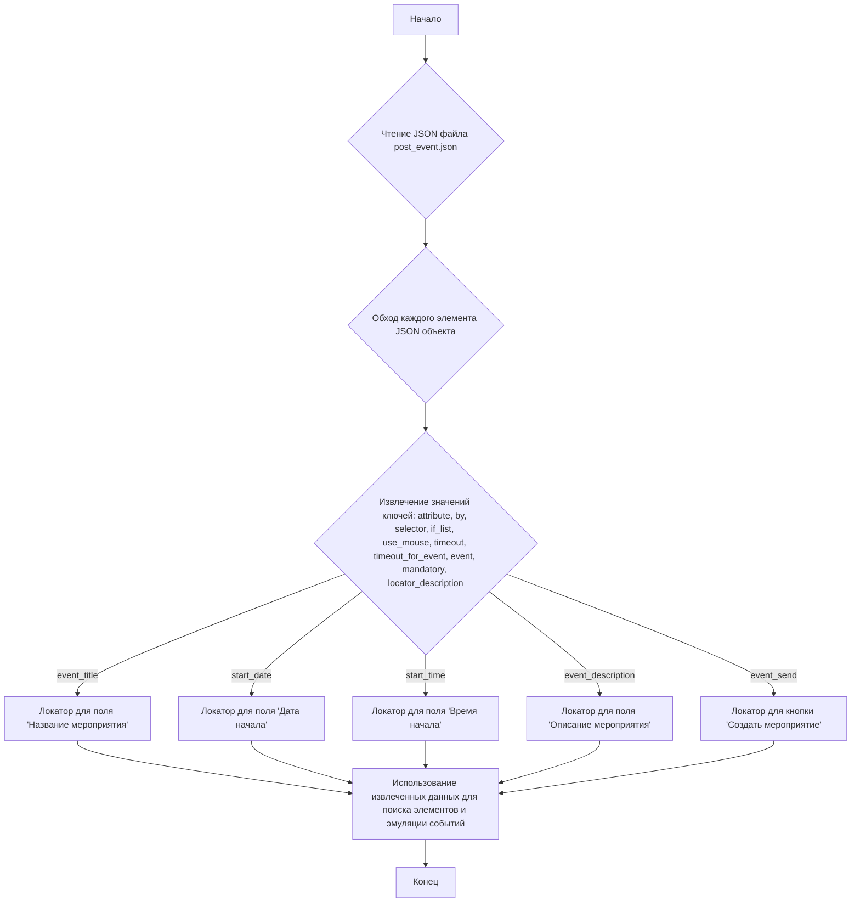

## Анализ кода `post_event.json`

### 1. <алгоритм>

JSON-файл `post_event.json` определяет структуру локаторов для элементов веб-страницы, используемых при создании события в Facebook. Каждый элемент представлен в виде JSON-объекта со следующими атрибутами:

1.  **`attribute`**: (string/null) Атрибут элемента, который может быть использован для уточнения поиска. В данном коде всегда `null`.
2.  **`by`**: (string) Метод поиска элемента, например "XPATH".
3.  **`selector`**: (string) Строка селектора для поиска элемента, например XPATH-запрос.
4.  **`if_list`**: (string) Параметр для определения того, как обрабатывать список элементов. В данном случае всегда "first", то есть выбирается первый найденный элемент.
5.  **`use_mouse`**: (boolean) Определяет необходимость эмуляции событий мыши. В данном коде всегда `false`.
6.  **`timeout`**: (integer) Максимальное время ожидания элемента (в секундах). В данном коде всегда 0.
7.  **`timeout_for_event`**: (string) Тип ожидания для события. Например `"presence_of_element_located"`.
8.  **`event`**: (string) Тип события, которое нужно эмулировать. Например `"click();%EXTERNAL_MESSAGE%"`, где `%EXTERNAL_MESSAGE%` будет заменен сообщением.
9.  **`mandatory`**: (boolean) Указывает, является ли элемент обязательным для выполнения сценария.
10. **`locator_description`**: (string) Описание локатора.

**Блок-схема:**



Пример работы для `event_title`:

1. Извлекается объект с ключом `"event_title"`.
2. Извлекаются его значения:
   - `attribute` = `null`
   - `by` = `"XPATH"`
   - `selector` = `"//label[@aria-label = 'Название мероприятия']//input"`
   - `if_list` = `"first"`
   - `use_mouse` = `false`
   - `timeout` = `0`
   - `timeout_for_event` = `"presence_of_element_located"`
   - `event` = `"click();%EXTERNAL_MESSAGE%"`
   - `mandatory` = `true`
   - `locator_description` = `"поле ввода названия сообщения. При переходе по специально сконструированной ссылке откроется сразу. См код сценария"`
3. Эти значения используются для поиска элемента на странице и эмуляции клика с последующим вводом текста.

### 2. <mermaid>

```mermaid
flowchart TD
    subgraph post_event.json
        eventTitle[event_title:
        attribute: null,
        by: "XPATH",
        selector: "//label[@aria-label = 'Название мероприятия']//input",
        if_list: "first",
        use_mouse: false,
        timeout: 0,
        timeout_for_event: "presence_of_element_located",
        event: "click();%EXTERNAL_MESSAGE%",
        mandatory: true,
        locator_description: "поле ввода названия сообщения"]
        
        startDate[start_date:
        attribute: null,
        by: "XPATH",
        selector: "//label[@aria-label = 'Дата начала']//input",
        if_list: "first",
        use_mouse: false,
        timeout: 0,
        timeout_for_event: "presence_of_element_located",
        event: "click();backspace(10);%EXTERNAL_MESSAGE%",
        mandatory: true,
        locator_description: "поле ввода даты начала мероприятия"]
        
        startTime[start_time:
        attribute: null,
        by: "XPATH",
        selector: "//label[@aria-label = 'Время начала']//input",
        if_list: "first",
        use_mouse: false,
        timeout: 0,
        timeout_for_event: "presence_of_element_located",
        event: "click();backspace();%EXTERNAL_MESSAGE%",
        mandatory: true,
        locator_description: "поле ввода даты начала мероприятия"]

        eventDescription[event_description:
        attribute: null,
        by: "XPATH",
        selector: "//label[@aria-label = 'Расскажите подробнее о мероприятии.']//textarea",
        if_list: "first",
        use_mouse: false,
        timeout: 0,
        timeout_for_event: "presence_of_element_located",
        event: "click();%EXTERNAL_MESSAGE%",
        mandatory: true,
        locator_description: "поле ввода даты начала мероприятия"]
        
        eventSend[event_send:
         attribute: null,
        by: "XPATH",
        selector: "//div[@aria-label = 'Создать мероприятие']",
        if_list: "first",
        use_mouse: false,
        timeout: 0,
        timeout_for_event: "presence_of_element_located",
        event: "click()",
        mandatory: true,
        locator_description: "Кнопка отправки"]
        
        eventTitle --> startDate
        startDate --> startTime
        startTime --> eventDescription
        eventDescription --> eventSend
    end
    
    Application --> post_event.json
    post_event.json --> WebBrowser[Web Browser]
```

**Объяснение:**

*   `eventTitle`, `startDate`, `startTime`, `eventDescription`, `eventSend`:  Представляют локаторы, описанные в JSON. Каждый узел содержит все атрибуты, необходимые для поиска элемента.
*   `Application`: Представляет программное обеспечение, которое использует данный JSON-файл.
*   `WebBrowser`: Представляет веб-браузер, в котором будут найдены элементы.
*   `-->`:  Указывает на то, что `Application` использует данные из `post_event.json` для взаимодействия с `WebBrowser`.
*   `post_event.json`:  Представляет JSON-файл, содержащий локаторы.
*   `subgraph`: Ограничивает область `post_event.json`.

Диаграмма `mermaid` показывает, что файл `post_event.json` содержит набор локаторов, которые будут использоваться приложением для поиска элементов в веб-браузере.

### 3. <объяснение>

**Импорты:**

В данном коде нет импортов. Это JSON-файл, а не Python или другой скриптовый код.

**Классы:**

В данном коде нет классов. Это JSON-файл, а не Python или другой скриптовый код.

**Функции:**

В данном коде нет функций. Это JSON-файл, а не Python или другой скриптовый код.

**Переменные:**

Это JSON-файл, где каждый ключ в JSON-объекте можно рассматривать как переменную (в контексте использования в скрипте):
-   `event_title`: Объект, содержащий локатор для поля названия мероприятия.
-   `start_date`: Объект, содержащий локатор для поля даты начала мероприятия.
-   `start_time`: Объект, содержащий локатор для поля времени начала мероприятия.
-  `event_description`: Объект, содержащий локатор для поля описания мероприятия.
-  `event_send`: Объект, содержащий локатор для кнопки отправки.

Каждый из этих объектов содержит следующие атрибуты:
    -   `attribute`: Атрибут элемента (всегда `null` в данном файле).
    -   `by`: Метод поиска элемента (например, "XPATH").
    -   `selector`: Строка селектора для поиска элемента.
    -   `if_list`:  Параметр обработки списка элементов (всегда `"first"`).
    -   `use_mouse`: Флаг использования эмуляции мыши (всегда `false`).
    -   `timeout`: Время ожидания (всегда `0`).
    -   `timeout_for_event`: Тип ожидания.
    -   `event`: Событие для эмуляции.
    -  `mandatory`: Указывает, обязателен ли элемент.
    - `locator_description`: Описание локатора.

**Взаимосвязь с другими частями проекта:**

Этот файл предназначен для использования в автоматизированных тестах или скриптах, которые взаимодействуют с веб-интерфейсом Facebook. Локаторы, определенные в этом файле, используются для поиска элементов на веб-странице и взаимодействия с ними. Приложение, использующее этот файл, загружает его и использует данные для навигации и работы с UI Facebook.

**Потенциальные ошибки и области для улучшения:**

1.  **Жестко заданные селекторы:** Использование жестко заданных XPATH-селекторов может привести к поломкам, если структура страницы Facebook изменится. Следует рассмотреть использование более гибких подходов, например, комбинацию нескольких атрибутов или относительных путей.
2.  **Отсутствие гибкости:** Файл не предусматривает возможности динамически менять параметры, например, `timeout`.
3.  **Использование `backspace(10)` и `backspace()`:** Жесткое кодирование `backspace` может быть ненадежным и может приводить к ошибкам при использовании. Следует рассмотреть более надежные методы очистки полей ввода.
4.  **Отсутствие проверок:** Не определены проверки успешности нахождения элементов, что может привести к непредсказуемым результатам в случае отсутствия элемента.
5.  **Константы вместо переменных**: Параметры `timeout = 0` и `use_mouse=false` для всех локаторов выглядят не оптимально. Возможно имеет смысл сделать общие константы.
6. **Отсутствует блок `mermaid` для `header.py`:** В данном JSON файле нет импорта `header`, потому нет необходимости строить блок `mermaid` для `header.py`.