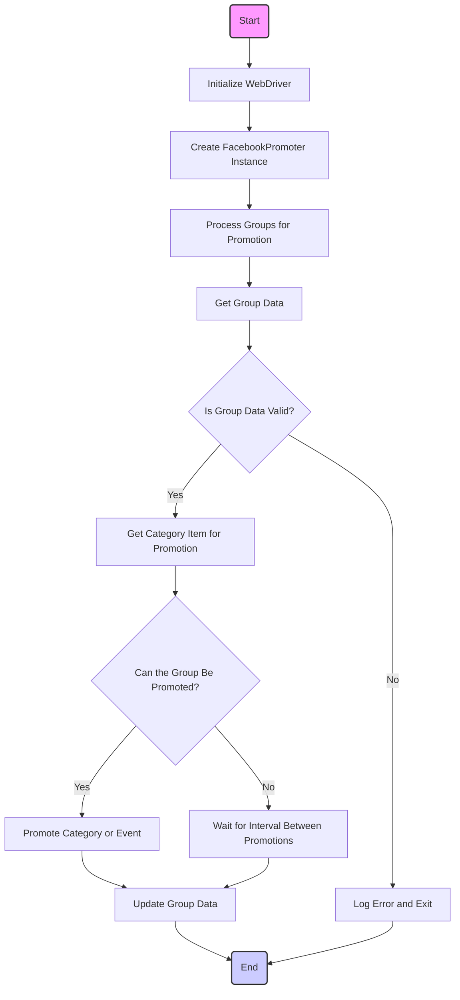

## Анализ кода модуля Facebook Promoter

### 1. <алгоритм>
**Обзор процесса продвижения в Facebook**

Модуль `Facebook Promoter` автоматизирует процесс публикации рекламных объявлений (категорий товаров или событий) в Facebook группах.  Он управляет отправкой рекламных материалов, обеспечивая, чтобы категории и события продвигались без повторов. Для автоматизации браузера используется WebDriver, что обеспечивает эффективную обработку продвижений.

**Пошаговая блок-схема:**

1.  **Инициализация:**
    *   Начало процесса.
    *   Создаётся экземпляр `Driver` для управления браузером.
    *   Инициализируется экземпляр `FacebookPromoter` с необходимыми параметрами (WebDriver, имя промоутера, пути к файлам с данными групп, флаг отключения видео).
    
2.  **Обработка групп:**
    *   Вызывается метод `process_groups` с параметрами: `campaign_name`, `events`, `group_categories_to_adv`, `language`, `currency`.
    *   Метод проходит через каждую группу, указанную в файлах конфигурации.
    
3.  **Получение данных группы:**
    *   Для каждой группы извлекаются данные (например, ID группы, интервал между продвижениями).
    
4.  **Проверка данных группы:**
    *   Метод `validate_group` проверяет, что данные группы имеют необходимую структуру (например, наличие `id`, `last_promotion_time`, `promoted_categories` и т.д.).
    
5.  **Получение продвигаемого элемента:**
    *   Если данные группы валидны, метод `get_category_item` получает элемент (категорию или событие) для продвижения в текущей группе.

    
6.  **Проверка возможности продвижения:**
    *   Метод `check_interval` проверяет, что прошло достаточно времени с момента последнего продвижения в данной группе.

    
7.  **Продвижение элемента:**
    *   Если группа готова к продвижению, метод `promote` публикует объявление в группе.
       *   **Пример:** Загружает изображение или видео, добавляет текст, вставляет ссылку.
       *   После продвижения вызывается `update_group_promotion_data` и записывает информацию о том, что в этой группе продвигался такой-то элемент.
    
8.  **Обновление данных группы:**
    *   Метод `update_group_promotion_data` обновляет данные группы, добавляя элемент в список уже продвинутых.
    
9.  **Обработка ошибки:**
    *   Если данные группы не валидны или продвижение не удалось, метод `log_promotion_error` записывает сообщение об ошибке в лог.
10. **Завершение:**
    *   Процесс заканчивается, переходя к следующей группе.

**Поток данных:**

*   `Driver` -> `FacebookPromoter` (при инициализации).
*   Файлы конфигурации групп -> `FacebookPromoter` (при инициализации).
*   `campaign_name`, `events`, `group_categories_to_adv`, `language`, `currency`-> `process_groups`.
*   Данные группы -> `validate_group`.
*   Данные группы,  `language`, `currency`, `campaign_name` -> `get_category_item`.
*  Данные группы -> `check_interval`.
*   Данные группы, элемент -> `promote`.
*   Данные группы, элемент -> `update_group_promotion_data`.
*   `is_event`, имя элемента -> `log_promotion_error`.

### 2. <mermaid>

**Объяснение диаграммы:**

*   `Start`: Начало процесса.
*   `InitializeWebDriver`: Инициализация веб-драйвера для управления браузером.
*   `CreateFacebookPromoter`: Создание экземпляра класса `FacebookPromoter` с переданными настройками.
*   `ProcessGroups`: Запуск процесса обработки каждой группы из списка.
*   `GetGroupData`: Получение данных о конкретной группе.
*   `ValidateGroup`: Проверка валидности полученных данных группы.
    *   Если данные валидны (`Yes`), то переходим к этапу получения элемента для продвижения.
    *   Если данные не валидны (`No`), то логируем ошибку и завершаем обработку данной группы.
*   `GetCategoryItem`: Получение элемента (категория товара или событие) для продвижения в текущей группе.
*    `CanPromoteGroup`: Проверка, можно ли продвигать данный элемент в текущей группе (на основе интервала).
     *   Если можно (`Yes`), то переходим к продвижению элемента.
     *   Если нельзя (`No`), то ожидаем интервал.
*   `PromoteItem`: Публикация элемента в выбранной группе.
*    `WaitInterval`: Ожидание интервала до следующего продвижения.
*   `UpdateGroupData`: Обновление информации о группе после успешного продвижения.
*   `LogErrorAndExit`: Запись сообщения об ошибке, если произошла ошибка в процессе.
*   `End`: Завершение обработки группы.

**Зависимости:**

В диаграмме не отображены конкретные импорты, но логически используются следующие зависимости:

*   `src.webdriver.driver.Driver`:  Для управления браузером.
*   `src.utils.jjson.j_loads_ns`: Для загрузки данных из JSON-файлов.
*  `types.SimpleNamespace`:  Используется для хранения и доступа к данным, полученных из JSON.

### 3. <объяснение>

#### Импорты

*   `from src.endpoints.advertisement.facebook.promoter import FacebookPromoter`: Импортирует класс `FacebookPromoter` из модуля `promoter`. Этот класс является основным в данном модуле и отвечает за логику продвижения.
*   `from src.webdriver.driver import Driver`: Импортирует класс `Driver`, который управляет веб-драйвером для автоматизации браузера.
*   `from src.utils.jjson import j_loads_ns`: Импортирует функцию `j_loads_ns`, которая загружает JSON-данные в объект `SimpleNamespace`. Эта функция используется для загрузки данных о группах из файлов.

    **Взаимосвязь с `src`**:
    Все импорты связаны с пользовательским пакетом `src`, где находятся вспомогательные модули для веб-драйвинга, обработки JSON и общей логики проекта.

#### Класс `FacebookPromoter`
    
*   **Роль:**
    Класс `FacebookPromoter` управляет процессом продвижения рекламных материалов в Facebook группах. Он содержит методы для инициализации, обработки групп, продвижения элементов и обновления данных.

*   **Атрибуты:**
    *   `d: Driver`:  Экземпляр класса `Driver` для управления браузером.
    *   `promoter: str`:  Строка, идентифицирующая промоутера (например, "aliexpress").
    *   `group_file_paths: Optional[list[str | Path] | str | Path]`:  Пути к файлам, содержащим данные о группах для продвижения. Может быть списком путей, строкой или объектом `Path`.
    *   `no_video: bool`:  Флаг, определяющий, нужно ли отключать загрузку видео в постах. По умолчанию `False`.

*   **Методы:**
    *   `__init__(self, d: Driver, promoter: str, group_file_paths: Optional[list[str | Path] | str | Path] = None, no_video: bool = False)`:
        *   **Назначение:** Конструктор класса, инициализирует атрибуты.
        *   **Аргументы:**
            *   `d`: Экземпляр `Driver`.
            *   `promoter`: Строка с именем промоутера.
            *   `group_file_paths`: Пути к файлам с данными групп.
            *   `no_video`: Флаг отключения видео.
        *   **Возвращаемое значение:** None.
    *   `promote(self, group: SimpleNamespace, item: SimpleNamespace, is_event: bool = False, language: str = None, currency: str = None) -> bool`:
        *   **Назначение:** Выполняет продвижение элемента в указанной Facebook группе.
        *   **Аргументы:**
            *   `group`: Данные группы.
            *   `item`: Элемент для продвижения (категория или событие).
            *   `is_event`:  Флаг, указывающий, является ли элемент событием.
            *    `language`: Язык для продвижения.
            *    `currency`: Валюта для продвижения.
        *   **Возвращаемое значение:** `True` - если продвижение успешно, `False` в противном случае.
    *   `log_promotion_error(self, is_event: bool, item_name: str)`:
        *   **Назначение:** Регистрирует ошибку продвижения в лог.
        *   **Аргументы:**
            *   `is_event`: Флаг, указывающий, является ли элемент событием.
            *   `item_name`: Имя элемента, при продвижении которого возникла ошибка.
        *   **Возвращаемое значение:** None.
    *    `update_group_promotion_data(self, group: SimpleNamespace, item_name: str, is_event: bool = False)`:
        *    **Назначение:** Обновляет данные о продвижении в группе.
        *    **Аргументы:**
            *    `group`: Данные группы.
            *    `item_name`: Имя продвинутого элемента.
            *   `is_event`:  Флаг, указывающий, является ли элемент событием.
        *    **Возвращаемое значение:** None.
    *   `process_groups(self, campaign_name: str = None, events: list[SimpleNamespace] = None, is_event: bool = False, group_file_paths: list[str] = None, group_categories_to_adv: list[str] = ['sales'], language: str = None, currency: str = None)`:
        *   **Назначение:** Управляет процессом продвижения, перебирая группы и продвигая в них элементы.
        *   **Аргументы:**
            *    `campaign_name`: Имя кампании.
            *    `events`: Список событий для продвижения.
            *    `is_event`: Флаг, указывающий, нужно ли продвигать события.
            *    `group_file_paths`: Список путей к файлам данных групп.
            *   `group_categories_to_adv`: Список категорий для продвижения.
            *   `language`: Язык для продвижения.
            *   `currency`: Валюта для продвижения.
        *   **Возвращаемое значение:** None.
    *    `get_category_item(self, campaign_name: str, group: SimpleNamespace, language: str, currency: str) -> SimpleNamespace`:
        *   **Назначение:** Возвращает элемент (категорию или событие) для продвижения.
        *   **Аргументы:**
             *   `campaign_name`: Имя кампании.
            *    `group`: Данные группы.
             *    `language`: Язык для продвижения.
             *    `currency`: Валюта для продвижения.
        *   **Возвращаемое значение:** `SimpleNamespace` с данными элемента.
    *   `check_interval(self, group: SimpleNamespace) -> bool`:
        *   **Назначение:** Проверяет, прошло ли достаточно времени с последнего продвижения в группе.
        *   **Аргументы:**
            *   `group`: Данные группы.
        *   **Возвращаемое значение:** `True`, если группа готова к продвижению, `False` - в противном случае.
    *   `validate_group(self, group: SimpleNamespace) -> bool`:
        *   **Назначение:** Проверяет, что данные группы имеют необходимую структуру.
        *   **Аргументы:**
            *   `group`: Данные группы.
        *   **Возвращаемое значение:** `True`, если данные валидны, `False` - в противном случае.
#### Переменные:

*   `d` (Driver): Экземпляр класса `Driver` для управления браузером.
*   `promoter` (str):  Имя промоутера (например, "aliexpress").
*   `group_file_paths` (Optional[list[str | Path] | str | Path]): Путь или список путей к файлам с данными групп.
*  `no_video` (bool): Флаг для отключения видео.
*   `group` (SimpleNamespace): Объект, представляющий данные группы.
*   `item` (SimpleNamespace): Объект, представляющий элемент для продвижения.
*   `is_event` (bool): Флаг, указывающий, является ли продвигаемый элемент событием или категорией.
*    `language` (str): Язык для продвижения.
*    `currency` (str): Валюта для продвижения.
*   `campaign_name` (str): Имя кампании.
*    `events` (list[SimpleNamespace]): Список событий для продвижения.
*    `group_categories_to_adv` (list[str]): Список категорий для продвижения.

#### Потенциальные ошибки и области для улучшения

*   **Обработка ошибок:** В коде есть базовая обработка ошибок, но её можно улучшить, добавив более детальное логирование и обработку исключений (например, при ошибке соединения с Facebook).
*   **Конфигурация:** Конфигурация групп и категорий реализована через файлы. Можно расширить возможности конфигурации, например, добавив поддержку баз данных или API.
*   **Параллелизация:** Процесс продвижения выполняется последовательно. Можно реализовать параллельную обработку групп для ускорения процесса.
*   **Тестирование:** Необходимо добавить unit-тесты для проверки работы всех методов и классов.
*   **Гибкость:**  Можно добавить больше параметров для настройки процесса продвижения (например, время ожидания между действиями, разные типы публикаций).

#### Взаимосвязи с другими частями проекта

*   Модуль зависит от `src.webdriver.driver` для автоматизации браузера, что позволяет взаимодействовать с веб-страницами Facebook.
*  `src.utils.jjson` используется для работы с JSON-файлами, которые содержат информацию о группах.
*   В целом, этот модуль является частью более широкой системы продвижения в Facebook, используя общие компоненты для управления браузером и конфигурацией.