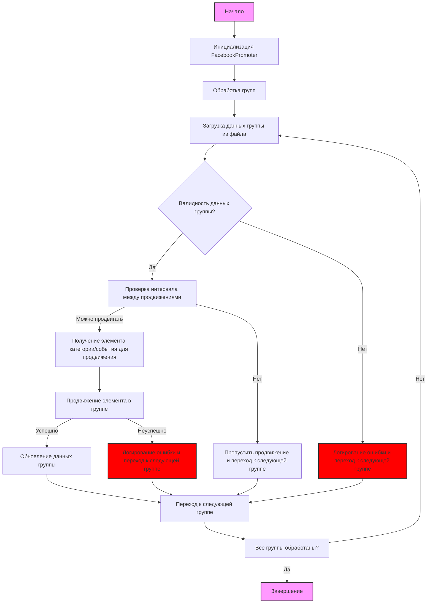

## АНАЛИЗ КОДА: `hypotez/src/endpoints/advertisement/facebook/promoter.ru.md`

### 1. <алгоритм>

1.  **Инициализация:**
    *   Создается экземпляр класса `FacebookPromoter`.
    *   В качестве аргументов передаются:
        *   `d` - экземпляр `WebDriver` для управления браузером.
        *   `promoter` - имя промоутера (например, "aliexpress").
        *   `group_file_paths` - список путей к файлам с данными групп Facebook.
        *   `no_video` - флаг, указывающий на необходимость отключения загрузки видео (по умолчанию `False`).
2.  **Обработка групп (`process_groups`):**
    *   Итерируется по файлам групп, указанных в `group_file_paths`.
    *   Загружает данные каждой группы из JSON файла.
    *   **Для каждой группы:**
        *   Проверяется валидность данных группы (`validate_group`).
            *   **Пример:** Если поле `group_id` или `access_token` отсутствуют, группа считается невалидной.
        *   Если группа невалидна, в лог записывается ошибка (`log_promotion_error`) и обработка группы завершается.
        *   Если группа валидна, проверяется, прошло ли достаточно времени с момента последнего продвижения группы (`check_interval`).
            *  **Пример**: если с последнего продвижения прошло менее 2 часов, продвижение не выполняется
        *   Если прошло достаточно времени:
            *   Определяется, что продвигается: категория или событие.
                *   Если продвигается категория, то извлекается нужный элемент категории для продвижения (`get_category_item`).
                    *   **Пример:** Запрос элемента категории 'sales' для компании 'aliexpress' в определенной группе на основе языка и валюты.
                *   Если продвигается событие, то берется событие из списка переданных событий.
                    *   **Пример:** передача события 'Black Friday' из списка событий
            *   Вызывается метод `promote`, чтобы выполнить продвижение в группе.
                *   **Пример:** Публикация поста с категорией 'sales' или событием 'Black Friday' в группе Facebook.
            *   После успешного продвижения обновляются данные группы (`update_group_promotion_data`)
                 *   **Пример:** в данные группы добавляется информация о дате последнего продвижения и название категории/события
        *   Если время не прошло, то обработка группы завершается.
3. **Продвижение (`promote`):**
    *   Выполняет фактическую публикацию поста в группе Facebook.
    *   Использует WebDriver для взаимодействия со страницей Facebook.
    *   Возвращает `True` при успехе, `False` при неудаче.
4. **Логирование ошибки (`log_promotion_error`):**
    *   Записывает информацию об ошибке, если продвижение не удалось.
5. **Обновление данных группы (`update_group_promotion_data`):**
    *   Обновляет информацию о последнем продвижении для данной группы в данных группы.

**Поток данных:**

*   `FacebookPromoter` получает данные групп из файлов JSON.
*   `FacebookPromoter` использует `WebDriver` для автоматизации браузера.
*   `FacebookPromoter` вызывает методы `promote`, `log_promotion_error`, `update_group_promotion_data`, `get_category_item`, `check_interval`, `validate_group`.
*   `promote` метод взаимодействует с веб-страницей Facebook.

### 2. <mermaid>

#### mermaid explanation:
*   **Start**: Начало процесса.
*   **InitializePromoter**: Инициализация экземпляра класса `FacebookPromoter`.
*   **ProcessGroups**: Начинает процесс обработки групп для продвижения.
*   **LoadGroupData**: Загружает данные о группе из файла конфигурации.
*   **ValidateGroupData**: Проверяет, валидны ли данные загруженной группы (например, наличие обязательных полей, таких как `group_id`, `access_token`).
*   **CheckPromotionInterval**: Проверяет, прошло ли достаточно времени с последнего продвижения для данной группы, чтобы можно было выполнить новое продвижение.
*   **GetCategoryOrEvent**: Получает элемент для продвижения (категория или событие).
*   **PromoteItem**: Выполняет продвижение элемента в группе Facebook, используя WebDriver.
*   **UpdateGroupData**: Обновляет данные о последнем продвижении для группы.
*  **SkipPromotion**: Пропускает продвижение текущей группы, если интервал не настал и переходит к следующей группе.
*   **LogError**: Логирует ошибку, если данные группы не валидны, и переходит к следующей группе.
*   **LogErrorAndSkip**: Логирует ошибку продвижения, если продвижение не удалось и переходит к следующей группе.
*   **NextGroup**: Переходит к обработке следующей группы.
*   **Condition**: Проверяет, все ли группы обработаны. Если нет, возвращается к загрузке данных для следующей группы.
*   **End**: Завершение процесса.
*   **style**: применены стили к блокам 'Start', 'End', 'LogError', 'LogErrorAndSkip', чтобы выделить их визуально

### 3. <объяснение>

#### Импорты:

*   `random`:  Используется для генерации случайных чисел, например, для случайной задержки перед публикацией.
*   `datetime`: Используется для работы с датой и временем, например, для определения интервала между продвижениями.
*   `pathlib`: Используется для работы с путями к файлам и директориям.
*   `urllib.parse`: Используется для работы с URL, например, для формирования ссылок.
*   `types.SimpleNamespace`: Используется для создания объектов с атрибутами, доступными через точку. Упрощает работу с данными.
*   `src`: Пользовательский модуль. Содержит следующие подмодули:
    *   `src.endpoints.advertisement.facebook.promoter`: Сам текущий модуль, отвечающий за продвижение в Facebook.
    *   `src.webdriver.driver`:  Предоставляет класс `Driver` для управления браузером.
    *   `src.utils.jjson`:  Предоставляет функции для работы с JSON, такие как `j_loads_ns` для загрузки данных JSON в объект `SimpleNamespace`.

#### Классы:

*   `FacebookPromoter`:
    *   **Роль:** Управляет процессом продвижения товаров и мероприятий в группах Facebook.
    *   **Атрибуты:**
        *   `d`: Экземпляр `WebDriver` для автоматизации браузера.
        *   `promoter`: Имя промоутера (например, "aliexpress").
        *   `group_file_paths`: Список путей к файлам с данными групп Facebook.
        *   `no_video`: Флаг, указывающий на необходимость отключения загрузки видео (по умолчанию `False`).
    *   **Методы:**
        *   `__init__`: Инициализирует промоутер, устанавливая необходимые параметры.
        *   `promote`: Выполняет фактическую публикацию поста в группе Facebook.
        *   `log_promotion_error`: Записывает информацию об ошибке, если продвижение не удалось.
        *   `update_group_promotion_data`: Обновляет информацию о последнем продвижении для данной группы.
        *   `process_groups`: Обрабатывает группы для текущей кампании или продвижения мероприятия.
        *   `get_category_item`: Получает элемент категории для продвижения.
        *   `check_interval`: Проверяет, прошло ли достаточно времени, чтобы снова продвигать эту группу.
        *   `validate_group`: Проверяет данные группы на корректность.
    *   **Взаимодействие:**
        *   Использует `Driver` для управления браузером.
        *   Использует функции `src.utils.jjson` для загрузки данных.
        *   Вызывает методы для управления продвижением.

#### Функции:

*   `__init__(self, d: Driver, promoter: str, group_file_paths: Optional[list[str | Path] | str | Path] = None, no_video: bool = False)`:
    *   **Аргументы:**
        *   `d`: Экземпляр `WebDriver`.
        *   `promoter`: Имя промоутера.
        *   `group_file_paths`: Пути к файлам с данными групп.
        *   `no_video`: Флаг отключения загрузки видео.
    *   **Назначение:** Инициализирует объект `FacebookPromoter`.
    *   **Пример:** `FacebookPromoter(d=my_driver, promoter="aliexpress", group_file_paths=["groups1.json", "groups2.json"], no_video=True)`
*   `promote(self, group: SimpleNamespace, item: SimpleNamespace, is_event: bool = False, language: str = None, currency: str = None) -> bool`:
    *   **Аргументы:**
        *   `group`: Данные группы в виде `SimpleNamespace`.
        *   `item`: Категория или событие для продвижения в виде `SimpleNamespace`.
        *   `is_event`: Флаг, если продвигается событие.
        *    `language`: Язык для публикации.
        *    `currency`: Валюта для продвижения.
    *   **Назначение:** Выполняет продвижение в указанной группе.
    *   **Возвращает:** `True`, если продвижение прошло успешно, `False` - если нет.
    *   **Пример:** `promoter.promote(group_data, category_data, is_event=False, language="en", currency="USD")`
*   `log_promotion_error(self, is_event: bool, item_name: str)`:
    *   **Аргументы:**
        *   `is_event`: Флаг, если продвигается событие.
        *   `item_name`: Имя продвигаемого элемента.
    *   **Назначение:** Записывает ошибку продвижения в лог.
    *   **Пример:** `promoter.log_promotion_error(True, "Black Friday")`
*   `update_group_promotion_data(self, group: SimpleNamespace, item_name: str, is_event: bool = False)`:
    *   **Аргументы:**
        *   `group`: Данные группы в виде `SimpleNamespace`.
        *   `item_name`: Имя продвигаемого элемента.
        *    `is_event`: Флаг, если продвигается событие.
    *   **Назначение:** Обновляет данные группы после продвижения.
    *   **Пример:** `promoter.update_group_promotion_data(group_data, "sales", is_event=False)`
*   `process_groups(self, campaign_name: str = None, events: list[SimpleNamespace] = None, is_event: bool = False, group_file_paths: list[str] = None, group_categories_to_adv: list[str] = ['sales'], language: str = None, currency: str = None)`:
    *   **Аргументы:**
        *   `campaign_name`: Название кампании.
        *   `events`: Список событий для продвижения.
        *    `is_event`: Флаг, если продвигаются события.
        *   `group_file_paths`: Пути к файлам с данными групп.
        *    `group_categories_to_adv`: Список категорий для продвижения.
         *    `language`: Язык для публикации.
        *   `currency`: Валюта для продвижения.
    *   **Назначение:** Обрабатывает все группы, выполняя продвижение.
    *   **Пример:** `promoter.process_groups(campaign_name="SummerSales", events=[], group_categories_to_adv=['sales', 'new_arrivals'], language="en", currency="USD")`
*   `get_category_item(self, campaign_name: str, group: SimpleNamespace, language: str, currency: str) -> SimpleNamespace`:
    *   **Аргументы:**
        *   `campaign_name`: Название кампании.
        *   `group`: Данные группы в виде `SimpleNamespace`.
        *   `language`: Язык публикации.
        *   `currency`: Валюта для продвижения.
    *   **Назначение:** Получает элемент категории для продвижения.
    *   **Возвращает:** Объект `SimpleNamespace` с данными категории.
    *   **Пример:** `promoter.get_category_item("SummerSales", group_data, language="en", currency="USD")`
*   `check_interval(self, group: SimpleNamespace) -> bool`:
    *   **Аргументы:**
        *   `group`: Данные группы в виде `SimpleNamespace`.
    *   **Назначение:** Проверяет, прошло ли достаточно времени с момента последнего продвижения.
    *   **Возвращает:** `True`, если можно снова продвигать группу, `False` - если нет.
    *   **Пример:** `promoter.check_interval(group_data)`
*   `validate_group(self, group: SimpleNamespace) -> bool`:
    *   **Аргументы:**
        *   `group`: Данные группы в виде `SimpleNamespace`.
    *   **Назначение:** Проверяет валидность данных группы.
    *   **Возвращает:** `True`, если данные группы валидны, `False` - если нет.
    *   **Пример:** `promoter.validate_group(group_data)`

#### Переменные:

*   `d` (Driver): Экземпляр `WebDriver`.
*   `promoter` (str): Имя промоутера.
*   `group_file_paths` (list[str | Path] | str | Path): Список путей к файлам с данными групп.
*   `no_video` (bool): Флаг отключения загрузки видео.
*   `group` (SimpleNamespace): Данные группы.
*   `item` (SimpleNamespace): Категория или событие для продвижения.
*   `is_event` (bool): Флаг, указывающий, является ли элемент мероприятием.
*    `language` (str): Язык для публикации.
*   `currency` (str): Валюта для продвижения.
*   `campaign_name` (str): Название кампании.
*   `events` (list[SimpleNamespace]): Список событий для продвижения.
*  `group_categories_to_adv` (list[str]): Список категорий для продвижения.

#### Потенциальные ошибки и области для улучшения:

*   **Обработка ошибок:** Не все возможные ошибки обработки данных, взаимодействия с WebDriver и сетью обрабатываются. Нужно добавить логирование и более детальную обработку.
*   **Конфигурация:** Конфигурации, такие как интервал между продвижениями и используемые языки/валюты, могут быть вынесены в отдельные файлы конфигурации.
*   **Расширяемость:** Класс может быть расширен для поддержки других социальных сетей, добавив новые методы `promote`.
*   **Параллелизм:** Обработку групп можно распараллелить для ускорения процесса.
*   **Зависимость от `src`:** Все модули находятся в пакете `src` , что не позволяет использовать данный модуль без `src`.

#### Взаимосвязи с другими частями проекта:

*   `src.webdriver.driver`: Обеспечивает управление браузером, что является основой для автоматизации Facebook.
*   `src.utils.jjson`: Используется для загрузки конфигурационных данных из файлов JSON.
*   Модуль `promoter` является частью пакета `src.endpoints.advertisement.facebook`, что говорит о структуре проекта, где `advertisement` - это модуль, работающий с рекламой, `facebook` - это подмодуль, работающий с рекламой в Facebook, `promoter` -  занимается продвижением.