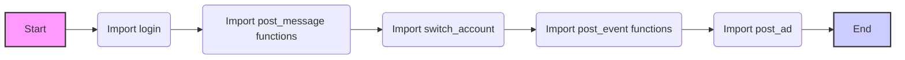
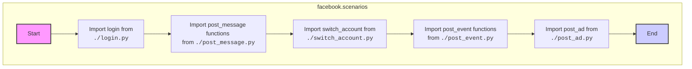

## Анализ кода `hypotez/src/endpoints/advertisement/facebook/scenarios/__init__.py`

### 1. <алгоритм>

**Общая схема работы:**

Этот файл `__init__.py` действует как точка входа для модуля `scenarios` в пакете `facebook` в каталоге `advertisement`. Он импортирует и перенаправляет функции из других модулей, тем самым предоставляя интерфейс для взаимодействия с различными сценариями действий в Facebook (например, публикация сообщений, событий, рекламы).

**Блок-схема:**

**Примеры логических блоков:**

1.  **`Import login`**:
    *   Импортирует функцию `login` из модуля `login.py`.
    *   Позволяет пользователю аутентифицироваться в Facebook.
    *   Пример использования: `from .login import login`
2.  **`Import post_message functions`**:
    *   Импортирует функции для работы с публикацией сообщений (`post_message`), включая заголовок (`post_title`), загрузку медиа (`upload_media`), обновление подписей к изображениям (`update_images_captions`), и публикацию (`publish`).
    *   Пример: `from .post_message import (post_title as post_message_title, upload_media as upload_post_media, update_images_captions as update_post_media_captions, publish as message_publish, post_message)`
3.  **`Import switch_account`**:
    *   Импортирует функцию `switch_account` из модуля `switch_account.py`.
    *   Позволяет переключаться между разными учетными записями Facebook.
    *   Пример: `from .switch_account import switch_account`
4.  **`Import post_event functions`**:
    *   Импортирует функции для создания событий, включая заголовок (`post_title`), описание (`post_description`), дату (`post_date`), время (`post_time`) и отправку (`post_event`).
    *   Пример: `from .post_event import (post_title as post_event_title, post_description as post_event_description, post_date, post_time, post_event)`
5.  **`Import post_ad`**:
    *   Импортирует функцию `post_ad` из модуля `post_ad.py`.
    *   Позволяет размещать рекламу в Facebook.
    *    Пример: `from .post_ad import post_ad`

### 2. <mermaid>

**Объяснение `mermaid` диаграммы:**

1.  **`subgraph facebook.scenarios`**:
    *   Определяет подграф для модуля `facebook.scenarios`, отображающий его внутренние зависимости.
2.  **`Start`**:
    *   Начальная точка процесса импорта.
3.  **`ImportLogin`**:
    *   Импортирует функцию `login` из модуля `login.py` для аутентификации пользователя.
4.  **`ImportPostMessage`**:
    *   Импортирует функции `post_title`, `upload_media`, `update_images_captions`, `publish`, и `post_message` из модуля `post_message.py` для публикации сообщений.
5.  **`ImportSwitchAccount`**:
    *   Импортирует функцию `switch_account` из модуля `switch_account.py` для переключения между учетными записями.
6.  **`ImportPostEvent`**:
    *   Импортирует функции `post_title`, `post_description`, `post_date`, `post_time`, и `post_event` из модуля `post_event.py` для работы с событиями.
7.  **`ImportPostAd`**:
    *   Импортирует функцию `post_ad` из модуля `post_ad.py` для размещения рекламы.
8.  **`End`**:
    *   Конечная точка процесса импорта, представляющая завершение инициализации модуля.

### 3. <объяснение>

**Импорты:**

*   `from .login import login`:
    *   Импортирует функцию `login` из файла `login.py` в текущем каталоге. Эта функция предположительно отвечает за аутентификацию пользователя в Facebook.
*   `from .post_message import *`:
    *   Импортирует все определения из файла `post_message.py`. `post_message.py` предположительно содержит логику для создания и публикации сообщений в Facebook.
*   `from .switch_account import switch_account`:
    *   Импортирует функцию `switch_account` из файла `switch_account.py`. Эта функция используется для переключения между различными учетными записями пользователя в Facebook.
*    `from .post_message import (post_title as post_message_title, ...)`
    *   Импортирует несколько функций для публикации сообщений из файла `post_message.py` и переименовывает некоторые из них, например, `post_title` переименовывается в `post_message_title`.
*   `from .post_event import (post_title as post_event_title, ...)`
    *   Аналогично импорту из `post_message`, импортирует функции для создания и публикации событий из файла `post_event.py` и переименовывает `post_title`.
*   `from .post_ad import post_ad`:
    *   Импортирует функцию `post_ad` из файла `post_ad.py` для создания и публикации рекламных объявлений.

**Классы:**

В данном файле классы не определены, так как он предназначен только для импорта и перенаправления функциональности из других модулей.

**Функции:**

В данном файле функции не определены, но через импорты доступны следующие:

*   `login`: Функция для аутентификации в Facebook.
*   `post_message`, `post_message_title`, `upload_post_media`, `update_post_media_captions`, `message_publish`: Функции для создания и публикации сообщений, управления медиа и заголовками.
*   `switch_account`: Функция для переключения между аккаунтами.
*   `post_event`, `post_event_title`, `post_event_description`, `post_date`, `post_time`: Функции для создания и публикации событий в Facebook.
*   `post_ad`: Функция для создания и публикации рекламных объявлений.

**Переменные:**

В этом файле нет явных переменных.

**Потенциальные ошибки и области для улучшения:**

*   **Импорт \***: Использование `from .post_message import *` не рекомендуется, так как это может привести к конфликтам имен и затрудняет чтение и понимание кода. Лучше явно импортировать нужные функции.
*   **Неявные зависимости**: Зависимости от других модулей (например, `login.py`, `post_message.py`, и т.д.) не являются явными в этом файле, что может усложнить отладку и понимание общей структуры проекта.

**Взаимосвязь с другими частями проекта:**

*   Этот `__init__.py` выступает в качестве интерфейса для модуля `facebook.scenarios`.
*   Он взаимодействует с модулями `login.py`, `post_message.py`, `switch_account.py`, `post_event.py` и `post_ad.py`, обеспечивая доступ к функциям для работы с Facebook.
*   Он, вероятно, используется другими модулями в `src` для выполнения различных сценариев действий в Facebook.