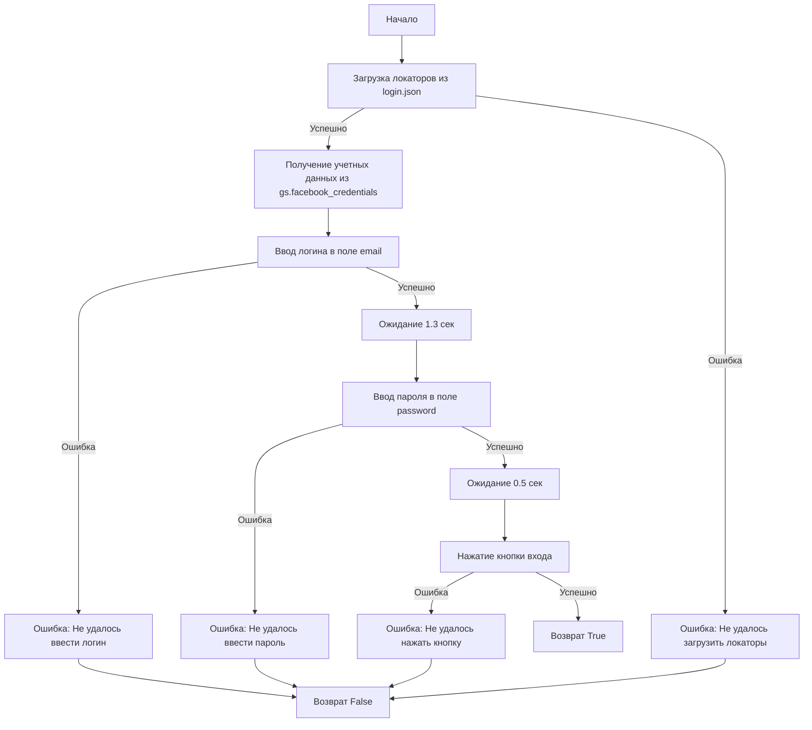
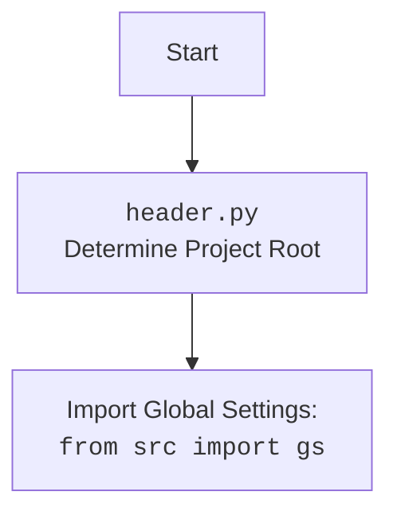

## ИНСТРУКЦИЯ:

Анализируй предоставленный код подробно и объясни его функциональность. Ответ должен включать три раздела:

1.  **<алгоритм>**: Опиши рабочий процесс в виде пошаговой блок-схемы, включая примеры для каждого логического блока, и проиллюстрируй поток данных между функциями, классами или методами.
2.  **<mermaid>**: Напиши код для диаграммы в формате `mermaid`, проанализируй и объясни все зависимости,
    которые импортируются при создании диаграммы.
    **ВАЖНО!** Убедитесь, что все имена переменных, используемые в диаграмме `mermaid`,
    имеют осмысленные и описательные имена. Имена переменных вроде `A`, `B`, `C`, и т.д., не допускаются!

    **Дополнительно**: Если в коде есть импорт `import header`, добавьте блок `mermaid` flowchart, объясняющий `header.py`:
    ```mermaid
    flowchart TD
        Start --> Header[<code>header.py</code><br> Determine Project Root]

        Header --> import[Import Global Settings: <br><code>from src import gs</code>]
    ```

3.  **<объяснение>**: Предоставьте подробные объяснения:
    -   **Импорты**: Их назначение и взаимосвязь с другими пакетами `src.`.
    -   **Классы**: Их роль, атрибуты, методы и взаимодействие с другими компонентами проекта.
    -   **Функции**: Их аргументы, возвращаемые значения, назначение и примеры.
    -   **Переменные**: Их типы и использование.
    -   Выделите потенциальные ошибки или области для улучшения.

Дополнительно, постройте цепочку взаимосвязей с другими частями проекта (если применимо).

Это обеспечивает всесторонний и структурированный анализ кода.
## Формат ответа: `.md` (markdown)
**КОНЕЦ ИНСТРУКЦИИ**

## <алгоритм>
1. **Загрузка локаторов**:
   - Загружаются локаторы элементов страницы Facebook из файла `login.json`, используя `j_loads_ns`.
   - Если загрузка не удалась, выводится сообщение об ошибке, и программа переходит к следующему шагу, не выполняя вход.
2. **Извлечение учетных данных**:
   - Получение учетных данных Facebook (логин и пароль) из глобальных настроек `gs.facebook_credentials[0]`.
3. **Ввод логина**:
   - Попытка ввода логина (username) в поле email, используя метод `d.send_key_to_webelement()` и локатор `locators.email`.
   - Если ввод не удался, выводится ошибка и функция возвращает `False`.
4. **Ожидание**:
    - Выполняется пауза в 1.3 секунды, чтобы элементы успели обновиться, используя `d.wait(1.3)`.
5. **Ввод пароля**:
   - Попытка ввода пароля, используя метод `d.send_key_to_webelement()` и локатор `locators['password']`.
   - Если ввод не удался, выводится ошибка и функция возвращает `False`.
6. **Ожидание**:
    - Выполняется пауза в 0.5 секунды, чтобы элементы успели обновиться, используя `d.wait(0.5)`.
7. **Нажатие кнопки входа**:
   - Попытка нажатия на кнопку входа, используя метод `d.execute_locator()` и локатор `locators['button']`.
   - Если нажатие не удалось, выводится ошибка и функция возвращает `False`.
8. **Успешный вход**:
    - Если все предыдущие шаги выполнены без ошибок, функция возвращает `True`.

**Примеры**:
- **Загрузка локаторов**: Файл `login.json` содержит JSON объект, описывающий CSS или XPath селекторы для элементов страницы, например: `{"email": "#email", "password": "#pass", "button": "#loginbutton"}`.
- **Ввод логина**: Если `credentials.username` равно `"testuser@example.com"`, то в поле email на странице Facebook будет введено это значение.
- **Ввод пароля**: Если `credentials['password']` равно `"testpassword"`, то в поле пароля на странице Facebook будет введено это значение.
- **Нажатие кнопки входа**: Происходит клик по элементу, который соответствует локатору `"button"` на странице Facebook.

## <mermaid>




**Объяснение зависимостей `mermaid`:**

1.  **`Start`**: Начало сценария авторизации.
2.  **`LoadLocators`**: Загрузка локаторов элементов веб-страницы Facebook из файла `login.json`.
3.  **`GetCredentials`**: Получение учетных данных (логин и пароль) из глобальных настроек.
4.  **`InputLogin`**: Ввод логина в соответствующее поле веб-формы.
5.  **`WaitAfterLogin`**: Пауза перед вводом пароля для предотвращения ошибок.
6.   **`InputPassword`**: Ввод пароля в соответствующее поле веб-формы.
7.   **`WaitAfterPassword`**: Пауза перед нажатием кнопки для предотвращения ошибок.
8.  **`ClickLoginButton`**: Нажатие кнопки для входа в систему.
9.  **`EndTrue`**: Завершение сценария с успешным результатом (возвращается `True`).
10. **`EndFalse`**: Завершение сценария с неуспешным результатом (возвращается `False`).
11. **`ErrorLoadLocators`**: Обработка ошибки при загрузке локаторов.
12. **`ErrorInputLogin`**: Обработка ошибки при вводе логина.
13. **`ErrorInputPassword`**: Обработка ошибки при вводе пароля.
14. **`ErrorClickButton`**: Обработка ошибки при нажатии кнопки входа.
15. **`Header`**: Определяет корень проекта.
16. **`Import`**: Импортирует глобальные настройки.

## <объяснение>
**Импорты:**
-   `pathlib.Path`: Используется для работы с путями к файлам и каталогам в операционной системе. В данном случае, используется для создания пути к файлу `login.json`.
-   `typing.Dict`: Используется для аннотации типов, чтобы указать, что переменная может быть словарем.
-   `src.gs`: Импортирует глобальные настройки из модуля `gs`, который вероятно содержит общие параметры приложения, включая учетные данные Facebook.
-   `src.webdriver.driver.Driver`: Импортирует класс `Driver` для управления веб-браузером, который отвечает за выполнение действий на веб-странице.
-   `src.utils.jjson.j_loads, j_loads_ns, j_dumps`: Импортирует функции для работы с JSON данными, вероятно, для загрузки и сохранения данных. `j_loads_ns` используется для загрузки JSON с поддержкой "namespaces".
-   `src.logger.logger.logger`: Импортирует объект `logger` для логирования сообщений, ошибок и отладочной информации.

**Классы:**
-   `Driver`: Класс, предоставляющий методы для взаимодействия с веб-браузером, например, для ввода текста (`send_key_to_webelement`), выполнения кликов (`execute_locator`) и ожидания (`wait`). Класс является частью фреймворка автоматизации тестов.

**Функции:**
-   `login(d: Driver) -> bool`:
    -   **Аргументы**:
        -   `d`: Экземпляр класса `Driver`, используемый для взаимодействия с веб-браузером.
    -   **Возвращаемое значение**:
        -   `bool`: `True`, если авторизация прошла успешно, `False` в противном случае.
    -   **Назначение**:
        -   Функция реализует сценарий авторизации на Facebook.
        -   Она использует переданный экземпляр `Driver` для ввода логина, пароля и нажатия кнопки входа.
        -   Функция оборачивает операции взаимодействия с веб-страницей в блоки `try-except` для обработки возможных исключений.
    -   **Примеры**:
        -   `login(driver_instance)` – попытка авторизоваться на Facebook, используя переданный драйвер.
- `j_loads_ns(path)`: загружает JSON из файла, обрабатывая namespace.
- `j_loads(path)`: загружает JSON из файла.
- `j_dumps(data)`: преобразует Python объект в JSON формат.

**Переменные:**
-   `locators`: Словарь, содержащий локаторы веб-элементов для страницы входа Facebook. Загружается из файла `login.json` с помощью `j_loads_ns`.
-   `credentials`: Список учетных данных (логин и пароль) для Facebook. В коде используется первый элемент из списка `gs.facebook_credentials[0]`.
-  `gs`: Объект, содержащий глобальные настройки.
- `d`: Объект класса `Driver`, предоставляемый как аргумент в функции `login`.

**Потенциальные ошибки и области для улучшения:**
-   **Обработка ошибок**: В коде есть общая обработка исключений (`except Exception as ex:`), но не выполняется никаких действий по исправлению ошибки, кроме логирования и возвращения `False`. В реальном приложении может потребоваться более сложная обработка ошибок, например, повторная попытка авторизации.
-   **Жестко закодированный индекс**: `gs.facebook_credentials[0]` использует первый элемент списка учетных данных. Если список пуст или содержит более одного элемента, это может вызвать проблему.
-   **Ожидание**: Использование фиксированных задержек `d.wait(1.3)` и `d.wait(0.5)` может быть ненадежным, так как время загрузки веб-страницы может меняться. Лучше использовать явные ожидания (explicit waits), основанные на условиях (например, ожидание появления элемента).
-   **Безопасность**: Хранение учетных данных в коде или файле конфигурации не безопасно. Лучше использовать механизмы для управления секретами, например, переменные окружения.
-   **Отсутствие обработки невалидных данных**: Код не проверяет валидность загруженных локаторов и учетных данных, что может привести к ошибкам во время выполнения.
-   **Слабая типизация**: Отсутствие строгой типизации в `locators` может привести к ошибкам во время выполнения.
-   **Отсутствие комментариев**: В коде мало комментариев, которые бы объясняли назначение отдельных блоков, что затрудняет его понимание и поддержку.

**Цепочка взаимосвязей с другими частями проекта:**
-   `src.gs` предоставляет глобальные настройки, включая учетные данные.
-   `src.webdriver.driver.Driver` управляет веб-браузером и позволяет выполнять действия на странице.
-   `src.utils.jjson` используется для загрузки локаторов из JSON файлов.
-   `src.logger` предоставляет механизм логирования для отслеживания ошибок.
-   `login.json` содержит локаторы элементов страницы.

Таким образом, данный скрипт интегрирован с другими частями проекта для выполнения автоматизированного входа на Facebook. Он использует глобальные настройки, драйвер браузера, утилиты для работы с JSON, логирование и локаторы, хранящиеся в файле.