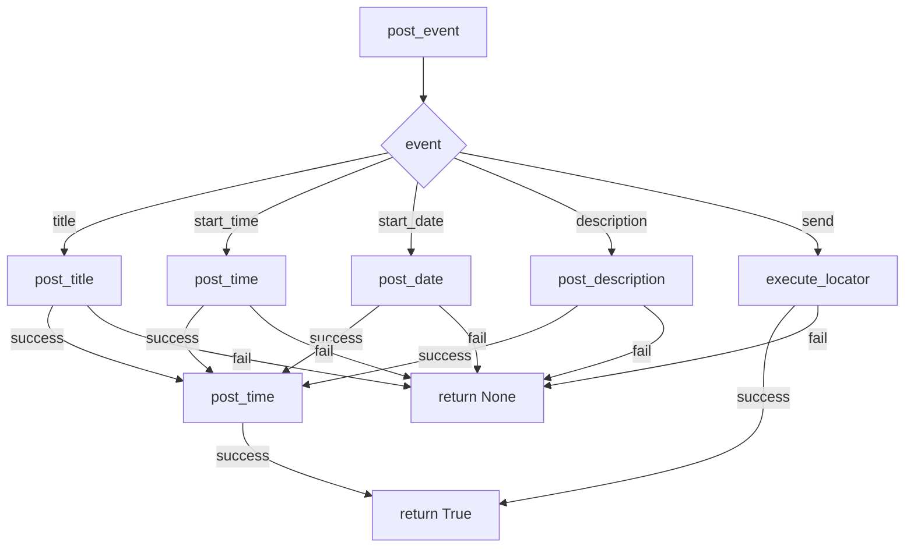

```MD
# <input code>

```python
## \file hypotez/src/endpoints/advertisement/facebook/scenarios/post_event.py
# -*- coding: utf-8 -*-\

#! venv/bin/python/python3.12

"""
.. module: src.endpoints.advertisement.facebook.scenarios 
	:platform: Windows, Unix
	:synopsis: Публикация календарного события v группах фейсбук

"""


from socket import timeout
import time
from pathlib import Path
from types import SimpleNamespace
from typing import Dict, List
from urllib.parse import urlencode
from selenium.webdriver.remote.webelement import WebElement

from src import gs
from src.webdriver.driver import Driver
from src.utils.jjson import j_loads_ns, pprint
from src.logger import logger

# Load locators from JSON file.
locator: SimpleNamespace = j_loads_ns(
    Path(gs.path.src / 'endpoints' / 'advertisement' / 'facebook' / 'locators' / 'post_event.json')
)


def post_title(d: Driver, title: str) -> bool:
    """ Sends the title of event.

    Args:
        d (Driver): The driver instance used for interacting with the webpage.
        event (SimpleNamespace): The event containing the title, data of event and description to be sent.

    Returns:
        bool: `True` if the title and description were sent successfully, otherwise `None`.

    Examples:
        >>> driver = Driver(...)
        >>> event = SimpleNamespace(title="Campaign Title", description="Event Description")
        >>> post_title(driver, event)
        True
    """

    if not d.execute_locator(locator=locator.event_title, message=title):
        logger.error("Failed to send event title", exc_info=False)
        return
    return True


def post_date(d: Driver, date: str) -> bool:
    """ Sends the title of event.

    Args:
        d (Driver): The driver instance used for interacting with the webpage.
        event (SimpleNamespace): The event containing the title, data of event and description to be sent.

    Returns:
        bool: `True` if the title and description were sent successfully, otherwise `None`.

    Examples:
        >>> driver = Driver(...)
        >>> event = SimpleNamespace(title="Campaign Title", description="Event Description")
        >>> post_title(driver, event)
        True
    """
    if not d.execute_locator(locator=locator.start_date, message=date):
        logger.error("Failed to send event date", exc_info=False)
        return
    return True


def post_time(d: Driver, time: str) -> bool:
    """ Sends the title of event.

    Args:
        d (Driver): The driver instance used for interacting with the webpage.
        event (SimpleNamespace): The event containing the title, data of event and description to be sent.

    Returns:
        bool: `True` if the title and description were sent successfully, otherwise `None`.

    Examples:
        >>> driver = Driver(...)
        >>> event = SimpleNamespace(title="Campaign Title", description="Event Description")
        >>> post_title(driver, event)
        True
    """
    if not d.execute_locator(locator=locator.start_time, message=time):
        logger.error("Failed to send event time", exc_info=False)
        return
    return True


def post_description(d: Driver, description: str) -> bool:
    """ Sends the title of event.

    Args:
        d (Driver): The driver instance used for interacting with the webpage.
        event (SimpleNamespace): The event containing the title, data of event and description to be sent.

    Returns:
        bool: `True` if the title and description were sent successfully, otherwise `None`.

    Examples:
        >>> driver = Driver(...)
        >>> event = SimpleNamespace(title="Campaign Title", description="Event Description")
        >>> post_title(driver, event)
        True
    """
    d.scroll(1, 300, 'down')
    if not d.execute_locator(locator=locator.event_description, message=description):
        logger.error("Failed to send event description", exc_info=False)
        return
    return True


def post_event(d: Driver, event: SimpleNamespace) -> bool:
    """ Manages the process of promoting a post with a title, description, and media files.

    Args:
        d (Driver): The driver instance used for interacting with the webpage.
        event (SimpleNamespace): The event containing the title, description, date and time to be posted.

    Returns:
        bool: `True` if the event was posted successfully, otherwise `None`

    Examples:
        >>> driver = Driver(...)
        >>> event = SimpleNamespace(title="Campaign Title", description="Event Description", start="2024-10-27 10:00")
        >>> post_event(driver, event)
    """
    if not post_title(d, event.title):
        return
    dt, tm = event.start.split()
    if not post_date(d, dt.strip()):
        return
    if not post_time(d, tm.strip()):
        return
    if not post_description(d, f"{event.description}\n{event.promotional_link}"):
        return
    if not d.execute_locator(locator=locator.event_send):
        return
    time.sleep(30)
    return True
```

# <algorithm>

**Шаг 1:** Функция `post_event` принимает драйвер `d` и объект `event` (SimpleNamespace).

**Шаг 2:** Вызывается функция `post_title` для отправки заголовка события. Если функция возвращает `None`, процесс прерывается.

**Шаг 3:** Строка `event.start` разделяется на дату (`dt`) и время (`tm`).

**Шаг 4:** Вызывается функция `post_date` для отправки даты события. Если функция возвращает `None`, процесс прерывается.

**Шаг 5:** Вызывается функция `post_time` для отправки времени события. Если функция возвращает `None`, процесс прерывается.

**Шаг 6:** Вызывается функция `post_description` для отправки описания события, добавляя `\n` и `promotional_link`. Если функция возвращает `None`, процесс прерывается.

**Шаг 7:** Вызывается функция `execute_locator` для нажатия кнопки отправки. Если функция возвращает `None`, процесс прерывается.

**Шаг 8:** Добавляется задержка `time.sleep(30)`

**Шаг 9:** Возвращается `True`, если все шаги выполнены успешно.


# <mermaid>



**Описание зависимостей:**

* `post_event`: Функция, отвечающая за публикацию события.  Зависит от функций `post_title`, `post_date`, `post_time`, `post_description` и `d.execute_locator`.
* `post_title`, `post_date`, `post_time`, `post_description`: Функции, отвечающие за отправку заголовка, даты, времени и описания соответственно.  Зависит от `d.execute_locator`
* `d.execute_locator`: Метод класса `Driver`, осуществляющий взаимодействие с веб-драйвером и отправку данных на веб-страницу.
* `Driver`: Класс для работы с веб-драйвером.  Необходим для работы функций `post_title`, `post_date`, `post_time`, `post_description` и `post_event`.
* `locator`: Объект `SimpleNamespace`, содержащий локаторы для элементов веб-страницы. Загружается из JSON файла `post_event.json`.  Необходим для `d.execute_locator`.
* `gs`: Модуль, содержащий конфигурационные переменные, вероятно, связанные с путями к файлам.
* `j_loads_ns`: Функция из `src.utils.jjson`, которая загружает данные из JSON в объект `SimpleNamespace`.

# <explanation>

* **Импорты:**  Код импортирует необходимые библиотеки для работы с веб-драйвером (Selenium), временем, путями к файлам, обработкой JSON и логгированием.  Важно, что импортируется `Driver` из `src.webdriver.driver`, что указывает на структуру проекта, организованную с использованием модулей `src`.


* **Классы:**  Код использует класс `Driver`, предположительно, из модуля `src.webdriver.driver`. Этот класс отвечает за взаимодействие с веб-драйвером (например, заполнение полей формы).


* **Функции:**
    * `post_event`:  Функция для публикации события. Принимает `Driver` и `SimpleNamespace` с данными события, обрабатывает все поля, выполняя вызовы других функций, и возвращает `True` или `None` в зависимости от успешности.
    * `post_title`, `post_date`, `post_time`, `post_description`: Функции для отправки отдельных частей события (заголовок, дата, время, описание). Они принимают `Driver` и соответствующие данные, вызывают `execute_locator` для взаимодействия с веб-страницей, и возвращают `True` в случае успеха или `None` в случае неудачи.  Все функции имеют одинаковый функционал, но различаются по параметрам.
* **Переменные:** `locator` - это объект `SimpleNamespace`, который содержит локаторы (xpath или css-селекторы) элементов на странице Facebook, загруженные из JSON файла. `MODE` - переменная, вероятно, устанавливающая режим работы (например, 'dev' или 'prod').
* **Возможные ошибки и улучшения:**
    * Отсутствие обработки исключений: Функции не обрабатывают потенциальные исключения (например, `TimeoutException`, если веб-элемент не найден).
    * Неявная зависимость от `d.execute_locator`: Функции неявно зависят от работоспособности метода `execute_locator` класса `Driver`.  Следовало бы предусмотреть проверку, если этот метод не может выполнить задачу, чтобы функция не возвращала `None` без явного сообщения об ошибке.
    * Недостаток ясности в аргументах: Аргумент `event` в `post_event` мог бы быть более информативным.


**Взаимосвязи с другими частями проекта:**

Код зависит от `gs` (вероятно, глобальные настройки), `src.webdriver.driver` (для работы с драйвером), `src.utils.jjson` (для парсинга локаторов) и `src.logger` (для логирования ошибок). Локаторы загружаются из файла `post_event.json`, который расположен в папке `locators` в подпапке `facebook` папки `advertisement` проекта.  Это указывает на структурированную архитектуру проекта.