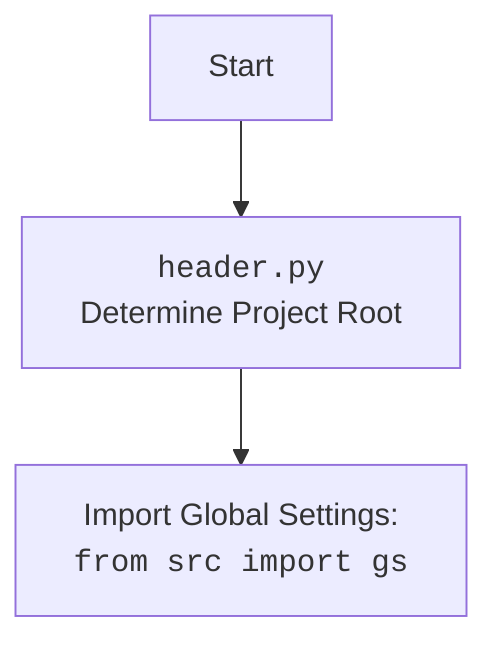

## ИНСТРУКЦИЯ:

Анализируй предоставленный код подробно и объясни его функциональность. Ответ должен включать три раздела:

1.  **<алгоритм>**: Опиши рабочий процесс в виде пошаговой блок-схемы, включая примеры для каждого логического блока, и проиллюстрируй поток данных между функциями, классами или методами.
2.  **<mermaid>**: Напиши код для диаграммы в формате `mermaid`, проанализируй и объясни все зависимости,
    которые импортируются при создании диаграммы.
    **ВАЖНО!** Убедитесь, что все имена переменных, используемые в диаграмме `mermaid`,
    имеют осмысленные и описательные имена. Имена переменных вроде `A`, `B`, `C`, и т.д., не допускаются!

    **Дополнительно**: Если в коде есть импорт `import header`, добавьте блок `mermaid` flowchart, объясняющий `header.py`:
    ```mermaid
    flowchart TD
        Start --> Header[<code>header.py</code><br> Determine Project Root]

        Header --> import[Import Global Settings: <br><code>from src import gs</code>]
    ```

3.  **<объяснение>**: Предоставьте подробные объяснения:
    - **Импорты**: Их назначение и взаимосвязь с другими пакетами `src.`.
    - **Классы**: Их роль, атрибуты, методы и взаимодействие с другими компонентами проекта.
    - **Функции**: Их аргументы, возвращаемые значения, назначение и примеры.
    - **Переменные**: Их типы и использование.
    - Выделите потенциальные ошибки или области для улучшения.

Дополнительно, постройте цепочку взаимосвязей с другими частями проекта (если применимо).

Это обеспечивает всесторонний и структурированный анализ кода.
## Формат ответа: `.md` (markdown)
**КОНЕЦ ИНСТРУКЦИИ**

## <алгоритм>
1. **`post_title(d, message)`**:
   - **Вход**: `d` - экземпляр `Driver`, `message` - `SimpleNamespace` (содержащий `title` и `description`) или `str`.
   - **Действия**:
     - Прокрутка страницы вверх.
     - Открытие окна добавления поста.
     - Формирование строки сообщения: объединяет `message.title` и `message.description` (если `message` является `SimpleNamespace`).
     - Ввод сообщения в поле ввода.
   - **Выход**: `True`, если сообщение успешно отправлено, иначе `None`.
   - **Пример**:
     - Входные данные: `d` (объект драйвера), `message` (SimpleNamespace: title="Заголовок", description="Описание").
     - Действия: Прокрутка, открытие окна, ввод "Заголовок\nОписание".
     - Выход: `True`.

2. **`upload_media(d, media, no_video, without_captions)`**:
   - **Вход**: `d` - экземпляр `Driver`, `media` - `SimpleNamespace` (с путями к файлам), список `SimpleNamespace`, `str` или список `str`, `no_video` - булево значение, `without_captions` - булево значение.
   - **Действия**:
     - Открытие формы добавления медиа.
     - Преобразование `media` в список, если это не список.
     - Перебор элементов `media`.
         - Определение пути к медиафайлу.
         - Загрузка медиафайла.
     - Если `without_captions = False` открытие формы редактирования медиа и получение списка полей для ввода подписей.
     - Вызов функции `update_images_captions` для обновления подписей к изображениям.
   - **Выход**: `True`, если медиа загружено, иначе `None`.
   - **Пример**:
        - Входные данные: `d` (объект драйвера), `media` (список SimpleNamespace: [{local_image_path: "path1.jpg"}, {local_image_path: "path2.jpg"}]), `no_video = False`.
        - Действия: Открытие формы, загрузка path1.jpg, загрузка path2.jpg, открытие окна редактирования, обновление подписей.
        - Выход: `True`.

3. **`update_images_captions(d, media, textarea_list)`**:
   - **Вход**: `d` - экземпляр `Driver`, `media` - список `SimpleNamespace`, `textarea_list` - список `WebElement`.
   - **Действия**:
     - Загрузка локализованных текстов из JSON-файла.
     - Перебор элементов `media` и `textarea_list`.
     - Формирование строки сообщения: добавляет заголовок, описание, цену и т.д. на основе локализации и направления текста.
     - Ввод сообщения в textarea.
   - **Выход**: `None`.
   - **Пример**:
     - Входные данные: `d` (объект драйвера), `media` ([{product_title: "Товар", description: "Описание", ...}], `textarea_list` (список элементов textarea).
     - Действия: Генерация текста на основе `media`, ввод текста в соответствующие `textarea`.
     - Выход: `None`.

4. **`publish(d, attempts)`**:
   - **Вход**: `d` - экземпляр `Driver`, `attempts` - количество попыток публикации.
    - **Действия**:
      - Проверка количества попыток, если меньше нуля - выход.
      - Поиск и нажатие на кнопку `finish_editing_button`.
      - Ожидание 1 секунду.
      - Поиск и нажатие на кнопку `publish`.
      - Если кнопка `publish` не найдена, ищутся кнопки `close_pop_up` или `not_now`, если одна из них есть - функция вызывается рекурсивно, уменьшая количество попыток.
      - Ожидание появления поля ввода, если не появилось - поиск кнопок `close_pop_up` или `not_now`, если одна из них есть - функция вызывается рекурсивно, уменьшая количество попыток.
   - **Выход**: `True`, если публикация прошла успешно, иначе `None`.
   - **Пример**:
     - Входные данные: `d` (объект драйвера), attempts = 5.
     - Действия: Нажатие `finish_editing_button`, ожидание, нажатие `publish` (если не найдена, попытки с уменьшением). Если все удачно - выход, если нет - рекурсивный вызов.
     - Выход: `True`.

5. **`promote_post(d, category, products, no_video)`**:
   - **Вход**: `d` - экземпляр `Driver`, `category` - `SimpleNamespace`, `products` - список `SimpleNamespace`, `no_video` - булево значение.
   - **Действия**:
     - Вызов `post_title`.
     - Вызов `upload_media`.
     - Поиск и нажатие на кнопку `finish_editing_button`.
     - Поиск и нажатие на кнопку `publish`.
   - **Выход**: `True`, если публикация прошла успешно, иначе `None`.
   - **Пример**:
     - Входные данные: `d` (объект драйвера), `category` (SimpleNamespace), `products` (список SimpleNamespace).
     - Действия: Вызов `post_title`, `upload_media`, нажатие `finish_editing_button`, нажатие `publish`.
     - Выход: `True`.

6.  **`post_message(d, message, no_video, images, without_captions)`**:
   - **Вход**: `d` - экземпляр `Driver`, `message` - `SimpleNamespace`, `no_video` - булево значение, `images` - список или строка, `without_captions` - булево значение.
   - **Действия**:
      - Вызов функции `post_title`.
      - Вызов функции `upload_media`.
      - Ожидание 0.5 сек
      - Поиск и нажатие на кнопку `send`, если найдена - выход из функции.
      - Поиск и нажатие на кнопку `finish_editing_button`.
      - Вызов `publish`.
   -  **Выход**: `True`, если все этапы прошли успешно, иначе `None`.
   -  **Пример**:
      - Входные данные: `d` (объект драйвера), `message` (SimpleNamespace), `images` (список или строка).
      - Действия: Вызов `post_title`, `upload_media`, нажатие `finish_editing_button`, вызов `publish`.
      - Выход: `True`.
## <mermaid>
```mermaid
flowchart TD
    Start[Start] --> PostTitleCall
    PostTitleCall[Call post_title(d, message)]
    PostTitleCall -- Success --> UploadMediaCall
    PostTitleCall -- Fail --> End
    UploadMediaCall[Call upload_media(d, media, no_video, without_captions)]
    UploadMediaCall -- Success --> CheckSendButton
    UploadMediaCall -- Fail --> End
    CheckSendButton[Check if send button exists]
    CheckSendButton -- Yes --> End
    CheckSendButton -- No --> FinishEditingButton
    FinishEditingButton[Call d.execute_locator(finish_editing_button)]
    FinishEditingButton -- Success --> PublishCall
    FinishEditingButton -- Fail --> End
    PublishCall[Call publish(d)]
    PublishCall -- Success --> End
    PublishCall -- Fail --> End
    End[End]

    style Start fill:#f9f,stroke:#333,stroke-width:2px
    style End fill:#ccf,stroke:#333,stroke-width:2px

    subgraph post_message
    PostTitleCall
    UploadMediaCall
    CheckSendButton
    FinishEditingButton
    PublishCall
    end

     
```



**Анализ зависимостей в `mermaid` диаграмме:**

*   **`post_message`**: Основная функция, которая управляет процессом публикации. Она вызывает другие функции: `post_title`, `upload_media`, `publish`, которые являются ее зависимостями.
*   **`post_title`**: Функция для отправки заголовка и описания. Является зависимостью для `post_message`.
*   **`upload_media`**: Функция для загрузки медиафайлов и обновления подписей. Является зависимостью для `post_message`.
*   **`publish`**: Функция для публикации поста. Является зависимостью для `post_message`.
*   **`d`**:  Экземпляр `Driver`, передается между функциями для управления браузером.
*   **`message`**: `SimpleNamespace` с данными для публикации (заголовок, описание и др.).
*  **`media`**: `SimpleNamespace` или список `SimpleNamespace` с путями к медиафайлам.
*   **`no_video`**: Булево значение, указывающее, загружать ли видео.
*   **`without_captions`**: Булево значение, указывающее, нужно ли обновлять подписи.

## <объяснение>

### Импорты:
-   `time`: Используется для задержек (ожидания) в работе Selenium.
-   `pathlib.Path`: Используется для работы с путями к файлам в операционной системе.
-   `types.SimpleNamespace`: Удобный класс для создания объектов с атрибутами, к которым можно обращаться через точку.
-   `typing.Dict, List, Optional`: Используются для определения типов данных, что улучшает читаемость и предотвращает ошибки.
-   `selenium.webdriver.remote.webelement.WebElement`: Используется для работы с веб-элементами на странице.
-   `src.gs`: Глобальные настройки проекта. Позволяет получить доступ к общим параметрам и путям.
-   `src.webdriver.driver.Driver`: Класс-обертка для Selenium WebDriver, упрощающий взаимодействие с браузером.
-   `src.utils.jjson.j_loads_ns`: Функция для загрузки данных из JSON-файла в объект SimpleNamespace.
-   `src.utils.printer.pprint`: Функция для красивого вывода данных, чаще всего для отладки.
-   `src.logger.logger.logger`: Логгер для записи сообщений о работе программы, ошибок и т.д.

### Классы:
-   `Driver` (из `src.webdriver.driver`):
    -   **Роль**: Управляет браузером. Предоставляет методы для навигации, поиска элементов, ввода данных и т.д.
    -   **Атрибуты и методы**: Объекты класса `Driver` используются в качестве аргумента в функциях для управления веб-страницей.
    -   **Взаимодействие**: Используется во всех функциях, взаимодействующих с веб-страницей.

### Функции:
-   **`post_title(d: Driver, message: SimpleNamespace | str) -> bool`**:
    -   **Аргументы**: `d` - экземпляр `Driver`, `message` -  `SimpleNamespace` (содержащий `title` и `description`) или `str`.
    -   **Возвращаемое значение**: `True`, если сообщение успешно добавлено в поле ввода, иначе `None`.
    -   **Назначение**: Отправляет заголовок и описание в поле ввода сообщения.
    -   **Пример**: `post_title(driver, SimpleNamespace(title="Заголовок", description="Описание"))`
-   **`upload_media(d: Driver, media: SimpleNamespace | List[SimpleNamespace] | str | list[str], no_video: bool = False, without_captions:bool = False) -> bool`**:
    -   **Аргументы**:
        -   `d` - экземпляр `Driver`.
        -   `media` - `SimpleNamespace` (с путем к файлу), список `SimpleNamespace`, строка (путь к файлу) или список строк (путей к файлам).
        -   `no_video` - Если `True` не будет использовать видео.
        -   `without_captions` - Если `True` не будут добавляться подписи.
    -   **Возвращаемое значение**: `True`, если медиа успешно загружено, иначе `None`.
    -   **Назначение**: Загружает медиафайлы (изображения или видео) и обновляет подписи, если требуется.
    -   **Пример**: `upload_media(driver, [SimpleNamespace(local_image_path="path1.jpg"), SimpleNamespace(local_image_path="path2.jpg")])`
-   **`update_images_captions(d: Driver, media: List[SimpleNamespace], textarea_list: List[WebElement]) -> None`**:
    -   **Аргументы**:
        -   `d` - экземпляр `Driver`.
        -   `media` - список `SimpleNamespace` с информацией о продукте.
        -   `textarea_list` - список `WebElement` (текстовые поля для ввода подписей).
    -   **Возвращаемое значение**: `None`.
    -   **Назначение**: Добавляет описания к загруженным медиафайлам. Использует локализацию для формирования текста.
    -   **Пример**: `update_images_captions(driver, [SimpleNamespace(product_title="Товар", description="Описание")], [WebElement1, WebElement2])`
-   **`publish(d: Driver, attempts: int = 5) -> bool`**:
    -   **Аргументы**:
        - `d` - экземпляр `Driver`.
        - `attempts` - количество попыток публикации.
    -   **Возвращаемое значение**: `True`, если публикация выполнена успешно, иначе `None`.
    -   **Назначение**: Публикует пост, обрабатывая различные всплывающие окна.
    -   **Пример**: `publish(driver, attempts = 3)`
-   **`promote_post(d: Driver, category: SimpleNamespace, products: List[SimpleNamespace], no_video: bool = False) -> bool`**:
    -   **Аргументы**:
        -   `d` - экземпляр `Driver`.
        -   `category` - `SimpleNamespace` с информацией о категории.
        -   `products` - список `SimpleNamespace` с информацией о продуктах.
        -   `no_video` - если `True`, то не будет использоваться видео.
    -   **Возвращаемое значение**: `True`, если публикация выполнена успешно, иначе `None`.
    -   **Назначение**: Управляет процессом публикации поста с заголовком, описанием и медиафайлами.
    -   **Пример**: `promote_post(driver, SimpleNamespace(title="Заголовок", description="Описание"), [SimpleNamespace(local_image_path="path1.jpg")])`
 -  **`post_message(d: Driver, message: SimpleNamespace,  no_video: bool = False, images:Optional[str | list[str]] = None, without_captions:bool = False) -> bool`**:
    -   **Аргументы**:
        -   `d` - экземпляр `Driver`.
        -   `message` - `SimpleNamespace` с информацией о сообщении.
        -   `no_video` - если `True`, то не будет использоваться видео.
        -   `images` - список или строка (путь к файлу)
        -   `without_captions` - если `True`, не будут добавляться подписи к изображениям.
    -   **Возвращаемое значение**: `True`, если все этапы публикации выполнены успешно, иначе `None`.
    -   **Назначение**: Управляет процессом публикации поста, включая заголовок, описание, медиа и публикацию.
    -   **Пример**: `post_message(driver, SimpleNamespace(title="Заголовок", description="Описание"), images=["path1.jpg"])`

### Переменные:
-   `locator` (SimpleNamespace): Содержит локаторы для веб-элементов, загруженные из JSON-файла.
-   `local_units` (SimpleNamespace): Содержит локализованные строки, загруженные из `translations.json`.
-   `media_path` (str): Путь к медиафайлу.
-  `textarea_list` (List[WebElement]): Список текстовых полей для ввода подписей к медиафайлам.
-  `attempts` (int): Количество попыток для публикации.

### Потенциальные ошибки и области для улучшения:
-   **Обработка ошибок**: В коде есть несколько блоков `try...except`, но можно добавить более подробное логирование ошибок, чтобы упростить отладку.
-   **Повторяющийся код**: Блоки кода, связанные с обработкой ошибок при загрузке и обновлении подписей к медиафайлам, можно выделить в отдельные функции.
-   **Использование `...` в `except` блоке**: Вместо многоточия лучше выводить конкретную ошибку или сообщение для отладки.
-   **Рекурсивный вызов `publish`**: При рекурсивном вызове `publish` можно передавать не только `attempts - 1` но и  сообщения в лог об ошибке, для облегчения поиска проблем.
-   **Ожидания**: Использовать более гибкие ожидания для элементов на странице, вместо фиксированных задержек `d.wait()`.
-   **Локализация**: Логику добавления подписей в `update_images_captions` можно сделать более гибкой, вынеся шаблоны сообщений во внешний файл.

### Взаимосвязи с другими частями проекта:
-   **`src.gs`**: Используется для доступа к глобальным настройкам, включая путь к файлам локаторов и другим ресурсам.
-   **`src.webdriver.driver.Driver`**: Абстракция для работы с браузером, обеспечивающая единый интерфейс.
-   **`src.utils.jjson`**: Используется для загрузки JSON-файлов, например, с локаторами и переводами.
-   **`src.logger.logger`**: Логгирование всех действий и ошибок, что полезно для отладки и мониторинга.

Этот код отвечает за автоматизацию процесса публикации сообщений в Facebook, включая текст и медиафайлы. Функции хорошо структурированы и выполняют определенные задачи. Улучшения можно внести в обработку ошибок, повторяющийся код и использование `...` в `except`.