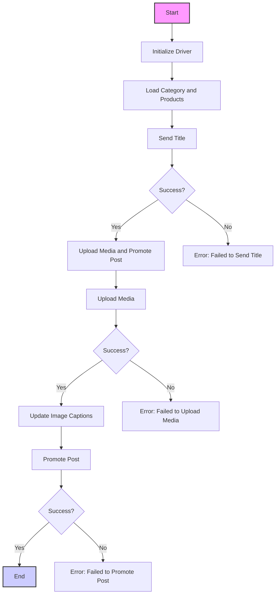

## АНАЛИЗ КОДА: `post_message_async.md`

### 1. <алгоритм>

**Описание рабочего процесса:**

1.  **Инициализация драйвера:** Создается экземпляр класса `Driver` для управления браузером.
2.  **Загрузка данных:** Загружаются данные о категории и продуктах, включая название, описание и пути к медиафайлам.
3.  **Отправка заголовка:** Вызывается функция `post_title` для отправки заголовка и описания в поле ввода Facebook.
    *   **Пример:** В поле ввода поста вводятся заголовок "Campaign Title" и описание "Campaign Description" из предоставленных данных.
4.  **Проверка успешности отправки заголовка:** Проверяется, успешно ли отправлен заголовок.
    *   **Успешно:** Переход к загрузке медиафайлов.
    *   **Ошибка:** Выводится сообщение об ошибке "Failed to send title".
5.  **Загрузка медиафайлов:** Вызывается функция `upload_media` для загрузки изображений и видео в пост Facebook.
    *   **Пример:** Загружается файл `path/to/image.jpg`.
6.  **Проверка успешности загрузки медиафайлов:** Проверяется, успешно ли загружены медиафайлы.
    *   **Успешно:** Переход к обновлению подписей к изображениям.
    *   **Ошибка:** Выводится сообщение об ошибке "Failed to upload media".
7.  **Обновление подписей к изображениям:** Вызывается функция `update_images_captions` для добавления или изменения подписей к загруженным изображениям.
    *   **Пример:** Добавляется подпись к изображению, связанная с данным продуктом.
8.  **Продвижение поста:** Вызывается функция `promote_post` для публикации сообщения в Facebook.
9.  **Проверка успешности продвижения поста:** Проверяется, успешно ли опубликован пост.
    *   **Успешно:** Завершение скрипта.
    *   **Ошибка:** Выводится сообщение об ошибке "Failed to promote post".

**Поток данных:**

*   **Данные категории (SimpleNamespace):** Передаются в функции `post_title` и `promote_post`.
*   **Данные продуктов (List[SimpleNamespace]):** Передаются в функции `upload_media`, `update_images_captions` и `promote_post`.
*   **Драйвер (Driver):** Передается во все функции, взаимодействующие с веб-страницей (`post_title`, `upload_media`, `update_images_captions`, `promote_post`).

### 2. <mermaid>

**Зависимости:**

Диаграмма не отображает импорты из кода, а показывает только логическую последовательность операций. Зависимости в коде включают:

*   **Driver:** Класс, управляющий браузером, предоставляется как аргумент функциям, работающим с веб-страницей.
*   **SimpleNamespace:** Используется для хранения данных о категориях и продуктах.
*   **Функции:**  `post_title`, `upload_media`, `update_images_captions`, `promote_post` - все они принимают `Driver` как аргумент, обеспечивая взаимодействие с веб-страницей.

**Объяснение переменных в Mermaid:**

*   **Start:** Начало скрипта.
*   **InitDriver:**  Инициализация экземпляра класса `Driver`.
*   **LoadCategoryAndProducts:** Загрузка данных о категории и продуктах.
*   **SendTitle:**  Вызов функции `post_title` для отправки заголовка и описания.
*   **CheckTitleSuccess:** Проверка успешности отправки заголовка.
*   **UploadMediaAndPromotePost:** Вызов функции `promote_post`, которая включает загрузку медиа и продвижение поста.
*   **TitleError:** Сообщение об ошибке при неудачной отправке заголовка.
*   **UploadMedia:**  Вызов функции `upload_media` для загрузки медиа.
*   **CheckMediaSuccess:** Проверка успешности загрузки медиа.
*   **UpdateCaptions:**  Вызов функции `update_images_captions` для обновления подписей к изображениям.
*   **MediaError:** Сообщение об ошибке при неудачной загрузке медиа.
*    **PromotePost**: Вызов функции для продвижения поста.
*   **CheckPromoteSuccess:** Проверка успешности продвижения поста.
*   **PromoteError:** Сообщение об ошибке при неудачном продвижении поста.
*   **End:** Конец скрипта.

### 3. <объяснение>

**Импорты:**

*   `selenium`: Используется для автоматизации взаимодействия с веб-браузером. Позволяет эмулировать действия пользователя, такие как ввод текста, нажатие кнопок и загрузка файлов.
*   `asyncio`: Используется для асинхронного выполнения операций.
*   `pathlib`: Предоставляет инструменты для работы с файловыми путями.
*   `types`: Используется для создания простых объектов с атрибутами (SimpleNamespace), что упрощает передачу и хранение данных.
*   `typing`: Используется для аннотации типов, повышая читаемость и предотвращая ошибки.

Все эти импорты, как ожидается, находятся в структуре `src` или являются стандартными библиотеками Python.

**Функции:**

*   **`post_title(d: Driver, category: SimpleNamespace) -> bool`**:
    *   **Аргументы:**
        *   `d`: Экземпляр класса `Driver` для управления браузером.
        *   `category`: Экземпляр `SimpleNamespace`, содержащий поля `title` и `description`.
    *   **Возвращает:** `True` при успешной отправке, в противном случае `None`.
    *   **Назначение:** Отправляет заголовок и описание в текстовое поле поста Facebook.
    *   **Пример:** `post_title(driver, SimpleNamespace(title="Мой заголовок", description="Мое описание"))`.
*   **`upload_media(d: Driver, products: List[SimpleNamespace], no_video: bool = False) -> bool`**:
    *   **Аргументы:**
        *   `d`: Экземпляр класса `Driver`.
        *   `products`: Список экземпляров `SimpleNamespace`, содержащих информацию о продуктах и путях к медиафайлам (`local_image_path`, `local_video_path`).
        *   `no_video`: Флаг для пропуска загрузки видео. По умолчанию `False`.
    *   **Возвращает:** `True` при успешной загрузке, в противном случае `None`.
    *   **Назначение:** Загружает изображения и, возможно, видеофайлы в пост Facebook.
    *   **Пример:** `upload_media(driver, [SimpleNamespace(local_image_path="path/to/image.jpg"), SimpleNamespace(local_video_path="path/to/video.mp4")])`.
*   **`update_images_captions(d: Driver, products: List[SimpleNamespace], textarea_list: List[WebElement]) -> None`**:
    *   **Аргументы:**
        *   `d`: Экземпляр класса `Driver`.
        *   `products`: Список экземпляров `SimpleNamespace`, содержащих детали для обновления (например, описание для подписи).
        *   `textarea_list`: Список текстовых полей, в которые вставляются подписи.
    *   **Возвращает:** `None` (функция ничего не возвращает).
    *   **Назначение:** Обновляет подписи к загруженным изображениям.
    *   **Пример:** `update_images_captions(driver, [SimpleNamespace(description="Моя подпись")], [textarea1, textarea2])`.
*   **`promote_post(d: Driver, category: SimpleNamespace, products: List[SimpleNamespace], no_video: bool = False) -> bool`**:
    *   **Аргументы:**
        *   `d`: Экземпляр класса `Driver`.
        *   `category`: Экземпляр `SimpleNamespace` с заголовком и описанием.
        *   `products`: Список экземпляров `SimpleNamespace`, содержащих медиафайлы и детали.
        *   `no_video`: Флаг для пропуска загрузки видео.
    *   **Возвращает:** `True` при успешной публикации, в противном случае `None`.
    *   **Назначение:** Управляет всем процессом публикации сообщения в Facebook, включая отправку заголовка, загрузку медиа и публикацию.
    *   **Пример:** `promote_post(driver, SimpleNamespace(title="Заголовок", description="Описание"), [SimpleNamespace(local_image_path="path/to/image.jpg")])`.

**Классы:**

*   **`Driver`**:
    *   Предполагается, что это класс из `src.webdriver.driver`.
    *   **Роль:** Управляет браузером, выполняя навигацию по страницам, поиск элементов и ввод данных.
    *   **Методы:** Включает в себя методы для взаимодействия с веб-элементами, например, `find_element`, `send_keys`, `click`, `upload_file`.

**Переменные:**

*   **`d`**: Экземпляр класса `Driver`.
*   **`category`**: Экземпляр `SimpleNamespace`, содержащий заголовок и описание для поста.
*   **`products`**: Список экземпляров `SimpleNamespace`, содержащих информацию о продуктах, включая пути к медиафайлам.
*   **`no_video`**: Логическая переменная, указывающая, следует ли пропускать загрузку видео.
*   **`textarea_list`**: Список веб-элементов типа textarea, в которые вставляются описания к изображениям.

**Потенциальные ошибки и области для улучшения:**

*   **Обработка ошибок:** Не указано, как именно обрабатываются ошибки внутри функций. Нужно добавить конкретные механизмы обработки исключений (try-except) для более надежной работы.
*   **Асинхронность:** В примере используется `await promote_post`, но не показано использование `asyncio` в самих функциях. Необходимо убедиться, что все блокирующие операции (например, загрузка файлов и поиск элементов) используют асинхронные вызовы.
*   **Логирование:** Нет логгирования действий, что усложняет отладку.
*   **Управление ожиданиями:** Для работы с динамическими веб-страницами необходима реализация явных и неявных ожиданий (wait), чтобы избежать проблем с загрузкой элементов.
*   **Устойчивость к изменениям:**  Использование точных XPath может быть хрупким, так как верстка Facebook может меняться. Необходимо использовать более устойчивые локаторы.

**Взаимосвязи с другими частями проекта:**

*   Скрипт использует класс `Driver` из `src.webdriver.driver`, что указывает на наличие модуля, управляющего браузером.
*   Данные для поста, вероятно, получаются из других частей проекта (например, из API или базы данных), но это не отображено в описании, что затрудняет понимание общей картины.
*   Наличие `SimpleNamespace` предполагает использование этой структуры в других частях проекта для хранения данных.

В заключение, этот скрипт является важной частью процесса публикации постов в Facebook, но требует усиления в плане обработки ошибок, асинхронности, логирования и стабильности работы при изменениях верстки.