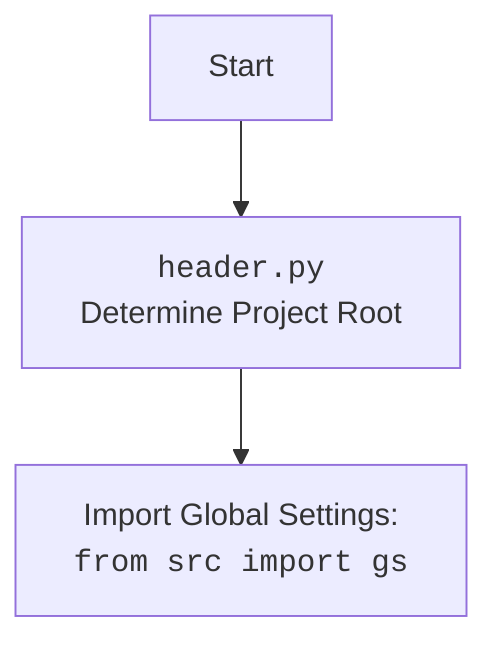

## АНАЛИЗ КОДА: `src/endpoints/advertisement/facebook/start_event.py`

### 1. <алгоритм>

**Блок-схема:**

```mermaid
graph LR
    A[Начало] --> B(Инициализация WebDriver);
    B --> C{Цикл "while True:"};
    C -- Да --> D(Логирование "waikig up");
    D --> E(Вызов promoter.run_events);
    E --> F(Логирование "going to sleep");
    F --> G(Пауза 7200 секунд);
    G --> C;
    C -- Нет(KeyboardInterrupt) --> H(Логирование "Campaign promotion interrupted.");
    H --> I[Конец];

    style A fill:#f9f,stroke:#333,stroke-width:2px
    style I fill:#f9f,stroke:#333,stroke-width:2px
    style C fill:#ccf,stroke:#333,stroke-width:2px

  subgraph "Пример работы 'run_events'"
  EE[Прочитать JSON файлы групп] --> FFF[Получить группы]
  FFF --> GGG{Цикл по группам}
  GGG -- Да --> HHH[Найти группу]
  HHH --> III[Найти элемент для постинга]
  III --> JJJ[Пост события]
  JJJ --> GGG
  GGG -- Нет --> KKK[Завершение цикла]
  end
  E --> EE
```

**Примеры:**

*   **Инициализация WebDriver:** Создание экземпляра `Driver` с использованием браузера `Chrome`. Устанавливается URL для Facebook.
*   **Цикл "while True:"**: Бесконечный цикл, пока не будет прерван `KeyboardInterrupt`.
*   **Логирование "waikig up"**: Запись в лог о начале работы цикла, с указанием текущего времени.
*   **Вызов `promoter.run_events`**: Вызов метода `run_events` объекта `FacebookPromoter`, передавая список имен событий и путей к файлам групп. Метод `run_events` прочитывает JSON-файлы с группами, отбирает подходящие и ищет соответствующий элемент для постинга события.
*   **Логирование "going to sleep"**: Запись в лог о завершении работы и переходе в режим сна, с указанием текущего времени.
*   **Пауза 7200 секунд**: Ожидание в течение 2 часов перед повторным выполнением цикла.
*   **Логирование "Campaign promotion interrupted."**: Запись в лог при прерывании цикла нажатием `Ctrl+C`.

### 2. <mermaid>

```mermaid
flowchart TD
    Start --> InitializeWebDriver[Инициализировать WebDriver: <br><code>d = Driver(Chrome)</code>];
    InitializeWebDriver --> GetFacebookURL[Открыть URL: <br><code>d.get_url("https://facebook.com")</code>];
    GetFacebookURL --> DefineFilenames[Определить имена файлов групп: <br><code>filenames</code>];
    DefineFilenames --> DefineExcludedFilenames[Определить исключенные файлы: <br><code>excluded_filenames</code>];
    DefineExcludedFilenames --> DefineEventsNames[Определить имена событий: <br><code>events_names</code>];
    DefineEventsNames --> CreatePromoter[Создать FacebookPromoter: <br><code>promoter = FacebookPromoter(...)</code>];
    CreatePromoter --> StartMainLoop[Начать бесконечный цикл: <br><code>while True:</code>];
    StartMainLoop --> LogWakeUp[Логирование: "waikig up" <br><code>logger.debug(...)</code>];
    LogWakeUp --> RunEvents[Запустить события: <br><code>promoter.run_events(...)</code>];
    RunEvents --> LogGoingToSleep[Логирование: "going to sleep" <br><code>logger.debug(...)</code>];
    LogGoingToSleep --> Sleep[Пауза 7200 секунд: <br><code>time.sleep(7200)</code>];
    Sleep --> StartMainLoop;
    StartMainLoop -- KeyboardInterrupt --> LogInterrupted[Логирование: "Campaign promotion interrupted." <br><code>logger.info(...)</code>];
    LogInterrupted --> End[Конец];
```

**Объяснение зависимостей `mermaid`:**

*   **`Start`**: Начало выполнения скрипта.
*   **`InitializeWebDriver`**: Инициализирует веб-драйвер (`Driver`) с использованием браузера Chrome.
*   **`GetFacebookURL`**: Открывает страницу Facebook в браузере, управляемом веб-драйвером.
*  **`DefineFilenames`**: Определяет список имен файлов JSON, содержащих информацию о группах Facebook.
*   **`DefineExcludedFilenames`**: Определяет список имен файлов, которые следует исключить из обработки.
*   **`DefineEventsNames`**: Определяет список имен событий, которые будут опубликованы в группах.
*   **`CreatePromoter`**: Создает экземпляр класса `FacebookPromoter`, который используется для публикации событий.
*   **`StartMainLoop`**: Начинает бесконечный цикл, в котором происходит публикация событий.
*   **`LogWakeUp`**: Логирует сообщение о начале работы цикла.
*   **`RunEvents`**: Вызывает метод `run_events` класса `FacebookPromoter` для публикации событий.
*   **`LogGoingToSleep`**: Логирует сообщение о переходе в режим сна после публикации событий.
*   **`Sleep`**: Приостанавливает выполнение скрипта на 7200 секунд (2 часа).
*   **`LogInterrupted`**: Логирует сообщение о прерывании работы цикла.
*   **`End`**: Конец выполнения скрипта.



### 3. <объяснение>

**Импорты:**

*   `from math import log`: Импортирует функцию `log` из модуля `math`. Эта функция используется для вычисления логарифмов, но в данном коде она не используется. Можно удалить этот импорт.
*   `import header`: Импортирует модуль `header`. Предположительно, это модуль для инициализации проекта, например, для определения корневой директории и загрузки глобальных настроек.
*   `import time`: Импортирует модуль `time` для работы со временем, в частности для добавления пауз (`time.sleep`) и форматирования текущего времени (`time.strftime`).
*   `from src.utils.jjson import j_loads`: Импортирует функцию `j_loads` из модуля `src.utils.jjson`. Эта функция используется для загрузки данных из JSON файлов.
*   `from src.webdriver.driver import Driver, Chrome`: Импортирует классы `Driver` и `Chrome` из модуля `src.webdriver.driver`. Класс `Driver` используется для создания экземпляра веб-драйвера, а `Chrome` указывает на использование браузера Chrome.
*   `from src.endpoints.advertisement.facebook import FacebookPromoter`: Импортирует класс `FacebookPromoter` из модуля `src.endpoints.advertisement.facebook`. Этот класс, предположительно, управляет процессом публикации событий в группах Facebook.
*   `from src.logger.logger import logger`: Импортирует объект `logger` из модуля `src.logger.logger`. Этот объект используется для записи сообщений в лог.

**Переменные:**

*   `filenames`: `list[str]` - список строк, представляющих имена JSON файлов, содержащих данные о группах Facebook.
*   `excluded_filenames`: `list[str]` - список строк, представляющих имена файлов групп, которые не следует обрабатывать.
*   `events_names`: `list` - список строк, представляющих имена событий, которые нужно опубликовать.
*   `d`: `Driver` - экземпляр класса `Driver`, представляющий веб-драйвер для управления браузером.
*   `promoter`: `FacebookPromoter` - экземпляр класса `FacebookPromoter`, используемый для публикации событий в группах Facebook.

**Классы:**

*   `Driver`: Класс из `src.webdriver.driver`, который инкапсулирует функциональность управления веб-браузером.
    *  **`get_url(url)`** - Метод открывает страницу по заданному URL.
*   `FacebookPromoter`: Класс из `src.endpoints.advertisement.facebook`, предназначенный для управления процессом публикации событий в группах Facebook.
    *   **`run_events(events_names, group_file_paths)`** - метод запускает процесс постинга заданных событий в группы.

**Функции:**

*   `time.sleep(seconds)`: Функция из модуля `time`, приостанавливающая выполнение скрипта на заданное количество секунд.
*   `time.strftime('%H:%M:%S')`: Функция из модуля `time`, возвращающая текущее время в формате "ЧЧ:ММ:СС".
*   `logger.debug(message, exception, need_print)`: Функция из модуля `src.logger.logger`, предназначенная для записи отладочных сообщений в лог.
*   `logger.info(message)`: Функция из модуля `src.logger.logger`, предназначенная для записи информационных сообщений в лог.
*  `j_loads(path)`: функция из модуля `src.utils.jjson`, предназначенная для чтения JSON-файла и преобразования его в объект Python.

**Потенциальные ошибки и области для улучшения:**

*   **Отсутствие обработки исключений:** Код обрабатывает только `KeyboardInterrupt`, но могут возникнуть другие исключения, например, при чтении файлов, взаимодействии с браузером или при публикации событий. Рекомендуется добавить более общую обработку исключений.
*   **Захардкоженные значения:** Имена файлов, имена событий и время сна жестко прописаны в коде. Лучше использовать конфигурационные файлы или переменные окружения для гибкости.
*   **Неиспользуемый импорт:** Импорт `from math import log` не используется и может быть удален.
*   **Цикл `while True`:** Бесконечный цикл может быть проблематичным, если нет возможности его корректно завершить (кроме как `KeyboardInterrupt`). Следует рассмотреть добавление более гибких механизмов управления циклом, например, на основе конфигурации или внешнего сигнала.
*   **Отсутствие явного закрытия драйвера:** Код не содержит явного закрытия веб-драйвера (`d.close()` или `d.quit()`). Это может привести к утечкам ресурсов. Рекомендуется закрывать драйвер после завершения работы.
*   **Неочевидные имена файлов:** Неочевидны назначения файлов в filenames. Нужна документация или комментарии.

**Взаимосвязь с другими частями проекта:**

*   `src.utils.jjson`: Используется для чтения JSON файлов.
*   `src.webdriver.driver`: Обеспечивает функциональность управления веб-браузером.
*   `src.endpoints.advertisement.facebook`: Содержит класс `FacebookPromoter`, который управляет процессом публикации событий в Facebook.
*   `src.logger.logger`: Обеспечивает функциональность логирования.
*   `header.py`: Загружает глобальные настройки и определяет корень проекта.