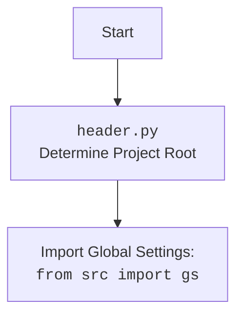

## <алгоритм>

1.  **Инициализация драйвера:**
    *   Создается экземпляр драйвера `Driver` с типом `Chrome`.
    *   Пример: `d = Driver(Chrome)`
    *   Драйвер переходит по адресу "https://facebook.com".
    *   Пример: `d.get_url(r"https://facebook.com")`
2.  **Инициализация списков файлов и кампаний:**
    *   Создается список `filenames`, содержащий имена файлов JSON с данными о группах Facebook.
        Пример: `filenames = ["usa.json", "he_ils.json", ...]`
    *   Создается список `excluded_filenames`, содержащий имена файлов, которые нужно исключить.
        Пример: `excluded_filenames = ["my_managed_groups.json", "ru_usd.json", ...]`
    *   Создается список `campaigns` с названиями рекламных кампаний.
        Пример: `campaigns = ['brands', 'mom_and_baby', ...]`
3.  **Инициализация промоутера:**
    *   Создается экземпляр `FacebookPromoter` с драйвером, списком файлов и флагом `no_video = True`.
    *   Пример: `promoter = FacebookPromoter(d, group_file_paths=filenames, no_video = True)`
4.  **Основной цикл продвижения:**
    *   Запускается бесконечный цикл `while True`.
    *   Внутри цикла запускаются рекламные кампании с помощью `promoter.run_campaigns()`, передавая списки кампаний и файлов групп.
        Пример: `promoter.run_campaigns(campaigns = copy.copy(campaigns), group_file_paths = filenames)`
    *   После запуска выводится сообщение о переходе в сон, включая текущее время.
        Пример: `print(f"Going sleep {time.localtime}")`
    *   Поток засыпает на 180 секунд.
        Пример: `time.sleep(180)`
    *   Цикл повторяется.
5.  **Обработка прерывания:**
    *   Если возникает `KeyboardInterrupt` (например, нажатие Ctrl+C), цикл прерывается.
    *   В этом случае в лог записывается сообщение об остановке продвижения.
        Пример: `logger.info("Campaign promotion interrupted.")`

## <mermaid>

```mermaid
flowchart TD
    Start[Start] --> DriverInit[Инициализация драйвера: <br><code>d = Driver(Chrome)</code>]
    DriverInit --> NavigateToFacebook[Переход на Facebook: <br><code>d.get_url("https://facebook.com")</code>]
    NavigateToFacebook --> InitFilesAndCampaigns[Инициализация списков файлов и кампаний: <br><code>filenames, excluded_filenames, campaigns</code>]
    InitFilesAndCampaigns --> PromoterInit[Инициализация промоутера: <br><code>promoter = FacebookPromoter(d, ...)</code>]
    PromoterInit --> CampaignLoop[Начало основного цикла]
    CampaignLoop --> RunCampaigns[Запуск кампаний: <br><code>promoter.run_campaigns(...)</code>]
    RunCampaigns --> Sleep[Сон: <br><code>time.sleep(180)</code>]
    Sleep --> CampaignLoop
    CampaignLoop --> InterruptCheck{Прерывание?}
    InterruptCheck -- Yes --> InterruptHandler[Обработка прерывания]
    InterruptCheck -- No --> RunCampaigns
    InterruptHandler --> End[Конец]
    
    
     subgraph src.webdriver.driver
        SD(Driver)
        SC(Chrome)
    end
    SD --> SC
   
     subgraph src.endpoints.advertisement.facebook
        FP(FacebookPromoter)
    end
    
     subgraph src.logger
        LL(logger)
    end
    PromoterInit-->FP
    InterruptHandler-->LL

```



## <объяснение>

**Импорты:**

*   `from math import log`: импортируется функция `log` из модуля `math`, но в данном коде она не используется. Возможно, это остаток от предыдущих итераций кода.
*   `import header`: импортируется модуль `header`, который, вероятно, содержит код для определения корня проекта, загрузки глобальных настроек и т.д.
*   `import time`: импортируется модуль `time`, используемый для управления временем (например, `time.sleep()`).
*   `import copy`: импортируется модуль `copy`, используемый для создания копии списка `campaigns`.
*   `from src.webdriver.driver import Driver, Chrome`: импортируются классы `Driver` и `Chrome` из модуля `src.webdriver.driver`, которые используются для управления веб-браузером.
*   `from src.endpoints.advertisement.facebook import FacebookPromoter`: импортируется класс `FacebookPromoter` из модуля `src.endpoints.advertisement.facebook`, который используется для управления процессом продвижения в Facebook.
*   `from src.logger.logger import logger`: импортируется объект `logger` из модуля `src.logger.logger`, который используется для логирования событий.

**Классы:**

*   `Driver(Chrome)`: класс `Driver` с типом `Chrome` управляет веб-браузером Chrome.
*   `FacebookPromoter`: класс `FacebookPromoter` инкапсулирует логику для продвижения контента в Facebook. Он принимает драйвер веб-браузера, список файлов JSON с данными о группах и другие параметры.

**Функции:**

*   `d.get_url(url)`: метод `get_url` класса `Driver` открывает указанный URL в веб-браузере.
*   `time.sleep(seconds)`: функция `sleep` из модуля `time` приостанавливает выполнение программы на заданное количество секунд.
*   `promoter.run_campaigns(campaigns, group_file_paths)`: метод `run_campaigns` класса `FacebookPromoter` запускает рекламные кампании. Он принимает списки кампаний и файлов групп.
*  `copy.copy(campaigns)`:  функция `copy` из модуля `copy`  создаёт копию списка `campaigns`, чтобы избежать случайного изменения оригинального списка при передаче в  `promoter.run_campaigns`.
*   `logger.info(message)`: метод `info` объекта `logger` записывает сообщение в лог.

**Переменные:**

*   `d`: экземпляр класса `Driver`.
*   `filenames`: список строк, представляющих имена файлов JSON.
*   `excluded_filenames`: список строк, представляющих имена файлов JSON, которые нужно исключить.
*   `campaigns`: список строк, представляющих названия рекламных кампаний.
*   `promoter`: экземпляр класса `FacebookPromoter`.

**Объяснение:**

Этот скрипт предназначен для автоматической публикации рекламных объявлений в группах Facebook. Он инициализирует веб-драйвер, загружает списки файлов и кампаний, затем запускает бесконечный цикл, в котором запускает рекламные кампании с заданными параметрами. Внутри цикла программа засыпает на 180 секунд, чтобы не нагружать систему и имитировать работу пользователя. Если пользователь прерывает выполнение программы нажатием Ctrl+C, то цикл прерывается и программа завершается.

**Потенциальные ошибки и области для улучшения:**

*   **Отсутствие обработки ошибок:** В коде отсутствует обработка возможных ошибок, таких как сбои при загрузке файлов JSON или сбои при работе с веб-драйвером. Это может привести к неожиданному завершению программы.
*   **Бесконечный цикл:** Бесконечный цикл `while True` может быть нежелателен в некоторых случаях. Следует предусмотреть механизмы для остановки цикла (например, через какое-то количество итераций или по достижении определенной даты).
*  **Зависимость от жестко заданных путей:** Список `filenames` с именами файлов JSON жестко закодирован. Лучше предусмотреть гибкий механизм для загрузки файлов, например, из папки или по конфигурации.
*   **Спящий режим:** Простой сон на 180 секунд может быть недостаточным. Возможно, следует использовать более гибкий подход, например, отслеживание нагрузки на систему или использование случайных промежутков времени.
*   **Обработка ошибок `FacebookPromoter`:** Непонятно как обрабатываются ошибки в `FacebookPromoter` классе, следует добавить обработку исключений из этого класса.

**Взаимосвязи с другими частями проекта:**

*   `src.webdriver.driver`: Этот модуль используется для управления веб-браузером, который является основой для взаимодействия с Facebook.
*   `src.endpoints.advertisement.facebook`: Этот модуль содержит класс `FacebookPromoter`, который реализует логику продвижения контента.
*   `src.logger.logger`: Этот модуль используется для логирования событий, что позволяет отслеживать работу программы и выявлять проблемы.
*  `header.py`:  Этот модуль используется для определения корня проекта и загрузки глобальных настроек.