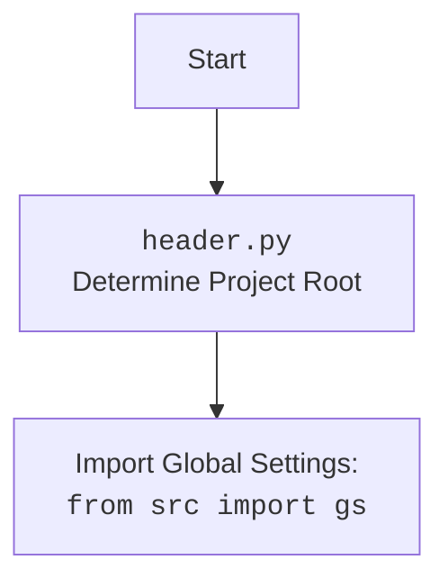

## ИНСТРУКЦИЯ:

Анализируй предоставленный код подробно и объясни его функциональность. Ответ должен включать три раздела:  

1.  **<алгоритм>**: Опиши рабочий процесс в виде пошаговой блок-схемы, включая примеры для каждого логического блока, и проиллюстрируй поток данных между функциями, классами или методами.
2.  **<mermaid>**: Напиши код для диаграммы в формате `mermaid`, проанализируй и объясни все зависимости,
    которые импортируются при создании диаграммы.
    **ВАЖНО!** Убедитесь, что все имена переменных, используемые в диаграмме `mermaid`,
    имеют осмысленные и описательные имена. Имена переменных вроде `A`, `B`, `C`, и т.д., не допускаются!

    **Дополнительно**: Если в коде есть импорт `import header`, добавьте блок `mermaid` flowchart, объясняющий `header.py`:
    ```mermaid
    flowchart TD
        Start --> Header[<code>header.py</code><br> Determine Project Root]

        Header --> import[Import Global Settings: <br><code>from src import gs</code>]
    ```

3.  **<объяснение>**: Предоставьте подробные объяснения:
    -   **Импорты**: Их назначение и взаимосвязь с другими пакетами `src.`.
    -   **Классы**: Их роль, атрибуты, методы и взаимодействие с другими компонентами проекта.
    -   **Функции**: Их аргументы, возвращаемые значения, назначение и примеры.
    -   **Переменные**: Их типы и использование.
    -   Выделите потенциальные ошибки или области для улучшения.

Дополнительно, постройте цепочку взаимосвязей с другими частями проекта (если применимо).

Это обеспечивает всесторонний и структурированный анализ кода.
## Формат ответа: `.md` (markdown)
**КОНЕЦ ИНСТРУКЦИИ**

## <алгоритм>

1.  **Инициализация:**
    *   Импортируются необходимые модули и классы, включая `header`, `copy`, `Driver`, `Chrome`, `FacebookPromoter`, и `logger`.
    *   Создается экземпляр `Driver` с использованием `Chrome` в качестве драйвера браузера.
    *   Открывается страница Facebook.
    *   Определяется список имен файлов `filenames` (в данном случае - `['my_managed_groups.json']`).
    *   Определяется список кампаний `campaigns`.
2.  **Создание промоутера:**
    *   Создается экземпляр класса `FacebookPromoter` с передачей ему драйвера, списка имен файлов и флага `no_video = True`.
3.  **Бесконечный цикл продвижения:**
    *   Начинается бесконечный цикл `while True`.
    *   Внутри цикла вызывается метод `run_campaigns` класса `FacebookPromoter`.
    *   В метод передаются копии списка кампаний и списка файлов.
    *   После вызова метода `run_campaigns` выполняется оператор `...`, что, вероятно, должно было быть каким-то ожиданием или паузой.
    *   Цикл продолжается до прерывания пользователем (клавиатурным прерыванием).
4.  **Обработка прерывания:**
    *   При получении `KeyboardInterrupt` (например, нажатие Ctrl+C) отлавливается исключение.
    *   В лог записывается сообщение "Campaign promotion interrupted."

## <mermaid>

```mermaid
flowchart TD
    Start[Start] --> Header[<code>header.py</code><br> Determine Project Root]
    Header --> ImportGS[Import Global Settings: <br><code>from src import gs</code>]

    ImportGS --> ImportModules[Import Modules: <br><code>import copy</code><br><code>from src.webdriver.driver import Driver, Chrome</code><br><code>from src.endpoints.advertisement.facebook.promoter import FacebookPromoter</code><br><code>from src.logger.logger import logger</code>]
    ImportModules --> CreateDriver[Create Driver Instance:<br><code>d = Driver(Chrome)</code>]
    CreateDriver --> OpenFacebook[Open Facebook:<br><code>d.get_url("https://facebook.com")</code>]
    OpenFacebook --> DefineFiles[Define Group Files:<br><code>filenames = ['my_managed_groups.json']</code>]
    DefineFiles --> DefineCampaigns[Define Campaigns:<br><code>campaigns = ['brands', 'mom_and_baby', ...]</code>]
    DefineCampaigns --> CreatePromoter[Create FacebookPromoter:<br><code>promoter = FacebookPromoter(d, filenames, no_video=True)</code>]
    CreatePromoter --> InfiniteLoop[Infinite Loop:<br><code>while True:</code>]
    InfiniteLoop --> RunCampaigns[Run Campaigns:<br><code>promoter.run_campaigns(campaigns=copy.copy(campaigns), group_file_paths=filenames)</code>]
    RunCampaigns --> Pause[...]
    Pause --> InfiniteLoop
    InfiniteLoop -- KeyboardInterrupt --> LogInterrupt[Log: "Campaign promotion interrupted."]
    LogInterrupt --> End[End]
```



**Анализ зависимостей:**

*   **`header.py`**: Модуль `header.py` используется для определения корневой директории проекта и импорта глобальных настроек, необходимых для работы приложения. Это позволяет использовать единые настройки во всем проекте.
*   **`copy`**: Модуль `copy` используется для создания поверхностной копии списка `campaigns` перед передачей его в метод `run_campaigns`. Это предотвращает случайное изменение исходного списка кампаний.
*   **`src.webdriver.driver`**: Из этого модуля импортируются классы `Driver` и `Chrome`. Класс `Driver` управляет браузером, а класс `Chrome` используется для создания экземпляра браузера Chrome.
*   **`src.endpoints.advertisement.facebook.promoter`**: Из этого модуля импортируется класс `FacebookPromoter`, который отвечает за выполнение рекламных кампаний в Facebook.
*   **`src.logger.logger`**: Из этого модуля импортируется объект `logger`, который используется для логирования событий в приложении.

## <объяснение>

**Импорты:**

*   **`import header`**: Импортирует модуль `header`, который, вероятно, используется для настройки окружения, например, для определения корневого каталога проекта и загрузки глобальных настроек. Это стандартный подход для больших проектов, чтобы избежать жесткого задания путей и настроек.
*   **`import copy`**: Импортирует модуль `copy`, используемый для создания копий объектов. Здесь он используется для создания копии списка `campaigns` перед передачей его в `run_campaigns`, что предотвращает изменение исходного списка.
*   **`from src.webdriver.driver import Driver, Chrome`**: Импортирует классы `Driver` и `Chrome` из модуля `src.webdriver.driver`. Класс `Driver` представляет собой абстракцию для управления веб-браузером, а `Chrome` - это конкретная реализация драйвера для браузера Chrome.
*   **`from src.endpoints.advertisement.facebook.promoter import FacebookPromoter`**: Импортирует класс `FacebookPromoter` из модуля `src.endpoints.advertisement.facebook.promoter`. Этот класс, вероятно, инкапсулирует логику для выполнения рекламных кампаний на Facebook.
*   **`from src.logger.logger import logger`**: Импортирует объект `logger` из модуля `src.logger.logger`. Объект `logger` используется для записи различных сообщений (информационных, ошибок и т. д.) в лог.

**Переменные:**

*   **`d = Driver(Chrome)`**: Создает экземпляр класса `Driver`, используя драйвер Chrome. Переменная `d` используется для управления браузером.
*   **`filenames: list = ['my_managed_groups.json',]`**: Список, содержащий имена файлов, которые, вероятно, содержат данные о группах Facebook. В текущем варианте содержит только имя файла `my_managed_groups.json`.
*   **`campaigns: list = ['brands', 'mom_and_baby', 'pain', 'sport_and_activity', 'house', 'bags_backpacks_suitcases', 'man']`**: Список кампаний, которые будут запущены. Каждая строка, скорее всего, соответствует типу или категории рекламной кампании.
*   **`promoter = FacebookPromoter(d, group_file_paths=filenames, no_video=True)`**: Создает экземпляр класса `FacebookPromoter`, передавая ему драйвер браузера, список файлов и параметр `no_video`.

**Классы:**

*   **`Driver`**: Класс, который управляет веб-браузером. Он предоставляет методы для навигации, взаимодействия с элементами страницы и т. д. Принимает драйвер браузера как аргумент (в данном случае `Chrome`).
*   **`Chrome`**: Класс, который создает экземпляр браузера Chrome и управляет им.
*   **`FacebookPromoter`**: Класс, который выполняет рекламные кампании в Facebook. Он принимает драйвер браузера, список файлов с данными о группах и параметр `no_video`, указывающий, использовать ли видео в рекламе. Метод `run_campaigns` запускает кампании.

**Функции:**

*   **`d.get_url(r"https://facebook.com")`**: Метод класса `Driver`, который открывает веб-страницу по указанному URL (в данном случае, главную страницу Facebook).
*   **`promoter.run_campaigns(campaigns=copy.copy(campaigns), group_file_paths=filenames)`**: Метод класса `FacebookPromoter`, запускающий рекламные кампании. Он принимает список кампаний и список файлов с данными о группах. Используется `copy.copy` для предотвращения изменения оригинального списка `campaigns`.
*   **`logger.info("Campaign promotion interrupted.")`**: Метод объекта `logger`, который записывает сообщение в лог. В данном случае, сообщение об остановке продвижения кампании.

**Потенциальные ошибки и области для улучшения:**

*   **Бесконечный цикл:** Бесконечный цикл `while True` может привести к бесконечной работе скрипта. Для более контролируемой работы, вероятно, стоит добавить условие выхода из цикла (например, по времени или по количеству итераций).
*   **Отсутствие обработки ошибок:** Код не обрабатывает возможные исключения, которые могут возникнуть во время работы браузера или при выполнении кампаний. Нужно добавить обработку исключений, чтобы предотвратить неожиданное завершение скрипта.
*   **Многоточие в цикле:** Использование `...` в цикле, вероятно, является опечаткой и требует замены на реальный код, например, `time.sleep()`, или другие действия.
*   **Отсутствие комментариев:** В коде мало комментариев, что затрудняет понимание его работы. Необходимо добавить комментарии для объяснения логики и назначения каждого блока.
*   **Жестко заданные значения:** Значения `filenames` и `campaigns` заданы жестко в коде. Лучше вынести их в конфигурационный файл или использовать аргументы командной строки.
*   **Предполагаемые файлы:** Наличие файла `my_managed_groups.json` предполагает, что пользователь заранее подготовил данные о группах. Необходимо предусмотреть возможность считывать эти данные и валидировать их.

**Взаимосвязи с другими частями проекта:**

*   **`src.webdriver.driver`**: Этот модуль обеспечивает управление браузером, необходимое для работы с веб-интерфейсом Facebook.
*   **`src.logger.logger`**: Модуль логирования используется для отслеживания работы скрипта и для упрощения отладки.
*   **`src.endpoints.advertisement.facebook.promoter`**: Этот модуль инкапсулирует всю логику работы с рекламными кампаниями, что позволяет отделить логику управления браузером от бизнес-логики.

Этот скрипт, по сути, представляет собой бесконечный цикл, который пытается запускать рекламные кампании в Facebook, используя заданные списки групп и категорий, что может требовать доработки в части обработки ошибок, условий выхода из цикла и гибкости параметров.