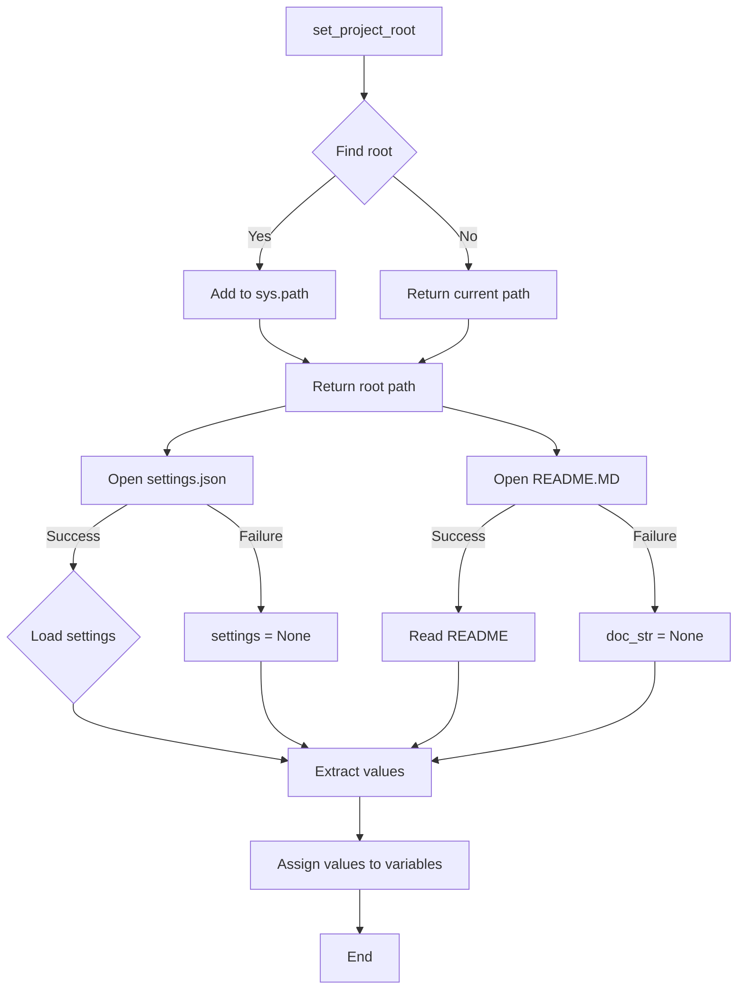

```MD
# <input code>

```python
## \file hypotez/src/endpoints/advertisement/header.py
# -*- coding: utf-8 -*-

#! venv/bin/python/python3.12

"""
.. module: src.endpoints.advertisement 
	:platform: Windows, Unix
	:synopsis:

"""


import sys
import json
from packaging.version import Version

from pathlib import Path
def set_project_root(marker_files=('__root__','.git')) -> Path:
    """
    Finds the root directory of the project starting from the current file's directory,
    searching upwards and stopping at the first directory containing any of the marker files.

    Args:
        marker_files (tuple): Filenames or directory names to identify the project root.
    
    Returns:
        Path: Path to the root directory if found, otherwise the directory where the script is located.
    """
    __root__:Path
    current_path:Path = Path(__file__).resolve().parent
    __root__ = current_path
    for parent in [current_path] + list(current_path.parents):
        if any((parent / marker).exists() for marker in marker_files):
            __root__ = parent
            break
    if __root__ not in sys.path:
        sys.path.insert(0, str(__root__))
    return __root__


# Get the root directory of the project
__root__ = set_project_root()
"""__root__ (Path): Path to the root directory of the project"""

from src import gs

settings:dict = None
try:
    with open(gs.path.root / 'src' /  'settings.json', 'r') as settings_file:
        settings = json.load(settings_file)
except (FileNotFoundError, json.JSONDecodeError):
    ...

doc_str:str = None
try:
    with open(gs.path.root / 'src' /  'README.MD', 'r') as settings_file:
        doc_str = settings_file.read()
except (FileNotFoundError, json.JSONDecodeError):
    ...


__project_name__ = settings.get("project_name", 'hypotez') if settings  else 'hypotez'
__version__: str = settings.get("version", '')  if settings  else ''
__doc__: str = doc_str if doc_str else ''
__details__: str = ''
__author__: str = settings.get("author", '')  if settings  else ''
__copyright__: str = settings.get("copyrihgnt", '')  if settings  else ''
__cofee__: str = settings.get("cofee", "Treat the developer to a cup of coffee for boosting enthusiasm in development: https://boosty.to/hypo69")  if settings  else "Treat the developer to a cup of coffee for boosting enthusiasm in development: https://boosty.to/hypo69"
```

# <algorithm>

**Шаг 1:**  Функция `set_project_root` ищет корневую директорию проекта. Начинает поиск с текущей директории файла и движется вверх по дереву каталогов.

**Пример:** Если скрипт находится в `hypotez/src/endpoints/advertisement/header.py`, поиск будет начинаться с `hypotez/src/endpoints/advertisement` и идти вверх к `hypotez`, и останавливается на первом каталоге, содержащем `pyproject.toml`, `requirements.txt` или `.git`.

**Шаг 2:** `set_project_root` добавляет найденную корневую директорию в `sys.path` для корректного импорта модулей из проекта.

**Шаг 3:** Считываются настройки из `gs.path.root / 'src' / 'settings.json'`, если файл существует.

**Шаг 4:** Считывается README из `gs.path.root / 'src' / 'README.MD'`, если файл существует.

**Шаг 5:** Извлекаются значения из `settings` (если оно не пустое) или задаются значения по умолчанию для переменных `__project_name__`, `__version__`, `__doc__`, `__author__`, `__copyright__`, `__cofee__`.


# <mermaid>



**Объяснение диаграммы:**

* `set_project_root`: Функция поиска корневой директории проекта.
* `Find root`: Поиск родительских директорий, проверяющих наличие `marker_files`.
* `Add to sys.path`: Добавляет найденную директорию в пути поиска модулей Python.
* `Load settings`: Загружает данные из файла `settings.json` с помощью `json.load`.
* `Extract values`: Извлекает нужные ключи из загруженных данных.
* `Read README`: Читает файл `README.MD` в переменную `doc_str`.
* `Assign values to variables`: Присваивает значения из настроек к переменным проекта.
* `settings = None`:  Обрабатывает случай, когда файл `settings.json` не найден или повреждён.
* `doc_str = None`:  Обрабатывает случай, когда файл `README.MD` не найден или повреждён.

# <explanation>

**Импорты:**

* `sys`: Для работы со стандартным вводом/выводом и путём поиска модулей.
* `json`: Для работы с файлами JSON.
* `packaging.version`: Для работы с версиями пакетов.
* `pathlib`: Для работы с путями файлов и директорий.
* `src.gs`: Модуль, содержащий информацию о путях к файлам проекта. (зависимость)

**Классы:**

Код не содержит классов.

**Функции:**

* `set_project_root(marker_files=...)`: Находит корневую директорию проекта, начиная от текущего файла.  Возвращает `Path` объект к корневой директории или директорию текущего скрипта. Аргумент `marker_files` позволяет указать файлы/каталоги для поиска корня проекта.

**Переменные:**

* `MODE`, `__root__`, `settings`, `doc_str`: Общедоступные переменные, используемые для работы скрипта.

**Возможные ошибки и улучшения:**

* **Обработка ошибок:** Код обрабатывает исключения `FileNotFoundError` и `json.JSONDecodeError`. Это важно для предотвращения аварийных остановок приложения при отсутствии или некорректном формате файлов.
* **Ясность кода:** Переменные `__root__`, `__project_name__`, `__version__`, `__doc__`, `__author__`, `__copyright__`, `__cofee__` следуют соглашению об именовании.
* **Документация:** Документация PythonDocstyle задаёт корректный стиль кода.


**Цепочка взаимосвязей:**

Этот файл `header.py` использует модуль `gs` из `src` для получения пути к корневой директории проекта. Это указывает на то, что `gs` должен быть частью проекта и определять пути к файлам.  Файлы `settings.json` и `README.MD` должны находиться в корне проекта. Скрипт находит и обрабатывает данные, необходимые для работы всего приложения.  Таким образом, этот код является частью более крупной системы, где эти данные используются для настройки или отображения информации.