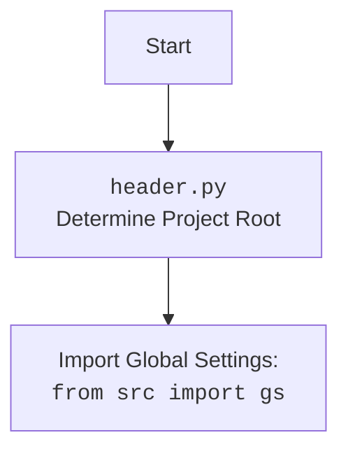

## ИНСТРУКЦИЯ:

Анализируй предоставленный код подробно и объясни его функциональность. Ответ должен включать три раздела:  

1. **<алгоритм>**: Опиши рабочий процесс в виде пошаговой блок-схемы, включая примеры для каждого логического блока, и проиллюстрируй поток данных между функциями, классами или методами.  
2. **<mermaid>**: Напиши код для диаграммы в формате `mermaid`, проанализируй и объясни все зависимости, 
    которые импортируются при создании диаграммы. 
    **ВАЖНО!** Убедитесь, что все имена переменных, используемые в диаграмме `mermaid`, 
    имеют осмысленные и описательные имена. Имена переменных вроде `A`, `B`, `C`, и т.д., не допускаются!  
    
    **Дополнительно**: Если в коде есть импорт `import header`, добавьте блок `mermaid` flowchart, объясняющий `header.py`:\
    ```mermaid
    flowchart TD
        Start --> Header[<code>header.py</code><br> Determine Project Root]
    
        Header --> import[Import Global Settings: <br><code>from src import gs</code>] 
    ```

3. **<объяснение>**: Предоставьте подробные объяснения:  
   - **Импорты**: Их назначение и взаимосвязь с другими пакетами `src.`.  
   - **Классы**: Их роль, атрибуты, методы и взаимодействие с другими компонентами проекта.  
   - **Функции**: Их аргументы, возвращаемые значения, назначение и примеры.  
   - **Переменные**: Их типы и использование.  
   - Выделите потенциальные ошибки или области для улучшения.  

Дополнительно, постройте цепочку взаимосвязей с другими частями проекта (если применимо).  

Это обеспечивает всесторонний и структурированный анализ кода.
## Формат ответа: `.md` (markdown)
**КОНЕЦ ИНСТРУКЦИИ**

### <алгоритм>
1. **Начало**:
   -  Исполнение скрипта начинается с определения пути к текущему файлу и инициализации переменной `__root__`.
   -  *Пример*: Если текущий файл находится в `/home/user/project/src/endpoints/advertisement/header.py`, то `current_path` будет `/home/user/project/src/endpoints/advertisement`.

2. **Определение корня проекта (функция `set_project_root`):**
   - Функция `set_project_root` получает список `marker_files` (по умолчанию `("__root__",".git")`).
   - Проверяется наличие этих файлов в текущей директории и ее родительских директориях.
   - Если один из этих файлов найден, то родительская директория, где он был найден, становится корнем проекта (`__root__`).
   - *Пример*: Если в `/home/user/project/` есть файл `.git`, то `__root__` будет `/home/user/project/`.
   -  Если не найдено ни одного файла, то корнем проекта будет считаться директория, в которой расположен данный файл.
   - После определения, путь корня проекта добавляется в `sys.path` для корректной работы импортов.

3. **Импорт глобальных настроек:**
    - После определения корня проекта импортируется глобальная конфигурация `from src import gs`
    -  Переменная `gs`  используется для получения доступа к настройкам проекта.

4. **Загрузка настроек из файла `settings.json`:**
   -  Пытается открыть файл `settings.json` который находится в директории `src` корня проекта.
   -  Если файл успешно открыт, то данные из файла загружаются в переменную `settings` как словарь `dict` с помощью `json.load()`.
   - *Пример*: `settings.json` содержит `{"project_name": "hypotez", "version": "1.0.0"}`, тогда `settings` будет `{"project_name": "hypotez", "version": "1.0.0"}`.
   -  Если файл не найден или возникла ошибка `json.JSONDecodeError`, то `settings` остается `None`.

5. **Загрузка README.MD:**
    - Аналогично загрузке настроек, производится попытка открытия и чтения файла `README.MD` в корень проекта.
    - Если файл найден, его содержимое загружается в переменную `doc_str`
     - Если файл не найден или возникла ошибка `json.JSONDecodeError`, то `doc_str` остается `None`.

6. **Извлечение данных из настроек или установка значений по умолчанию:**
   - Извлекаются значения из словаря `settings` (если он не равен `None`) или используются значения по умолчанию.
    - `__project_name__`: Название проекта (из ключа `project_name` или 'hypotez').
    - `__version__`: Версия проекта (из ключа `version` или '').
    - `__doc__`: Содержимое README.MD (из переменной `doc_str` или '').
    - `__details__`: Детали проекта (по умолчанию '').
    - `__author__`: Автор проекта (из ключа `author` или '').
    - `__copyright__`: Авторские права (из ключа `copyrihgnt` или '').
    - `__cofee__`: Строка, призывающая угостить разработчика кофе (из ключа `cofee` или "Treat the developer to a cup of coffee for boosting enthusiasm in development: https://boosty.to/hypo69").
   -  *Пример*: Если `settings = {"project_name": "MyProject", "version": "1.2.3", "author": "John Doe"}`, то `__project_name__` станет "MyProject", `__version__` станет "1.2.3", `__author__` станет "John Doe".

### <mermaid>
```mermaid
flowchart TD
    Start --> FindRoot[<code>set_project_root()</code><br> Determine Project Root]
    
    FindRoot -- "Project Root Found" --> SetRootPath[Set __root__ variable];
    FindRoot -- "Project Root Not Found" --> SetCurrentPathRoot[Set Current File Path as __root__]
    SetRootPath --> AddSysPath[Add __root__ to sys.path]
    SetCurrentPathRoot --> AddSysPath
    
    AddSysPath --> ImportGS[Import Global Settings: <br><code>from src import gs</code>]
    
    ImportGS --> LoadSettings[Load Settings from <code>settings.json</code>]
    LoadSettings -- "Settings Loaded" --> LoadDoc[Load Doc from <code>README.MD</code>]
    LoadSettings -- "Settings Load Failed" --> LoadDoc

    LoadDoc -- "Doc Loaded" -->  SetProjectInfo[Set Project Info Variables]
    LoadDoc -- "Doc Load Failed" -->  SetProjectInfo
    
    SetProjectInfo --> End[End]


    style FindRoot fill:#f9f,stroke:#333,stroke-width:2px
    style SetRootPath fill:#ccf,stroke:#333,stroke-width:2px
    style SetCurrentPathRoot fill:#ccf,stroke:#333,stroke-width:2px
    style AddSysPath fill:#ccf,stroke:#333,stroke-width:2px
    style ImportGS fill:#aaf,stroke:#333,stroke-width:2px
    style LoadSettings fill:#aaf,stroke:#333,stroke-width:2px
    style LoadDoc fill:#aaf,stroke:#333,stroke-width:2px
    style SetProjectInfo fill:#ccf,stroke:#333,stroke-width:2px
    
```



**Описание диаграммы:**

1.  **Start**: Начало выполнения скрипта.
2.  **FindRoot**: Вызов функции `set_project_root()` для определения корня проекта.
3.  **SetRootPath**: Установка переменной `__root__` в найденный корень проекта.
4.  **SetCurrentPathRoot**: Установка переменной `__root__` в директорию файла, если корень не найден.
5.  **AddSysPath**: Добавление пути к корню проекта в `sys.path`.
6.  **ImportGS**: Импорт глобальных настроек из `src import gs`.
7.  **LoadSettings**: Загрузка настроек из файла `settings.json`.
8.  **LoadDoc**: Загрузка контента из файла `README.MD`.
9. **SetProjectInfo**: Задание переменных проекта (`__project_name__`, `__version__`, `__doc__`, `__details__`, `__author__`, `__copyright__`, `__cofee__`).
10. **End**: Завершение выполнения скрипта.
### <объяснение>
**Импорты:**

-   `sys`: Используется для работы с системными параметрами и функциями, в частности, для добавления пути к корню проекта в `sys.path`. Это позволяет импортировать модули из этого проекта.
-   `json`: Используется для загрузки данных из файла `settings.json`, который представляет собой JSON-файл, содержащий настройки проекта.
-   `packaging.version.Version`: Используется для работы с версиями программного обеспечения.
-   `pathlib.Path`:  Используется для работы с путями к файлам и директориям, обеспечивая кроссплатформенную совместимость.

**Функции:**
-   `set_project_root(marker_files=('__root__', '.git')) -> Path`:
    -   **Аргументы:**
        - `marker_files` (tuple): Кортеж строк, представляющих названия файлов или директорий, которые могут использоваться для определения корня проекта. По умолчанию `("__root__",".git")`.
    -   **Возвращаемое значение:**
        - `Path`: Объект `pathlib.Path`, представляющий путь к корню проекта.
    -   **Назначение:**
        - Функция рекурсивно ищет родительские директории, пока не найдет один из `marker_files`. Возвращает путь к директории, где был найден маркер. Если маркер не найден, то возвращает путь к директории, где находится файл скрипта.
    -   **Пример:**
        - Если `marker_files` = `("__root__",".git")` и корень проекта находится в `/home/user/my_project/` где присутствует `.git` , то функция вернет `Path('/home/user/my_project/')`.

**Переменные:**
- `__root__` (Path): Глобальная переменная, хранящая путь к корню проекта. Определяется с помощью функции `set_project_root()`.
- `settings` (dict): Глобальная переменная, хранящая словарь с настройками проекта, загруженный из `settings.json`. Может быть `None`, если файл не найден или произошла ошибка при чтении.
- `doc_str` (str): Глобальная переменная, хранящая строку с содержимым из файла `README.MD`. Может быть `None`, если файл не найден.
- `__project_name__` (str):  Название проекта. По умолчанию 'hypotez' или значение из `settings`.
- `__version__` (str): Версия проекта. По умолчанию пустая строка, или значение из `settings`.
- `__doc__` (str): Документация проекта, как правило, содержимое `README.MD`, или пустая строка.
- `__details__` (str): Детали проекта. По умолчанию пустая строка.
- `__author__` (str): Автор проекта. По умолчанию пустая строка, или значение из `settings`.
- `__copyright__` (str): Авторские права. По умолчанию пустая строка, или значение из `settings`.
- `__cofee__` (str): Строка с приглашением угостить разработчика кофе. По умолчанию строка "Treat the developer to a cup of coffee for boosting enthusiasm in development: https://boosty.to/hypo69" или значение из `settings`.

**Взаимосвязь с другими частями проекта:**

-   `src.gs`: Этот импорт указывает на то, что данный модуль взаимодействует с глобальными настройками проекта, которые, вероятно, определены в другом модуле. Переменная `gs` из `src`  используется для доступа к глобальным путям и настройкам.
-   `settings.json` и `README.MD` : Данные файлы являются важными частями проекта и влияют на инициализацию проекта и получения информации о нем.

**Потенциальные ошибки и области для улучшения:**

-   **Обработка исключений**: Используется `try/except` для обработки `FileNotFoundError` и `json.JSONDecodeError`, но обработка исключений довольно поверхностная (`...`). Можно добавить логирование ошибок или более детальную обработку.
-   **Зависимость от `settings.json`**: Весь код сильно зависит от наличия и корректности файла `settings.json`. Отсутствие файла или некорректный JSON может привести к проблемам.
-   **Магические строки**: Использование строк `'src'` и `'settings.json'` в коде не является лучшей практикой, лучше использовать константы или переменные.
-   **Жестко заданные маркеры**: Маркерные файлы `("__root__",".git")` могут быть недостаточными для некоторых проектов. Можно было бы сделать их настраиваемыми через переменную окружения или файл конфигурации.
-  **Устаревший shebang**: `#! venv/bin/python/python3.12` указывает на конкретную версию Python и путь к ней. Обычно используется `#!/usr/bin/env python3` для портативности.

**Цепочка взаимосвязей:**

1.  `header.py` → `set_project_root` → `sys.path`
2.  `header.py` → `src.gs` → `settings.json`
3.  `header.py` → `settings.json`
4. `header.py` --> `README.MD`
5. `header.py` --> другие модули через `__project_name__`, `__version__`, `__doc__` ...

**Итог:**
Код отвечает за определение корня проекта, загрузку настроек из `settings.json`, и предоставление базовой информации о проекте в глобальных переменных. Код написан с учетом обработки возможных ошибок, но требует некоторой доработки для лучшей надежности и гибкости.