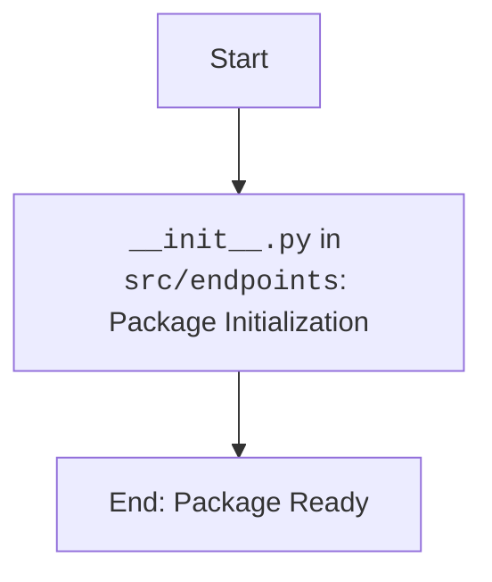

## АНАЛИЗ КОДА: `hypotez/src/endpoints/__init__.py`

### 1. <алгоритм>

Данный файл `__init__.py` в директории `src/endpoints` является файлом инициализации пакета Python. В настоящее время он содержит только комментарии и не импортирует никаких модулей или классов. Это означает, что при импорте пакета `src.endpoints` никаких дополнительных действий не производится, кроме как объявление директории пакетом.

**Пример:**
1.  Импорт `src.endpoints` в другом модуле.
    ```python
    from src import endpoints
    ```
    В этом случае, импорт `endpoints` выполнится, но никакие переменные или классы из этого файла не будут доступны, так как файл пуст.
   
### 2. <mermaid>


**Объяснение диаграммы:**
- `Start`: Начало процесса.
- `Init`: Инициализация пакета. Файл `__init__.py` в `src/endpoints` объявляет эту директорию как пакет Python. На данном этапе в коде нет никакого импорта, только комментарии.
- `End`: Пакет инициализирован и готов к использованию.

### 3. <объяснение>

**Импорты:**

*   В текущей версии файла нет импортов. Закомментированные строки
    `# from .prestashop import ...`
    и
    `# from .kazarinov import KazarinovTelegramBot`
    указывают на потенциальные импорты из подмодулей `prestashop` и `kazarinov` в рамках `src.endpoints`. Если раскомментировать эти строки, они бы импортировали классы и модули из соответствующих файлов.

**Классы:**

*   В текущей версии файла нет классов. Но закомментированные строки
    `# from .prestashop import PrestaShop, PrestaCategory, PrestaCustomer, PrestaLanguage, PrestaProduct, PrestaShopShop, PrestaSupplier, PrestaWarehouse, PriceListRequester`
    предполагают наличие классов для работы с PrestaShop API (модуль `prestashop`)
    
     `# from .kazarinov import KazarinovTelegramBot`
    предполагают наличие класса для работы с Telegram API.

**Функции:**
*   В текущей версии файла нет функций.

**Переменные:**

*   В текущей версии файла нет переменных.

**Общие замечания:**
1.  **Файл инициализации пакета:** Файл `__init__.py` необходим, чтобы Python распознавал директорию `src/endpoints` как пакет.
2.  **Отсутствие кода:** На данный момент, файл почти пуст, что означает, что пакет `src.endpoints` сам по себе не выполняет никаких действий.
3.  **Потенциал расширения:** Закомментированный код намекает на будущую функциональность: взаимодействие с PrestaShop и Telegram.
4.  **Цепочка взаимосвязей:** Этот пакет (если раскомментировать импорты) будет связан с пакетами `src.endpoints.prestashop` и `src.endpoints.kazarinov`.
5. **Потенциальные ошибки/области для улучшения:** Отсутствие явного импорта или кода в `__init__.py` может привести к ошибкам если предполагается, что данный пакет что-то делает. Необходимо раскомментировать нужный код и убедиться, что соответствующие модули существуют и корректны.