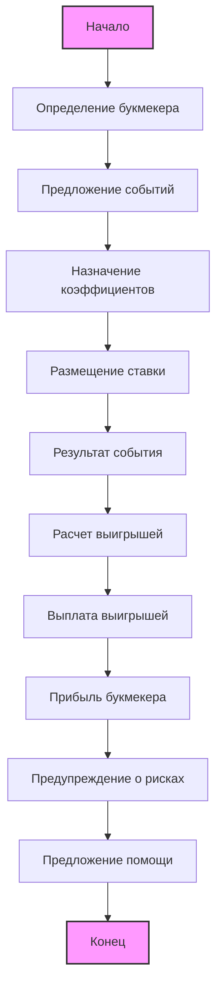

## Анализ кода

### <алгоритм>
Представленный код не является программным кодом, а представляет собой текстовое описание работы букмекерских контор на русском языке в формате Markdown. Поэтому алгоритм здесь будет описывать логику этого текста:

1. **Начало:** Текст начинается с объяснения того, кто такой букмекер.
2. **Определение букмекера:** Определяется, что букмекер — это человек или компания, принимающая ставки на события.
3. **Принцип работы:** 
    - Описывается, что букмекер предлагает события для ставок (например, спортивные матчи).
    - Каждому исходу события присваивается коэффициент, отражающий его вероятность.
    - Игрок делает ставку на выбранный исход.
    - После завершения события букмекер подсчитывает и выплачивает выигрыши.
4. **Мотивация букмекеров:** Описывается, как букмекеры зарабатывают на разнице между вероятностями и коэффициентами.
5. **Предупреждения:** Подчеркиваются риски, связанные с азартными играми, и важность ответственной игры.
6. **Предложение помощи:** Предлагается предоставить дополнительную информацию о ставках и ответить на вопросы.
7. **Заключение:** Призыв к ответственной игре.

**Примеры:**
* **Событие:** Футбольный матч между командами "A" и "B".
* **Коэффициент:** Коэффициент на победу команды "A" - 2.0, на победу команды "B" - 3.5, на ничью - 3.2.
* **Ставка:** Игрок делает ставку в 100 рублей на победу команды "A".
* **Результат:** Если команда "A" выигрывает, игрок получает 200 рублей (100 * 2.0). Если выигрывает команда "B" или ничья, игрок проигрывает ставку.

### <mermaid>

**Объяснение:**

1.  `Start`: Начало процесса.
2.  `DefineBookmaker`: Определение понятия букмекера.
3.  `EventOffer`: Букмекер предлагает различные события для ставок.
4.  `AssignOdds`: Каждому исходу события назначается коэффициент.
5.  `PlaceBet`: Игрок размещает ставку на выбранный исход.
6.  `EventResult`: Происходит событие и определяется результат.
7.  `CalculateWinnings`: Букмекер рассчитывает выигрыши на основе ставок и результатов.
8.  `PayWinnings`: Букмекер выплачивает выигрыши игрокам.
9.  `BookmakerProfit`: Букмекер получает прибыль за счет правильно рассчитанных коэффициентов.
10. `RiskWarning`: Предупреждение о рисках, связанных с азартными играми.
11. `OfferHelp`: Предложение дополнительной помощи и ответов на вопросы.
12. `End`: Конец процесса.

### <объяснение>
**Импорты**: В данном коде нет импортов, так как это не программный код, а текстовое описание.
**Классы**: В данном коде нет классов, так как это не программный код, а текстовое описание.
**Функции**: В данном коде нет функций, так как это не программный код, а текстовое описание.
**Переменные**: В данном коде нет переменных, так как это не программный код, а текстовое описание.

**Детальное объяснение:**
Данный текст представляет собой вводное объяснение работы букмекерских контор. Он рассказывает о том, что такое букмекер, как они работают, на чем зарабатывают и какие риски связаны со ставками на спорт.

*   **Разделы**: Текст разделен на несколько логических секций:
    *   Введение в понятие букмекера.
    *   Описание процесса приема ставок, включая события, коэффициенты, ставки, результаты и выплаты.
    *   Объяснение, как букмекеры получают прибыль.
    *   Предупреждение о рисках и необходимости ответственной игры.
    *   Предложение дополнительной помощи и ответов на вопросы.

*   **Цель**: Текст предназначен для ознакомления пользователей с основными принципами работы букмекеров, чтобы они могли понять, как это работает, и делать осознанные решения.

**Потенциальные ошибки и области для улучшения:**

*   **Отсутствие конкретики**: Текст дает общее представление, но не вдается в детали. Например, можно было бы объяснить, как рассчитываются коэффициенты, какие типы ставок бывают, и т.д.
*   **Упрощенное объяснение**: Описание работы букмекеров немного упрощено. В реальной жизни это гораздо более сложный процесс, включающий анализ данных, математические модели и управление рисками.
*   **Нет ссылок на внешние ресурсы**: Можно было бы добавить ссылки на сайты, предоставляющие дополнительную информацию о ставках, правилах и т.д.

**Взаимосвязь с другими частями проекта:**

В данном случае, поскольку это текстовый файл, он не имеет прямых взаимосвязей с программными компонентами проекта. Однако, он может быть частью раздела "О проекте" или "Справка" в веб-приложении, связанном с букмекерской тематикой, предоставляя вводную информацию для пользователей.