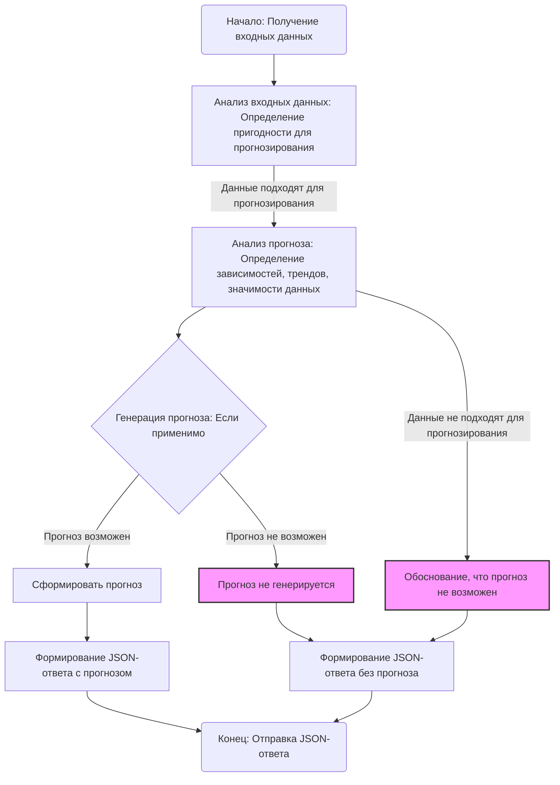

## АНАЛИЗ КОДА:

### 1. <алгоритм>

**Описание рабочего процесса:**
Данный код представляет собой текстовое описание промпта для модели машинного обучения, специализирующейся на анализе входных данных с целью определения их пригодности для прогнозирования. Алгоритм, описанный в промпте, можно представить в виде следующей пошаговой блок-схемы:

1.  **Начало:**
    -   Модель получает на вход данные в текстовом или числовом формате.
    -   *Пример*:
        - `[12, 14, 15, 20, 25, ...]`: Временной ряд чисел.
        -  `Таблица с датами, продажами и категориями`: Структурированные данные.
        - `Текстовое описание с метаданными`: Неструктурированные данные.

2.  **Анализ входных данных:**
    -   Модель анализирует полученные данные, чтобы определить их пригодность для прогнозирования.
        -   *Пример*:
            -   Анализ временного ряда на наличие трендов или сезонности.
            -   Анализ табличных данных на наличие зависимостей между столбцами.
            -   Анализ текстовых описаний на наличие прогностически значимой информации.
    -   Проверка на наличие паттернов, трендов, и возможность прогнозировать.

3. **Принятие решения о прогнозировании:**
    -   Если данные подходят для прогнозирования, модель переходит к следующему шагу, иначе переходит к шагу 6.
    - *Пример*:
        - Временной ряд с выраженным трендом подходит для прогнозирования.
        - Случайный набор чисел без видимой структуры не подходит для прогнозирования.

4. **Анализ прогноза:**
    -   Модель выполняет анализ прогноза, включая:
        -   Определение возможных зависимостей или трендов.
        -   Оценку значимости данных для прогноза.
        -   *Пример*:
            - Определение тренда в продажах за последние месяцы, анализ взаимосвязи продаж и категорий.
            - Оценка значимости временного ряда для предсказания будущих значений.

5. **Формирование прогноза (если применимо):**
    -   Модель формирует примерный прогноз на основе анализа.
    - *Пример*:
        - Прогноз значений временного ряда на следующий период.
        -  Прогноз будущих продаж на основе выявленных трендов и зависимостей.

6.  **Формирование ответа:**
    -   Модель формирует JSON-ответ в соответствии с заданным форматом.
    -   *Пример*:
    ```json
    {
      "is_forecastable": true,
      "analysis": {
        "patterns_detected": "описание выявленных паттернов",
        "trend": "описание тренда (если применимо)",
        "forecast_period": "период, на который можно прогнозировать (если применимо)"
      },
      "forecast": "примерный прогноз, если возможно, иначе null"
    }
    ```
    -   *Пример (если прогноз невозможен)*:
    ```json
    {
      "is_forecastable": false,
      "analysis": {
        "reason": "Недостаточно данных или структура данных не подходит для прогнозирования"
      },
      "forecast": null
    }
    ```

7.  **Конец:**
    -   Модель возвращает сформированный JSON-ответ.

### 2. <mermaid>



**Анализ зависимостей `mermaid`:**
-   Диаграмма `mermaid` использует синтаксис `flowchart TD` для определения блок-схемы.
-   `-->` обозначает поток данных или последовательность операций.
-   `Start`, `End` - начало и конец процесса.
-   `AnalyzeData`, `ForecastAnalysis`, `GenerateForecast`, `ForecastGenerated`, `NotForecastable`, `NoForecast`, `FormatResponse`, `FormatResponseNoForecast` - это узлы, представляющие шаги алгоритма.
-   Фигурные скобки (`{}`) обозначают узлы принятия решений.
-   `classDef notForecastable` и `class NotForecastable,NoForecast notForecastable` используются для стилизации некоторых блоков, например, чтобы выделить блоки где прогноз не возможен.
-   Стрелки `-->` показывают поток управления от одного шага к другому.
-   Подписи на стрелках и узлах описывают логику работы алгоритма.
-   Имена переменных:
    -   `Start`: Начало процесса.
    -   `AnalyzeData`: Блок анализа входных данных.
    -   `ForecastAnalysis`: Блок анализа прогноза.
    -   `GenerateForecast`: Блок принятия решения о генерации прогноза.
    -   `ForecastGenerated`: Блок генерации прогноза.
    -   `NotForecastable`: Блок для обоснования, что прогноз не возможен.
    -   `NoForecast`: Блок для случая, когда прогноз не генерируется.
    -   `FormatResponse`: Блок форматирования JSON-ответа с прогнозом.
    -   `FormatResponseNoForecast`: Блок форматирования JSON-ответа без прогноза.
    -   `End`: Конец процесса.
### 3. <объяснение>

**Импорты:**
В представленном коде нет импортов. Это не код Python, а текстовое описание промпта для модели машинного обучения.

**Классы:**
В представленном коде нет классов, так как это текстовое описание, а не программный код.

**Функции:**
В данном тексте нет функций, так как это описание промпта, а не код. Промпт описывает последовательность действий, которые должна выполнить модель, но не описывает конкретные функции.

**Переменные:**
В представленном коде нет явных переменных. Вместо этого, промпт использует описательные фразы и JSON-структуру для определения форматов входных и выходных данных. Можно выделить следующие концептуальные "переменные":

*   `входные данные`: Данные в текстовом или числовом формате, которые предоставляются модели для анализа.
*   `is_forecastable`: Булева переменная, указывающая, возможно ли прогнозирование ( `true` или `false`).
*   `analysis`: Объект, содержащий информацию о проведенном анализе.
    *   `patterns_detected`: Описание выявленных паттернов.
    *   `trend`: Описание тренда (если применимо).
    *   `forecast_period`: Период, на который можно прогнозировать (если применимо).
    *   `reason`: Причина, почему прогнозирование невозможно.
*   `forecast`:  Примерный прогноз (если применимо) или `null`.

**Объяснение:**
Этот текст представляет собой промпт, то есть инструкцию для модели машинного обучения, чтобы она могла выполнить анализ входных данных на возможность прогнозирования. Основные моменты:

1.  **Анализ данных:** Модель должна определить, возможно ли использовать предоставленные данные для прогнозирования. Это включает анализ структуры данных, обнаружение паттернов, трендов и т.д.

2.  **Анализ прогноза:** Если данные пригодны для прогнозирования, модель должна провести более глубокий анализ, включая выявление зависимостей, оценку значимости данных и, если это возможно, формирование примера прогноза.

3.  **Формат ответа:** Ответ должен быть в формате JSON, содержащем информацию о том, возможен ли прогноз (`is_forecastable`), результаты анализа (`analysis`) и сам прогноз (если это возможно).

4.  **Разнообразие входных данных:** Промпт охватывает различные типы входных данных, такие как временные ряды, структурированные таблицы и текстовые описания. Это указывает на необходимость адаптации модели к различным форматам.

5.  **Обработка ошибок:** Модель должна уметь обрабатывать случаи, когда входные данные не пригодны для прогнозирования, и возвращать соответствующий ответ с указанием причины.

**Потенциальные ошибки и улучшения:**

1.  **Неоднозначность анализа:** Промпт может быть интерпретирован по-разному, что может привести к неоднородным результатам. Было бы полезно уточнить, какие конкретно методы анализа и критерии пригодности данных нужно использовать.
2.  **Отсутствие примеров:** Было бы полезно добавить больше примеров входных данных и соответствующих ответов, чтобы модель лучше понимала ожидания.
3.  **Детализация прогностических моделей**: В текущем виде промпт не указывает на какой тип прогнозирования должна опираться модель.
4.  **Обоснование:** Промпт предполагает аргументацию в случае не возможности прогнозирования, однако не описывает как модель должна осуществлять данную аргументацию.

**Цепочка взаимосвязей с другими частями проекта:**

Так как это промпт, его взаимодействие с другими частями проекта происходит на уровне интерфейса между моделью машинного обучения и другими компонентами.

- **Входные данные:** Промпт будет использоваться после того, как данные будут собраны и подготовлены. Данные могут поступать из различных источников (файлы, базы данных, API) и должны быть преобразованы в формат, который понимает модель.
- **Модель:** Результаты будут использоваться в зависимости от того, какой будет ответ. Положительный ответ будет использован для дальнейшего прогнозирования, отрицательный может использоваться для определения необходимости сбора других данных.
- **Выходные данные:** Результат работы модели (JSON-ответ) передается другим компонентам системы, например, для отображения результатов пользователю или для дальнейшей обработки.

В целом, данный промпт является частью конвейера обработки данных и служит для автоматического анализа и прогнозирования с использованием модели машинного обучения.