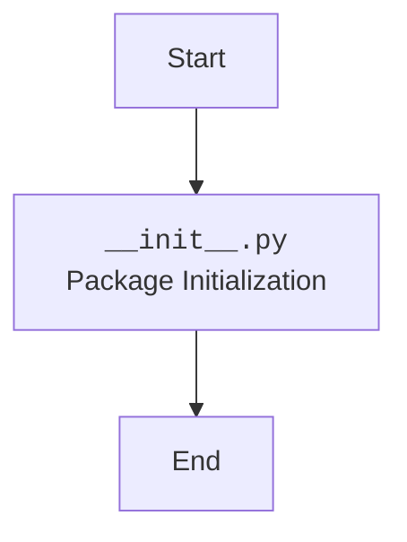

## АНАЛИЗ КОДА: `src/endpoints/bots/__init__.py`

### <алгоритм>
1. **Начало**: Исполнение скрипта `__init__.py` начинается.
2. **Импорты**: В данном файле отсутствуют явные импорты. Он используется для того, чтобы директория `bots` воспринималась Python как пакет.
3. **Конец**: Завершение скрипта. Никакой другой логики не выполняется.

### <mermaid>

### <объяснение>

**Импорты:**

- В данном файле отсутствуют явные импорты. Файл `__init__.py` используется для обозначения директории `bots` как Python-пакета. Это позволяет другим частям проекта импортировать модули из директории `bots` как из обычного пакета.

**Классы:**

- В данном файле отсутствуют классы.

**Функции:**

- В данном файле отсутствуют функции.

**Переменные:**

- В данном файле отсутствуют переменные.

**Объяснение:**

Файл `__init__.py` служит важной цели в структуре пакетов Python. Его присутствие в директории `src/endpoints/bots` означает, что эта директория должна рассматриваться как Python-пакет. Это позволяет другим частям проекта, например, в `src/endpoints`, импортировать модули и подпакеты из `src/endpoints/bots`.

В представленном примере, файл `__init__.py` пустой, что является типичным сценарием для начальной стадии организации пакета. Это означает, что непосредственно в пакете `bots` нет инициализирующего кода или переменных. Он просто отмечает директорию как пакет.

**Цепочка взаимосвязей:**

- Данный файл является частью пакета `src.endpoints`.
- Он позволяет импортировать модули из пакета `src.endpoints.bots`.
- Другие части проекта, например, модули, которые используют API endpoints (например, Flask/FastAPI), могут импортировать модули из данного пакета.
-  Директория `bots` является подпакетом `endpoints`, что помогает в организации кода по функциональным областям.

**Потенциальные ошибки и области для улучшения:**

-  В данном конкретном случае, нет никаких ошибок или областей для улучшения, так как файл выполняет свою функцию - обозначения директории как пакета.
- В будущем, по мере развития функционала пакета `bots`, в файл `__init__.py` могут быть добавлены дополнительные импорты или логика инициализации.