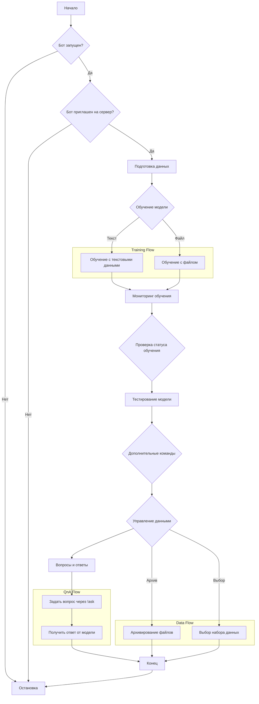

## Анализ кода

### 1. <алгоритм>

**Общий рабочий процесс:**
Этот документ описывает, как взаимодействовать с Discord-ботом для обучения и использования модели машинного обучения. Основной рабочий процесс включает в себя подготовку данных, обучение модели и тестирование, а также дополнительные команды для управления данными.

**Блок-схема:**

**Примеры для каждого блока:**

*   **BotRunning**: Проверка, что бот запущен и выводит сообщение "Logged in as YourBotName#1234".
*   **BotInvited**: Убедиться, что бот добавлен на сервер с правами читать и отправлять сообщения.
*   **PrepareData**:
    *   Текст: "Sample training data".
    *   Файл: Файл `data.txt` с тренировочными данными.
*   **TrainModel**: Команда `!train "Sample training data" positive=True` или `!train positive=True` с прикрепленным файлом.
*   **MonitorTraining**: Бот возвращает сообщение "Model training started. Job ID: <job_id>".
*   **CheckStatus**: (Предполагается наличие команды для проверки статуса обучения).
*   **TestModel**: Команда `!test {"input": "Test input data"}`.
*   **AdditionalCommands**: Команды `!archive /path/to/directory` или `!select_dataset /path/to/positive_data positive=True`.
    *   **QnA**: Команда `!ask What is the capital of France?`

**Поток данных:**

1.  Пользователь отправляет команду боту через Discord.
2.  Бот обрабатывает команду (например, `!train`, `!test`, `!ask`).
3.  Если это `!train`, данные для обучения либо берутся из текста команды, либо из файла, прикрепленного к сообщению.
4.  Если это `!test`, тестовые данные берутся из JSON-строки в команде.
5.  Если это `!ask`, вопрос берется из команды.
6.  Бот передает данные для обучения/тестирования в модель машинного обучения.
7.  Модель обучается или предсказывает результат.
8.  Бот отправляет ответ пользователю в Discord.

### 2. <mermaid>

**Зависимости:**

В предоставленном документе, нет импорта. Но,  предполагается использование Discord API (через библиотеку `discord.py` или аналогичную в `Node.js`) и библиотеки машинного обучения (например, `scikit-learn` или `transformers` в `Python`, или аналог в `Node.js`). Диаграмма не отображает эти внутренние зависимости, но подразумевается их наличие. Также предполагается использование файловой системы для хранения и чтения обучающих данных и модели, а также JSON для работы с тестовыми данными.

### 3. <объяснение>

**Импорты:**

В данном документе не представлен код, поэтому нет импортов.

**Классы:**
Документ не содержит описания классов, но подразумевается наличие как минимум следующих классов:

1.  **Discord Bot**:  Отвечает за взаимодействие с Discord API, обработку сообщений, команд и отправку ответов.
2.  **Model**:  Отвечает за обучение, тестирование и ответы на запросы. Он может быть оберткой вокруг конкретной модели машинного обучения.
3.  **Data Handler**: Управляет загрузкой, хранением и обработкой тренировочных данных.

**Функции:**

*   **Обработчики команд:** Функции, которые вызываются при поступлении команд `!train`, `!test`, `!archive`, `!select_dataset` и `!ask` через Discord.
*   **Функции обучения и тестирования:** Методы класса `Model`, которые выполняют обучение модели и тестирование с использованием предоставленных данных.

**Переменные:**
*   `positive`: Булева переменная, указывающая, что данные для обучения являются положительными примерами.
*  `training_data`: Строка или путь к файлу с тренировочными данными.
*  `test_data`: JSON строка с тестовыми данными.
*  `job_id`: Идентификатор задачи обучения.

**Объяснение:**

Данный документ является инструкцией по использованию Discord-бота для обучения и тестирования моделей машинного обучения. Основной процесс включает следующие шаги:

1.  **Запуск и приглашение бота**: Убедиться, что бот запущен и добавлен на сервер Discord.
2.  **Подготовка данных**: Данные для обучения могут быть предоставлены в виде текста или в файле.
3.  **Обучение модели**: Используется команда `!train` с текстовыми данными или файлом.
4.  **Мониторинг обучения**: Бот возвращает статус обучения.
5.  **Тестирование модели**: Используется команда `!test` с JSON-строкой тестовых данных.
6.  **Дополнительные команды**: Команды `!archive` и `!select_dataset` для управления файлами и наборами данных.
7.  **Вопросы и ответы**:  Используется команда `!ask` для получения ответа от обученной модели.

**Потенциальные ошибки или области для улучшения:**

*   **Обработка ошибок:** Отсутствует подробная обработка ошибок при загрузке файлов, обучении модели или тестировании.
*   **Асинхронность**: В случае сложных задач (таких как обучение) может потребоваться асинхронная обработка, чтобы бот не зависал.
*   **Безопасность:** Необходимо убедиться, что обработка файлов и команд безопасна.
*   **Масштабирование**: Для больших моделей и объемов данных может потребоваться оптимизация производительности.
*   **Управление состоянием:** Требуется правильно управлять состоянием модели и задач обучения.
*   **Мониторинг прогресса**: Необходимо добавить функционал для мониторинга прогресса обучения.
*   **Логирование**:  Добавить логирование для отладки и мониторинга.

**Взаимосвязи с другими частями проекта:**
Данный бот интегрируется с другими частями проекта:

1.  **Модель машинного обучения**: Основная часть, отвечающая за обучение и предсказания.
2.  **API Discord**: Для взаимодействия с платформой Discord.
3.  **Файловая система**: Для хранения и загрузки данных.
4.  **Конфигурация**: Для хранения параметров, таких как путь к моделям и данным.
5.  **Система логирования**: Для записи событий и отладки.