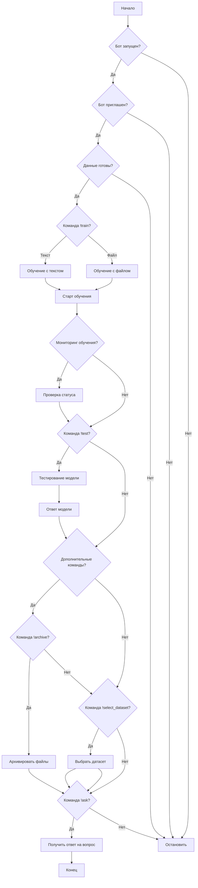

## Анализ кода

### 1. <алгоритм>

**Блок-схема рабочего процесса Discord-бота для обучения и тестирования модели:**

1. **Запуск бота:**
   -   Убедиться, что бот запущен и подключен к Discord.
   -   Пример: `Logged in as YourBotName#1234` в консоли.

2. **Приглашение бота на сервер:**
   -   Убедиться, что бот добавлен на нужный сервер и имеет права на чтение и отправку сообщений.

3. **Подготовка данных для обучения:**
   -   **Текстовые данные:**
        -   Подготовить текстовую строку для обучения.
        -   Пример: `"Sample training data"`
   -   **Файл:**
        -   Подготовить файл с данными для обучения.
        -   Убедиться, что файл доступен боту.

4. **Команда обучения `!train`:**
   - **С текстовыми данными:**
        -   Пользователь отправляет сообщение: `!train "текст" positive=True`
        -   Бот обрабатывает текст и запускает обучение модели.
        -   Пример: `!train "This is a positive example" positive=True`
   - **С файлом:**
        -   Пользователь прикрепляет файл к сообщению и отправляет команду: `!train positive=True`
        -   Бот сохраняет файл и запускает обучение модели.
        -   Пример: `!train positive=True` (с прикрепленным файлом)
   - **Ответ бота:**
       -   `Model training started. Job ID: <job_id>`

5. **Мониторинг обучения (опционально):**
   -   Запрос статуса обучения модели.

6. **Команда тестирования `!test`:**
   -   Подготовка JSON-строки с тестовыми данными.
        -   Пример: `{"test_key": "test_value"}`
   -   Отправка сообщения: `!test {"test_key": "test_value"}`
        -   Пример: `!test {"input": "Test input data"}`
   -   Бот возвращает результаты теста модели.

7. **Дополнительные команды:**
    - **`!archive`**: Архивирование файлов по указанному пути.
        -   Пример: `!archive /path/to/directory`
    - **`!select_dataset`**: Выбор директории с данными для обучения.
        -   Пример: `!select_dataset /path/to/positive_data positive=True`

8. **Команда `!ask`:**
     - Пользователь отправляет сообщение: `!ask "Какой вопрос?"`
     - Бот обрабатывает вопрос и возвращает ответ модели.
     - Пример: `!ask What is the capital of France?`
     - Бот отвечает: `Model response: The capital of France is Paris.`

### 2. <mermaid>

**Объяснение зависимостей в `mermaid` диаграмме:**

-   `Start`: Начало процесса.
-   `BotRunning`: Проверка, запущен ли бот.
-    `BotInvited`: Проверка, добавлен ли бот на сервер.
-   `DataPrepared`: Проверка, подготовлены ли данные для обучения.
-   `TrainCommand`: Проверка команды `!train`.
-   `TrainTextData`: Блок обучения с текстовыми данными.
-   `TrainFileData`: Блок обучения с файлом.
-   `TrainingStarted`: Блок, показывающий старт обучения.
-   `MonitorTraining`: Проверка, требуется ли мониторинг обучения.
-   `CheckTrainingStatus`: Проверка статуса обучения.
-  `TestCommand`: Проверка команды `!test`.
-   `TestModel`: Тестирование модели.
-  `AdditionalCommands`: Проверка дополнительных команд.
-  `ArchiveCommand`: Проверка команды `!archive`.
- `ArchiveFiles`: Архивирование файлов.
- `SelectDatasetCommand`: Проверка команды `!select_dataset`.
-   `SelectDataset`: Выбор директории с датасетом.
- `AskCommand`: Проверка команды `!ask`.
-`GetAnswer`:  Получить ответ на вопрос.
-  `Stop`: Остановка процесса.
-   `ModelResponse`: Ответ модели.
-   `End`: Конец процесса.

### 3. <объяснение>

**Объяснения:**

-   **Импорты:** В предоставленном коде нет явных импортов Python, так как это описание работы бота, а не его исходный код. Однако подразумевается, что код, реализующий этого бота, будет использовать библиотеки Discord API (`discord.py` или аналогичную) для взаимодействия с Discord.
-   **Классы:**
    -   В описании присутствует класс `Model`, который отвечает за обучение и тестирование модели. Этот класс должен содержать методы:
        -   `train`: для обучения модели на основе предоставленных данных.
        -   `test`: для тестирования модели и возврата предсказаний.
        -   `ask`: для получения ответа на вопрос от модели.
    -   Также, возможно, используется класс `DiscordBot` (или его аналог), который отвечает за взаимодействие с Discord API, обработку команд, отправку ответов.
-   **Функции:**
    -   Функции обработки команд, такие как:
        -   `train_command`: принимает текст или файл, начинает обучение модели.
            -   Аргументы: текст (`str`) или путь к файлу (`str`), флаг `positive` (`bool`).
            -   Возвращает: сообщение о начале обучения и Job ID.
            -   Пример: `train_command("Sample data", positive=True)`.
        -   `test_command`: принимает JSON строку, тестирует модель и возвращает результат.
            -   Аргументы: JSON-строка (`str`).
            -   Возвращает: предсказания модели.
            -   Пример: `test_command('{"input": "test input"}')`.
         - `archive_command`: принимает путь к директории для архивирования.
            - Аргументы: путь к директории (`str`).
            - Возвращает: сообщение о выполнении архивирования.
            -Пример: `archive_command("/path/to/archive")`
        - `select_dataset_command`: принимает путь к директории с данными для обучения и флаг `positive`.
            -Аргументы: путь к директории (`str`), флаг `positive` (`bool`).
            -Возвращает: сообщение о выполнении выбора датасета.
            -Пример: `select_dataset_command("/path/to/dataset", positive=True)`
         -`ask_command`: принимает вопрос от пользователя и возвращает ответ модели.
            - Аргументы: вопрос (`str`).
            - Возвращает: ответ модели.
            - Пример: `ask_command("What is the capital of France?")`
-   **Переменные:**
    -   `job_id`: Идентификатор процесса обучения.
    -   `positive`: Флаг, указывающий на положительные примеры.
    -   `test_data`: Данные для тестирования модели.
    -   `model`: экземпляр класса `Model` для обучения и тестирования.
    -   `training_data`: Данные для обучения модели.
-   **Потенциальные ошибки:**
    -   Некорректные команды или аргументы.
    -   Неправильный формат данных для обучения/тестирования (особенно JSON).
    -   Проблемы с доступом к файлам.
    -   Ошибки при взаимодействии с Discord API.
    -   Недостаточные права бота на сервере.
-   **Области для улучшения:**
    -   Обработка ошибок, валидация ввода.
    -   Добавление прогресс-бара для процесса обучения.
    -   Улучшение пользовательского интерфейса для взаимодействия с ботом.
-   **Взаимосвязи с другими частями проекта:**
    -   Бот является частью более крупного проекта, в котором модель машинного обучения тренируется, сохраняется и используется.
    -   Бот может быть частью системы автоматизированного обучения моделей на основе обратной связи от пользователей Discord.