## АНАЛИЗ `package-lock.json`

### <алгоритм>

1. **Начало**: Чтение файла `package-lock.json`. Этот файл является слепком зависимостей проекта на момент последней установки или обновления пакетов.
2. **Разбор JSON**: Разбор JSON-структуры файла. Это структура данных, которая содержит информацию обо всех зависимостях проекта, включая их версии и расположения.
3. **Анализ корневого пакета ("")**:
   - Извлекаются имя (`name`) и версия (`version`) проекта `chatgpt-telegram`.
   - Определяются прямые зависимости (`dependencies`), необходимые для работы проекта:
     - `@ffmpeg-installer/ffmpeg`: Установщик `ffmpeg` для разных платформ.
     - `axios`: HTTP-клиент для выполнения запросов.
     - `config`: Загрузка и управление конфигурациями.
     - `fluent-ffmpeg`: Управление `ffmpeg` с помощью Node.js.
     - `openai`: Клиент для работы с API OpenAI.
     - `telegraf`: Фреймворк для создания Telegram-ботов.
   - Определяются зависимости для разработки (`devDependencies`):
     - `cross-env`: Кросс-платформенное задание переменных окружения.
     - `nodemon`: Автоматический перезапуск приложения при изменениях файлов.
4. **Анализ `node_modules`**:
   - Для каждой установленной зависимости в `node_modules`:
     - Извлекается имя пакета, версия (`version`), ссылка на архив (`resolved`) и хеш (`integrity`).
     - Определяются зависимости каждого пакета.
     - Указывается, является ли пакет опциональным, и на каких платформах он может быть установлен.
     - Примеры: `@ffmpeg-installer/darwin-arm64`, `@ffmpeg-installer/linux-arm`, `axios`, `debug`, `telegraf` и другие.
5. **Связи между пакетами**:
   -  Определяется иерархия зависимостей между пакетами. Например, `axios` зависит от `follow-redirects`, `form-data`, `proxy-from-env`, а `telegraf` от `abort-controller`, `debug`, `mri`, `node-fetch`, `p-timeout`, `safe-compare`, `sandwich-stream`, `typegram`.
   -  Некоторые пакеты, такие как `@ffmpeg-installer/ffmpeg`, являются корневыми и имеют несколько опциональных зависимостей для разных платформ.
6. **Завершение**: Файл `package-lock.json` полностью проанализирован, все зависимости и их связи определены.

```mermaid
flowchart TD
    subgraph Root Package
        root_name[name: chatgpt-telegram]
        root_version[version: 1.0.0]
    end

    subgraph Dependencies
        ffmpeg_installer_ffmpeg["@ffmpeg-installer/ffmpeg"]
        axios_lib["axios"]
        config_lib["config"]
        fluent_ffmpeg_lib["fluent-ffmpeg"]
        openai_lib["openai"]
        telegraf_lib["telegraf"]
    end

     subgraph DevDependencies
        cross_env_lib["cross-env"]
        nodemon_lib["nodemon"]
    end


    subgraph ffmpeg_installer_deps ["@ffmpeg-installer/*"]
        ffmpeg_darwin_arm64["darwin-arm64"]
        ffmpeg_darwin_x64["darwin-x64"]
        ffmpeg_linux_arm["linux-arm"]
        ffmpeg_linux_arm64["linux-arm64"]
        ffmpeg_linux_ia32["linux-ia32"]
         ffmpeg_linux_x64["linux-x64"]
        ffmpeg_win32_ia32["win32-ia32"]
         ffmpeg_win32_x64["win32-x64"]
    end

    subgraph axios_deps ["axios dependencies"]
    	follow_redirects_lib["follow-redirects"]
        form_data_lib["form-data"]
        proxy_from_env_lib["proxy-from-env"]
    end
     subgraph form_data_deps ["form-data dependencies"]
        asynckit_lib["asynckit"]
         combined_stream_lib["combined-stream"]
        mime_types_lib["mime-types"]
    end
     subgraph telegraf_deps ["telegraf dependencies"]
        abort_controller_lib["abort-controller"]
        debug_lib["debug"]
        mri_lib["mri"]
        node_fetch_lib["node-fetch"]
        p_timeout_lib["p-timeout"]
        safe_compare_lib["safe-compare"]
        sandwich_stream_lib["sandwich-stream"]
        typegram_lib["typegram"]
    end

    subgraph nodemon_deps ["nodemon dependencies"]
         chokidar_lib["chokidar"]
        debug_nodemon_lib["debug"]
        ignore_by_default_lib["ignore-by-default"]
        minimatch_lib["minimatch"]
        pstree_remy_lib["pstree.remy"]
         semver_lib["semver"]
        simple_update_notifier_lib["simple-update-notifier"]
         supports_color_lib["supports-color"]
        touch_lib["touch"]
        undefsafe_lib["undefsafe"]
    end


    root_name --> root_version
    root_version --> Dependencies
    Dependencies --> ffmpeg_installer_ffmpeg
    Dependencies --> axios_lib
    Dependencies --> config_lib
    Dependencies --> fluent_ffmpeg_lib
    Dependencies --> openai_lib
    Dependencies --> telegraf_lib
    root_version --> DevDependencies
    DevDependencies --> cross_env_lib
    DevDependencies --> nodemon_lib

    ffmpeg_installer_ffmpeg --> ffmpeg_installer_deps
    ffmpeg_installer_deps --> ffmpeg_darwin_arm64
    ffmpeg_installer_deps --> ffmpeg_darwin_x64
    ffmpeg_installer_deps --> ffmpeg_linux_arm
    ffmpeg_installer_deps --> ffmpeg_linux_arm64
    ffmpeg_installer_deps --> ffmpeg_linux_ia32
    ffmpeg_installer_deps --> ffmpeg_linux_x64
    ffmpeg_installer_deps --> ffmpeg_win32_ia32
     ffmpeg_installer_deps --> ffmpeg_win32_x64

    axios_lib --> axios_deps
    axios_deps --> follow_redirects_lib
    axios_deps --> form_data_lib
    axios_deps --> proxy_from_env_lib

   form_data_lib -->form_data_deps
   form_data_deps--> asynckit_lib
    form_data_deps--> combined_stream_lib
    form_data_deps--> mime_types_lib

    telegraf_lib --> telegraf_deps
   telegraf_deps --> abort_controller_lib
    telegraf_deps --> debug_lib
    telegraf_deps --> mri_lib
     telegraf_deps --> node_fetch_lib
    telegraf_deps --> p_timeout_lib
   telegraf_deps --> safe_compare_lib
    telegraf_deps --> sandwich_stream_lib
    telegraf_deps --> typegram_lib

    nodemon_lib --> nodemon_deps
    nodemon_deps --> chokidar_lib
    nodemon_deps --> debug_nodemon_lib
    nodemon_deps --> ignore_by_default_lib
    nodemon_deps --> minimatch_lib
   nodemon_deps --> pstree_remy_lib
    nodemon_deps --> semver_lib
   nodemon_deps --> simple_update_notifier_lib
     nodemon_deps --> supports_color_lib
    nodemon_deps --> touch_lib
   nodemon_deps --> undefsafe_lib
```

### <mermaid>

### <объяснение>

#### Общее
Файл `package-lock.json` содержит полную информацию о зависимостях проекта `chatgpt-telegram` и их подзависимостях. Это гарантирует, что все разработчики работают с одними и теми же версиями пакетов, что устраняет ошибки, связанные с несовместимостью версий.

#### Разделы `packages` и `node_modules`
Структура файла `package-lock.json` организована вокруг ключа `packages`.
- Внутри `packages` ключ `""` описывает корневой пакет проекта (`chatgpt-telegram`). Он содержит основную информацию, такую как название проекта, его версию, лицензию, а также зависимости и dev-зависимости.
- Остальные записи внутри `packages` (например, `"node_modules/@ffmpeg-installer/darwin-arm64"`) представляют собой конкретные установленные пакеты. Они включают информацию о версии пакета, откуда он был загружен (`resolved`), контрольную сумму (`integrity`) для проверки целостности, список платформ и архитектур (`cpu`, `os`), на которых они работают.
-  Раздел `node_modules` содержит все установленные пакеты (зависимости) и их метаданные (версия, зависимости, локация и т.д.)

#### Зависимости (Dependencies)
- **`@ffmpeg-installer/ffmpeg`**: Предоставляет кроссплатформенную установку `ffmpeg`, необходимого для обработки медиафайлов. Зависит от конкретных установок для разных платформ.
- **`axios`**: HTTP-клиент, который позволяет делать запросы к внешним ресурсам, например, к OpenAI API. Зависит от `follow-redirects`, `form-data`, `proxy-from-env` для обработки перенаправлений, создания форм и прокси.
- **`config`**: Управляет конфигурационными файлами. Используется для загрузки настроек приложения. Зависит от `json5` для обработки JSON-подобных конфигураций.
- **`fluent-ffmpeg`**: Интерфейс для работы с `ffmpeg` из Node.js. Управляет процессом обработки медиа. Зависит от `async` и `which` для выполнения асинхронных операций и поиска исполняемого файла.
- **`openai`**: Клиент для взаимодействия с API OpenAI, предоставляет доступ к моделям GPT. Зависит от `axios` и `form-data`.
- **`telegraf`**:  Фреймворк для создания Telegram-ботов. Содержит широкий спектр функциональности. Зависит от `abort-controller`, `debug`, `mri`, `node-fetch`, `p-timeout`, `safe-compare`, `sandwich-stream` и `typegram`.

#### Зависимости для разработки (DevDependencies)
- **`cross-env`**: Кроссплатформенный инструмент для установки переменных окружения. Полезен при запуске скриптов в разных операционных системах. Зависит от `cross-spawn`.
- **`nodemon`**: Автоматически перезапускает приложение при изменении файлов. Помогает ускорить процесс разработки. Зависит от `chokidar`, `debug`, `ignore-by-default`, `minimatch`, `pstree.remy`, `semver`, `simple-update-notifier`, `supports-color`, `touch`, `undefsafe`.

#### Связи между пакетами
-   `openai` зависит от `axios` и `form-data` для отправки запросов. `axios`, в свою очередь, зависит от `follow-redirects`, `form-data`, `proxy-from-env`.
-   `telegraf` использует `node-fetch` для выполнения HTTP-запросов к API Telegram.
-   `nodemon` использует `chokidar` для отслеживания изменений файлов, `debug` для логирования, `semver` для проверки версий.

#### Потенциальные ошибки и улучшения
-   **Проблемы с версиями**: Хотя `package-lock.json` должен предотвращать проблемы с несовместимостью версий, конфликты могут возникнуть, если некоторые зависимости не указали корректные диапазоны версий или если `npm` сам сталкивается с ошибкой разрешения зависимостей.
-   **Безопасность**: Необходим регулярный аудит зависимостей на наличие уязвимостей.
-  **Раздувание зависимостей**: Некоторые зависимости могут быть избыточными или можно найти более легкие аналоги.
-  **Актуализация версий**: Некоторые версии библиотек устарели и требуют обновления. (например: `openai: 3.2.1`, `telegraf: 4.12.2`, `axios: 1.4.0`, `node-fetch: 2.6.11`).

#### Цепочка взаимосвязей
Взаимодействие между пакетами и библиотеками создает сложную иерархию. Например:
-  Для отправки запроса к OpenAI: `telegraf` -> `node-fetch` или `axios` -> `follow-redirects` ->  `form-data` -> `combined-stream` -> `delayed-stream`.
-  Для обработки медиа:  `fluent-ffmpeg` -> `async` -> `which` -> `isexe`.

Этот файл `package-lock.json` обеспечивает стабильность проекта и должен регулярно обновляться при внесении изменений в `package.json`. Он является важным инструментом для управления зависимостями и обеспечения воспроизводимости среды разработки.