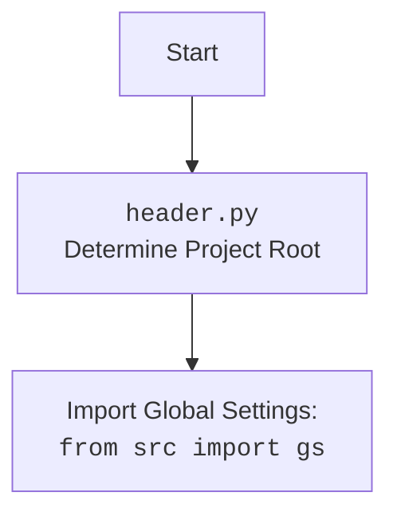

## ИНСТРУКЦИЯ:

Анализируй предоставленный код подробно и объясни его функциональность. Ответ должен включать три раздела:

1. **<алгоритм>**: Опиши рабочий процесс в виде пошаговой блок-схемы, включая примеры для каждого логического блока, и проиллюстрируй поток данных между функциями, классами или методами.
2. **<mermaid>**: Напиши код для диаграммы в формате `mermaid`, проанализируй и объясни все зависимости,
    которые импортируются при создании диаграммы.
    **ВАЖНО!** Убедитесь, что все имена переменных, используемые в диаграмме `mermaid`,
    имеют осмысленные и описательные имена. Имена переменных вроде `A`, `B`, `C`, и т.д., не допускаются!

    **Дополнительно**: Если в коде есть импорт `import header`, добавьте блок `mermaid` flowchart, объясняющий `header.py`:
    ```mermaid
    flowchart TD
        Start --> Header[<code>header.py</code><br> Determine Project Root]

        Header --> import[Import Global Settings: <br><code>from src import gs</code>]
    ```

3. **<объяснение>**: Предоставьте подробные объяснения:
   - **Импорты**: Их назначение и взаимосвязь с другими пакетами `src.`.
   - **Классы**: Их роль, атрибуты, методы и взаимодействие с другими компонентами проекта.
   - **Функции**: Их аргументы, возвращаемые значения, назначение и примеры.
   - **Переменные**: Их типы и использование.
   - Выделите потенциальные ошибки или области для улучшения.

Дополнительно, постройте цепочку взаимосвязей с другими частями проекта (если применимо).

Это обеспечивает всесторонний и структурированный анализ кода.
## Формат ответа: `.md` (markdown)
**КОНЕЦ ИНСТРУКЦИИ**

## <алгоритм>

1.  **Определение корня проекта (`set_project_root`):**
    *   Начало: Функция `set_project_root` вызывается без аргументов или с пользовательскими `marker_files`.
        *   Пример: `set_project_root()` или `set_project_root(marker_files=(".root", ".marker"))`
    *   Определение начальной директории: Получается абсолютный путь к директории текущего файла с помощью `Path(__file__).resolve().parent`.
    *   Поиск корня:
        *   Проверяется наличие `marker_files` в текущей директории и ее родительских директориях.
        *   Если `marker_files` найден, то родительская директория считается корнем проекта.
        *   Поиск прекращается при нахождении первого совпадения.
        *   Если ни один из `marker_files` не найден, текущая директория считается корнем проекта.
    *   Добавление корня в `sys.path`: Если корень проекта не в `sys.path`, то он добавляется в начало, чтобы обеспечить правильный импорт модулей проекта.
    *   Возврат: Возвращается объект `Path`, представляющий корень проекта.

2.  **Инициализация глобальных переменных:**
    *   Вызов `set_project_root()` и запись результата в `__root__`.
    *   Импорт `gs` из `src`.
    *   Загрузка настроек из `settings.json`:
        *   Попытка открыть и прочитать `src/settings.json` из корневой директории проекта.
        *   Если файл найден и корректный JSON, то настройки загружаются в словарь `settings`.
        *   При возникновении `FileNotFoundError` или `json.JSONDecodeError` переменная `settings` остается `None`.
    *   Чтение документации из `README.MD`:
        *   Попытка открыть и прочитать `src/README.MD` из корневой директории проекта.
        *   Если файл найден, то его содержимое загружается в строку `doc_str`.
        *   При возникновении `FileNotFoundError` или `json.JSONDecodeError` переменная `doc_str` остается `None`.
    *   Инициализация глобальных переменных:
        *   `__project_name__` : Если `settings`  не `None`, берется значение из словаря  по ключу  `project_name`, если нет ключа, то `hypotez`, иначе  `hypotez`.
        *   `__version__`: Если `settings`  не `None`, берется значение из словаря по ключу `version`, если нет ключа, то `''`, иначе `''`.
        *   `__doc__`: Если `doc_str` не `None`,  то берется его значение, иначе `''`.
        *   `__details__`: Присваивается пустая строка.
        *   `__author__`: Если `settings`  не `None`, берется значение из словаря по ключу `author`, если нет ключа, то `''`, иначе `''`.
        *   `__copyright__`: Если `settings`  не `None`, берется значение из словаря по ключу `copyrihgnt`, если нет ключа, то `''`, иначе `''`.
        *   `__cofee__`: Если `settings`  не `None`, берется значение из словаря по ключу `cofee`, если нет ключа, то "Treat the developer to a cup of coffee for boosting enthusiasm in development: https://boosty.to/hypo69", иначе  "Treat the developer to a cup of coffee for boosting enthusiasm in development: https://boosty.to/hypo69".

## <mermaid>

```mermaid
flowchart TD
    Start[Начало] --> SetRoot[<code>set_project_root()</code><br>Определение корня проекта]
    SetRoot --> CheckMarkerFiles[Проверка `marker_files` в директориях]
    CheckMarkerFiles -- Найдено --> RootFound[Корень проекта найден]
    CheckMarkerFiles -- Не найдено --> UseCurrentDir[Использовать текущую директорию как корень]
    RootFound --> SetRootPath[Сохранить путь корня]
    UseCurrentDir --> SetRootPath
    SetRootPath --> AddToSysPath[Добавить корень проекта в <code>sys.path</code>]
    AddToSysPath --> ReturnRoot[Вернуть корень проекта]
    ReturnRoot --> LoadSettings[Загрузка <code>settings.json</code>]
    LoadSettings -- Успешно --> ReadReadme[Чтение <code>README.MD</code>]
     LoadSettings -- Ошибка --> ReadReadme[Чтение <code>README.MD</code>]
    ReadReadme -- Успешно --> InitializeGlobals[Инициализация глобальных переменных]
    ReadReadme -- Ошибка --> InitializeGlobals[Инициализация глобальных переменных]
    InitializeGlobals --> End[Конец]

    style Start fill:#f9f,stroke:#333,stroke-width:2px
    style End fill:#f9f,stroke:#333,stroke-width:2px
```



**Объяснение зависимостей в mermaid-диаграмме:**

*   `Start` и `End` - обозначают начало и конец процесса.
*   `SetRoot` - блок, представляющий вызов функции `set_project_root()`, которая отвечает за определение корня проекта.
*   `CheckMarkerFiles` - логический блок, проверяющий наличие `marker_files` в директориях для определения корня проекта.
*   `RootFound` - блок, обозначающий ситуацию, когда корень проекта найден.
*   `UseCurrentDir` - блок, обозначающий ситуацию, когда корень проекта не найден и используется текущая директория.
*   `SetRootPath` - блок, сохраняющий путь к корню проекта.
*    `AddToSysPath` - блок, добавляющий путь к корню проекта в список путей для поиска модулей python.
*   `ReturnRoot` - блок, возвращающий путь к корню проекта.
*   `LoadSettings` - блок, отвечающий за загрузку файла `settings.json`.
*   `ReadReadme` - блок, отвечающий за чтение файла `README.MD`.
*   `InitializeGlobals` - блок, отвечающий за инициализацию глобальных переменных.

## <объяснение>

**Импорты:**

*   `sys`: Модуль `sys` используется для доступа к некоторым переменным и функциям, которые взаимодействуют с интерпретатором Python. В данном коде он используется для добавления пути к корню проекта в `sys.path`, что позволяет импортировать модули из этого пути.
*   `json`: Модуль `json` используется для работы с данными в формате JSON. В данном коде он используется для загрузки настроек из файла `settings.json`.
*   `packaging.version`: Модуль `packaging.version` используется для работы с версиями программного обеспечения. В данном коде он не используется.
*    `pathlib`: Модуль `pathlib` предоставляет классы для представления файловых путей. В данном коде он используется для работы с путями к файлам и директориям.
*   `src.gs`:  Импорт `gs` из пакета `src` предполагает, что `gs` содержит глобальные настройки или пути.  Это указывает на то, что данный файл (`header.py`) зависит от общей конфигурации проекта, расположенной в пакете `src`.

**Функции:**

*   `set_project_root(marker_files: tuple = ('__root__', '.git')) -> Path:`
    *   **Аргументы:**
        *   `marker_files`: Кортеж, содержащий имена файлов или директорий, которые используются для определения корня проекта. По умолчанию ('\_\_root\_\_', '.git').
    *   **Возвращаемое значение:**
        *   `Path`: Объект `Path`, представляющий путь к корню проекта.
    *   **Назначение:**
        *   Функция находит корень проекта, начиная с директории, в которой расположен файл. Она ищет родительские директории до тех пор, пока не найдет директорию, содержащую один из `marker_files`. Затем добавляет путь к корню проекта в `sys.path`, чтобы обеспечить правильный импорт модулей.
        *   Пример вызова:
            ```python
            project_root = set_project_root()
            print(project_root)
            # Вывод: /path/to/project
            ```
            ```python
             project_root = set_project_root(marker_files=(".root", ".marker"))
            print(project_root)
            # Вывод: /path/to/project
            ```

**Переменные:**

*   `__root__`:  Переменная типа `Path`, хранит путь к корневой директории проекта, определенной функцией `set_project_root()`.
*   `settings`: Словарь, который хранит настройки проекта, загруженные из файла `settings.json`. Изначально `None`,  становится словарем если загрузка `settings.json` прошла успешно.
*   `doc_str`: Строка, которая хранит содержимое файла `README.MD`.  Изначально `None`, становится строкой если загрузка `README.MD` прошла успешно.
*   `__project_name__`: Строка, содержащая название проекта, загружается из настроек или значение `hypotez` по умолчанию.
*   `__version__`: Строка, содержащая версию проекта, загружается из настроек или пустая строка по умолчанию.
*   `__doc__`: Строка, содержащая документацию проекта, загружается из `README.MD`, или пустая строка, если `README.MD` не найден.
*   `__details__`:  Строка, содержащая дополнительную информацию о проекте, по умолчанию пустая строка.
*   `__author__`: Строка, содержащая имя автора проекта, загружается из настроек или пустая строка по умолчанию.
*   `__copyright__`: Строка, содержащая информацию об авторских правах проекта, загружается из настроек или пустая строка по умолчанию.
*    `__cofee__`: Строка, содержащая сообщение с предложением "угостить разработчика чашечкой кофе", загружается из настроек или значение по умолчанию.

**Взаимосвязи с другими частями проекта:**

*   `header.py`  является ключевым модулем, так как устанавливает корень проекта и загружает настройки,  которые используются другими частями проекта.
*   Зависимость от пакета `src`, откуда импортируется `gs`,  показывает, что данный модуль использует глобальные настройки, определенные в другом модуле.
*   Загрузка `settings.json` и `README.MD` из корня проекта означает, что структура директорий проекта должна соответствовать ожидаемой.

**Потенциальные ошибки и области для улучшения:**

*   **Обработка ошибок:**
    *   В блоках `try...except` при загрузке `settings.json` и `README.MD` используется `...`.  Желательно выводить сообщения об ошибках или записывать их в лог.
*   **Расширяемость `marker_files`:**
    *   Можно добавить возможность передавать `marker_files` через переменные окружения или конфигурационный файл.
*   **Версионирование зависимостей:**
      *   Импорт `from packaging.version import Version`  не используется. Возможно, стоит рассмотреть добавление механизма проверки версий зависимостей.
*   **Улучшенная документация:**
    *   Добавить более подробные docstrings к функциям, классам и переменным.
* **Конфигурация:**
     * Можно добавить возможность конфигурации имени файла настроек и документации, чтобы не было привязки именно к `settings.json` и `README.MD`.