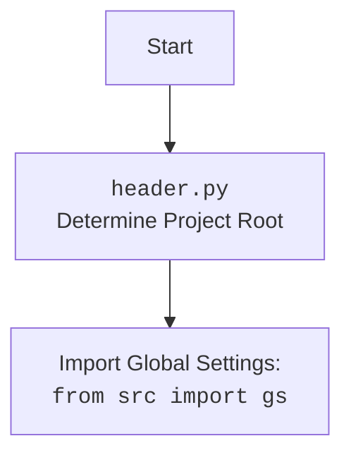

## АЛГОРИТМ:

1. **Инициализация**:
   - Импортируются необходимые библиотеки: `discord`, `discord.ext.commands`, `pathlib`, `tempfile`, `asyncio`, `header`, `src.gs`, `src.ai.openai.model.training.Model`, `src.utils.jjson`, `src.logger.logger`, `speech_recognition`, `requests`, `pydub`, `gtts`.
   - Устанавливается путь к `ffmpeg`.
   - Создается объект бота `bot` с префиксом `!`.
   - Создается объект модели `model`.

2. **Событие `on_ready`**:
   - Вызывается при успешном подключении бота к Discord.
   - Записывает в лог сообщение о готовности бота.

3. **Команда `hi`**:
   - Отправляет приветственное сообщение "HI!" в текстовый канал.

4.  **Команда `join`**:
    -   Присоединяет бота к голосовому каналу пользователя, вызвавшего команду.
    -   Отправляет сообщение о подключении.
    -   Если пользователь не в голосовом канале, отправляет сообщение об ошибке.
    - Пример:
        1.  Пользователь пишет в чате `!join`
        2.  Проверяется, находится ли пользователь в голосовом канале
        3.  Если да, бот подключается к каналу и отправляет подтверждающее сообщение
        4.  Иначе отправляет сообщение что пользователь не в голосовом канале

5.  **Команда `leave`**:
    -   Отключает бота от голосового канала.
    -   Отправляет сообщение об отключении.
    -   Если бот не в голосовом канале, отправляет сообщение об ошибке.
    - Пример:
        1.  Пользователь пишет в чате `!leave`
        2.  Проверяется, подключен ли бот к голосовому каналу
        3.  Если да, бот отключается и отправляет подтверждающее сообщение
        4.  Иначе отправляет сообщение что бот не в голосовом канале

6. **Команда `train`**:
   - Принимает `data` (путь к файлу или текст), `data_dir` (путь к директории), `positive` (флаг) и `attachment` (файл).
   - Если есть `attachment`, сохраняет его во временный файл.
   - Запускает обучение модели, используя метод `model.train()`.
   - Отправляет сообщение с `job_id` или сообщение об ошибке.

7.  **Команда `test`**:
    -   Принимает `test_data` в формате JSON.
    -   Преобразует JSON в данные.
    -   Запускает тестирование модели, используя метод `model.predict()`.
    -   Отправляет результат тестирования.
    -   Обрабатывает ошибки JSON и отправляет сообщение об ошибке.
    - Пример:
        1.  Пользователь пишет в чате `!test {"input": "test_text"}`
        2.  Парсится JSON
        3.  Вызывается метод `model.predict`
        4.  Бот отправляет полученные результаты
        5.  Если JSON некорректен, отправляет сообщение об ошибке

8.  **Команда `archive`**:
    -   Принимает `directory` (путь к директории).
    -   Архивирует файлы в указанной директории с помощью `model.archive_files()`.
    -   Отправляет сообщение об успешном архивировании или ошибке.
    - Пример:
        1.  Пользователь пишет в чате `!archive /path/to/dir`
        2.  Вызывается метод `model.archive_files`
        3.  Бот отправляет сообщение об успешном архивировании или об ошибке

9.  **Команда `select_dataset`**:
    -   Принимает `path_to_dir_positive` (путь к директории) и `positive` (флаг).
    -   Выбирает и архивирует датасет с помощью `model.select_dataset_and_archive()`.
    -   Отправляет сообщение об успешном выборе или ошибке.
    - Пример:
        1.  Пользователь пишет в чате `!select_dataset /path/to/dataset`
        2.  Вызывается метод `model.select_dataset_and_archive`
        3.  Бот отправляет сообщение об успешном выборе или об ошибке

10. **Команда `instruction`**:
    - Читает инструкции из файла `_docs/bot_instruction.md`.
    - Отправляет инструкции в текстовый канал.
    - Обрабатывает ошибки, если файл не найден.
    - Пример:
        1. Пользователь пишет в чате `!instruction`
        2. Бот читает содержимое файла `_docs/bot_instruction.md`
        3. Отправляет содержимое файла пользователю
        4. Если файл не найден, отправляет сообщение об ошибке

11. **Команда `correct`**:
    - Принимает `message_id` (идентификатор сообщения) и `correction` (исправление).
    - Получает сообщение по `message_id`.
    - Сохраняет исправление с помощью функции `store_correction`.
    - Отправляет сообщение об успешном получении исправления или ошибке.
    - Пример:
        1. Пользователь пишет в чате `!correct 123456789 My correction`
        2. Бот пытается найти сообщение с id `123456789`
        3. Сохраняет исправление в файл и отправляет подтверждение
        4. Если сообщение не найдено отправляет сообщение об ошибке

12. **Функция `store_correction`**:
    - Сохраняет оригинальный текст и исправление в файл `corrections_log.txt`.

13. **Команда `feedback`**:
    - Принимает `feedback_text` (текст обратной связи).
    - Сохраняет обратную связь с помощью `store_correction`.
    - Отправляет сообщение благодарности за обратную связь.
    - Пример:
        1. Пользователь пишет в чате `!feedback some feedback`
        2. Бот сохраняет обратную связь и отправляет сообщение благодарности

14. **Команда `getfile`**:
    - Принимает `file_path` (путь к файлу).
    - Отправляет файл в текстовый канал.
    - Обрабатывает ошибку, если файл не найден.
    - Пример:
        1. Пользователь пишет в чате `!getfile /path/to/file.txt`
        2. Бот проверяет, существует ли файл
        3. Если файл существует, отправляет его пользователю
        4. Иначе отправляет сообщение об ошибке

15.  **Функция `text_to_speech_and_play`**:
    -   Преобразует текст в речь и воспроизводит её в голосовом канале.
    -   Сохраняет аудиофайл во временном каталоге.
    -   Подключается к голосовому каналу, если бот ещё не подключен.
    -   Воспроизводит аудио.
    -   Отключается от голосового канала.
    - Пример:
        1. Вызывается с текстом и каналом пользователя
        2. Преобразует текст в речь
        3. Если бот не подключен к каналу, подключается
        4. Воспроизводит аудио
        5. Отключается от канала

16. **Событие `on_message`**:
    - Обрабатывает входящие сообщения.
    - Игнорирует сообщения от самого бота.
    - Если сообщение начинается с префикса `!`, обрабатывает команду.
    - Если есть вложения, то если вложение - это аудиофайл, то распознает речь с помощью функции `recognizer` и отправляет распознанный текст в модель.
    - Если вложений нет, то отправляет сообщение в модель.
    - Если пользователь находится в голосовом канале, то отправляет ответ с помощью `text_to_speech_and_play`.
    - Иначе отправляет ответ в текстовый канал.
17. **Запуск бота**:
    - Запускает бота, используя токен из `gs.credentials.discord.bot_token`.

## MERMAID:

```mermaid
flowchart TD
    Start[Start] --> Init[Инициализация]
    Init --> BotReadyEvent[on_ready()]
    BotReadyEvent --> LogReady[Логирование]
    LogReady --> CommandHi[hi(ctx)]
    CommandHi --> SendHi[ctx.send('HI!')]
    
    Init --> CommandJoin[join(ctx)]
    CommandJoin --> CheckVoiceChannel[Проверка голосовго канала]
    CheckVoiceChannel -- Пользователь в канале --> ConnectToVoiceChannel[channel.connect()]
    ConnectToVoiceChannel --> SendJoinedMessage[ctx.send(f'Joined {channel}')]
    CheckVoiceChannel -- Пользователь не в канале --> SendNoVoiceMessage[ctx.send('You are not in a voice channel.')]
    
    Init --> CommandLeave[leave(ctx)]
    CommandLeave --> CheckVoiceClient[Проверка голосового клиента]
    CheckVoiceClient -- Бот в канале --> DisconnectFromVoiceChannel[ctx.voice_client.disconnect()]
    DisconnectFromVoiceChannel --> SendDisconnectedMessage[ctx.send('Disconnected from the voice channel.')]
    CheckVoiceClient -- Бот не в канале --> SendNotConnectedMessage[ctx.send('I am not in a voice channel.')]
   
    Init --> CommandTrain[train(ctx, data, data_dir, positive, attachment)]
    CommandTrain --> CheckAttachment[Проверка вложения]
    CheckAttachment -- Есть вложение --> SaveAttachment[attachment.save(file_path)]
    SaveAttachment --> SetData[data = file_path]
    CheckAttachment -- Нет вложения --> ProcessTraining[model.train(data, data_dir, positive)]
    ProcessTraining --> CheckJobId[Проверка job_id]
    CheckJobId -- job_id есть --> SendTrainingStarted[ctx.send(f'Model training started. Job ID: {job_id}')]
    SendTrainingStarted --> SaveJobId[model.save_job_id(job_id, "Training task started")]
     CheckJobId -- job_id нет --> SendTrainingFailed[ctx.send('Failed to start training.')]
   
    Init --> CommandTest[test(ctx, test_data)]
    CommandTest --> LoadTestData[j_loads(test_data)]
    LoadTestData --> GetPredictions[model.predict(test_data)]
    GetPredictions --> CheckPredictions[Проверка предсказаний]
    CheckPredictions -- Есть предсказания --> SendPredictions[ctx.send(f'Test complete. Predictions: {predictions}')]
    SendPredictions --> HandleErrors[model.handle_errors(predictions, test_data)]
    CheckPredictions -- Нет предсказаний --> SendFailedPredictions[ctx.send('Failed to get predictions.')]
     CommandTest --> ErrorHandling[Обработка ошибок JSON]
    ErrorHandling --> SendInvalidFormat[ctx.send('Invalid test data format. Please provide a valid JSON string.')]
    
    Init --> CommandArchive[archive(ctx, directory)]
    CommandArchive --> ArchiveFiles[model.archive_files(directory)]
    ArchiveFiles --> SendArchivedMessage[ctx.send(f'Files in {directory} have been archived.')]
    CommandArchive --> ErrorHandlingArchive[Обработка ошибок архивации]
    ErrorHandlingArchive --> SendErrorArchive[ctx.send(f'An error occurred while archiving files: {ex}')]
    
    Init --> CommandSelectDataset[select_dataset(ctx, path_to_dir_positive, positive)]
     CommandSelectDataset --> SelectDatasetAndArchive[model.select_dataset_and_archive(path_to_dir_positive, positive)]
    SelectDatasetAndArchive --> CheckDataset[Проверка датасета]
    CheckDataset -- Dataset --> SendDatasetSelectedMessage[ctx.send(f'Dataset selected and archived. Dataset: {dataset}')]
    CheckDataset -- No Dataset --> SendDatasetFailedMessage[ctx.send('Failed to select dataset.')]

    Init --> CommandInstruction[instruction(ctx)]
    CommandInstruction --> CheckInstructionFile[Проверка наличия файла]
    CheckInstructionFile -- Файл существует --> ReadInstructions[file.read()]
    ReadInstructions --> SendInstructions[ctx.send(instructions)]
    CheckInstructionFile -- Файл не существует --> SendInstructionNotFound[ctx.send('Instructions file not found.')]
     CommandInstruction --> ErrorHandlingInstruction[Обработка ошибок чтения инструкции]
    ErrorHandlingInstruction --> SendErrorInstruction[ctx.send(f'An error occurred while reading the instructions: {ex}')]
    
   Init --> CommandCorrect[correct(ctx, message_id, correction)]
   CommandCorrect --> FetchMessage[ctx.fetch_message(message_id)]
    FetchMessage --> CheckMessage[Проверка сообщения]
    CheckMessage -- Сообщение найдено --> LogCorrection[logger.info(f"Correction for message ID {message_id}: {correction}")]
    LogCorrection --> StoreCorrection[store_correction(message.content, correction)]
    StoreCorrection --> SendCorrectionMessage[ctx.send(f"Correction received: {correction}")]
    CheckMessage -- Сообщение не найдено --> SendMessageNotFound[ctx.send("Message not found.")]
    CommandCorrect --> ErrorHandlingCorrect[Обработка ошибок коррекции]
    ErrorHandlingCorrect --> SendErrorCorrect[ctx.send(f'An error occurred: {ex}')]

    Init --> CommandFeedback[feedback(ctx, feedback_text)]
    CommandFeedback --> StoreFeedback[store_correction("Feedback", feedback_text)]
     StoreFeedback --> SendFeedbackMessage[ctx.send('Thank you for your feedback. We will use it to improve the model.')]

    Init --> CommandGetFile[getfile(ctx, file_path)]
    CommandGetFile --> CheckFile[Проверка наличия файла]
    CheckFile -- Файл существует --> SendFile[ctx.send("Here is the file you requested:", file=discord.File(file_to_attach))]
     CheckFile -- Файл не существует --> SendFileNotFound[ctx.send(f'File not found: {file_path}')]
 
    Init --> OnMessageEvent[on_message(message)]
    OnMessageEvent --> CheckAuthor[Проверка автора сообщения]
    CheckAuthor -- Автор бот --> StopProcessing[return]
    CheckAuthor -- Автор не бот --> CheckPrefix[Проверка префикса сообщения]
    CheckPrefix -- Сообщение с префиксом --> ProcessCommand[bot.process_commands(message)]
    CheckPrefix -- Сообщение без префикса --> CheckAttachments[Проверка наличия вложений]
    CheckAttachments -- Есть вложения --> CheckAudioAttachment[Проверка аудио вложений]
    CheckAudioAttachment -- Есть аудио вложения --> RecognizeSpeech[recognizer(message.attachments[0].url)]
    RecognizeSpeech --> SendToModelWithAttachment[model.send_message(recognized_text)]
    CheckAudioAttachment -- Нет аудио вложений --> SendToModel[model.send_message(message.content)]
    CheckAttachments -- Нет вложений --> SendToModel[model.send_message(message.content)]
    SendToModelWithAttachment --> CheckUserInVoiceChannel[Проверка пользователя в голосовом канале]
    SendToModel --> CheckUserInVoiceChannel
    CheckUserInVoiceChannel -- Пользователь в канале --> TextToSpeechAndPlay[text_to_speech_and_play(response, message.author.voice.channel)]
    CheckUserInVoiceChannel -- Пользователь не в канале --> SendResponse[message.channel.send(response)]
  
    Init --> StartBot[bot.run(gs.credentials.discord.bot_token)]
```



## ОБЪЯСНЕНИЕ:

**Импорты:**

*   **`discord`**: Основная библиотека для работы с Discord API, позволяющая боту взаимодействовать с серверами и каналами.
*   **`discord.ext.commands`**: Расширение библиотеки `discord`, предоставляющее удобный способ создания и обработки команд бота.
*   **`pathlib.Path`**: Библиотека для работы с путями к файлам и директориям в кроссплатформенном стиле.
*   **`tempfile`**:  Модуль для создания временных файлов и директорий.
*   **`asyncio`**: Библиотека для работы с асинхронным кодом, используется для выполнения неблокирующих операций.
*   **`header`**: Модуль для определения корневой директории проекта (как показано в mermaid диаграмме).
*   **`src.gs`**:  Глобальные настройки проекта, такие как пути к файлам, учетные данные, и другие параметры. Используется для получения токена бота.
*   **`src.ai.openai.model.training.Model`**: Класс, отвечающий за обучение и работу с моделью искусственного интеллекта.
*   **`src.utils.jjson`**: Модуль для работы с JSON, используется для загрузки и выгрузки данных.
*   **`src.logger.logger`**: Модуль для логирования событий и ошибок.
*   **`speech_recognition`**: Библиотека для распознавания речи.
*   **`requests`**: Библиотека для отправки HTTP запросов.
*   **`pydub`**: Библиотека для работы с аудиофайлами.
*   **`gtts`**: Библиотека для преобразования текста в речь.
*   **`.chatterbox`**:  Модуль `chatterbox`, находящийся в той же директории, используется для дополнительной обработки сообщений.

**Переменные:**

*   `path_to_ffmpeg`: Путь к исполняемому файлу ffmpeg, необходимому для работы с аудио.
*   `PREFIX`: Префикс для команд бота (по умолчанию `!`).
*   `intents`: Набор намерений, определяющих, к каким событиям должен быть подписан бот.
*   `bot`: Объект бота, созданный с помощью `commands.Bot`.
*   `model`: Объект модели, созданный с помощью класса `Model`.

**Классы:**

*   **`discord.Client` (неявно, через `commands.Bot`)**: Базовый класс для создания Discord-бота, управляет подключением к Discord API, обработкой событий и взаимодействием с сервером.
*   **`commands.Bot`**: Подкласс `discord.Client`, предоставляющий функциональность для создания и обработки команд.
*   **`src.ai.openai.model.training.Model`**: Класс для работы с моделью ИИ, отвечает за обучение, тестирование и предсказания.

**Функции:**

*   **`on_ready()`**: Событие, вызываемое при подключении бота к Discord. Выводит сообщение о готовности бота в лог.
*   **`hi(ctx)`**: Команда для приветствия. Отправляет сообщение "HI!".
*   **`join(ctx)`**: Команда для подключения бота к голосовому каналу.
*   **`leave(ctx)`**: Команда для отключения бота от голосового канала.
*   **`train(ctx, data, data_dir, positive, attachment)`**: Команда для обучения модели. Принимает данные для обучения, путь к директории и флаг `positive` (положительные или отрицательные данные), а также вложение(файл).
*   **`test(ctx, test_data)`**: Команда для тестирования модели. Принимает тестовые данные в формате JSON.
*  **`archive(ctx, directory)`**:  Команда для архивации файлов в указанной директории.
*  **`select_dataset(ctx, path_to_dir_positive, positive)`**:  Команда для выбора и архивации датасета.
*   **`instruction(ctx)`**: Команда для вывода инструкции из файла.
*   **`correct(ctx, message_id, correction)`**: Команда для исправления предыдущего ответа.
*   **`store_correction(original_text, correction)`**: Функция для сохранения исправлений.
*   **`feedback(ctx, feedback_text)`**: Команда для получения обратной связи от пользователя.
*   **`getfile(ctx, file_path)`**: Команда для получения файла.
*   **`text_to_speech_and_play(text, channel)`**: Функция для преобразования текста в речь и воспроизведения ее в голосовом канале.
*    **`on_message(message)`**: Обработчик сообщений. Распознает речь, отправляет текст в модель, и воспроизводит ответ в голосовом канале (если пользователь находится в голосовом канале) или отправляет ответ в текстовый канал.

**Цепочка взаимосвязей:**

1.  **`header.py` -> `src.gs`**: `header.py` определяет корневую директорию проекта, что позволяет получить доступ к глобальным настройкам через `src.gs`.

2.  **`discord` -> `commands.Bot`**: `commands.Bot` наследуется от `discord.Client` и использует его функциональность для взаимодействия с Discord API.
3.  **`commands.Bot` -> `Model`**:  `commands.Bot` использует `Model` для обучения, тестирования и получения предсказаний.
4.  **`commands.Bot` -> `src.utils.jjson`**: `commands.Bot` использует  `src.utils.jjson` для обработки JSON данных.
5.   **`commands.Bot` -> `src.logger.logger`**: `commands.Bot` использует  `src.logger.logger` для логирования событий.
6.  **`commands.Bot` -> `text_to_speech_and_play`**: `commands.Bot` использует `text_to_speech_and_play` для воспроизведения ответов в голосовом канале.
7. **`commands.Bot` -> `store_correction`**: `commands.Bot` использует `store_correction` для сохранения исправлений.
8. **`speech_recognition` -> `on_message`**: `speech_recognition` используется в `on_message` для распознавания речи из аудио вложений.
9. **`requests` -> `recognizer`**: `requests` используется в `recognizer` для загрузки аудио файлов.
10. **`pydub` -> `recognizer`**: `pydub` используется в `recognizer` для конвертации аудио форматов.
11. **`gtts` -> `text_to_speech_and_play`**: `gtts` используется в `text_to_speech_and_play` для преобразования текста в речь.

**Потенциальные ошибки и области для улучшения:**

*   **Обработка ошибок**:  В некоторых функциях обработка ошибок может быть улучшена (например, более детальное логирование).
*  **Безопасность**: При работе с файлами и путями необходимо обеспечить безопасность, чтобы избежать уязвимостей.
*   **Асинхронность**: Можно улучшить асинхронность в некоторых местах, чтобы бот был более отзывчивым (например, параллельная обработка нескольких голосовых команд).
*   **`recognizer`**: Функция `recognizer` закомментирована, стоит убедиться что она работает и правильно обрабатывает ошибки распознавания речи.
*   **`text_to_speech_and_play`**: Функция `text_to_speech_and_play` не обрабатывает ошибки подключения к голосовому каналу.
*   **Масштабируемость**: Логика обработки сообщений может быть пересмотрена, если бот будет обрабатывать большое количество сообщений.
*   **Хранение данных**: Исправления и обратная связь хранятся в текстовых файлах, для более надежного хранения можно использовать БД.
* **`model`**: Непонятно как именно работает `Model` и какие есть ограничения, необходимо более детальное изучение кода `src/ai/openai/model/training.py`