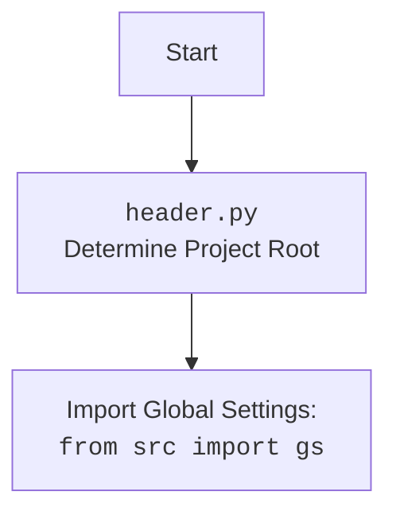

## ИНСТРУКЦИЯ:

Анализируй предоставленный код подробно и объясни его функциональность. Ответ должен включать три раздела:  

1. **<алгоритм>**: Опиши рабочий процесс в виде пошаговой блок-схемы, включая примеры для каждого логического блока, и проиллюстрируй поток данных между функциями, классами или методами.  
2. **<mermaid>**: Напиши код для диаграммы в формате `mermaid`, проанализируй и объясни все зависимости, 
    которые импортируются при создании диаграммы. 
    **ВАЖНО!** Убедитесь, что все имена переменных, используемые в диаграмме `mermaid`, 
    имеют осмысленные и описательные имена. Имена переменных вроде `A`, `B`, `C`, и т.д., не допускаются!  
    
    **Дополнительно**: Если в коде есть импорт `import header`, добавьте блок `mermaid` flowchart, объясняющий `header.py`:\
    ```mermaid\
    flowchart TD\
        Start --> Header[<code>header.py</code><br> Determine Project Root]\
    \
        Header --> import[Import Global Settings: <br><code>from src import gs</code>] \
    ```

3. **<объяснение>**: Предоставьте подробные объяснения:  
   - **Импорты**: Их назначение и взаимосвязь с другими пакетами `src.`.  
   - **Классы**: Их роль, атрибуты, методы и взаимодействие с другими компонентами проекта.  
   - **Функции**: Их аргументы, возвращаемые значения, назначение и примеры.  
   - **Переменные**: Их типы и использование.  
   - Выделите потенциальные ошибки или области для улучшения.  

Дополнительно, постройте цепочку взаимосвязей с другими частями проекта (если применимо).  

Это обеспечивает всесторонний и структурированный анализ кода.
## Формат ответа: `.md` (markdown)
**КОНЕЦ ИНСТРУКЦИИ**
```markdown
## <алгоритм>

1.  **`set_project_root(marker_files)`**:
    *   **Начало**: Функция вызывается с кортежем `marker_files` (по умолчанию `('__root__', '.git')`).
    *   **Определение текущего пути**: Получает абсолютный путь к директории, где находится файл `header.py`.
    *   **Поиск родительских директорий**: Итерируется по текущей директории и всем ее родительским директориям.
    *   **Проверка наличия маркеров**: Для каждой директории проверяется, существует ли хотя бы один из файлов или директорий из `marker_files`.
        *   **Пример**: Если текущая директория `/path/to/project/src/bots/discord` и `marker_files` включает `'.git'`, то будет проверено существование `/path/to/project/src/bots/discord/.git`, затем `/path/to/project/src/bots/.git`, и т.д.
    *   **Найдена корневая директория**: Если маркер найден, текущая директория устанавливается как корень проекта, и цикл завершается.
    *   **Добавление корневой директории в `sys.path`**: Если корневая директория не содержится в `sys.path`, то добавляем её в начало списка.
    *   **Возврат**: Функция возвращает объект `Path` для корневой директории.

2.  **Определение `__root__`**:
    *   Вызывается функция `set_project_root()`, и возвращенное значение сохраняется в глобальной переменной `__root__`.

3.  **Импорт `gs`**:
    *   Выполняется `from src import gs`.

4.  **Загрузка настроек из `settings.json`**:
    *   **Попытка открыть файл**: Пытается открыть файл `settings.json`, расположенный по пути `gs.path.root / 'src' / 'settings.json'`.
    *   **Чтение файла**: Если файл успешно открыт, его содержимое загружается из JSON в словарь `settings`.
    *   **Обработка ошибок**: Если файл не найден или JSON не может быть декодирован, перехватывается исключение, и `settings` остается равным `None`.

5.  **Загрузка содержимого `README.MD`**:
     *   **Попытка открыть файл**: Пытается открыть файл `README.MD`, расположенный по пути `gs.path.root / 'src' / 'README.MD'`.
     *   **Чтение файла**: Если файл успешно открыт, его содержимое читается в строку `doc_str`.
     *   **Обработка ошибок**: Если файл не найден или не может быть прочитан, перехватывается исключение, и `doc_str` остается равным `None`.

6.  **Инициализация глобальных переменных**:
    *   Глобальные переменные `__project_name__`, `__version__`, `__doc__`, `__details__`, `__author__`, `__copyright__` и `__cofee__` инициализируются.
    *   Если словарь `settings` был успешно загружен, значения берутся из него, иначе используются значения по умолчанию.

## <mermaid>

```mermaid
flowchart TD
    Start --> FindProjectRoot[Determine Project Root using marker files]
    FindProjectRoot --> SetRootPath[Set project root path]
    SetRootPath --> AddRootToSysPath{Add root to sys.path?}
    AddRootToSysPath -- Yes --> UpdateSysPath[sys.path.insert(0, root_path)]
     AddRootToSysPath -- No --> LoadSettings[Load settings.json]
    UpdateSysPath --> LoadSettings
    LoadSettings --> OpenSettingsFile{Open settings.json file}
    OpenSettingsFile -- Success --> ParseSettingsFile[Parse JSON from settings.json]
    OpenSettingsFile -- Fail --> SetSettingsToNone[settings = None]
    ParseSettingsFile --> LoadReadme[Load README.md]
    SetSettingsToNone --> LoadReadme
    LoadReadme --> OpenReadmeFile{Open README.md file}
     OpenReadmeFile -- Success --> ReadReadmeFile[Read content from README.md]
    OpenReadmeFile -- Fail --> SetReadmeToNone[doc_str = None]
    ReadReadmeFile --> SetProjectInfo[Set project information based on settings]
    SetReadmeToNone --> SetProjectInfo

    SetProjectInfo --> End

    style Start fill:#f9f,stroke:#333,stroke-width:2px
     style End fill:#ccf,stroke:#333,stroke-width:2px
    
```



**Анализ зависимостей:**

*   `sys`: Используется для работы с системными переменными и путями, в частности `sys.path`.
*   `json`: Используется для загрузки данных из JSON файла `settings.json`.
*   `packaging.version.Version`: Импортируется, но не используется в представленном коде, что может быть ошибкой.
*   `pathlib.Path`: Используется для работы с путями к файлам и директориям.
*   `src.gs`: Импортируется для доступа к глобальным настройкам проекта (предположительно, `gs.path.root`).

## <объяснение>

### Импорты

*   `sys`: Модуль `sys` предоставляет доступ к некоторым переменным и функциям, взаимодействующим с интерпретатором Python. В данном коде используется для изменения `sys.path`, чтобы добавить корневую директорию проекта в список путей поиска модулей. Это позволяет импортировать модули из проекта, где бы они ни находились.

*   `json`: Модуль `json` используется для работы с JSON-данными. В этом коде он применяется для загрузки настроек проекта из файла `settings.json`.

*   `packaging.version`: Импортирует класс `Version` из модуля `packaging.version`, но в предоставленном коде он не используется. Возможно, этот импорт остался от предыдущей версии и может быть удален.

*   `pathlib`: Модуль `pathlib` предоставляет объектно-ориентированный способ работы с файловыми путями. В этом коде используется класс `Path` для определения пути к текущему файлу, поиска корневой директории проекта и формирования путей к файлам `settings.json` и `README.MD`.

*   `from src import gs`: Этот импорт предполагает наличие модуля `gs` внутри пакета `src`. `gs` (вероятно, "global settings") содержит глобальные переменные и настройки проекта, включая путь к корню проекта (`gs.path.root`).

### Функции

*   **`set_project_root(marker_files: tuple = ('__root__', '.git')) -> Path`**:
    *   **Аргументы**:
        *   `marker_files`: Кортеж, содержащий имена файлов или директорий, которые служат маркерами для определения корневой директории проекта. По умолчанию `('__root__', '.git')`.
    *   **Возвращаемое значение**: Объект `Path`, представляющий путь к корневой директории проекта.
    *   **Назначение**: Функция предназначена для автоматического определения корневой директории проекта, начиная с места, где находится файл `header.py`. Она проверяет наличие файлов/директорий, указанных в `marker_files`, в родительских директориях. Это позволяет скрипту находить корневую директорию независимо от текущей рабочей директории или местоположения в файловой системе.
    *   **Пример**: Если структура проекта такова:
        ```
        project/
        ├── __root__
        ├── src/
        │   ├── bots/
        │   │   └── discord/
        │   │       └── header.py
        ```
        Функция обнаружит файл `__root__` в `project/` и вернёт объект `Path` для директории `project/`.

### Переменные

*   `__root__` (`Path`): Глобальная переменная, содержащая объект `Path`, представляющий путь к корневой директории проекта. Инициализируется вызовом `set_project_root()`.

*  `settings` (`dict` или `None`): Словарь, который содержит настройки проекта, загруженные из файла `settings.json`. Может быть `None`, если файл не найден или произошла ошибка декодирования JSON.

*   `doc_str` (`str` или `None`):  Содержит строку с содержимым `README.md`, может быть `None` если файл не найден.

*   `__project_name__` (`str`): Название проекта, извлеченное из `settings` или `hypotez` по умолчанию.
*   `__version__` (`str`): Версия проекта, извлеченная из `settings` или пустая строка по умолчанию.
*   `__doc__` (`str`): Документация проекта, извлеченная из `README.md` или пустая строка по умолчанию.
*  `__details__` (`str`): Детали проекта, всегда инициализируется пустой строкой `''`.
*   `__author__` (`str`): Автор проекта, извлеченное из `settings` или пустая строка по умолчанию.
*   `__copyright__` (`str`): Авторские права проекта, извлеченное из `settings` или пустая строка по умолчанию.
*  `__cofee__` (`str`): Сообщение с приглашением угостить разработчика кофе, по умолчанию "Treat the developer to a cup of coffee for boosting enthusiasm in development: https://boosty.to/hypo69", или значение из настроек.

### Потенциальные ошибки и области для улучшения:

*   **Неиспользуемый импорт `Version`**: Импорт `from packaging.version import Version` не используется в коде и может быть удален.
*   **Обработка ошибок при чтении файлов**: В блоках `try...except` используется `...` для обработки исключений. Лучше явно указать действие, например `settings = {}` или `doc_str = ''`, чтобы избежать неоднозначности.
*   **Жестко заданные пути**: Пути к файлам `settings.json` и `README.MD` жестко закодированы. Можно сделать их более гибкими, например, передавая их в качестве параметров.
*   **Отсутствие валидации JSON**: Код не проверяет структуру и наличие обязательных полей в файле `settings.json`.
*   **Негибкие значения по умолчанию**: Значения по умолчанию для некоторых переменных (`__cofee__`) могут быть вынесены в конфигурационный файл.

### Взаимосвязи с другими частями проекта:

*   **`src.gs`**: Модуль `gs` используется для получения пути к корневой директории проекта, что позволяет этому модулю работать независимо от места его запуска.
*  **`settings.json`**: Файл содержит настройки проекта.
*  **`README.MD`**: Файл содержит документацию проекта.
*   **Другие модули `src`**: Значения глобальных переменных, определённых в `header.py`, могут использоваться в других модулях проекта.

**Цепочка взаимосвязей**:
`header.py` -> `set_project_root` -> `__root__` -> `src.gs.path.root` -> `settings.json` ->` README.MD` -> `__project_name__, __version__, __doc__` -> другие модули проекта.