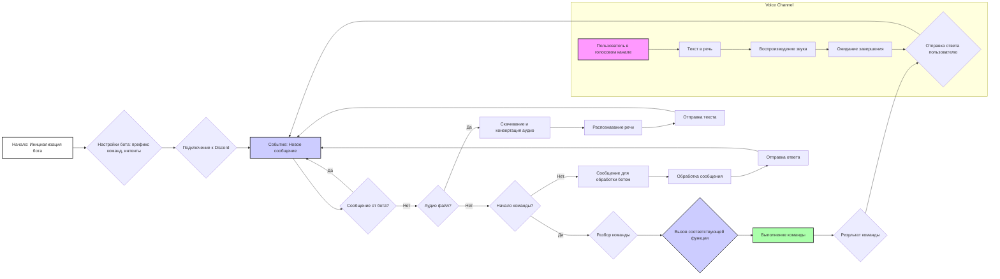
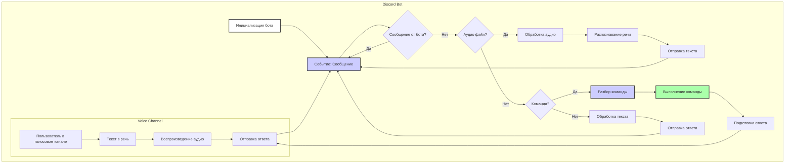

## АНАЛИЗ КОДА: Описание Discord-бота

### 1. <алгоритм>

**Блок-схема работы Discord-бота:**

**Примеры для каждого блока:**

*   **A. Начало: Инициализация бота**: Бот запускается с использованием токена, полученного из настроек, регистрирует префикс `!` для команд и необходимые интенты.
*   **B. Настройки бота**: Установка префикса команд `!` и необходимых интентов, которые определяют разрешения для доступа к определенным событиям Discord.
*   **C. Подключение к Discord**: Бот устанавливает соединение с серверами Discord используя предоставленный токен.
*   **D. Событие: Новое сообщение**: Пользователь отправляет сообщение в текстовый или голосовой канал.
*   **E. Сообщение от бота?**: Проверка, является ли автор сообщения самим ботом. Если да, то сообщение игнорируется.
*   **F. Аудио файл?**: Проверка, является ли сообщение аудиофайлом.
*   **G. Скачивание и конвертация аудио**: Аудиофайл скачивается и конвертируется в формат WAV для обработки.
*   **H. Распознавание речи**: Текст из аудио распознаётся с использованием Google Speech Recognition.
*   **I. Отправка текста**: Бот отправляет распознанный текст в текстовый канал.
*   **J. Начало команды?**: Проверка, начинается ли сообщение с префикса команды `!`.
*   **K. Разбор команды**: Определение, какая именно команда введена пользователем. Например, "!train", "!test", "!join" и т.д.
*   **L. Вызов соответствующей функции**: На основе распознанной команды вызывается нужная функция.
*   **M. Выполнение команды**: Выполнение логики команды. Например, обучение модели, подключение к голосовому каналу.
*    **N. Результат команды**: Бот подготавливает результат выполнения команды. Это может быть текст, файл или другие данные.
*   **O. Отправка ответа пользователю**: Результат выполнения команды или ответ бота отправляется пользователю в текстовый или голосовой канал.
*   **P. Сообщение для обработки ботом**: Сообщение не является ни командой, ни аудиофайлом, поэтому рассматривается как обычный текст для обработки.
*   **Q. Обработка сообщения**: Применяется логика для обработки текстового сообщения, например, анализ текста.
*   **R. Отправка ответа**: Бот отправляет ответ на сообщение.
*    **S. Пользователь в голосовом канале**: Проверка, находится ли пользователь в голосовом канале.
*    **T. Текст в речь**: Текст преобразуется в речь с использованием библиотеки `gTTS`.
*    **U. Воспроизведение звука**: Бот воспроизводит аудио в голосовом канале.
*    **V. Ожидание завершения**: Бот ожидает завершения воспроизведения аудио.

**Поток данных:**

1.  **Ввод**: Пользователь отправляет сообщение (текст, аудио или команду) в Discord.
2.  **Обработка**: Сообщение обрабатывается ботом, который определяет тип сообщения (команда, текст или аудио).
3.  **Распознавание речи (если аудио)**: Аудиофайл скачивается, конвертируется и распознается в текст.
4.  **Текст в речь (если в голосовом канале)**: Текст преобразуется в речь и воспроизводится в голосовом канале.
5.  **Выполнение команды (если команда)**: Выполняется логика команды и подготавливается результат.
6.  **Логирование**: Все события и ошибки логируются.
7.  **Вывод**: Бот отправляет ответ пользователю (текст, аудио или файл).

### 2. <mermaid>

**Анализ зависимостей `mermaid`:**

Диаграмма `mermaid` представляет собой блок-схему, показывающую основные этапы обработки сообщений в Discord-боте.

*   **Инициализация бота (`A`)**: Начальный этап, когда бот запускается и настраивается.
*   **Событие: Сообщение (`B`)**: Событие срабатывает, когда пользователь отправляет сообщение в Discord.
*   **Сообщение от бота? (`C`)**: Логический блок, проверяющий, было ли сообщение отправлено самим ботом. Если да, сообщение игнорируется.
*   **Аудио файл? (`D`)**: Логический блок, проверяющий, является ли сообщение аудиофайлом.
*    **Обработка аудио (`E`)**: Этап обработки аудиофайла.
*   **Распознавание речи (`F`)**: Процесс преобразования аудио в текст.
*    **Отправка текста (`G`)**: Отправка распознанного текста пользователю.
*   **Команда? (`H`)**: Логический блок, проверяющий, начинается ли сообщение с префикса команды.
*   **Разбор команды (`I`)**: Этап, когда бот определяет, какая команда была введена.
*   **Выполнение команды (`J`)**: Этап, когда выполняется логика определенной команды.
*    **Подготовка ответа (`K`)**: Этап подготовки ответа пользователю на выполненную команду.
*   **Отправка ответа (`L`)**: Этап, когда бот отправляет ответ пользователю в текстовый канал.
*   **Обработка текста (`M`)**: Процесс обработки текстового сообщения
*    **Отправка ответа (`N`)**: Отправка ответа на сообщение.
*   **Пользователь в голосовом канале (`O`)**: Проверка, находится ли пользователь в голосовом канале.
*    **Текст в речь (`P`)**: Процесс преобразования текста в речь.
*    **Воспроизведение аудио (`Q`)**: Процесс воспроизведения аудио в голосовом канале.

**Дополнительно: `header.py`**

Не представлен импорт `header`, поэтому блок `mermaid` для `header.py` не добавляется.

### 3. <объяснение>

**Импорты:**

*   **`discord` (`discord.py`)**: Основная библиотека для создания Discord-ботов. Позволяет взаимодействовать с API Discord, обрабатывать сообщения, команды, события, управлять каналами и пользователями.
*   **`speech_recognition`**: Библиотека для распознавания речи. Используется для преобразования аудио в текст.
*   **`pydub`**: Библиотека для работы с аудиофайлами, включая конвертацию форматов.
*   **`gtts`**: Библиотека для преобразования текста в речь. Используется для воспроизведения текста в голосовом канале.
*   **`requests`**: Библиотека для выполнения HTTP-запросов, используется для скачивания файлов из интернета.
*   **`pathlib`**: Библиотека для работы с путями к файлам и каталогам.
*   **`tempfile`**: Библиотека для создания временных файлов и директорий.
*   **`asyncio`**: Библиотека для асинхронного программирования, используется для параллельного выполнения задач.
*   **`logger`**: Модуль для логирования событий и ошибок, обеспечивает отслеживание работы бота и диагностики проблем.
    
**Классы:**

*   В предоставленном описании нет определения классов, но есть описание общей функциональности бота. Предполагается, что бот реализован в виде набора функций, которые обрабатывают разные события и команды.

**Функции:**

*   **Обработка сообщений:**
    *   **Аргументы:** Сообщение от пользователя.
    *   **Возвращаемые значения:** Нет, но бот отправляет ответы в текстовые или голосовые каналы.
    *   **Назначение:** Обрабатывает входящие сообщения, определяя их тип (команда, текст или аудио), и выполняет соответствующую логику.
    *   **Пример:** Обрабатывает сообщение с командой `!train` вызывая функцию для обучения модели. Или обрабатывает аудиофайл, вызывая функцию для распознавания речи.

*   **`recognizer` (функция распознавания речи):**
    *   **Аргументы:** Путь к аудиофайлу.
    *   **Возвращаемые значения:** Распознанный текст.
    *   **Назначение:** Скачивает аудиофайл, конвертирует его в формат WAV и распознает речь с помощью Google Speech Recognition.
    *   **Пример:** `recognizer("audio.mp3")` вернет распознанный текст из аудиофайла.

*   **`text_to_speech_and_play` (функция преобразования текста в речь):**
    *   **Аргументы:** Текст для преобразования, голосовой канал Discord.
    *   **Возвращаемые значения:** Нет.
    *   **Назначение:** Преобразует текст в речь с помощью `gTTS` и воспроизводит его в голосовом канале.
    *   **Пример:** `text_to_speech_and_play("Привет, мир!", voice_channel)` воспроизведет текст "Привет, мир!" в голосовом канале.

*   **Команды бота:**
    *   `!hi`: Отправляет приветственное сообщение.
    *   `!join`: Подключает бота к голосовому каналу.
    *   `!leave`: Отключает бота от голосового канала.
    *   `!train`: Обучает модель на данных из файла или текста.
    *   `!test`: Тестирует модель на предоставленных данных.
    *   `!archive`: Архивирует файлы в указанной директории.
    *   `!select_dataset`: Выбирает датасет для обучения.
    *   `!instruction`: Отправляет инструкции из файла.
    *   `!correct`: Позволяет исправить предыдущее сообщение бота.
    *   `!feedback`: Позволяет отправить обратную связь.
    *   `!getfile`: Отправляет файл из указанного пути.
     
    *   **Аргументы:** контекст сообщения Discord.
    *    **Возвращаемые значения:** Нет, бот отправляет ответ в текстовый или голосовой канал.
    *   **Назначение:** Каждая команда выполняет определенное действие.

**Переменные:**

*   **`gs.credentials.discord.bot_token`**: Токен Discord-бота. Используется для авторизации бота в Discord.

**Потенциальные ошибки и области для улучшения:**

*   **Обработка ошибок:** Не описана детальная обработка ошибок, таких как проблемы со скачиванием файлов, распознаванием речи, преобразованием текста в речь. Требуется добавить обработку исключений и логирование ошибок.
*   **Масштабируемость:** Описание не показывает, как бот масштабируется, если количество пользователей и команд увеличится.
*   **Безопасность**: Описание не упоминает про меры безопасности, такие как хранение токена, защита от вредоносных сообщений и файлов.

**Взаимосвязи с другими частями проекта:**

*   Бот использует модуль `logger` для логирования, который может быть общим для всего проекта.
*   Бот взаимодействует с моделями машинного обучения для обучения и тестирования, что подразумевает связь с модулями, связанными с машинным обучением.
*   Используются общие настройки `gs.credentials.discord.bot_token`.

В целом, этот бот представляет собой комплексный инструмент для взаимодействия с пользователями Discord, обрабатывая текст, аудио и команды, а также интегрируя функциональность машинного обучения и преобразования текста в речь.