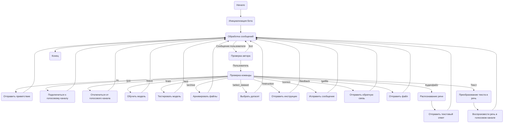
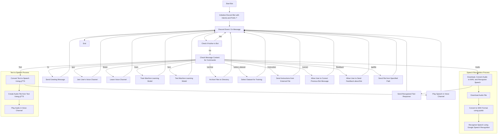

## Анализ кода Discord-бота

### 1. <алгоритм>

**Блок-схема работы Discord-бота:**

**Примеры:**

*   **Инициализация бота:** Запуск бота с префиксом `!` и необходимыми интентами, авторизация через токен.
*   **Обработка сообщения:** Пользователь пишет `!hi`.
    *   Проверяется автор - это не бот.
    *   Проверяется команда - это `!hi`.
    *   Выполняется `SendGreeting` - бот отправляет "Привет!".
*   **Распознавание речи:** Пользователь отправляет аудиофайл.
    *   Проверяется автор - это не бот.
    *   Обнаруживается аудиофайл.
    *   Выполняется `RecognizeSpeech` - аудио преобразуется в текст.
    *   Выполняется `SendTextResponse` - бот отправляет расшифрованный текст в ответ.
*   **Текст в речь:** Пользователь пишет сообщение в текстовом канале, и находится в голосовом канале.
    *   Проверяется автор - это не бот.
    *   Сообщение является текстом.
    *   Выполняется `TextToSpeech` - текст преобразуется в речь.
    *   Выполняется `PlayVoice` - бот воспроизводит речь в голосовом канале.

### 2. <mermaid>

**Объяснение зависимостей в mermaid-диаграмме:**

*   `Start` -> `InitBot`: Бот инициализируется, устанавливая префикс команд (`!`) и необходимые интенты для доступа к событиям Discord.
*   `InitBot` -> `EventMessage`: Бот ожидает события новых сообщений.
*   `EventMessage` -> `CheckAuthor`: Проверяется, является ли автор сообщения ботом, чтобы избежать обработки собственных сообщений.
*   `CheckAuthor` -> `EventMessage` (Yes): Если автор - бот, обработка сообщения завершается.
*   `CheckAuthor` -> `CheckCommand` (No): Если автор - пользователь, проверяется наличие команд.
*   `CheckCommand` -> `SendGreeting` (`!hi`), `JoinVoiceChannel` (`!join`), `LeaveVoiceChannel` (`!leave`), `TrainModel` (`!train`), `TestModel` (`!test`), `ArchiveFiles` (`!archive`), `SelectDataset`(`!select_dataset`), `SendInstructions` (`!instruction`), `CorrectMessage`(`!correct`), `SendFeedback`(`!feedback`), `SendFile`(`!getfile`):  В зависимости от команды, выполняются соответствующие действия.
*   `CheckCommand` -> `SpeechRecognition` (Audio): Если сообщение содержит аудиофайл, запускается процесс распознавания речи.
*    `CheckCommand` -> `ConvertTextToSpeech` (Text): Если сообщение содержит текст, который нужно озвучить, запускается процесс преобразования текста в речь.
*   `SpeechRecognition` -> `DownloadAudio`: Аудиофайл скачивается.
*   `DownloadAudio` -> `ConvertToWAV`: Аудиофайл конвертируется в формат WAV.
*    `ConvertToWAV` -> `RecognizeSpeechGoogle`: Используется Google Speech Recognition для преобразования аудио в текст.
*    `ConvertTextToSpeech` -> `CreateAudioFromText`: Создается аудиофайл на основе текста.
*    `CreateAudioFromText` -> `PlayAudio`: Аудио проигрывается в голосовом канале.
*  `SpeechRecognition` -> `SendTextResponse`:  Распознанный текст отправляется в качестве ответа.
*   `ConvertTextToSpeech` -> `PlayVoice`: Бот воспроизводит речь в голосовом канале.
*  Все обработчики команд (`SendGreeting`, `JoinVoiceChannel`, `LeaveVoiceChannel`, `TrainModel`, `TestModel`, `ArchiveFiles`, `SelectDataset`, `SendInstructions`, `CorrectMessage`, `SendFeedback`, `SendFile`) и  обработчики сообщений (`SendTextResponse`, `PlayVoice`) возвращаются к ожиданию новых сообщений (`EventMessage`).
*   `EventMessage` -> `End`: Процесс обработки сообщения завершается.

### 3. <объяснение>

**Импорты:**

*   `discord`: Основная библиотека для работы с Discord API. Используется для создания и управления ботами, взаимодействия с пользователями, каналами и серверами.
*   `speech_recognition`: Библиотека для распознавания речи, поддерживает различные сервисы, включая Google Speech Recognition. Используется для преобразования речи в текст.
*   `pydub`: Библиотека для работы с аудиофайлами, используется для конвертации форматов, таких как конвертация в `WAV`.
*   `gtts`: Библиотека для преобразования текста в речь (Google Text-to-Speech). Используется для создания аудио из текста.
*   `requests`: Библиотека для выполнения HTTP-запросов, используется для скачивания аудиофайлов с URL.
*   `pathlib`: Библиотека для работы с путями к файлам и каталогам.
*   `tempfile`: Библиотека для создания временных файлов и каталогов.
*   `asyncio`: Библиотека для асинхронного программирования. Позволяет выполнять задачи параллельно, не блокируя основной поток, что важно для быстродействия бота.
*  `src.gs`:  Импорт глобальных настроек проекта, которые вероятно содержат токен бота.
* `src.logger`:  Импорт модуля логирования для отслеживания событий и ошибок.

**Основные функции и их назначение:**

*   **Инициализация бота:**
    *   Бот инициализируется с префиксом команд `!` и интентами, необходимыми для доступа к различным событиям Discord.
    *   Токен бота, необходимый для авторизации в Discord API, загружается из `gs.credentials.discord.bot_token`.
*   **Обработка сообщений:**
    *   Функция, обрабатывающая входящие сообщения, проверяет, является ли автор сообщения ботом, и если нет, то проверяет наличие команд или аудиофайла.
    *   Если отправлен аудиофайл, вызывается функция `recognizer` для его распознавания.
    *   Если пользователь находится в голосовом канале, бот преобразует текст в речь и воспроизводит его.
*   **`recognizer` (Распознавание речи):**
    *   Принимает URL аудиофайла.
    *   Скачивает аудиофайл.
    *   Конвертирует аудиофайл в формат WAV с помощью `pydub`.
    *   Распознает речь в аудио с помощью Google Speech Recognition (`speech_recognition`).
    *   Возвращает распознанный текст.
*   **`text_to_speech_and_play` (Текст в речь и воспроизведение):**
    *   Принимает текст и голосовой канал Discord.
    *   Преобразует текст в речь с помощью `gtts`.
    *   Воспроизводит аудио в указанном голосовом канале.

**Основные классы и их роль:**

*   В предоставленном коде нет явных классов, но `discord.Client` используется для создания экземпляра бота.

**Переменные:**

*   `bot_token`: Токен Discord-бота для авторизации. Получается из `gs.credentials.discord.bot_token`.
*   `prefix`: Префикс команд (`!`).
*   Различные переменные в функциях для временных файлов, путей к файлам, и т.д.

**Потенциальные ошибки и области для улучшения:**

*   Обработка ошибок при скачивании файлов, распознавании речи и преобразовании текста в речь должна быть более надежной.
*   Необходимо добавить проверку на наличие необходимых зависимостей.
*   Следует улучшить логирование событий, чтобы облегчить отладку и мониторинг.
*   Необходимо добавить обработку ситуаций, когда пользователь не находится в голосовом канале или когда бот не может подключиться к каналу.
*   Следует добавить механизм для управления обучением модели, в том числе сохранение обученной модели и ее последующую загрузку.

**Взаимосвязь с другими частями проекта:**

*   Бот использует `src.gs` для доступа к глобальным настройкам, включая токен бота.
*   Бот использует `src.logger` для логирования событий и ошибок.
*   Бот использует `src.endpoints.bots.discord` как модуль для обработки команд Discord.

Этот бот является частью более крупного проекта `hypo`, и он взаимодействует с другими частями проекта через глобальные настройки (`gs`) и модуль логирования (`logger`).