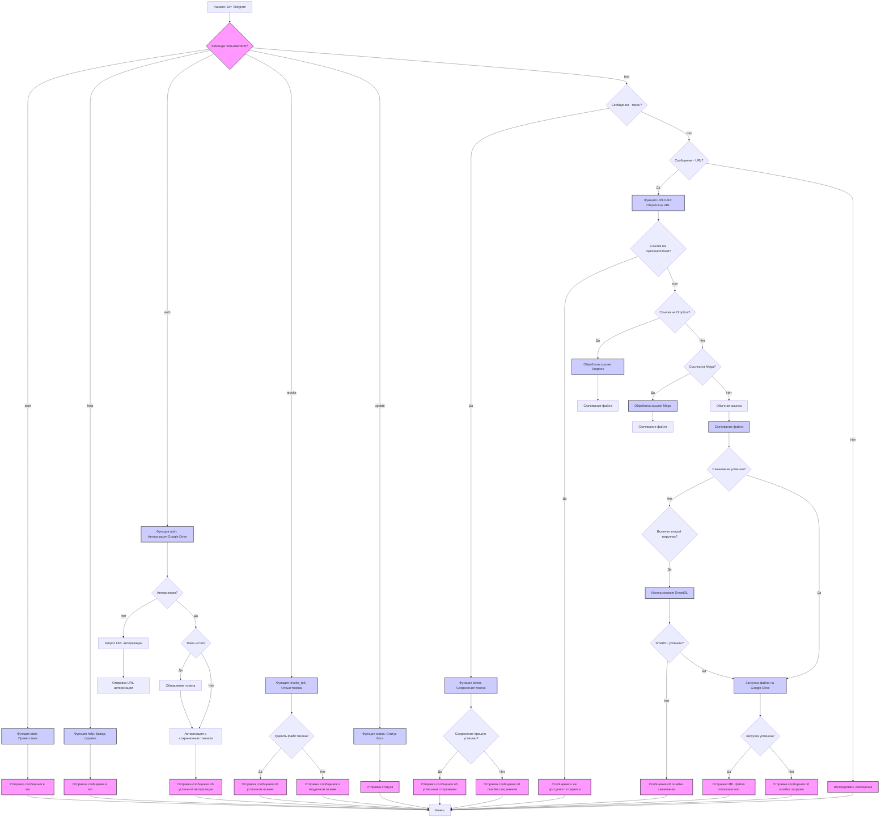

## ИНСТРУКЦИЯ:

Анализируй предоставленный код подробно и объясни его функциональность. Ответ должен включать три раздела:

1.  **<алгоритм>**: Опиши рабочий процесс в виде пошаговой блок-схемы, включая примеры для каждого логического блока, и проиллюстрируй поток данных между функциями, классами или методами.
2.  **<mermaid>**: Напиши код для диаграммы в формате `mermaid`, проанализируй и объясни все зависимости,
    которые импортируются при создании диаграммы.
    **ВАЖНО!** Убедитесь, что все имена переменных, используемые в диаграмме `mermaid`,
    имеют осмысленные и описательные имена. Имена переменных вроде `A`, `B`, `C`, и т.д., не допускаются!

    **Дополнительно**: Если в коде есть импорт `import header`, добавьте блок `mermaid` flowchart, объясняющий `header.py`:
    ```mermaid
    flowchart TD
        Start --> Header[<code>header.py</code><br> Determine Project Root]

        Header --> import[Import Global Settings: <br><code>from src import gs</code>]
    ```

3.  **<объяснение>**: Предоставьте подробные объяснения:
    *   **Импорты**: Их назначение и взаимосвязь с другими пакетами `src.`.
    *   **Классы**: Их роль, атрибуты, методы и взаимодействие с другими компонентами проекта.
    *   **Функции**: Их аргументы, возвращаемые значения, назначение и примеры.
    *   **Переменные**: Их типы и использование.
    *   Выделите потенциальные ошибки или области для улучшения.

Дополнительно, постройте цепочку взаимосвязей с другими частями проекта (если применимо).

Это обеспечивает всесторонний и структурированный анализ кода.
## Формат ответа: `.md` (markdown)
**КОНЕЦ ИНСТРУКЦИИ**

## <алгоритм>



## <mermaid>

```mermaid
flowchart TD
    Start[Начало] --> ImportModules[Импорт модулей];
    ImportModules --> DefineGlobalVariables[Определение глобальных переменных];
     DefineGlobalVariables --> BotInitialization[Инициализация бота];
     BotInitialization --> DefineHandlers[Определение обработчиков команд];
        DefineHandlers --> CommandHandlerStart[Обработчик команды start];
        CommandHandlerStart --> FunctionStart[Функция start];
         FunctionStart --> SendStartMessage[Отправка приветственного сообщения];
         DefineHandlers --> CommandHandlerHelp[Обработчик команды help];
         CommandHandlerHelp --> FunctionHelp[Функция help];
          FunctionHelp --> SendHelpMessage[Отправка справочного сообщения];
          DefineHandlers --> CommandHandlerAuth[Обработчик команды auth];
         CommandHandlerAuth --> FunctionAuth[Функция auth];
             FunctionAuth --> CheckCredentials[Проверка наличия токена];
               CheckCredentials -- Токен отсутствует --> GenerateAuthURL[Генерация URL авторизации];
                 GenerateAuthURL --> SendAuthURL[Отправка URL авторизации];
              CheckCredentials -- Токен есть --> CheckTokenExpiration[Проверка срока действия токена];
                  CheckTokenExpiration -- Токен истек --> RefreshToken[Обновление токена];
                     RefreshToken --> AuthorizeWithNewToken[Авторизация с новым токеном];
                  CheckTokenExpiration -- Токен не истек --> AuthorizeWithSavedToken[Авторизация с сохраненным токеном];
                      AuthorizeWithSavedToken --> SendAuthSuccess[Отправка сообщения об успешной авторизации];
             DefineHandlers --> CommandHandlerRevoke[Обработчик команды revoke];
            CommandHandlerRevoke --> FunctionRevoke[Функция revoke_tok];
                 FunctionRevoke --> RemoveTokenFile[Удаление файла токена];
                  RemoveTokenFile --> SendRevokeMessage[Отправка сообщения об успехе/неудаче отзыва];
                    DefineHandlers --> CommandHandlerUpdate[Обработчик команды update];
                    CommandHandlerUpdate --> FunctionStatus[Функция status];
                    FunctionStatus --> SendStatusMessage[Отправка сообщения о статусе];
            DefineHandlers --> MessageHandlerToken[Обработчик текстовых сообщений (токен)];
                MessageHandlerToken --> FunctionToken[Функция token];
                  FunctionToken --> ValidateToken[Проверка токена];
                    ValidateToken --> SaveToken[Сохранение токена];
                        SaveToken --> SendTokenSuccess[Отправка сообщения об успешном сохранении токена];
                        SaveToken --> SendTokenError[Отправка сообщения об ошибке сохранении токена];

           DefineHandlers --> MessageHandlerUrl[Обработчик текстовых сообщений (URL)];
            MessageHandlerUrl --> FunctionUpload[Функция UPLOAD];
            FunctionUpload -->  ProcessURL[Обработка URL];

    ProcessURL --> CheckOpenload[Проверка Openload/Oload];
        CheckOpenload -- Да --> SendNotAvailable[Сообщение о недоступности сервиса];
        CheckOpenload -- Нет --> CheckDropbox[Проверка Dropbox];

        CheckDropbox -- Да --> ProcessDropbox[Обработка Dropbox];
          ProcessDropbox --> DownloadFileDP[Скачивание файла Dropbox];
             DownloadFileDP--> CheckMega[Проверка Mega];
        CheckDropbox -- Нет --> CheckMega;

        CheckMega -- Да --> ProcessMega[Обработка Mega];
            ProcessMega --> DownloadFileMega[Скачивание файла Mega];
                DownloadFileMega--> DownloadFile[Скачивание файла]
        CheckMega -- Нет --> DownloadFile[Скачивание файла];
    DownloadFile --> CheckDownloadSuccess[Проверка успешности скачивания];
      CheckDownloadSuccess -- Нет --> CheckSecondDownloader[Проверка второго загрузчика];
          CheckSecondDownloader -- Да --> StartSmartDL[Использование SmartDL];
            StartSmartDL --> CheckSmartDLSuccess[Проверка успешности SmartDL];
                CheckSmartDLSuccess -- Да --> UploadFile[Загрузка файла на Google Drive];
                CheckSmartDLSuccess -- Нет --> SendDownloadError[Отправка сообщения об ошибке скачивания];
      CheckDownloadSuccess -- Да --> UploadFile[Загрузка файла на Google Drive];

    UploadFile --> CheckUploadSuccess[Проверка успешности загрузки];
        CheckUploadSuccess -- Да --> SendFileUrl[Отправка URL файла пользователю];
         CheckUploadSuccess -- Нет --> SendUploadError[Отправка ошибки загрузки];

     SendNotAvailable --> End[Конец];
      SendStartMessage --> End;
      SendHelpMessage --> End;
      SendAuthURL --> End;
      SendAuthSuccess --> End;
        SendRevokeMessage --> End;
          SendStatusMessage --> End;
       SendTokenSuccess --> End;
        SendTokenError --> End;
        SendDownloadError --> End;
        SendFileUrl --> End;
        SendUploadError --> End;

    classDef func fill:#f9f,stroke:#333,stroke-width:2px
    classDef process fill:#ccf,stroke:#333,stroke-width:2px
    class ImportModules,DefineGlobalVariables,BotInitialization,DefineHandlers process
    class FunctionStart,FunctionHelp,FunctionAuth,FunctionRevoke,FunctionStatus,FunctionToken,FunctionUpload func
```

**Объяснение `mermaid` диаграммы:**

*   **Импорт модулей (ImportModules):** Начинается с импорта необходимых библиотек, таких как `telegram`, `os`, `json`, `pydrive`, `pySmartDL`, `mega` и пользовательских модулей.
*   **Определение глобальных переменных (DefineGlobalVariables):** Инициализируются глобальные переменные, такие как токен бота `bot_token`, объект `Updater`, `Dispatcher` и `GoogleAuth`.
*   **Инициализация бота (BotInitialization):** Создается экземпляр бота Telegram с использованием токена и настраивается диспетчер.
*   **Определение обработчиков команд (DefineHandlers):**
    *   **Обработчик команды start (CommandHandlerStart):** Вызывает функцию `start` для обработки команды `/start`.
    *   **Обработчик команды help (CommandHandlerHelp):** Вызывает функцию `help` для обработки команды `/help`.
    *   **Обработчик команды auth (CommandHandlerAuth):** Вызывает функцию `auth` для обработки команды `/auth`.
     *   **Обработчик команды revoke (CommandHandlerRevoke):** Вызывает функцию `revoke_tok` для обработки команды `/revoke`.
    *   **Обработчик текстовых сообщений (токен) (MessageHandlerToken):** Вызывает функцию `token` для обработки текстовых сообщений, которые могут содержать токен.
    *     **Обработчик команды update (CommandHandlerUpdate):** Вызывает функцию `status` для обработки команды `/update`.
    *   **Обработчик текстовых сообщений (URL) (MessageHandlerUrl):** Вызывает функцию `UPLOAD` для обработки текстовых сообщений, содержащих URL.
*   **Функция start (FunctionStart):** Приветствует пользователя.
*  **Функция help (FunctionHelp):** Отправляет справочное сообщение.
*   **Функция auth (FunctionAuth):**
    *   Проверяет наличие файла с токеном авторизации.
    *   Если токен отсутствует, генерирует URL авторизации и отправляет его пользователю.
    *   Если токен есть, проверяет его срок действия.
    *   Обновляет токен, если он истек, и авторизует бота.
    *   Отправляет сообщение об успешной авторизации.
*   **Функция revoke_tok (FunctionRevoke):**
    *  Удаляет сохраненный файл токена
    *  Отправляет сообщение об успехе/неудаче отзыва
*   **Функция status (FunctionStatus):**
    *  Отправляет статус бота
*   **Функция token (FunctionToken):**
    *   Проверяет, является ли сообщение токеном.
    *   Сохраняет токен в файл и отправляет сообщение об успехе или ошибке.
*   **Функция UPLOAD (FunctionUpload):**
    *   Обрабатывает URL, переданный пользователем.
    *   Проверяет URL на принадлежность к Openload, Dropbox или Mega.
    *   Скачивает файл с использованием wget или SmartDL.
    *   Загружает файл на Google Drive.
    *   Отправляет пользователю ссылку на загруженный файл.
*   **Проверка Openload/Oload (CheckOpenload):** Проверяет, является ли ссылка на Openload/Oload, и если да, отправляет сообщение о недоступности сервиса.
*   **Проверка Dropbox (CheckDropbox):** Проверяет, является ли ссылка на Dropbox, и обрабатывает ее соответствующим образом.
*    **Проверка Mega (CheckMega):** Проверяет, является ли ссылка на Mega, и обрабатывает ее соответствующим образом.
*   **Скачивание файла (DownloadFile):** Запускает скачивание файла с использованием wget.
*   **Проверка успешности скачивания (CheckDownloadSuccess):** Проверяет, был ли файл скачан успешно.
*   **Проверка второго загрузчика (CheckSecondDownloader):** Проверяет, включен ли второй загрузчик SmartDL.
*   **Использование SmartDL (StartSmartDL):** Скачивает файл с помощью SmartDL.
*    **Загрузка файла на Google Drive (UploadFile):** Загружает файл на Google Drive.
*   **Проверка успешности загрузки (CheckUploadSuccess):** Проверяет, была ли загрузка успешной.
*   **Отправка URL файла пользователю (SendFileUrl):** Отправляет пользователю ссылку на загруженный файл.
*   **Отправка сообщений об ошибках (SendTokenError, SendDownloadError, SendUploadError):** Отправляет пользователю сообщения об ошибках при обработке токена, скачивании или загрузке файла.
*   **Конец (End):** Завершение выполнения.

## <объяснение>

**Импорты:**

*   `json`: Используется для работы с данными в формате JSON. В коде не используется напрямую, но может применяться внутри модулей, которые импортируются.
*   `telegram.ext`: Модуль для работы с Telegram Bot API, используется для создания и управления ботом.
*   `telegram`: Базовый модуль для Telegram Bot API.
*   `os`: Предоставляет функции для взаимодействия с операционной системой, например, для работы с файлами и директориями.
*   `sys`: Предоставляет доступ к некоторым переменным и функциям, используемым или поддерживаемым интерпретатором.
*   `upload`: Пользовательский модуль, предназначенный для загрузки файлов на Google Drive.
*   `creds`: Пользовательский модуль для хранения конфиденциальных данных (токены, пароли).
*   `pySmartDL`: Библиотека для загрузки файлов с поддержкой возобновления закачки.
*   `pydrive.auth`: Модуль для авторизации в Google Drive API.
*   `plugins.TEXT`: Модуль, содержащий текстовые константы и настройки бота.
*   `plugins.tok_rec`: Модуль с функцией `is_token` для проверки, является ли сообщение токеном.
*   `time`: Модуль для работы со временем.
*   `subprocess`: Модуль для запуска внешних процессов.
*   `plugins.dpbox`: Модуль для обработки ссылок Dropbox.
*   `plugins.wdl`: Модуль для загрузки файлов через `wget`.
*   `re`: Модуль для работы с регулярными выражениями.
*   `mega`: Библиотека для работы с сервисом Mega.

**Классы:**

*   `Creds`: (из модуля `creds`) Класс, вероятно, содержит статические переменные, необходимые для работы бота, такие как токен Telegram и учетные данные Mega.
    В данном случае используется для доступа к `TG_TOKEN`, `MEGA_EMAIL` и `MEGA_PASSWORD`.
*   `GoogleAuth`: (из `pydrive.auth`) Класс, используемый для авторизации в Google Drive API.
*   `SmartDL`: (из `pySmartDL`) Класс для скачивания файлов с возможностью возобновления.
*   `Mega`: (из `mega`) Класс для работы с сервисом Mega, используется для скачивания файлов.

**Функции:**

*   `help(update, context)`:
    *   Аргументы: `update` (объект сообщения от Telegram), `context` (контекст бота).
    *   Назначение: Отправляет пользователю сообщение со справочной информацией.
    *   Пример: Пользователь отправляет команду `/help`, бот отвечает текстом из `TEXT.HELP`.
*   `auth(update, context)`:
    *   Аргументы: `update`, `context`.
    *   Назначение: Проверяет, авторизован ли пользователь в Google Drive, или запрашивает авторизацию.
    *   Пример: Пользователь отправляет команду `/auth`, бот либо запрашивает токен, либо подтверждает авторизацию.
*   `token(update, context)`:
    *   Аргументы: `update`, `context`.
    *   Назначение: Сохраняет токен авторизации Google Drive, полученный от пользователя.
    *   Пример: Пользователь отправляет токен, бот его сохраняет и подтверждает успех.
*   `start(update, context)`:
    *   Аргументы: `update`, `context`.
    *   Назначение: Отправляет приветственное сообщение пользователю при запуске бота.
    *   Пример: Пользователь отправляет команду `/start`, бот приветствует его.
*   `revoke_tok(update, context)`:
    *   Аргументы: `update`, `context`.
    *   Назначение: Удаляет файл с сохраненным токеном авторизации.
    *   Пример: Пользователь отправляет команду `/revoke`, бот удаляет файл и сообщает об успехе или неудаче.
*   `UPLOAD(update, context)`:
    *   Аргументы: `update`, `context`.
    *   Назначение: Обрабатывает URL, переданный пользователем, скачивает файл и загружает его на Google Drive.
    *   Пример: Пользователь отправляет URL, бот скачивает файл, загружает его на Google Drive и отправляет ссылку пользователю.
*    `status(update, context)`:
    *   Аргументы: `update`, `context`.
    *   Назначение: Отправляет статус бота пользователю.
    *   Пример: Пользователь отправляет команду `/update`, бот отправляет статус.

**Переменные:**

*   `bot_token`: (строка) Токен Telegram бота.
*   `updater`: (объект `Updater`) Объект для управления ботом.
*   `dp`: (объект `Dispatcher`) Диспетчер для обработки сообщений.
*   `gauth`: (объект `GoogleAuth`) Объект для работы с Google Drive API.
*   `ID`: (строка) ID пользователя или чата.
*   `url`: (строка) URL, переданный пользователем.
*    `filename`: (строка) Имя скачанного файла.
*   `sent_message`: (объект сообщения) Сообщение бота, которое можно редактировать.
*    `DownloadStatus`: (boolean) Статус успешного скачивания.
*    `SIZE`: (int) Размер файла
*    `FILENAME`: (string) Название файла
*    `FILELINK`: (string) Ссылка на загруженный файл

**Потенциальные ошибки и области для улучшения:**

*   **Обработка ошибок:** В коде есть `try-except` блоки, но не все ошибки обрабатываются с достаточной детализацией.
*   **Безопасность:** Хранение токенов в виде файлов может быть небезопасным.
*   **Дублирование кода:** Некоторые части кода, например, обработка скачивания, могут быть вынесены в отдельные функции.
*   **Логирование:** Нет логгирования ошибок, что затрудняет отладку.
*   **Размер файлов:** Нет ограничений на размер скачиваемых файлов.
*   **Асинхронность:**  Код использует `@run_async`, но более сложные операции должны быть асинхронными, чтобы не блокировать бота.
*   **Зависимость от `TEXT`:** Настройки и текстовые константы находятся в `TEXT`, что делает код менее гибким.
*   **Отсутствие проверок:** Нет проверок входных данных, например, URL.

**Взаимосвязь с другими частями проекта:**

*   Модуль `creds` хранит конфиденциальные данные.
*   Модуль `plugins.TEXT` содержит текстовые константы и настройки.
*   Модуль `upload` выполняет загрузку файла на Google Drive.
*   Модуль `plugins.tok_rec` проверяет, является ли сообщение токеном.
*   Модуль `plugins.dpbox` обрабатывает ссылки Dropbox.
*    Модуль `plugins.wdl`  выполняет загрузку файлов с помощью wget.

**Цепочка взаимосвязей:**

1.  Пользователь отправляет команду или сообщение боту.
2.  Диспетчер `dp` определяет, какой обработчик должен обработать сообщение.
3.  Обработчик вызывает соответствующую функцию.
4.  Функции используют модули `Creds`, `upload`, `plugins.TEXT`, `plugins.tok_rec`, `plugins.dpbox` и `plugins.wdl`, а также `telegram`, `os`, `pydrive`, `pySmartDL`, `mega` для выполнения операций.
5.  Бот отправляет ответ пользователю.